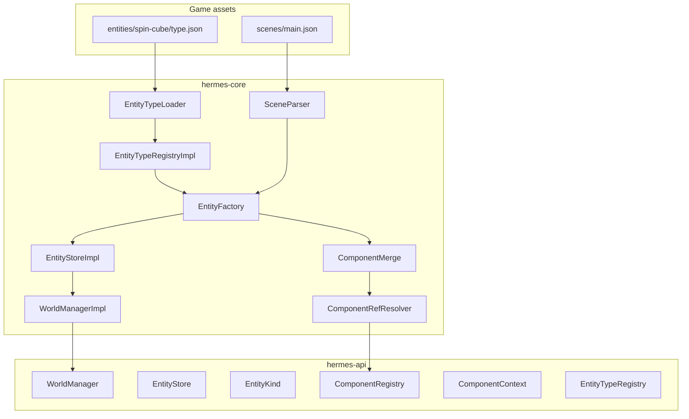
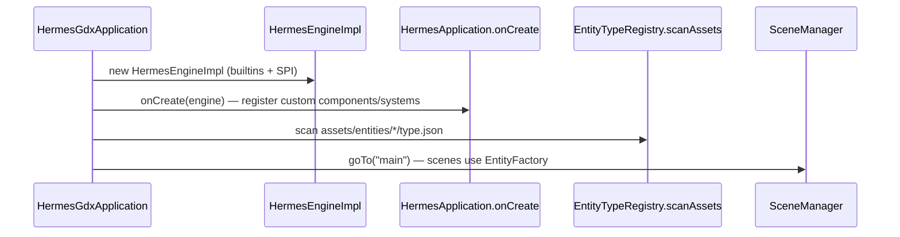
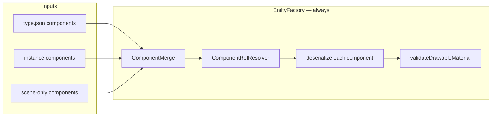
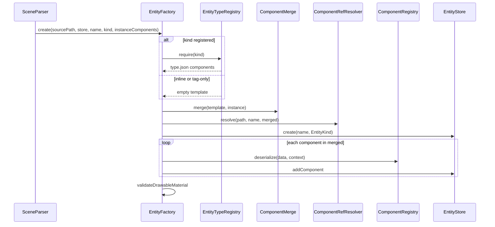

# Entity Types and World Manager Implementation Plan

> **For agentic workers:** REQUIRED SUB-SKILL: Use superpowers:subagent-driven-development (recommended) or superpowers:executing-plans to implement this plan task-by-task. Steps use checkbox (`- [ ]`) syntax for tracking.

> **Pre-release policy:** Nothing is shipped. Delete `World`, rename APIs cleanly, update all call sites in one pass. No deprecation shims.

**Goal:** Config-first reusable entity templates (`assets/entities/<kind>/type.json`), a single entity-creation pipeline for scenes and runtime spawn, sibling-component wiring via `$ref` and `ComponentContext`, and `WorldManager` as the per-scene simulation root that future engine features attach to.

**Architecture:** Template id = directory name = runtime `EntityKind`. Scene JSON uses `"type"` (preferred) or `"kind"` (alias). `EntityFactory` always runs merge → `ComponentRefResolver` on merged JSON → deserialize — same path for inline scene entities, typed templates, and `spawn()`. Delete `World`; `WorldManager.entities()` is the ECS store. `System` receives `WorldManager`. Cross-entity behavior stays in systems querying `manager.entities()`.

**Tech Stack:** Java 11, libGDX `JsonReader` (core only), JUnit 5, Gradle `:hermes-core:test`, `:dogfood-simulation:compileJava`, `hermes-templates/*` asset updates.

---

## Current baseline (repo state)

Nothing in this plan is implemented yet. The codebase today:

| Area | Today | After this plan |
|------|-------|-----------------|
| Scene root | `World` / `WorldImpl` per scene | `WorldManager` / `WorldManagerImpl` wrapping `EntityStore` |
| Scene APIs | `SceneHandle.world()`, `SceneManager.activeWorld()`, `SceneContext.world()` | `manager()`, `activeManager()` |
| Systems | `System.update(World, float)`, `System.render(World)` | `update(WorldManager, float)`, `render(WorldManager)` |
| Render | `RenderGraph.render(World)` | `RenderGraph.render(EntityStore)` via `scene.manager().entities()` |
| Entity creation | `SceneParser` loops components directly | `EntityFactory` (merge + refs + deserialize) |
| Scene `kind` | Parsed into `EntityKind` but **does not load templates** | Registered kind → merge `type.json`; unregistered kind → tag-only |
| Entity templates | Not supported | `assets/entities/<kind>/type.json` scanned at startup |
| `$ref` / `ComponentContext` | Not supported | Merged-JSON refs + deserializer context |
| Runtime spawn | Not supported | `EntityStore.spawn(kind)` / `spawn(kind, name)` |
| Game module | `dogfood-simulation` (monorepo dogfood) | Same; extract `spin-cube` template |
| `RuntimeConfigService` | Already on `HermesEngine` | Unchanged; entity scan runs after `onCreate` |

Relevant existing types to reuse (not rewrite):

- `EntityKind`, `Entity`, `EntityId` — keep; `EntityKind.of("")` → `UNSET`
- `SceneDocument.EntitySpec` / `ComponentSpec` — extend parsing for `"type"` alias
- `ComponentRegistryImpl.deserialize(scenePath, entityName, typeName, data)` — add `ComponentContext` param
- `HermesAssetPaths.internal(path)` — entity scan uses `entities/*/type.json`
- `SceneParseException` — ref/merge/type validation errors
- SPI: `ComponentRegistration` — still the no-code path for custom components + systems

---

## Design goals

| Goal | How |
|------|-----|
| **No-code games** | Scenes + `type.json` templates + `$ref` wiring. Zero Java for props, enemies, lights-as-entities. |
| **Progressive complexity** | Tier 0 inline scene → Tier 1 templates → Tier 2 runtime spawn → Tier 3 custom deserializers → Tier 4 systems/code. |
| **One creation pipeline** | Every entity (scene, spawn, programmatic) goes through `EntityFactory`. |
| **Generalized** | Same merge/ref/deserialize path for typed and untyped entities. |
| **Expandable scene root** | `WorldManager` starts with `entities()`; lighting, save snapshots, and scene services attach later without renaming again. |
| **Pre-release clean break** | Delete `World`; update dogfood, templates, tests, docs in the same effort. |

### Complexity tiers (author experience)

| Tier | Author writes | Engine does |
|------|---------------|-------------|
| **0 — Inline scene** | `scenes/main.json` with full `components` per entity | Parse → factory with empty template |
| **1 — Templates** | `entities/spin-cube/type.json` + scene `"type": "spin-cube"` + small overrides | Merge template + instance → refs → components |
| **2 — Runtime spawn** | Same templates; optional Java `manager.entities().spawn("enemy")` | Factory with empty instance overrides |
| **3 — Custom wiring** | `$ref` in JSON and/or `ComponentContext.sibling()` in deserializers | Ref resolver + context during deserialize |
| **4 — Simulation logic** | `System` implementations querying `entitiesWith` / `entitiesWithKind` | Standard ECS update loop |

---

## Relationship to other plans

Execute **this plan first** — it is a prerequisite for clean integration elsewhere.

| Plan | Dependency on entity-types |
|------|---------------------------|
| [World lighting](2026-05-26-world-lighting.md) | Light entity templates (`entities/torch/type.json`), reserved `__hermes_scene__` entity created via same factory; systems take `WorldManager`. Update that plan's `World` references to `WorldManager` / `EntityStore` when implementing lighting. |
| [Save/load sessions](2026-05-22-save-load-sessions.md) | Capture/restore by `EntityKind` + components; `WorldManager` replaces `World` in save scope. |
| [Custom UI service](2026-05-29-custom-ui-service.md) | Independent; world-attached UI (`UiAttach`) can reference entities by name/kind. |
| [Unified runtime config](2026-05-24-unified-runtime-config-service.md) | Already landed (`RuntimeConfigService`). Entity scan stays filesystem-based under `assets/`; future `hermes.runtime.json` could list extra template roots. |
| [Unified input](2026-05-21-unified-input-system.md) | Already landed. Selection/drag systems migrate to `WorldManager` parameter. |

---

## Architecture

### Principles

| Principle | Application |
|-----------|-------------|
| One name for classification | `EntityKind` in Java. JSON `"type"` preferred; `"kind"` accepted as alias (same field semantics). |
| Type id = folder name | `assets/entities/spin-cube/type.json` → kind `"spin-cube"`. No duplicate `"id"` inside JSON. |
| Instance vs template | Auto `EntityId` per instance; shared `EntityKind`; scene `id` = stable **name** for lookup. |
| Config-first | Types + scene overrides + `$ref`. Java only for custom components, systems, and runtime spawn. |
| Same-entity wiring | `$ref` after merge (config) + `ComponentContext.sibling` during deserialize (logic). |
| Cross-entity | Systems query `manager.entities().entitiesWith(...)` — never type JSON. |
| Extensible simulation | `WorldManager` is the scene root; v1 exposes only `entities()`. |

### Types and naming

| Surface | Name |
|---------|------|
| Asset directory | `assets/entities/<kind>/` |
| Asset file | `type.json` |
| Scene JSON (preferred) | `"type": "<kind>"` |
| Scene JSON (alias) | `"kind": "<kind>"` |
| Java runtime | `EntityKind`, `entity.kind()`, `entitiesWithKind` |

### Layer diagram



### Bootstrap order (startup)



Custom components **must** register in `onCreate` before scan/load so deserialization succeeds for template components.

---

### `WorldManager` — per-scene simulation root

Each loaded scene owns one `WorldManagerImpl`. It wraps the ECS store and shares engine-wide registries (`EntityTypeRegistry`, `ComponentRegistry`).

```java
// hermes-api — v1 surface
public interface WorldManager {
  EntityStore entities();
}

// Documented extension points (NOT v1 tasks — implement in downstream plans):
// - SceneLightingState holder via reserved entity (world-lighting plan)
// - Save snapshot capture/restore hooks (save-load plan)
// - Optional scene-scoped services (audio buses, UI roots) without renaming WorldManager again
```

**Why not keep `World`?** The name implied “ECS only.” Upcoming features (lighting environment, save state, scene metadata services) belong at the scene root beside entities. One type (`WorldManager`) avoids a second rename when those land.

### `EntityStore` — ECS (extracted from `World`)

Rename methods for clarity (`createEntity` → `create`). Delete `World.java`.

```java
public interface EntityStore {
  Entity create(String name);
  Entity create(String name, EntityKind kind);
  Entity spawn(String kind);
  Entity spawn(String kind, String name);

  void removeEntity(EntityId id);
  Entity findByName(String name);
  Entity getEntity(EntityId id);

  <T extends Component> void addComponent(EntityId id, T component);
  <T extends Component> T getComponent(EntityId id, Class<T> type);
  <T extends Component> boolean hasComponent(EntityId id, Class<T> type);
  <T extends Component> void removeComponent(EntityId id, Class<T> type);

  Collection<Entity> entities();
  <T extends Component> Collection<Entity> entitiesWith(Class<T> componentType);
  Collection<Entity> entitiesWithKind(EntityKind kind);
  int entityCount();
  void clear();
}
```

`spawn` delegates to `EntityFactory` with empty instance overrides and auto-generated name when omitted.

---

### `type.json` (version 1)

Path: `assets/entities/<kind>/type.json` — **`<kind>` must match the parent directory name** (validated at scan).

```json
{
  "version": 1,
  "components": {
    "Transform": { "x": 0, "y": 0, "z": 0 },
    "Mesh": { "model": "models/cube.obj", "texture": "hermes-logo.png" },
    "Material": { "shader": "default/unlit" },
    "SpinMarker": {
      "speed": 1.2,
      "centerX": { "$ref": "Transform.x" },
      "centerY": { "$ref": "Transform.y" },
      "radius": 1.5
    }
  }
}
```

| Field | Required | Description |
|-------|----------|-------------|
| `version` | Yes | Must be `1`. |
| `components` | No | Default component map (same shape as scene `components`). |

### Scene entity

```json
{
  "type": "spin-cube",
  "id": "cube-a",
  "components": {
    "Transform": { "x": 3 }
  }
}
```

`"kind": "spin-cube"` is equivalent. Parser normalizes to one internal kind string.

**Merge:** type `components` → overlay instance `components` (deep-merge per component type; instance wins) → **`$ref` resolve on merged JSON** → deserialize in stable order (template keys first, then instance-only types).

### Entity creation: typed vs inline (same pipeline)

| Source | Template | Instance overrides | `EntityKind` |
|--------|----------|-------------------|--------------|
| Inline scene entity | empty | `entities[].components` | `UNSET` unless `type`/`kind` set |
| Typed scene entity | `type.json` when registered | scene `components` | `EntityKind.of(kind)` |
| Tag-only kind | empty (no `entities/<kind>/`) | scene `components` | kind string stored; no template merge |
| `spawn("spin-cube")` | registered template | empty | `EntityKind.of("spin-cube")` |

**Registry lookup:** `entityTypes().has(kind)` → merge template; else components come from scene/spawn JSON only (tag-only or `UNSET`).



**Inline example** — `$ref` between components on the same entity:

```json
{
  "id": "marker",
  "components": {
    "Transform": { "x": 100, "y": 200 },
    "SpinMarker": {
      "speed": 1,
      "centerX": { "$ref": "Transform.x" },
      "centerY": { "$ref": "Transform.y" },
      "radius": 50
    }
  }
}
```

**Typed example** — template ref sees instance override (`Transform.x = 9`, not `0`):

```json
// assets/entities/spin-cube/type.json — SpinMarker.centerX: {"$ref":"Transform.x"}, Transform.x: 0
// scene
{ "type": "spin-cube", "id": "cube", "components": { "Transform": { "x": 9 } } }
```

---

### `$ref` resolution (v1)

#### Syntax

A property is a reference only when it is a JSON object with exactly one key `"$ref"` and a string value:

```json
"centerX": { "$ref": "Transform.x" }
```

#### Grammar (v1)

| Path | Resolves to |
|------|-------------|
| `Transform.x` | `float` from merged `Transform` key `x` (default `0`) |
| `Transform.y` | same for `y` |
| `Transform.z` | same for `z` |

Unknown path or missing source component → `SceneParseException` with asset path, entity name, and ref string.

v1 resolves refs only at **top level** of each component's property object (not nested objects/arrays).

**Future (document only):** `Transform.rotationZ`, `Material.uniforms.u_tint.0`, cross-component paths — extend `ComponentRefResolver` without changing the factory pipeline.

#### When it runs

Refs resolve against the **merged component map** (`JsonValue` tree), **before** deserialize:

- Deserialize order does not matter for `$ref`.
- Instance overrides are visible to template refs.
- Typed and inline entities share the same resolver.

```
merged = ComponentMerge.merge(template, instance)
ComponentRefResolver.resolve(sourcePath, entityName, merged)
for each componentType in stableKeyOrder(merged):
  component = registry.deserialize(..., new ComponentContext(...), merged[type])
  store.addComponent(entity, component)
```

#### `$ref` vs `ComponentContext`

| Mechanism | When | Use for |
|-----------|------|---------|
| `$ref` | After merge, before deserialize | Copy float fields from sibling component JSON |
| `ComponentContext.sibling` | During deserialize | Conditional logic, non-float fields, computed defaults |

Prefer `$ref` in templates; use `context` when JSON refs are not enough.

---

### Reserved entity names

Engine-reserved names (validated at factory create — duplicate name already fails):

| Name | Purpose | Introduced by |
|------|---------|---------------|
| `__hermes_scene__` | Scene-level holder components (e.g. `SceneLightingState`) | [World lighting plan](2026-05-26-world-lighting.md) |

`SceneParser` post-pass (or dedicated hook after entity list) ensures reserved entities exist. Game content must not use these names.

---

### Public API summary

```java
// Scene stack
public interface SceneHandle {
  String id();
  WorldManager manager();
  boolean paused();
  Optional<String> renderPipelineOverride();
  Optional<String> inputContext();
}

public interface SceneManager {
  WorldManager activeManager();
  SceneHandle active();
  // ... unchanged transition/registry methods
}

public interface SceneContext {
  WorldManager manager();
  ComponentRegistry registry();
  HermesEngine engine();
  HermesSession session();
}

public interface SceneLoadContext {
  WorldManager manager();
  ComponentRegistry registry();
}

// Systems
public interface System {
  default void update(WorldManager manager, float deltaSeconds) {}
  default void render(WorldManager manager) {}
}

public interface HermesEngine {
  SceneManager scenes();
  ComponentRegistry registry();
  EntityTypeRegistry entityTypes();
  // viewport(), input(), runtimeConfig(), addSystem — unchanged
}

public interface EntityTypeRegistry {
  void scanAssets();
  void register(String kind, String assetPath);
  boolean has(String kind);
  EntityTypeDefinition require(String kind);
}

public interface ComponentDeserializer {
  Component deserialize(ComponentData data, ComponentContext context);
}

public interface ComponentContext {
  EntityId entityId();
  EntityKind kind();
  String entityName();
  <T extends Component> T sibling(Class<T> type);
}
```

`ComponentRegistry.register` takes `ComponentDeserializer` only. Lambdas may ignore `context`.

---

### Load pipeline



---

### User workflows

#### 1. Pure config simulation (no Java)

```
assets/
  entities/
    spin-cube/type.json
    enemy/type.json
  scenes/
    main.json
```

`main.json`:

```json
{
  "entities": [
    { "type": "spin-cube", "id": "cube-a", "components": { "Transform": { "x": -2 } } },
    { "type": "spin-cube", "id": "cube-b", "components": { "Transform": { "x": 2 } } },
    { "type": "enemy", "id": "boss" }
  ]
}
```

Register scene in `hermes.json`; engine scans templates after `onCreate`.

#### 2. Config + minimal Java (custom component once)

Register `SpinMarker` via SPI (`ComponentRegistration`) or `onCreate`:

```java
engine.registry().register("SpinMarker", SpinMarker.class, (data, ctx) -> { ... });
engine.addSystem(new SpinMarkerSystem());
```

Template uses `$ref` so authors never duplicate Transform coordinates in JSON.

#### 3. Runtime spawn (wave spawner)

```java
WorldManager manager = engine.scenes().activeManager();
Entity enemy = manager.entities().spawn("enemy", "enemy-" + waveIndex);
manager.entities().getComponent(enemy.id(), Transform.class).setX(spawnX);
```

Or pass overrides via a future `spawn(kind, name, overrides)` extension — **not v1**; use `create` + manual components only if overrides are dynamic maps (YAGNI for v1).

#### 4. Heavy simulation (systems + queries)

```java
public final class EnemyAiSystem implements System {
  @Override
  public void update(WorldManager manager, float delta) {
    EntityStore world = manager.entities();
    for (Entity e : world.entitiesWithKind(EntityKind.of("enemy"))) {
      // ...
    }
  }
}
```

---

## File map

| Action | Path |
|--------|------|
| **Delete** | `hermes-api/src/main/java/dev/hermes/api/ecs/World.java` |
| **Create (api)** | `WorldManager.java`, `EntityStore.java`, `EntityTypeRegistry.java`, `EntityTypeDefinition.java`, `ComponentContext.java` |
| **Create (core)** | `WorldManagerImpl.java`, `EntityStoreImpl.java` (rename from `WorldImpl`), `EntityTypeDocument.java`, `EntityTypeLoader.java`, `EntityTypeRegistryImpl.java`, `ComponentMerge.java`, `EntityFactory.java`, `ComponentRefResolver.java` |
| **Modify (api)** | `System.java`, `HermesEngine.java`, `ComponentDeserializer.java`, `SceneHandle.java`, `SceneManager.java`, `SceneContext.java`, `SceneLoadContext.java` |
| **Modify (core)** | `SceneDocument.java`, `SceneParser.java`, `SceneLoader.java`, `SceneStack.java`, `SceneInstance.java`, `SceneManagerImpl.java`, `ComponentRegistryImpl.java`, `BuiltinComponents.java`, `HermesGdxApplication.java`, `HermesEngineImpl.java` |
| **Modify (render)** | `RenderGraph.java`, `RenderPipelineExecutor.java`, `RenderGraphPass.java`, `SpritesPass.java`, `World3dPass.java`, `UiPass.java`, all `*GraphPass.java` |
| **Modify (input)** | `SelectionSystem.java`, `EntityDragSystem.java`, `CameraSceneControlSystem.java`, `InputServiceImpl.java`, `WorldPicker.java` |
| **Modify (dogfood)** | `SpinMarkerSystem.java`, `BounceMarkerSystem.java`, all systems using `World` |
| **Create (dogfood assets)** | `dogfood-simulation/src/main/resources/assets/entities/spin-cube/type.json` |
| **Modify (dogfood assets)** | `dogfood-simulation/src/main/resources/assets/scenes/main.json` |
| **Modify (templates)** | Optional `entities/logo/type.json` in `hermes-templates/minimal` — fold into Task 7 |
| **Docs** | Create `docs/entity-types.md`; update `scene-format-v1.md`, `scene-management.md`, `ARCHITECTURE.md`, `docs/README.md` |
| **Tests** | `WorldManagerTest`, `EntityTypeDocumentTest`, `EntityTypeRegistryTest`, `ComponentMergeTest`, `EntityFactoryTest`, `SceneEntityTypeTest`, `ComponentContextTest`, `EntitySpawnTest`, `ComponentRefResolverTest`; update all tests referencing `World` / `activeWorld()` |

---

## Implementation tasks

### Task 1: WorldManager and EntityStore (delete World)

**Files:**

- Create: `hermes-api/src/main/java/dev/hermes/api/ecs/WorldManager.java`
- Create: `hermes-api/src/main/java/dev/hermes/api/ecs/EntityStore.java`
- Delete: `hermes-api/src/main/java/dev/hermes/api/ecs/World.java`
- Rename: `hermes-core/src/main/java/dev/hermes/core/ecs/WorldImpl.java` → `EntityStoreImpl.java`
- Create: `hermes-core/src/main/java/dev/hermes/core/ecs/WorldManagerImpl.java`
- Modify: `System.java`, `SceneHandle.java`, `SceneContext.java`, `SceneLoadContext.java`, `SceneManager.java`, `SceneManagerImpl.java`, `SceneStack.java`, `SceneInstance.java`, `SceneLoadContextImpl.java`, `HermesGdxApplication.java`, render + input call sites listed in file map

- [ ] **Step 1: Write failing test**

`hermes-core/src/test/java/dev/hermes/core/ecs/WorldManagerTest.java`:

```java
package dev.hermes.core.ecs;

import dev.hermes.api.ecs.EntityKind;
import org.junit.jupiter.api.Test;

import static org.junit.jupiter.api.Assertions.assertEquals;

final class WorldManagerTest {

  @Test
  void manager_exposesEntityStore() {
    WorldManagerImpl manager = new WorldManagerImpl();
    var entity = manager.entities().create("a", EntityKind.UNSET);
    assertEquals(1, manager.entities().entityCount());
    assertEquals("a", entity.name());
  }
}
```

- [ ] **Step 2: Run test — FAIL**

Run: `./gradlew :hermes-core:test --tests dev.hermes.core.ecs.WorldManagerTest`

Expected: compilation failure (`WorldManagerImpl` missing)

- [ ] **Step 3: Implement and migrate**

- `EntityStore` = former `World` API with `create` / `create(name, kind)` (drop `createEntity`).
- `EntityStoreImpl` = renamed `WorldImpl`.
- `WorldManagerImpl` wraps one `EntityStoreImpl`.
- `System.update/render(WorldManager)`.
- `SceneInstance` holds `WorldManagerImpl`.
- `SceneHandle.manager()`, `SceneManager.activeManager()`, `SceneContext.manager()`, `SceneLoadContext.manager()`.
- `HermesGdxApplication` + global/scene system loops pass `WorldManager`.
- `RenderGraph.render(EntityStore)`; `RenderPipelineExecutor` uses `scene.manager().entities()`.
- Grep `World` / `activeWorld()` / `.world()` — update every hit (tests, dogfood, templates).

- [ ] **Step 4: Full compile + test**

Run: `./gradlew :hermes-core:test :dogfood-simulation:compileJava`

Expected: all tests pass; no remaining references to `dev.hermes.api.ecs.World`

- [ ] **Step 5: Commit**

```bash
git add -A
git commit -m "refactor(ecs): WorldManager and EntityStore replace World"
```

---

### Task 2: Entity type assets and registry

**Files:**

- Create: `hermes-api/src/main/java/dev/hermes/api/ecs/EntityTypeRegistry.java`
- Create: `hermes-api/src/main/java/dev/hermes/api/ecs/EntityTypeDefinition.java`
- Create: `hermes-core/src/main/java/dev/hermes/core/ecs/EntityTypeDocument.java`
- Create: `hermes-core/src/main/java/dev/hermes/core/ecs/EntityTypeLoader.java`
- Create: `hermes-core/src/main/java/dev/hermes/core/ecs/EntityTypeRegistryImpl.java`
- Modify: `HermesEngine.java`, `HermesEngineImpl.java`, `HermesGdxApplication.java`
- Test: `EntityTypeDocumentTest.java`, `EntityTypeRegistryTest.java`
- Fixture: `hermes-core/src/test/resources/entities/spin-cube/type.json`

- [ ] **Step 1: Fixture**

```json
{
  "version": 1,
  "components": {
    "Transform": { "z": 0 },
    "Material": { "shader": "default/unlit" }
  }
}
```

- [ ] **Step 2: Write failing tests**

`EntityTypeDocumentTest.java`:

```java
@Test
void parse_validTypeJson() {
  String json = "{\"version\":1,\"components\":{\"Transform\":{\"z\":0}}}";
  EntityTypeDocument doc = EntityTypeDocument.parse("entities/spin-cube/type.json", json);
  assertEquals(1, doc.version());
  assertTrue(doc.componentsJson().has("Transform"));
}

@Test
void parse_rejectsWrongVersion() {
  assertThrows(SceneParseException.class,
      () -> EntityTypeDocument.parse("entities/x/type.json", "{\"version\":2}"));
}
```

`EntityTypeRegistryTest.java`:

```java
@Test
void scanAssets_registersDirectoryNameAsKind() {
  EntityTypeRegistryImpl registry = new EntityTypeRegistryImpl();
  registry.scanTestAssets("entities/spin-cube/type.json"); // test helper or classpath root
  assertTrue(registry.has("spin-cube"));
  assertEquals("default/unlit",
      registry.require("spin-cube").componentsJson().get("Material").getString("shader"));
}

@Test
void require_throwsWhenMissing() {
  EntityTypeRegistryImpl registry = new EntityTypeRegistryImpl();
  assertThrows(IllegalArgumentException.class, () -> registry.require("missing"));
}
```

- [ ] **Step 3: Run tests — FAIL**

Run: `./gradlew :hermes-core:test --tests "dev.hermes.core.ecs.EntityType*"`

- [ ] **Step 4: Implement**

- `EntityTypeDocument.parse(path, json)` — `version` must be `1`; reuse `SceneDocument.ComponentSpec` parsing or shared `JsonComponentMap` helper in `dev.hermes.core.ecs`.
- Kind id = parent directory name; loader validates `entities/<kind>/type.json` path matches `<kind>`.
- `EntityTypeRegistryImpl.scanAssets()` — list `HermesAssetPaths.internal("entities/")` children for `type.json`.
- `HermesEngine.entityTypes()`; `HermesEngineImpl` constructs registry.
- `HermesGdxApplication.create()` — call `engine.entityTypes().scanAssets()` **after** `application.onCreate(engine)` and **before** first `goTo`.

- [ ] **Step 5: Run tests — PASS**

Run: `./gradlew :hermes-core:test --tests "dev.hermes.core.ecs.EntityType*"`

- [ ] **Step 6: Commit**

```bash
git commit -m "feat(ecs): entity type.json registry and asset scan"
```

---

### Task 3: ComponentMerge, EntityFactory, scene loading

**Files:**

- Create: `hermes-core/src/main/java/dev/hermes/core/ecs/ComponentMerge.java`
- Create: `hermes-core/src/main/java/dev/hermes/core/ecs/EntityFactory.java`
- Modify: `SceneDocument.java` (parse `"type"` or `"kind"`), `SceneParser.java`, `SceneLoader.java`
- Tests: `ComponentMergeTest.java`, `EntityFactoryTest.java`, `SceneEntityTypeTest.java`

- [ ] **Step 1: Write failing tests**

`ComponentMergeTest.java`:

```java
@Test
void merge_instanceOverridesTemplateField_keepsOtherTemplateFields() {
  JsonValue template = reader.parse("{\"Transform\":{\"x\":0,\"y\":1,\"z\":0}}");
  JsonValue instance = reader.parse("{\"Transform\":{\"x\":9}}");
  JsonValue merged = ComponentMerge.merge(template, instance);
  assertEquals(9f, merged.get("Transform").getFloat("x"), 0.001f);
  assertEquals(1f, merged.get("Transform").getFloat("y"), 0.001f);
}
```

`EntityFactoryTest.java`:

```java
@Test
void spawnFromRegisteredType_appliesTemplateComponents() {
  EntityTypeRegistryImpl types = registryWithSpinCube();
  ComponentRegistryImpl components = testRegistryWithMeshMaterialTransform();
  EntityStoreImpl store = new EntityStoreImpl();
  EntityFactory factory = new EntityFactory(types, components);

  Entity entity = factory.create("test/path", store, "c1", "spin-cube", Map.of());

  assertEquals("spin-cube", entity.kind().id());
  assertTrue(store.hasComponent(entity.id(), Material.class));
  assertEquals(0f, store.getComponent(entity.id(), Transform.class).z(), 0.001f);
}
```

`SceneEntityTypeTest.java`:

```java
@Test
void sceneTypedEntity_mergesOverrides() {
  String scene = "{\"entities\":[{\"type\":\"spin-cube\",\"id\":\"c1\","
      + "\"components\":{\"Transform\":{\"x\":9}}}]}";
  WorldManagerImpl manager = loadScene(scene, registryWithSpinCube());
  Entity c1 = manager.entities().findByName("c1");
  assertEquals("spin-cube", c1.kind().id());
  assertEquals(9f, manager.entities().getComponent(c1.id(), Transform.class).x(), 0.001f);
}

@Test
void sceneKindAlias_sameAsType() {
  String scene = "{\"entities\":[{\"kind\":\"spin-cube\",\"id\":\"c1\"}]}";
  WorldManagerImpl manager = loadScene(scene, registryWithSpinCube());
  assertEquals("spin-cube", manager.entities().findByName("c1").kind().id());
}
```

- [ ] **Step 2: Run tests — FAIL**

Run: `./gradlew :hermes-core:test --tests "dev.hermes.core.ecs.ComponentMergeTest" --tests "dev.hermes.core.ecs.EntityFactoryTest" --tests "dev.hermes.core.ecs.SceneEntityTypeTest"`

- [ ] **Step 3: Implement ComponentMerge**

Deep-merge top-level component-type keys; deep-merge property objects within each component; instance wins on conflict.

- [ ] **Step 4: Implement EntityFactory**

```java
final class EntityFactory {

  private final EntityTypeRegistry types;
  private final ComponentRegistryImpl registry;

  EntityFactory(EntityTypeRegistry types, ComponentRegistryImpl registry) {
    this.types = types;
    this.registry = registry;
  }

  Entity create(
      String sourcePath,
      EntityStore store,
      String name,
      String kind,
      Map<String, JsonValue> instanceComponents) {
    String normalizedKind = kind == null ? "" : kind.trim();
    JsonValue template =
        normalizedKind.isEmpty() || !types.has(normalizedKind)
            ? emptyObject()
            : types.require(normalizedKind).componentsJson();
    JsonValue merged =
        ComponentMerge.merge(template, ComponentMerge.toJsonObject(instanceComponents));
    // Task 5 adds: ComponentRefResolver.resolve(sourcePath, name, merged);
    EntityKind entityKind =
        normalizedKind.isEmpty() ? EntityKind.UNSET : EntityKind.of(normalizedKind);
    Entity entity = store.create(name, entityKind);
    Map<Class<? extends Component>, Component> built = new LinkedHashMap<>();
    ComponentContext context =
        new ComponentContextImpl(entity.id(), entityKind, name, built);
    for (JsonValue entry : merged) {
      String typeName = entry.name;
      Component component =
          registry.deserialize(
              sourcePath, name, typeName, new JsonComponentData(entry), context);
      built.put(component.getClass(), component);
      store.addComponent(entity.id(), component);
    }
    validateDrawableMaterial(sourcePath, name, merged);
    return entity;
  }
}
```

- `SceneDocument` — read `"type"` first, else `"kind"`.
- `SceneParser` — replace inline loop with `factory.create(...)` per entity.
- `SceneLoader.loadFromString` — construct factory from `EntityTypeRegistry` + registry (thread via `SceneLoadContext` or engine reference on `WorldManagerImpl`).

- [ ] **Step 5: Run tests — PASS**

- [ ] **Step 6: Commit**

```bash
git commit -m "feat(ecs): EntityFactory and scene type template loading"
```

---

### Task 4: ComponentContext and spawn API

**Files:**

- Create: `hermes-api/src/main/java/dev/hermes/api/ecs/ComponentContext.java`
- Create: `hermes-core/src/main/java/dev/hermes/core/ecs/ComponentContextImpl.java`
- Modify: `ComponentDeserializer.java`, `ComponentRegistryImpl.java`, `EntityFactory.java`, `EntityStoreImpl.java`, `BuiltinComponents.java`
- Modify: `dogfood-simulation/.../SpinMarkerRegistration.java`
- Test: `ComponentContextTest.java`, `EntitySpawnTest.java`

- [ ] **Step 1: Change deserializer signature**

```java
public interface ComponentDeserializer {
  Component deserialize(ComponentData data, ComponentContext context);
}
```

Update every registration in `BuiltinComponents`, dogfood SPI, and `hermes-templates/*/PulseMarkerRegistration.java`.

- [ ] **Step 2: ComponentContextImpl**

```java
final class ComponentContextImpl implements ComponentContext {
  private final Map<Class<? extends Component>, Component> siblings;

  <T extends Component> T sibling(Class<T> type) {
    return type.cast(siblings.get(type));
  }
}
```

`EntityFactory` passes the accumulating `built` map into context before each deserialize (siblings already deserialized in stable order).

- [ ] **Step 3: spawn on EntityStore**

Wire `EntityStoreImpl` with `EntityFactory` (constructor injection from `WorldManagerImpl`):

```java
@Override
public Entity spawn(String kind) {
  return spawn(kind, "");
}

@Override
public Entity spawn(String kind, String name) {
  return factory.create("spawn", this, name, kind, Map.of());
}
```

- [ ] **Step 4: Update SpinMarkerRegistration to use context (optional defaults)**

```java
(data, ctx) -> {
  SpinMarker spin = new SpinMarker();
  Transform transform = ctx.sibling(Transform.class);
  spin.setCenterX(data.getFloat("centerX", transform != null ? transform.x() : 320f));
  spin.setCenterY(data.getFloat("centerY", transform != null ? transform.y() : 240f));
  // ... remaining fields from data
  return spin;
}
```

- [ ] **Step 5: Tests**

`EntitySpawnTest.java`:

```java
@Test
void spawn_createsEntityWithTemplateComponents() {
  WorldManagerImpl manager = managerWithSpinCubeType();
  Entity e = manager.entities().spawn("spin-cube", "cube-1");
  assertEquals("spin-cube", e.kind().id());
  assertNotNull(manager.entities().getComponent(e.id(), Material.class));
}
```

Run: `./gradlew :hermes-core:test :dogfood-simulation:compileJava`

- [ ] **Step 6: Commit**

```bash
git commit -m "feat(ecs): ComponentContext deserialization and entity spawn"
```

---

### Task 5: ComponentRefResolver (merged JSON, pre-deserialize)

**Files:**

- Create: `hermes-core/src/main/java/dev/hermes/core/ecs/ComponentRefResolver.java`
- Wire: `EntityFactory.create` — call resolver after merge, before deserialize loop
- Test: `ComponentRefResolverTest.java`; extend `EntityFactoryTest`, `SceneEntityTypeTest`

- [ ] **Step 1: Unit tests**

`ComponentRefResolverTest.java`:

```java
@Test
void resolve_replacesRefWithLiteral_fromMergedTransform() {
  JsonValue merged = new JsonReader().parse(
      "{\"Transform\":{\"x\":7,\"y\":2},"
          + "\"SpinMarker\":{\"centerX\":{\"$ref\":\"Transform.x\"},"
          + "\"centerY\":{\"$ref\":\"Transform.y\"}}}");
  ComponentRefResolver.resolve("test", "e1", merged);
  assertEquals(7f, merged.get("SpinMarker").getFloat("centerX"), 0.001f);
  assertEquals(2f, merged.get("SpinMarker").getFloat("centerY"), 0.001f);
  assertFalse(merged.get("SpinMarker").get("centerX").isObject());
}

@Test
void resolve_missingTransform_throws() {
  JsonValue merged =
      new JsonReader().parse("{\"SpinMarker\":{\"centerX\":{\"$ref\":\"Transform.x\"}}}");
  assertThrows(
      SceneParseException.class,
      () -> ComponentRefResolver.resolve("test", "e1", merged));
}
```

- [ ] **Step 2: Run tests — FAIL**

Run: `./gradlew :hermes-core:test --tests dev.hermes.core.ecs.ComponentRefResolverTest`

- [ ] **Step 3: Implement ComponentRefResolver**

Walk top-level properties per component; detect `{"$ref":"Transform.x|y|z"}`; replace with numeric `JsonValue`; throw `SceneParseException` on unknown paths.

- [ ] **Step 4: Integration tests**

```java
@Test
void typedEntity_refUsesMergedInstanceOverride() {
  // template SpinMarker.centerX -> Transform.x; instance Transform.x = 9 -> centerX 9 after load
}

@Test
void normalEntity_refWithinSceneComponents() {
  String scene = "{\"entities\":[{\"id\":\"m\",\"components\":{"
      + "\"Transform\":{\"x\":3},"
      + "\"SpinMarker\":{\"centerX\":{\"$ref\":\"Transform.x\"},\"speed\":1,\"radius\":1}"
      + "}}]}";
  // SpinMarker.centerX == 3
}

@Test
void spawn_usesTemplateDefaultsForRefs() {
  // spawn spin-cube with template refs, no instance overrides
}
```

- [ ] **Step 5: Run all ecs factory/ref tests — PASS**

Run: `./gradlew :hermes-core:test --tests "dev.hermes.core.ecs.*"`

- [ ] **Step 6: Commit**

```bash
git commit -m "feat(ecs): resolve \$ref on merged component JSON before deserialize"
```

---

### Task 6: Dogfood migration

**Files:**

- Create: `dogfood-simulation/src/main/resources/assets/entities/spin-cube/type.json`
- Modify: `dogfood-simulation/src/main/resources/assets/scenes/main.json`

- [ ] **Step 1: Create type template**

`dogfood-simulation/src/main/resources/assets/entities/spin-cube/type.json`:

```json
{
  "version": 1,
  "components": {
    "Transform": { "x": 0, "y": 0, "z": 0 },
    "Mesh": { "model": "models/cube.obj", "texture": "hermes-logo.png" },
    "Material": { "shader": "default/unlit" },
    "SpinMarker": {
      "speed": 1.2,
      "centerX": { "$ref": "Transform.x" },
      "centerY": { "$ref": "Transform.y" },
      "radius": 1.5
    },
    "BounceMarker": { "amplitude": 0.2, "speed": 3 },
    "Selectable": { "radius": 1.2, "layer": "WORLD" }
  }
}
```

- [ ] **Step 2: Slim scene entity**

`dogfood-simulation/src/main/resources/assets/scenes/main.json`:

```json
{
  "entities": [
    {
      "id": "main-camera",
      "components": {
        "Transform": { "x": 0, "y": 0, "z": 5 },
        "Camera": {
          "projection": "perspective",
          "active": true,
          "fieldOfView": 60,
          "fitMode": "stretch"
        }
      }
    },
    {
      "type": "spin-cube",
      "id": "cube"
    }
  ]
}
```

- [ ] **Step 3: Manual smoke**

Run: `./gradlew :dogfood-simulation:hermesRunDesktop`

Expected: cube spins and bounces as before; selection/drag still work.

- [ ] **Step 4: Commit**

```bash
git commit -m "chore(dogfood): spin-cube entity template"
```

---

### Task 7: Documentation and templates

**Files:**

- Create: `docs/entity-types.md`
- Modify: `docs/scene-format-v1.md`, `docs/scene-management.md`, `docs/ARCHITECTURE.md`, `docs/README.md`
- Optional: `hermes-templates/minimal/game/src/main/resources/assets/entities/logo/type.json`

- [ ] **Step 1: Write `docs/entity-types.md`**

Cover: folder layout, `type.json`, scene `type`/`kind`, merge rules, `$ref`, spawn API, `WorldManager`, complexity tiers, reserved names, cross-entity = systems.

- [ ] **Step 2: Update `scene-format-v1.md`**

Add rows for `entities[].type`, document template merge, update `entities[].kind` description (alias + tag-only behavior). Remove text saying kind does not affect loading.

- [ ] **Step 3: Update `scene-management.md` and `ARCHITECTURE.md`**

Replace `activeWorld()` / `World` with `activeManager()` / `WorldManager` / `EntityStore`.

- [ ] **Step 4: Optional minimal template example**

Extract logo entity from `hermes-templates/minimal/.../scenes/main.json` into `entities/logo/type.json`.

- [ ] **Step 5: Commit**

```bash
git commit -m "docs: entity types and WorldManager architecture"
```

---

## Self-review

### Spec coverage

| Requirement | Task |
|-------------|------|
| `assets/entities/<kind>/` templates | 2, 3, 6 |
| Scene + spawn overrides | 3, 4 |
| `$ref` same path typed + inline | 3, 5 |
| `ComponentContext` for deserializers | 4 |
| `WorldManager` scene root | 1 |
| Delete `World` (no compat) | 1 |
| Config-first tiers documented | 7 |
| Future plan integration documented | Architecture + Relationship sections |
| `dogfood-simulation` (not legacy `game/`) | All tasks |
| Scan after `onCreate` | 2 |

### Placeholder scan

No TBD steps. All test snippets and JSON examples are concrete.

### Type consistency

- `EntityStore.create` / `spawn` used consistently (not `createEntity`).
- `SceneHandle.manager()` / `activeManager()` aligned across api + core.
- `EntityFactory.create(sourcePath, store, name, kind, instanceComponents)` wired in Tasks 3–5.
- `ComponentDeserializer.deserialize(data, context)` from Task 4 onward.

---

## Execution handoff

Plan complete and saved to `docs/superpowers/plans/2026-05-21-entity-types-and-world-manager.md`.

**1. Subagent-Driven (recommended)** — dispatch a fresh subagent per task, review between tasks, fast iteration.

**2. Inline Execution** — execute tasks in this session using executing-plans, batch execution with checkpoints.

Which approach?
