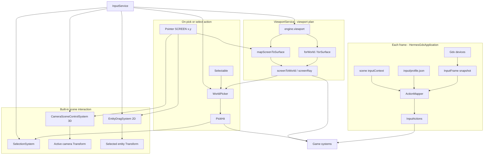

# Unified Input System Implementation Plan

> **For agentic workers:** REQUIRED SUB-SKILL: Use superpowers:subagent-driven-development (recommended) or superpowers:
> executing-plans to implement this plan task-by-task. Steps use checkbox (`- [ ]`) syntax for tracking.

> **Prerequisite:** Implement [`2026-05-22-viewport-coordinate-service.md`](2026-05-22-viewport-coordinate-service.md)
> first (through Task 12: `ViewportService`, `SceneViewport`, `mapScreenToSurface`, `CameraResolver.resolveForPass`).
> Input does **not** implement camera or viewport math — it consumes `HermesEngine.viewport()` only.

**Goal:** One input stack: device polling → remapped **actions** → **viewport-aware** screen/world coordinates → **world
picking** for selectable entities. Config-first for bindings; direct device access and picker APIs for code. **Templates and
dogfood** ship working pointer demos: **3D** orbit/pan the active camera on empty click+drag; **2D** click-to-select and
drag-to-move entities.

**Architecture:** `InputService` (on `HermesEngine`) owns per-frame poll and `InputActions`. All coordinate conversion
and projection lives in **`ViewportService`** (`engine.viewport()`). `WorldPicker` calls
`viewport.mapScreenToSurface` → `viewport.forSurface` / `screenRay` — same path as render passes. No `ViewportMapper`, no
duplicate `SceneCamera`. No libGDX in `hermes-api`. Pre-release: no migration shims.

**Tech Stack:** Java 11, libGDX input polling (core only), Gson JSON, JUnit 5. Viewport math via `ViewportService` (see
viewport plan).

---

## Coordinate spaces (read this first)

Canonical definitions live in [`docs/coordinate-spaces.md`](../coordinate-spaces.md) (written by the viewport plan).
Input only consumes them via `ViewportService`.

| Space          | Origin / axes                                    | Used for input |
|----------------|--------------------------------------------------|----------------|
| **SCREEN**     | Bottom-left of the **window**; `Gdx.input` x/y   | Raw pointer from poll |
| **SURFACE**    | Bottom-left of the **render target** (backbuffer) | After `mapScreenToSurface` (letterbox-aware) |
| **WORLD**      | ECS `Transform` units                            | Picking, movement, AI |
| **NORMALIZED** | 0..1 on camera viewport rect                     | Optional HUD anchors (viewport API) |

**Rules:**

1. Pointer hardware → **SCREEN** (`PointerSnapshot.screenX/Y`).
2. Picking / gameplay → **WORLD** via `engine.viewport()` — never reimplement `unproject` in input code.
3. Full-screen games (`world3d` → `"screen"`): `viewport.screenToWorld(world, screenX, screenY, z, out)` or
   `viewport.forWorld(world).screenToWorld(...)`.
4. Letterboxed or FBO workflows: `mapScreenToSurface(screenX, screenY, surface, out)` then
   `forSurface(world, surface).screenRay(out.x, out.y)`.

### Orthographic picking

`ViewportService` / `SceneViewport` (viewport plan) already mirror `SceneCamera` ortho math. Input calls:

```java
Vec3 world = new Vec3();
engine.viewport().screenToWorld(world, screenX, screenY, 0f, world);
// or: viewport.forWorld(world).screenToWorld(screenX, screenY, 0f, world);
```

For 2D on `z = 0`, use `planeZ = 0f`.

### Perspective picking

```java
ScreenRay ray = engine.viewport().screenRay(world, screenX, screenY);
// WorldPicker: ray-sphere vs Selectable.radius at Transform center
```

Mesh AABB picking is **out of scope** for this plan (sphere/circle only).

### Consistency guarantee

```text
Render pass:  ViewportService → CameraResolver.resolveForPass → SceneCamera → draw
Input pick:   ViewportService → same resolver + SceneCamera → screenRay / screenToWorld
```

No parallel code path. If pick and draw disagree, fix `ViewportService` — not input.

---

## System diagram



---

## Public API (`hermes-api`)

### `HermesEngine`

```java
InputService input();
ViewportService viewport();  // viewport plan — coordinate authority
```

### `InputService`

```java
public interface InputService {
  InputActions actions();
  InputDevices devices();

  /**
   * Convenience delegate to {@link HermesEngine#viewport()}{@code .forWorld(world)}.
   * Prefer {@code engine.viewport()} when both services are available.
   */
  SceneViewport viewport(World world);

  /** Screen coords (window). Uses backbuffer surface + active camera via ViewportService. */
  Optional<PickHit> pick(World world, float screenX, float screenY);
  Optional<PickHit> pick(World world, float screenX, float screenY, PickLayer layer);
}
```

Types `SceneViewport`, `ScreenRay`, `Vec2`, `Vec3` live in `dev.hermes.api.viewport` and `dev.hermes.api.math` (owned by
the viewport plan — **do not** duplicate under `dev.hermes.api.input`).

### Devices (direct access)

```java
public interface InputDevices {
  KeyboardSnapshot keyboard();
  PointerSnapshot pointer();
  int gamepadCount();
  GamepadSnapshot gamepad(int index);
}
```

Snapshots are **immutable for the current frame** (copied at poll). `PointerSnapshot`:

```java
float screenX();
float screenY();
boolean pressed();
boolean justPressed(int button);
boolean pressed(int button);
```

### Actions (remapped)

```java
public interface InputActions {
  boolean pressed(String action);
  boolean justPressed(String action);
  boolean justReleased(String action);
  float axis(String action); // -1..1
  void axis2(String action, float[] out); // out[0]=x out[1]=y
  String context();
}
```

### Viewport (defined in viewport plan — referenced here)

See `dev.hermes.api.viewport.SceneViewport`, `dev.hermes.api.math.ScreenRay`, `Vec2`, `Vec3` in
[`2026-05-22-viewport-coordinate-service.md`](2026-05-22-viewport-coordinate-service.md). Input code imports those types;
it does not redefine them.

### Picking

```java
public final class PickHit {
  public final EntityId entity;
  public final String entityName; // may be null
  public final float worldX, worldY, worldZ;
  public final float distance; // for sorting
}

public enum PickLayer { WORLD, UI, ANY }
```

### `Selectable` component

```java
public final class Selectable implements Component {
  private boolean enabled = true;
  private float radius = 16f; // world units; sphere for 3D, circle in XY for 2D
  private PickLayer layer = PickLayer.WORLD;
}
```

Scene JSON:

```json
"Selectable": { "radius": 40, "layer": "WORLD" }
```

### Key constants

`InputKey`, `InputButton`, `GamepadAxis`, `GamepadButton` — int constants + `byName(String)` for JSON; values match
libGDX (test asserts `InputKey.SPACE`).

---

## Config: `assets/input/profile.json`

Referenced from `hermes.json` (required field — pre-release, no optional fallback):

```json
{
  "inputProfile": "input/profile.json"
}
```

```json
{
  "version": 1,
  "context": "gameplay",
  "actions": {
    "move_x": { "type": "axis" },
    "move_y": { "type": "axis" },
    "select": { "type": "button" },
    "pause": { "type": "button" }
  },
  "bindings": [
    { "action": "move_x", "source": "keyboard", "key": "D", "scale": 1 },
    { "action": "move_x", "source": "keyboard", "key": "A", "scale": -1 },
    { "action": "move_y", "source": "keyboard", "key": "W", "scale": 1 },
    { "action": "move_y", "source": "keyboard", "key": "S", "scale": -1 },
    { "action": "select", "source": "pointer", "button": "LEFT", "when": "justPressed" },
    { "action": "pause", "source": "keyboard", "key": "ESCAPE", "when": "justPressed" },
    { "action": "move_x", "source": "gamepad", "axis": "LEFT_X" }
  ],
  "gamepad": { "deadzone": 0.15 }
}
```

| Field      | Description                                                                          |
|------------|--------------------------------------------------------------------------------------|
| `context`  | Default action context id (overridden per scene, see below).                         |
| `actions`  | `button` or `axis`.                                                                  |
| `bindings` | Flat list; filter by optional `context` on binding (omit = applies to all contexts). |
| `when`     | `pressed` (default), `justPressed`, `justReleased` — for pointer/keyboard/gamepad.   |

**Scene override** — top-level in scene JSON only:

```json
{
  "inputContext": "menu",
  "entities": []
}
```

Bindings with `"context": "menu"` apply when that scene is active (top of stack). No inheritance chains — explicit
context strings only.

---

## Core implementation notes

### `InputServiceImpl` (`hermes-core`)

- Constructed with `HermesEngineImpl` ref (holds `ViewportService` from same engine).
- Loads profile from `HermesLauncherSupport.inputProfilePath()` at startup; fail fast if path set but asset missing.
- `poll(delta)`:
    1. Read keyboard, pointer, gamepads from `GdxInputReaders`.
    2. Build `InputFrame` (immutable snapshots).
    3. Resolve `context` from active scene `inputContext` or profile default.
    4. `ActionMapper.apply(frame, context, actionsState)`.
- Does **not** store window size for camera math — `ViewportService` owns that via `onWindowResize` (viewport plan).

```java
@Override
public SceneViewport viewport(World world) {
  return engine.viewport().forWorld(world);
}
```

### `ActionMapper`

- Precompute `Map<String, List<ResolvedBinding>>` per context at load time.
- Axis: sum scaled contributions, clamp to [-1,1].
- Button: OR across bindings; track previous frame for justPressed/Released.

### `WorldPicker` (uses `ViewportService` only)

```java
final class WorldPicker {
  private final ViewportService viewport;

  WorldPicker(ViewportService viewport) {
    this.viewport = viewport;
  }

  Optional<PickHit> pick(World world, float screenX, float screenY, PickLayer layer) {
    RenderSurfaceDesc surface = viewport.backbufferSurface(world);
    Vec2 onSurface = new Vec2();
    viewport.mapScreenToSurface(screenX, screenY, surface, onSurface);
    SceneViewport vp = viewport.forSurface(world, surface);

    // Projection mode: read from resolved camera via ortho test or SceneViewport helper
    if (isOrthographic(world, surface)) {
      Vec3 worldPt = new Vec3();
      vp.screenToWorld(onSurface.x, onSurface.y, 0f, worldPt);
      return pickOrtho(worldPt, world, layer);
    }
    ScreenRay ray = vp.screenRay(onSurface.x, onSurface.y);
    return pickPerspective(ray, world, layer);
  }
}
```

For the common case (full-screen `target: "screen"`, no letterbox hit-test in bars), `pick` may call
`viewport.screenRay(world, screenX, screenY)` directly — `ViewportService` applies `mapScreenToSurface` internally when
needed.

**Do not add** `ViewportMapper`, `SceneViewportImpl` under `dev.hermes.core.input` — they belong in
`dev.hermes.core.viewport` (viewport plan).

`pickOrtho`: iterate `world.entitiesWith(Selectable.class)`, skip `!enabled`, filter `RenderLayer` if needed, compare
`hypot(tx - world.x, ty - world.y) <= radius`.

`pickPerspective`: ray-sphere intersection per selectable center `(tx,ty,tz)` radius `r`; smallest positive `t` wins.

### `SelectionSystem` (builtin GLOBAL)

Registered in `BuiltinComponents`. On `actions.justPressed("select")` in active world:

```java
PickHit hit = input.pick(activeWorld, pointer.screenX(), pointer.screenY()).orElse(null);
if (hit != null) {
  world.getComponent(hit.entity(), Selected.class); // toggle or set — see below
}
```

Add optional `Selected` marker component (empty tag) for viz/systems. Config-only games tag entities in scene JSON;
selection system sets `Selected` on picked entity and clears previous (single-select).

### Scene interaction (templates + dogfood)

Built-in **GLOBAL** systems (registered with `SelectionSystem` in `BuiltinComponents`). No game Java required for the
stock demos.

| Projection   | Pointer LEFT down on empty | Pointer LEFT down on entity | Pointer LEFT drag              |
|--------------|------------------------------|-----------------------------|--------------------------------|
| **Perspective (3D)** | Start camera orbit session   | Select entity (`Selected`)  | Orbit camera around look-at    |
| **Orthographic (2D)** | Clear selection              | Select entity               | Move `Selected` entity in world XY |

**3D camera orbit (`CameraSceneControlSystem`):**

- Runs only when the active camera’s `Camera.projection()` is `PERSPECTIVE`.
- On `pointer.justPressed(LEFT)`: if `input.pick(...)` is empty → begin orbit; store last screen x/y.
- While `pointer.pressed(LEFT)` and orbiting: horizontal delta → yaw (`Transform.rotationY`), vertical delta → pitch
  (`Transform.rotationX`, clamped ±89°). Recompute camera position on a sphere around the look-at point (use
  `Camera.lookAt*` when set, else world origin `(0,0,0)`).
- Does **not** move entities in 3D demos (selection is visual only).

**2D drag move (`EntityDragSystem`):**

- Runs only when the active camera’s `Camera.projection()` is `ORTHOGRAPHIC`.
- Each frame while `pointer.pressed(LEFT)` and some entity has `Selected`: map previous and current pointer through
  `engine.viewport().screenToWorld(world, x, y, selectedEntity.z, out)` (or `planeZ` from entity `Transform.z()`), apply
  `(dx, dy)` to `Transform.x/y`.
- Skips drag on the frame of `justPressed` if the pick missed (cleared selection).

**Shared helper** — add to `CameraResolver`:

```java
/** First active camera entity with Transform, same choice as {@link #resolveForPass}. */
public static Optional<Entity> activeCameraEntity(World world);
```

`CameraSceneControlSystem` and `EntityDragSystem` mutate that entity’s `Transform` / `Camera.setLookAt` in place (same
path render uses on the next frame).

**Demo assets (keep templates aligned with dogfood):**

| Module | Scene | Demo behavior |
|--------|-------|---------------|
| `dogfood-simulation` | `scenes/main.json` (3D) | `Selectable` on `cube`; orbit camera on empty drag |
| `hermes-templates/minimal` | `scenes/main.json` (3D) | Same as dogfood (single cube) |
| `hermes-templates/multi-scene` | `scenes/main.json` (3D) | Same; keep `SceneNavigationSystem` pause overlay |
| `hermes-templates/2d` | `scenes/main.json` (2D) | Two sprites with `Selectable`; drag logo/counterpart |

All four ship identical `assets/input/profile.json` (bindings below) and `hermes.json` field `"inputProfile"`.

---

## File map

| File                                                                | Responsibility                                 |
|---------------------------------------------------------------------|------------------------------------------------|
| **hermes-api** (input — this plan)                                  |                                                |
| `input/InputService.java`                                           | Facade; `viewport()` delegates to engine       |
| `input/InputActions.java`                                           |                                                |
| `input/InputDevices.java`                                           |                                                |
| `input/KeyboardSnapshot.java`                                       |                                                |
| `input/PointerSnapshot.java`                                        |                                                |
| `input/GamepadSnapshot.java`                                        |                                                |
| `input/PickHit.java`                                                |                                                |
| `input/PickLayer.java`                                              |                                                |
| `input/InputKey.java`                                               |                                                |
| `ecs/Selectable.java`                                               |                                                |
| `ecs/Selected.java`                                                 | optional tag                                   |
| `ecs/HermesEngine.java`                                             | `input()` (+ `viewport()` from viewport plan)  |
| **hermes-api** (viewport plan — prerequisite)                         |                                                |
| `viewport/ViewportService.java`, `SceneViewport.java`, `RenderSurfaceDesc.java` | Do not duplicate in input package |
| `math/Vec2.java`, `Vec3.java`, `ScreenRay.java`                     | Shared by input + viewport                     |
| **hermes-core** (input — this plan)                                 |                                                |
| `input/InputServiceImpl.java`                                       | poll + delegate pick/viewport                  |
| `input/InputFrame.java`                                             |                                                |
| `input/GdxInputReaders.java`                                        | Gdx poll only                                  |
| `input/InputProfile.java`                                           | parsed JSON                                    |
| `input/InputProfileLoader.java`                                     |                                                |
| `input/ActionMapper.java`                                           |                                                |
| `input/WorldPicker.java`                                            | uses `ViewportService`                         |
| `input/SelectionSystem.java`                                        | click → `Selected`                             |
| `input/CameraSceneControlSystem.java`                             | 3D empty-drag → orbit active camera            |
| `input/EntityDragSystem.java`                                       | 2D drag → move `Selected` entity               |
| `ecs/CameraResolver.java`                                           | `activeCameraEntity(World)`                    |
| `ecs/BuiltinComponents.java`                                        | register Selectable, Selected, interaction systems |
| `scene/SceneMetadata.java`                                          | `inputContext` on handle                       |
| `ecs/HermesEngineImpl.java`                                         | owns InputServiceImpl + ViewportServiceImpl    |
| `HermesGdxApplication.java`                                         | `engine.input().poll(delta)` before systems    |
| `HermesLauncherSupport.java`                                        | `inputProfilePath()`                           |
| **hermes-core** (viewport plan — prerequisite)                      |                                                |
| `viewport/*`                                                        | `ViewportServiceImpl`, `SceneViewportImpl`, …  |
| **hermes-tooling / gradle**                                         |                                                |
| `HermesGameConfig` + parser + `HermesLaunchProperties.inputProfile` |                                                |
| **docs**                                                            | `input.md`, `input-format-v1.md`, link `coordinate-spaces.md` |

**Removed from this plan (never implement):** `ViewportMapper`, `input/SceneViewport.java`, duplicate math types under
`input/`, `SensorInput`, `InputListener`, context inheritance, noop profile mode, split Gdx backend classes.

## Relationship to viewport plan

| Viewport plan deliverable | Used by input as |
|---------------------------|------------------|
| `HermesEngine.viewport()` | `InputService.viewport()` delegate; `WorldPicker` ctor dependency |
| `mapScreenToSurface` | Pointer SCREEN → SURFACE before ray cast |
| `forWorld` / `forSurface` | Picking matches active pass / letterbox |
| `screenRay` / `screenToWorld` | Perspective / ortho pick |
| `Camera.renderTarget` + `resolveForPass` | Ensures pick uses same camera as off-screen world pass when configured |

---

### Task 1: Input API skeleton (no viewport types)

**Prerequisite:** Viewport plan Task 3 (`Vec2`, `Vec3`, `SceneViewport`, `ViewportService` on `HermesEngine`) merged.

**Files:**

- Create: `hermes-api/.../input/InputService.java`, `InputActions.java`, `InputDevices.java`, snapshots, `PickHit`, `PickLayer`, `InputKey` stubs
- Modify: `HermesEngine.java` — `input()` only if `viewport()` already added by viewport plan

- [ ] **Step 1: Input interfaces** — signatures from **Public API**; import `SceneViewport` from `dev.hermes.api.viewport`

- [ ] **Step 2: `InputService.viewport(World)` Javadoc** — documents delegation to `engine.viewport().forWorld(world)`

- [ ] **Step 3: Compile**

Run: `./gradlew :hermes-api:compileJava`
Expected: SUCCESS

- [ ] **Step 4: Commit**

```bash
git commit -m "feat(input): add InputService API (viewport types from viewport module)"
```

---

### Task 2: InputKey constants

**Files:**

- Create: `InputKey.java`, `InputButton.java`, `GamepadAxis.java`, `GamepadButton.java`
- Test: `InputKeyTest.java`

- [ ] **Step 1: Failing test** — `InputKey.SPACE` equals libGDX `Keys.SPACE`; `byName("escape")` works.

- [ ] **Step 2: Implement** — map common keys used in bindings JSON.

- [ ] **Step 3: Run** `./gradlew :hermes-api:test --tests dev.hermes.api.input.InputKeyTest`

- [ ] **Step 4: Commit**

---

### Task 3: Input profile loader + ActionMapper

**Files:**

- Create: `InputProfile.java`, `InputProfileLoader.java`, `ActionMapper.java`, `InputActionsState.java`
- Test: `InputProfileLoaderTest.java`, `ActionMapperTest.java`
- Resource: `hermes-core/src/test/resources/assets/input/profile.json`

- [ ] **Step 1: Loader test** — parse profile, 5 bindings.

- [ ] **Step 2: ActionMapper test**

```java
@Test
void justPressed_select_whenPointerLeftClicked() {
  InputProfile profile = InputProfileLoader.load(...);
  ActionMapper mapper = new ActionMapper(profile);
  InputActionsState state = new InputActionsState();
  InputFrame frame = InputFrame.pointerJustPressed(100, 200, InputButton.LEFT);
  mapper.apply(frame, "gameplay", state);
  assertTrue(state.justPressed("select"));
}
```

- [ ] **Step 3: Implement `ActionMapper`** — keyboard/pointer/gamepad; deadzone on gamepad axes; axis combine clamp.

- [ ] **Step 4: Run tests** `./gradlew :hermes-core:test --tests "dev.hermes.core.input.ActionMapperTest"`

- [ ] **Step 5: Commit**

---

### Task 4: Gdx poll + InputServiceImpl + engine wire-up

**Files:**

- Create: `InputFrame.java`, `GdxInputReaders.java`, `InputServiceImpl.java`
- Modify: `HermesEngineImpl.java`, `HermesGdxApplication.java`

- [ ] **Step 1: `GdxInputReaders.poll()`** — copy keyboard keys needed for bindings; pointer x/y/buttons;
  `Controllers.getControllers()`.

- [ ] **Step 2: `InputServiceImpl.poll(delta)`** — build frame, run mapper (window size for viewport is handled by
  `ViewportService.onWindowResize` in `HermesGdxApplication`, not input).

- [ ] **Step 3: Wire engine** — `HermesEngineImpl.input()` returns service; `HermesGdxApplication.render()`:

```java
engine.input().poll(Gdx.graphics.getDeltaTime());
```

- [ ] **Step 4: Test with fake frame injection** — package-private `InputServiceImpl.pollFrame(InputFrame)` for unit
  tests. Add `InputFrame` test factories used by interaction tests:

```java
static InputFrame pointerJustPressed(float x, float y, int button) { ... }
static InputFrame pointerPressed(float x, float y, int button) { ... }
/** pressed(button) true, position moved since last frame */
static InputFrame pointerDrag(float x, float y, int button) { ... }
```

- [ ] **Step 5: Commit**

---

### Task 5: WorldPicker wired to ViewportService

**Prerequisite:** Viewport plan Tasks 6–12 (`ViewportServiceImpl`, `mapScreenToSurface`, `screenRay`).

**Files:**

- Create: `hermes-core/.../input/WorldPicker.java`
- Test: `hermes-core/.../input/WorldPickerTest.java`

- [ ] **Step 1: Ortho pick test** — scene with camera at (320,240), 640×480; compute screen coords via
  `engine.viewport().forWorld(world).worldToScreen(...)` then `picker.pick(world, screenX, screenY, WORLD)`.

- [ ] **Step 2: Implement `WorldPicker`** — constructor takes `ViewportService`; code from **Core implementation notes**
  (no `ViewportMapper`).

- [ ] **Step 3: `InputServiceImpl`** — `viewport(world)` → `engine.viewport().forWorld(world)`; `pick(...)` →
  `worldPicker.pick(...)`.

- [ ] **Step 4: Perspective ray pick test** — sphere `Selectable` along camera forward axis.

- [ ] **Step 5: Run** `./gradlew :hermes-core:test --tests dev.hermes.core.input.WorldPickerTest`

- [ ] **Step 6: Commit**

```bash
git commit -m "feat(input): WorldPicker uses ViewportService for pick rays"
```

---

### Task 6: Selectable component + scene assets

**Files:**

- Create: `Selectable.java`, `Selected.java` (api)
- Modify: `BuiltinComponents.java` — deserializer for `Selectable`
- Test resource: `scenes/pick-test.json`

- [ ] **Step 1: Scene test asset** — two entities, different `Selectable.radius`, transforms far apart.

- [ ] **Step 2: Register `Selectable` / `Selected` in `BuiltinComponents`**

- [ ] **Step 3: Extend `WorldPickerTest`** — load `pick-test.json`; assert closest entity wins (uses Task 5 picker).

- [ ] **Step 4: Commit**

```bash
git commit -m "feat(input): Selectable component and pick test scene"
```

---

### Task 7: SelectionSystem + scene inputContext

**Files:**

- Create: `SelectionSystem.java`
- Modify: scene loader for `inputContext`
- Modify: `SceneHandle` / metadata
- Test: `SelectionSystemTest.java`

- [ ] **Step 1: Test** — profile with `select` action; scene with two selectables; simulate pointer click → exactly one
  entity has `Selected`.

- [ ] **Step 2: `SelectionSystem`** — GLOBAL; only active world; clear previous `Selected` on new pick.

- [ ] **Step 3: Scene `inputContext`** — store on scene; `ActionMapper` uses binding `context` filter: binding applies
  if `binding.context` is null, `"*"`, or equals active scene context.

- [ ] **Step 4: Commit**

---

### Task 8: Camera orbit (3D) + entity drag (2D)

**Files:**

- Create: `hermes-core/.../input/CameraSceneControlSystem.java`, `EntityDragSystem.java`
- Modify: `hermes-core/.../ecs/CameraResolver.java` — `activeCameraEntity(World)`
- Modify: `hermes-core/.../ecs/BuiltinComponents.java` — register both systems (GLOBAL), after `SelectionSystem`
- Test: `CameraSceneControlSystemTest.java`, `EntityDragSystemTest.java`

- [ ] **Step 1: Failing test — active camera entity**

```java
@Test
void activeCameraEntity_returnsFirstActiveWithTransform() {
  World world = loadScene("scenes/camera-pick-test.json"); // one active Camera + Transform
  Optional<Entity> cam = CameraResolver.activeCameraEntity(world);
  assertTrue(cam.isPresent());
  assertEquals("main-camera", cam.get().name());
}
```

Run: `./gradlew :hermes-core:test --tests dev.hermes.core.ecs.CameraResolverTest`
Expected: FAIL — method missing

- [ ] **Step 2: Implement `CameraResolver.activeCameraEntity`**

```java
public static Optional<Entity> activeCameraEntity(World world) {
  if (world == null) {
    return Optional.empty();
  }
  Entity active = null;
  Entity fallback = null;
  for (Entity entity : world.entitiesWith(Camera.class)) {
    Camera camera = world.getComponent(entity.id(), Camera.class);
    if (camera == null || world.getComponent(entity.id(), Transform.class) == null) {
      continue;
    }
    if (fallback == null) {
      fallback = entity;
    }
    if (camera.active()) {
      active = entity;
      break;
    }
  }
  Entity chosen = active != null ? active : fallback;
  return Optional.ofNullable(chosen);
}
```

- [ ] **Step 3: Failing test — 3D orbit moves camera Transform**

```java
@Test
void emptyClickDrag_orbitsPerspectiveCamera() {
  HermesEngineImpl engine = testEngineWithInput();
  World world = loadScene("scenes/perspective-orbit-test.json");
  InputService input = engine.input();
  EntityId camId = CameraResolver.activeCameraEntity(world).orElseThrow().id();
  float rotationYBefore = world.getComponent(camId, Transform.class).rotationY();

  input.pollFrame(InputFrame.pointerJustPressed(320, 240, InputButton.LEFT)); // miss entities
  input.pollFrame(InputFrame.pointerDrag(340, 240, InputButton.LEFT)); // +20px X

  float rotationYAfter = world.getComponent(camId, Transform.class).rotationY();
  assertNotEquals(rotationYBefore, rotationYAfter, 0.01f);
}
```

- [ ] **Step 4: Implement `CameraSceneControlSystem`**

```java
public final class CameraSceneControlSystem implements System {
  private final InputService input;
  private boolean orbiting;
  private float lastScreenX;
  private float lastScreenY;
  private static final float DEG_PER_PIXEL = 0.35f;

  public CameraSceneControlSystem(InputService input) {
    this.input = input;
  }

  @Override
  public void update(World world, float deltaSeconds) {
    PointerSnapshot ptr = input.devices().pointer();
    Camera.Projection mode =
        CameraResolver.activeCameraEntity(world)
            .map(e -> world.getComponent(e.id(), Camera.class).projection())
            .orElse(Camera.Projection.ORTHOGRAPHIC);
    if (mode != Camera.Projection.PERSPECTIVE) {
      orbiting = false;
      return;
    }
    if (ptr.justPressed(InputButton.LEFT)) {
      boolean hit =
          input.pick(world, ptr.screenX(), ptr.screenY(), PickLayer.WORLD).isPresent();
      if (!hit) {
        orbiting = true;
        lastScreenX = ptr.screenX();
        lastScreenY = ptr.screenY();
      } else {
        orbiting = false;
      }
    }
    if (!ptr.pressed(InputButton.LEFT)) {
      orbiting = false;
      return;
    }
    if (!orbiting) {
      return;
    }
    float dx = ptr.screenX() - lastScreenX;
    float dy = ptr.screenY() - lastScreenY;
    lastScreenX = ptr.screenX();
    lastScreenY = ptr.screenY();
    orbitActiveCamera(world, dx, dy);
  }

  private void orbitActiveCamera(World world, float dx, float dy) { /* spherical offset around lookAt */ }
}
```

Implement `orbitActiveCamera`: read `Transform` + `Camera` on active entity; target = `lookAt` if `hasLookAt()`, else
`(0,0,0)`; adjust `rotationY += dx * DEG_PER_PIXEL`, `rotationX -= dy * DEG_PER_PIXEL` (clamp); set position =
`target + sphericalOffset(distance, rotationX, rotationY)`; call `camera.setLookAt(target)`.

- [ ] **Step 5: Failing test — 2D drag moves Selected entity**

```java
@Test
void dragMovesSelectedEntityInOrthoWorld() {
  HermesEngineImpl engine = testEngineWithInput();
  World world = loadScene("scenes/ortho-drag-test.json"); // ortho camera + selectable at (100,100)
  EntityId logo = world.findByName("logo").id();
  world.addComponent(logo, new Selected());

  input.pollFrame(InputFrame.pointerPressed(100, 100, InputButton.LEFT));
  input.pollFrame(InputFrame.pointerDrag(120, 100, InputButton.LEFT));

  Transform t = world.getComponent(logo, Transform.class);
  assertEquals(120f, t.x(), 0.5f);
}
```

- [ ] **Step 6: Implement `EntityDragSystem`** — ortho only; skip unless `Selected` exists and pointer pressed; use
  `viewport.screenToWorld` delta on `Transform.x/y`.

- [ ] **Step 7: Register in `BuiltinComponents`**, wire `InputService` into constructors from `HermesEngineImpl`.

- [ ] **Step 8: Run** `./gradlew :hermes-core:test --tests "dev.hermes.core.input.CameraSceneControlSystemTest,dev.hermes.core.input.EntityDragSystemTest"`

- [ ] **Step 9: Commit**

```bash
git add hermes-core/src/main/java/dev/hermes/core/input/CameraSceneControlSystem.java \
  hermes-core/src/main/java/dev/hermes/core/input/EntityDragSystem.java \
  hermes-core/src/main/java/dev/hermes/core/ecs/CameraResolver.java \
  hermes-core/src/test/java/dev/hermes/core/input/
git commit -m "feat(input): 3D camera orbit and 2D entity drag builtins"
```

---

### Task 9: `inputProfile` + dogfood + all templates

**Files:**

- Modify: `HermesGameConfig`, `HermesGameConfigParser`, `HermesLaunchProperties`, runtime generator, `HermesLauncherSupport`
- Create: `assets/input/profile.json` (shared content) in:
    - `dogfood-simulation/src/main/resources/assets/input/profile.json`
    - `hermes-templates/minimal/game/src/main/resources/assets/input/profile.json`
    - `hermes-templates/multi-scene/game/src/main/resources/assets/input/profile.json`
    - `hermes-templates/2d/game/src/main/resources/assets/input/profile.json`
- Modify `hermes.json` in all four modules — add `"inputProfile": "input/profile.json"`
- Modify scenes (see table in **Scene interaction**):
    - `dogfood-simulation/.../scenes/main.json` — `Selectable` on `cube` (`radius`: 1.2)
    - `hermes-templates/minimal/.../scenes/main.json` — `Selectable` on `cube`
    - `hermes-templates/multi-scene/.../scenes/main.json` — `Selectable` on `cube`
    - `hermes-templates/2d/.../scenes/main.json` — add second entity `marker` + `Selectable` on both `logo` and `marker`
- Test: `HermesGameConfigParserTest` — `inputProfile` required/ parsed
- Test: `hermes-cli/.../TemplateSupportTest` — generated project contains `input/profile.json`

**Shared `assets/input/profile.json`:**

```json
{
  "version": 1,
  "context": "gameplay",
  "actions": {
    "select": { "type": "button" },
    "pause": { "type": "button" }
  },
  "bindings": [
    { "action": "select", "source": "pointer", "button": "LEFT", "when": "justPressed" },
    { "action": "pause", "source": "keyboard", "key": "ESCAPE", "when": "justPressed" }
  ],
  "gamepad": { "deadzone": 0.15 }
}
```

(`CameraSceneControlSystem` / `EntityDragSystem` use raw pointer drag; no extra binding entries.)

- [ ] **Step 1: Require `inputProfile` in parser** (same pattern as `renderPipeline`).

```java
@Test
void parse_requiresInputProfile() {
  HermesGameConfig config =
      HermesGameConfigParser.parse(
          "{\"title\":\"T\",\"scene\":\"scenes/main.json\","
              + "\"renderPipeline\":\"render/pipeline.json\","
              + "\"inputProfile\":\"input/profile.json\"}");
  assertEquals("input/profile.json", config.getInputProfile());
}
```

- [ ] **Step 2: Copy profile into dogfood + three templates; update all four `hermes.json`.**

- [ ] **Step 3: Patch scene JSON** per projection (3D `Selectable` on mesh entity; 2D two selectables).

Example `dogfood-simulation/src/main/resources/assets/scenes/main.json` fragment:

```json
{
  "id": "cube",
  "components": {
    "Transform": { "x": 0, "y": 0, "z": 0 },
    "Mesh": { "model": "models/cube.obj", "texture": "hermes-logo.png" },
    "Material": { "shader": "default/unlit" },
    "Selectable": { "radius": 1.2, "layer": "WORLD" },
    "SpinMarker": { "speed": 1.2, "centerX": 0, "centerY": 0, "radius": 1.5 },
    "BounceMarker": { "amplitude": 0.2, "speed": 3 }
  }
}
```

Example `hermes-templates/2d/game/src/main/resources/assets/scenes/main.json` — add `marker` entity at `(180, 180)` with
`Sprite` + `Selectable`, and on `logo`:

```json
"Selectable": { "radius": 48, "layer": "WORLD" }
```

- [ ] **Step 4: Optional — `SelectionVisualSystem` in dogfood only** (tint or scale bump when `Selected`) so selection is
  visible without extra template Java. Templates stay zero-Java (`Game.onCreate` empty).

- [ ] **Step 5: Manual smoke**

```bash
./gradlew :dogfood-simulation:hermesRunDesktop
```

3D: drag empty background → camera orbits cube; click cube → selects (log or tint).  
2D template (after `hermes new --template 2d`): drag sprite → moves; click other → retargets selection.

- [ ] **Step 6: Template test** — `TemplateSupportTest` asserts `input/profile.json` exists in materialized `minimal` and
  `2d` projects.

- [ ] **Step 7: Commit**

```bash
git add dogfood-simulation hermes-templates HermesGameConfig*.java hermes-tooling
git commit -m "feat(input): ship input profile and scene demos in dogfood and templates"
```

---

### Task 10: Documentation

**Files:**

- Create: `docs/input.md`, `docs/input-format-v1.md`
- Update: `docs/scene-format-v1.md`, `docs/ARCHITECTURE.md`, `docs/README.md`

- [ ] **Step 1: Document coordinate spaces** with diagrams and ortho/perspective examples.

- [ ] **Step 2: Cookbook** — “click to select”, “3D orbit camera on empty drag”, “2D drag selected entity”, “move toward
  world point”, “UI vs WORLD pick layer”.

- [ ] **Step 3: Update `docs/scene-management.md`** — note built-in pointer demos on stock scenes.

- [ ] **Step 4: Commit**

---

## Usage patterns

### Config-only select

`input/profile.json` binds pointer → `select`. Scene entities include `Selectable`. Engine `SelectionSystem` toggles
`Selected`. No game Java required.

### Built-in: 3D scene navigation (empty click + drag)

Perspective scenes (dogfood, `minimal`, `multi-scene` templates): drag on empty space orbits the active camera. Click the
cube to select. No game code.

### Built-in: 2D select and move

Orthographic `2d` template: click a sprite to select; drag to move. Requires `Selectable` on entities (shipped in template
`main.json`).

### Code: move toward clicked world point

```java
if (input.actions().justPressed("select")) {
  PointerSnapshot p = input.devices().pointer();
  Vec3 world = new Vec3();
  engine.viewport().screenToWorld(activeWorld, p.screenX(), p.screenY(), 0f, world);
  // or: input.viewport(activeWorld).screenToWorld(...)  — same delegate
}
```

### Code: bypass actions

```java
if (input.devices().keyboard().justPressed(InputKey.F1)) { ... }
```

### Code: screen position of entity

```java
Transform t = world.getComponent(id, Transform.class);
Vec2 screen = new Vec2();
engine.viewport().forWorld(world).worldToScreen(t.x(), t.y(), t.z(), screen);
```

---

## Self-review

| Requirement             | Task                                                   |
|-------------------------|--------------------------------------------------------|
| Prerequisite viewport   | Viewport plan Tasks 1–12 before input Task 5           |
| All input sources       | Task 4 (keyboard, pointer, gamepad)                    |
| Config actions/bindings | Task 3, 8                                              |
| Unified API             | Task 1, 4                                              |
| Direct device access    | `InputDevices`                                         |
| Viewport + screen/world | **ViewportService** (viewport plan); input Task 5 wires pick only |
| No ViewportMapper       | Removed; grep plan confirms zero references            |
| World selection         | Task 6, 7                                              |
| 3D camera orbit (empty drag) | Task 8                                          |
| 2D select + drag move   | Task 8, 9 (2d template scenes)                         |
| Dogfood + templates input demos | Task 9 (all `hermes.json` + scenes + profile)   |
| Config-first + code     | Tasks 7–9, usage patterns                              |
| Clean / no cruft        | No duplicate SceneViewport; shared math in `api.math`  |

---

## Verification (input plan)

- [ ] `./gradlew :hermes-core:test` — no `ViewportMapper` class on classpath
- [ ] `WorldPicker` constructor requires `ViewportService`
- [ ] `docs/input.md` links to `docs/coordinate-spaces.md` (viewport-owned)
- [ ] Pick + draw use same camera after window resize (manual smoke on `dogfood-simulation`)
- [ ] `hermes new --template 2d` project runs with drag-move demo
- [ ] `hermes new --template minimal` project runs with camera-orbit demo

---

**Plan saved to `docs/superpowers/plans/2026-05-21-unified-input-system.md`.**

**Execution order:** Complete viewport plan → then input plan Tasks 1–10.

**1. Subagent-Driven (recommended)** — fresh subagent per task, review between tasks

**2. Inline Execution** — run in this session with checkpoints

**Which approach?**
