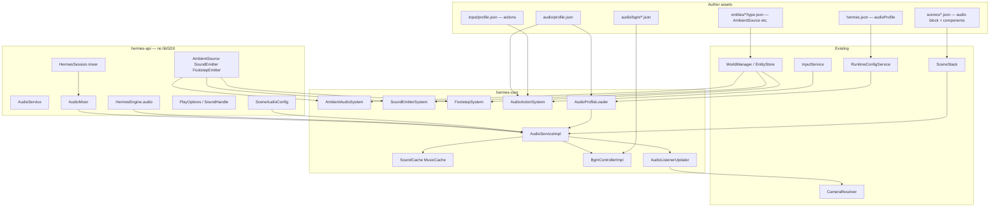

# Audio System Implementation Plan

> **For agentic workers:** REQUIRED SUB-SKILL: Use superpowers:subagent-driven-development (recommended) or superpowers:executing-plans to implement this plan task-by-task. Steps use checkbox (`- [ ]`) syntax for tracking.

> **Pre-release policy:** Nothing is shipped. Prefer clean design over compatibility. Delete interim code; no libGDX in `hermes-api`; no migration shims.

**Goal:** Ship a first-class `AudioService` as the **only** audio path in Hermes — config-driven BGM, SFX, 3D ambient, and action-triggered sounds from assets alone, with a Java/SPI surface for custom emitters and programmatic playback — so authors can build most games from JSON + audio files while heavy projects can override every step.

**Architecture:** `AudioService` on `HermesEngine` owns clip caches, instance pool, BGM controller, and scene lifecycle hooks. Session-scoped `AudioMixer` on `HermesSession` survives scene changes (settings, save/load). Short SFX use pooled libGDX `Sound` with `SoundHandle` for runtime changes; streaming BGM uses `Music` + playlist JSON. ECS components (`AmbientSource`, `SoundEmitter`, `FootstepEmitter`) + `ACTIVE_SCENE` systems cover config-only gameplay; scene JSON `audio` block + `SceneStack` hooks drive BGM without code (same pattern as `UiService.onSceneEnter`). 3D listener follows active scene camera `Transform` via `CameraResolver`.

**Tech Stack:** Java 11, libGDX 1.14.0 audio (`Sound`/`Music`/`Audio`, core only), Gson-style JSON via libGDX `JsonReader` (core), JUnit 5, `RuntimeConfigService`, `WorldManager` / `EntityStore`, Gradle `:hermes-api:compileJava`, `:hermes-core:test`.

---

## Current baseline (repo state)

| Area | Today | After this plan |
|------|-------|-----------------|
| Audio | **None** — no `AudioService`, no audio components | `HermesEngine.audio()`, full stack below |
| `HermesEngine` | `scenes`, `viewport`, `input`, `runtimeConfig`, `ui`, `entityTypes` — **no `audio()`** | `AudioService audio()` |
| `HermesSession` | `EMPTY` stub; comment mentions future audio mixer | `AudioMixer mixer()` — session-scoped bus volumes |
| Scene metadata | `SceneLoadMetadata`: `renderPipeline`, `inputContext`, `uiConfig` | Add `SceneAudioConfig` → `audioConfig` |
| `SceneStack` | Calls `engine.ui().onSceneEnter/Exit`; lifecycle callbacks | Also calls `engine.audio().onSceneEnter/Exit/Pause/Resume` |
| Systems | `System.update(WorldManager, float)` | Audio systems use `WorldManager` |
| ECS root | `WorldManager` + `EntityStore` (entity-types landed) | Audio systems query `manager.entities()` |
| Entity templates | `assets/entities/<kind>/type.json` | Reusable audio props (campfire, player footsteps) |
| Config launch | `RuntimeConfigService.gameInputProfile()` via `LaunchConfigResolver` | Add optional `gameAudioProfile()` |
| `hermes.json` | `title`, `scene`, `renderPipeline`, `inputProfile` | Optional `audioProfile` (default `audio/profile.json` when omitted) |
| Dogfood module | `dogfood-simulation` | Sample assets + scene audio demo |
| libGDX in api | Forbidden — `InputService`, `UiService` pattern | Same: all GDX in `hermes-core` behind backends |

Representative patterns to **reuse** (do not reinvent):

- `InputServiceImpl` + `InputProfileLoader` — profile load at engine ctor, asset path from runtime config
- `UiServiceImpl.onSceneEnter(id, config)` — scene metadata drives service state
- `SceneDocument` / `SceneLoadMetadata` — parse top-level scene fields
- `CameraResolver.resolveForPass(entities, "screen", w, h)` — active camera transform for listener
- `ComponentRegistration` SPI — custom audio components + systems without editing core
- `ModelCache`-style asset cache — `SoundCache` / `MusicCache`

---

## Relationship to other plans

| Plan | Status | How audio plan uses it |
|------|--------|------------------------|
| [Entity types & WorldManager](2026-05-21-entity-types-and-world-manager.md) | Landed | Systems take `WorldManager`; templates carry `AmbientSource` / `FootstepEmitter`; `$ref` for wiring |
| [Unified input](2026-05-21-unified-input-system.md) | Landed | `AudioActionSystem` plays clips on `input.actions().justPressed(action)`; profile `actionSounds` map |
| [Unified runtime config](2026-05-24-unified-runtime-config-service.md) | Landed | `RuntimeConfigService.gameAudioProfile()`; single `LaunchConfigResolver` key — no duplicate HTML/desktop lists |
| [Custom UI service](2026-05-29-custom-ui-service.md) | Landed / in progress | UI button `action` strings → same namespace as `actionSounds` (e.g. `"ui.click"`) |
| [Save/load sessions](2026-05-22-save-load-sessions.md) | Future | v2: `SessionPersistable` on session captures `AudioMixer` bus volumes; v1 documents hook only |
| [World lighting](2026-05-26-world-lighting.md) | Future | Independent; torch entities can reuse `AmbientSource` template |
| [Debug mode](2026-05-30-debug-mode.md) | Future | Optional audio debug overlay (active clips, bus gains) — not v1 |

**Prerequisites:** Entity-types (`WorldManager`), unified input, runtime config, viewport/`CameraResolver`. No separate audio prerequisite plan.

**Recommended order:** Can run in parallel with save/load or lighting; use `WorldManager` in all new APIs and tests.

---

## Design goals

| Goal | How |
|------|-----|
| **No-code-first** | Scene `"audio"` BGM block, entity templates, ECS components, `audio/profile.json` clip ids + `actionSounds` |
| **Progressive complexity** | Tiers 0–4 (below): pure config → templates → components → code → SPI/custom systems |
| **One audio system** | All playback through `AudioService`; no direct `Gdx.audio` in game code |
| **Generalized** | Clips by path or profile id; buses; playlists; handles for runtime control |
| **Easy to extend** | `ComponentRegistration` SPI; `SoundBackend`/`MusicBackend` for tests and future HTML swap |
| **Performant** | Load-once caches, instance cap per clip, single listener update per frame |
| **Maintainable** | libGDX-free `hermes-api`; scene hooks mirror UI; session mixer separate from engine service |

### Author complexity tiers

| Tier | Author writes | Engine does |
|------|---------------|-------------|
| **0 — Scene BGM** | `audio/bgm/main.json` + scene `"audio": { "bgm": "main" }` | Crossfade BGM on scene enter/exit via `SceneStack` |
| **1 — Entity templates** | `entities/campfire/type.json` with `AmbientSource` + scene `"type": "campfire"` | Factory merge → `AmbientAudioSystem` plays 3D loop |
| **2 — Scene components** | Inline `FootstepEmitter` / `SoundEmitter` on entities | Built-in systems emit on movement / spawn / interval |
| **3 — Action sounds** | `audio/profile.json` `"actionSounds": { "ui.click": "ui_click" }` + input profile actions | `AudioActionSystem` plays on `justPressed` |
| **4 — Code & SPI** | `engine.audio().play(...)`, custom `System`, `ComponentRegistration` | Full programmatic control; custom emitters |

**Honest v1 limit:** Declarative `"playOn": "component"` (e.g. play hit sound when `Health` changes) requires a small gameplay `System` or future event bus — not in v1 tasks. Document as v2 extension.

---

## Requirements coverage

| Requirement | Mechanism |
|-------------|-----------|
| Performant / efficient | `SoundCache` / `MusicCache`; `limits.maxInstancesPerClip`; no per-frame asset I/O; one listener update per frame |
| Dynamic volume, pitch, pan | `PlayOptions` at play time; `SoundHandle` mutators; `AudioMixer.effectiveGain(bus)` |
| BGM random / playlist | `BgmController` + `audio/bgm/*.json` + scene `audio.bgm` |
| Play from movement / gameplay | `FootstepEmitter`, `SoundEmitter`, `engine.audio().play(...)` in custom `System`s |
| 3D ambient at entity | `AmbientSource` + `AmbientAudioSystem` + listener from active camera |
| Configurable, minimal code | Scene JSON, `audio/profile.json`, optional `hermes.json` `audioProfile`, `actionSounds` |
| Easy + extensible | Thin API; backends; SPI; session mixer for settings |

**Out of scope (v1):** Web Audio on HTML (document limitation; desktop/Android first), procedural audio, MIDI, voice chat, FMOD/Wwise, pitch on streaming `Music` (libGDX limitation — use short looped `Sound` or document workaround), reverb/DSP zones.

---

## Coordinate spaces (3D audio)

| Space | Source | Used for |
|-------|--------|----------|
| **World** | ECS `Transform` | `AmbientSource`, `PlayOptions.worldPosition`, `FootstepEmitter` |
| **Listener** | Active scene camera entity `Transform` via `CameraResolver` | `Audio.setSoundListenerPosition` each frame |

Distances on `AmbientSource` (`minDistance`, `maxDistance`, `refDistance`) are in **world units**, same as meshes/sprites. See [coordinate-spaces.md](../coordinate-spaces.md).

---

## Architecture

### System context



### Layer responsibilities

| Layer | Types | Responsibility |
|-------|-------|----------------|
| **Config** | `hermes.json`, `audio/profile.json`, `audio/bgm/*.json`, scene `audio`, ECS components | Declare clips, buses, playlists, scene music, emitters |
| **API** | `AudioService`, `AudioMixer`, `PlayOptions`, `SoundHandle`, `BgmController`, `ClipId`, components | libGDX-free surface for games and SPI |
| **Core** | `AudioServiceImpl`, caches, backends, systems, loaders | libGDX playback, pooling, scene hooks, ECS tick |
| **Session** | `HermesSession.mixer()` | User settings bus volumes; survives scene changes; future save target |
| **Scene stack** | `SceneAudioConfig` on `SceneInstance` | BGM enter/exit/pause/resume without custom `SceneLifecycle` |

### Frame order (`HermesGdxApplication.render`)

After `processPending()` and `input().poll(delta)`:

1. **GLOBAL systems** — includes `AudioActionSystem` (action → SFX)
2. **GLOBAL audio tick** — `engine.audio().tick(delta)` (listener + BGM crossfade; internal)
3. **ACTIVE_SCENE systems** — `AmbientAudioSystem`, `SoundEmitterSystem`, `FootstepSystem`
4. **Render pipeline** — unchanged

Rationale: listener and BGM are session/engine scoped; entity audio runs only when a scene is active. `AudioListenerUpdater` runs inside `audio().tick()` before scene systems so 3D positions are correct for the same frame.

```java
// Inside HermesGdxApplication.render(), after input poll and GLOBAL systems:
engine.audio().tick(delta, engine.scenes().activeManager(), width, height);

if (hasActiveScene) {
    WorldManager activeManager = engine.scenes().activeManager();
    for (SystemEntry entry : engine.systems()) {
        if (entry.scope() == SystemScope.ACTIVE_SCENE) {
            entry.system().update(activeManager, delta);
        }
    }
}
```

### Testability: backends

Production uses libGDX; tests use recording backends:

```java
// hermes-core — package-private
interface SoundBackend {
  long play(String path, float volume, float pitch, float pan, boolean loop);
  void stop(String path, long instanceId);
  void setVolume(String path, long instanceId, float volume);
  void setPitch(String path, long instanceId, float pitch);
  void setPan(String path, long instanceId, float pan);
  void setPosition(String path, long instanceId, float x, float y, float z);
  void setListenerPosition(float x, float y, float z);
}

interface MusicBackend {
  MusicHandle load(String path);
  // play/stop/setVolume/isPlaying on handle
}
```

`GdxSoundBackend` / `GdxMusicBackend` implement with real GDX; unit tests inject fakes.

### Scene lifecycle (mirrors UI)

```java
// hermes-api
public interface AudioService {
  AudioMixer mixer();
  SoundHandle play(String clipPath, PlayOptions options);
  SoundHandle play(ClipId clipId, PlayOptions options);
  void stopAll(String clipPath); // null = all SFX instances
  BgmController bgm();
  void loadProfile(String profilePath); // idempotent
  void tick(float delta, WorldManager activeManager, float surfaceWidth, float surfaceHeight);

  /** Called by SceneStack — authors do not call directly. */
  void onSceneEnter(String sceneId, Optional<SceneAudioConfig> config);
  void onSceneExit(String sceneId);
  void onScenePause(String sceneId);
  void onSceneResume(String sceneId);
}
```

`SceneStack.enterScene` / `exitScene` / `pauseScene` / `resumeScene` invoke these after UI hooks (BGM continues across stacked pause menus unless `SceneAudioConfig.pauseBgmOnPause` is true).

### Clip resolution

| Reference form | Resolved by |
|----------------|-------------|
| Asset path `"sfx/hit.wav"` | Used as-is under assets root |
| Profile clip id `"hit"` | `audio/profile.json` → `"clips": { "hit": "sfx/hit.wav" }` |
| Component field `"clip": "hit"` + `"clipIsId": true` | Profile map |
| BGM `"bgm": "overworld"` | Loads `audio/bgm/overworld.json` (or explicit `bgmPlaylist` path) |

---

## Module layout

| Module | New / modified | Responsibility |
|--------|----------------|----------------|
| `hermes-api` | `dev.hermes.api.audio.*` | Public audio types |
| `hermes-api` | `dev.hermes.api.ecs.AmbientSource`, `SoundEmitter`, `FootstepEmitter` | JSON-deserializable components |
| `hermes-api` | `dev.hermes.api.scene.SceneAudioConfig` | Scene-level audio metadata |
| `hermes-api` | `HermesEngine.audio()`, `HermesSession.mixer()` | Engine/session access |
| `hermes-api` | `RuntimeConfigService.gameAudioProfile()` | Typed config accessor |
| `hermes-core` | `dev.hermes.core.audio.*` | Implementation, caches, systems |
| `hermes-core` | `BuiltinComponents` | Register audio components |
| `hermes-core` | `SceneDocument`, `SceneLoadMetadata`, `SceneInstance`, `SceneStack` | Parse and wire scene audio |
| `hermes-core` | `HermesGdxApplication` | Bootstrap profile load, `audio().tick` |
| `hermes-core` | `HermesEngineImpl` | Construct `AudioServiceImpl`, register builtin systems |
| `hermes-tooling` | `HermesGameConfig`, `HermesGameConfigParser`, `LaunchConfigResolver`, `RuntimeConfigKeys` | Optional `audioProfile` |
| `hermes-core` | `RuntimeConfigServiceImpl`, `HermesLauncherSupport` | `gameAudioProfile()` |
| `dogfood-simulation` | assets + scenes | Dogfood demo |
| `docs` | `audio.md`, `scene-format-v1.md` | Author docs |

---

## Public API (`hermes-api`)

### `HermesEngine`

```java
import dev.hermes.api.audio.AudioService;

AudioService audio();
```

### `HermesSession`

```java
import dev.hermes.api.audio.AudioMixer;

/** Session-scoped mixer; same instance for app lifetime. Used for settings and save/load. */
AudioMixer mixer();
```

Default `HermesSession.EMPTY`:

```java
@Override public AudioMixer mixer() { return AudioMixer.NOOP; }
```

Games override `HermesApplication.createSession()` to return a session whose `mixer()` is the same instance wired into `AudioServiceImpl` at `bindApplication`.

### `AudioService`, `PlayOptions`, `SoundHandle`, `AudioBus`, `AudioMixer`, `BgmController`, `ClipId`

Same shapes as the previous plan revision — implement exactly:

```java
package dev.hermes.api.audio;

public interface AudioService {
  AudioMixer mixer();
  SoundHandle play(String clipPath, PlayOptions options);
  SoundHandle play(ClipId clipId, PlayOptions options);
  void stopAll(String clipPath);
  BgmController bgm();
  void loadProfile(String profilePath);
  void tick(float delta, dev.hermes.api.ecs.WorldManager activeManager, float surfaceWidth, float surfaceHeight);
  void onSceneEnter(String sceneId, java.util.Optional<dev.hermes.api.scene.SceneAudioConfig> config);
  void onSceneExit(String sceneId);
  void onScenePause(String sceneId);
  void onSceneResume(String sceneId);
}
```

```java
public final class PlayOptions {
  public static Builder builder() { return new Builder(); }
  public static final class Builder {
    private AudioBus bus = AudioBus.SFX;
    private float volume = 1f;
    private float pitch = 1f;
    private float pan = 0f;
    private boolean loop = false;
    private Float worldX, worldY, worldZ;
    public Builder bus(AudioBus bus) { this.bus = bus; return this; }
    public Builder volume(float v) { this.volume = v; return this; }
    public Builder pitch(float p) { this.pitch = p; return this; }
    public Builder pan(float p) { this.pan = p; return this; }
    public Builder loop(boolean loop) { this.loop = loop; return this; }
    public Builder worldPosition(float x, float y, float z) {
      this.worldX = x; this.worldY = y; this.worldZ = z; return this;
    }
    public PlayOptions build() { return new PlayOptions(this); }
  }
  public AudioBus bus() { return bus; }
  public float volume() { return volume; }
  public float pitch() { return pitch; }
  public float pan() { return pan; }
  public boolean loop() { return loop; }
  public java.util.Optional<Float> worldX() { return java.util.Optional.ofNullable(worldX); }
  public java.util.Optional<Float> worldY() { return java.util.Optional.ofNullable(worldY); }
  public java.util.Optional<Float> worldZ() { return java.util.Optional.ofNullable(worldZ); }
  private PlayOptions(Builder b) { /* copy fields */ }
}
```

```java
public interface SoundHandle {
  long instanceId();
  boolean isPlaying();
  void stop();
  void setVolume(float volume);
  void setPitch(float pitch);
  void setPan(float pan);
  void setWorldPosition(float x, float y, float z);
}

public enum AudioBus { MASTER, SFX, MUSIC, AMBIENT }

public interface AudioMixer {
  AudioMixer NOOP = new AudioMixer() {
    public float volume(AudioBus bus) { return 1f; }
    public void setVolume(AudioBus bus, float v) { }
    public float effectiveGain(AudioBus bus) { return 1f; }
  };
  float volume(AudioBus bus);
  void setVolume(AudioBus bus, float volume01);
  float effectiveGain(AudioBus bus);
}

public interface BgmController {
  void playPlaylist(String playlistAssetPath);
  void playRandom(String playlistAssetPath);
  void crossfadeTo(String playlistAssetPath, float fadeSeconds);
  void stop(float fadeSeconds);
  void pause();
  void resume();
  void setVolume(float volume01);
  boolean isPlaying();
}

public record ClipId(String id) {
  public static ClipId of(String id) { return new ClipId(id); }
}
```

### `SceneAudioConfig`

```java
package dev.hermes.api.scene;

public final class SceneAudioConfig {
  private final String bgmPlaylistId;      // e.g. "overworld" → audio/bgm/overworld.json
  private final String bgmPlaylistPath;    // explicit path override
  private final float fadeInSeconds;
  private final float fadeOutSeconds;
  private final boolean pauseBgmOnPause;   // default false — menu overlay keeps music

  public Optional<String> bgmPlaylistId() { /* ... */ }
  public Optional<String> bgmPlaylistPath() { /* ... */ }
  public float fadeInSeconds() { return fadeInSeconds; }
  public float fadeOutSeconds() { return fadeOutSeconds; }
  public boolean pauseBgmOnPause() { return pauseBgmOnPause; }
}
```

---

## Config formats

### `hermes.json` (optional `audioProfile`)

```json
{
  "title": "MyGame",
  "scene": "scenes/main.json",
  "renderPipeline": "render/pipeline.json",
  "inputProfile": "input/profile.json",
  "audioProfile": "audio/profile.json"
}
```

When omitted, runtime default is `audio/profile.json`; if the asset is missing, `loadProfile` logs once and continues (no-op profile).

Wire through: `HermesGameConfigParser` KNOWN_KEYS → `LaunchConfigResolver` → `RuntimeConfigKeys.GAME_AUDIO_PROFILE` → `RuntimeConfigService.gameAudioProfile()`.

### `audio/profile.json`

```json
{
  "version": 1,
  "buses": {
    "master": 1.0,
    "sfx": 1.0,
    "music": 0.7,
    "ambient": 0.9
  },
  "clips": {
    "footstep": "sfx/footstep.wav",
    "hit": "sfx/hit.wav",
    "ui_click": "sfx/ui_click.wav"
  },
  "actionSounds": {
    "ui.click": "ui_click",
    "jump": "footstep"
  },
  "limits": {
    "maxInstancesPerClip": 8
  }
}
```

`actionSounds`: keys are **input action names** from `input/profile.json`; values are clip ids from `clips` (or raw asset paths).

### `audio/bgm/overworld.json`

```json
{
  "version": 1,
  "mode": "random",
  "tracks": [
    "music/overworld_a.ogg",
    "music/overworld_b.ogg"
  ],
  "crossfadeSeconds": 2.0
}
```

`mode`: `"sequential"` | `"random"` | `"single"`.

### Scene JSON — top-level `audio` (optional)

```json
{
  "audio": {
    "bgm": "overworld",
    "fadeInSeconds": 1.5,
    "fadeOutSeconds": 1.0,
    "pauseBgmOnPause": false
  },
  "entities": []
}
```

| Field | Default | Description |
|-------|---------|-------------|
| `bgm` | — | Playlist id → `audio/bgm/{bgm}.json` |
| `bgmPlaylist` | — | Explicit playlist asset path (overrides `bgm`) |
| `fadeInSeconds` | `1.0` | BGM fade in on enter |
| `fadeOutSeconds` | `1.0` | BGM fade out on exit |
| `pauseBgmOnPause` | `false` | When `true`, pause BGM on scene stack pause (e.g. pause menu) |

### Scene JSON — ECS components

#### `AmbientSource` (3D positional loop)

| Property | Default | Description |
|----------|---------|-------------|
| `clip` | required | Asset path or profile clip id |
| `clipIsId` | `false` | Resolve `clip` via profile `clips` |
| `bus` | `"ambient"` | `sfx` \| `ambient` |
| `volume` | `1` | Base volume 0..1 |
| `loop` | `true` | |
| `minDistance` | `1` | Full volume inside |
| `maxDistance` | `50` | Silent beyond |
| `refDistance` | `1` | OpenAL reference distance |

Requires `Transform` on same entity.

#### `SoundEmitter` (one-shot / looped SFX)

| Property | Default | Description |
|----------|---------|-------------|
| `clip` | required | Asset path or profile clip id |
| `clipIsId` | `false` | |
| `bus` | `"sfx"` | `sfx` \| `ambient` |
| `volume` | `1` | |
| `pitch` | `1` | |
| `loop` | `false` | |
| `playOn` | `"manual"` | `spawn` \| `interval` \| `manual` |
| `intervalSeconds` | `0` | For `interval` |

#### `FootstepEmitter` (config-only walking sounds)

| Property | Default | Description |
|----------|---------|-------------|
| `clips` | required | Array of paths or clip ids |
| `clipIsId` | `false` | |
| `intervalSeconds` | `0.35` | Min time between steps |
| `minSpeed` | `0.5` | World units/sec to emit |
| `bus` | `"sfx"` | |
| `volume` | `0.6` | |

Uses transform delta / delta time; requires `Transform`.

### Entity template example — campfire

`dogfood-simulation/src/main/resources/assets/entities/campfire/type.json`:

```json
{
  "version": 1,
  "components": {
    "Transform": { "x": 0, "y": 0, "z": 0 },
    "AmbientSource": {
      "clip": "ambient/fire_loop.wav",
      "minDistance": 2,
      "maxDistance": 25,
      "volume": 0.8
    }
  }
}
```

Scene reference:

```json
{ "type": "campfire", "id": "fire-pit", "components": { "Transform": { "x": 10, "y": 0, "z": 3 } } }
```

---

## User guide — no-code / config-only

**Scene background music**

1. Add `audio/bgm/overworld.json` and tracks under `assets/music/`.
2. Set scene `"audio": { "bgm": "overworld" }`.
3. Push/pop scenes — BGM crossfades automatically via `SceneStack`.

**3D campfire** — use entity template above or inline `AmbientSource`.

**Footsteps on player**

```json
{
  "type": "player",
  "id": "player",
  "components": {
    "Transform": { "x": 0, "y": 0 },
    "FootstepEmitter": {
      "clips": ["footstep"],
      "clipIsId": true,
      "intervalSeconds": 0.4,
      "minSpeed": 1.0
    }
  }
}
```

**UI click sound (no Java)**

1. In `input/profile.json`, define action `"ui.click"`.
2. In `audio/profile.json`, `"actionSounds": { "ui.click": "ui_click" }`.
3. In `ui/menu.json`, button `"action": "ui.click"`.

---

## User guide — code for complex games

```java
@Override
public void onCreate(HermesEngine engine) {
  engine.addSystem(new HitSoundSystem(engine), SystemScope.ACTIVE_SCENE);
}

// HitSoundSystem — when health drops:
SoundHandle hit = engine.audio().play(ClipId.of("hit"), PlayOptions.builder()
    .bus(AudioBus.SFX)
    .volume(0.9f)
    .pitch(0.95f + random.nextFloat() * 0.1f)
    .worldPosition(targetX, targetY, targetZ)
    .build());
```

**Custom BGM logic**

```java
public final class BossSceneLifecycle implements SceneLifecycle {
  @Override
  public void onEnter(SceneContext ctx) {
    ctx.engine().audio().bgm().crossfadeTo("audio/bgm/boss.json", 2f);
  }
}
```

Prefer scene `"audio"` block when possible; use `SceneLifecycle` only for dynamic logic.

**Settings menu — master volume**

```java
ctx.session().mixer().setVolume(AudioBus.MASTER, userSettings.masterVolume);
```

**SPI — custom emitter component**

```java
public final class EngineHumRegistration implements ComponentRegistration {
  @Override
  public void register(HermesEngine engine) {
    engine.registry().register("EngineHum", EngineHum.class, (data, ctx) -> { /* ... */ });
    engine.addSystem(new EngineHumSystem(engine), SystemScope.ACTIVE_SCENE);
  }
}
```

Register via `META-INF/services/dev.hermes.api.ecs.ComponentRegistration`.

---

## Core implementation notes

### `SoundCache`

```java
final class SoundCache {
  private final SoundBackend backend;
  private final Map<String, Object> cache = new ConcurrentHashMap<>();

  SoundCache(SoundBackend backend) { this.backend = backend; }

  Object soundForPath(String path) {
    return cache.computeIfAbsent(path, backend::loadSound);
  }

  void dispose() {
    cache.clear();
    backend.disposeSounds();
  }
}
```

### Instance cap

`AudioServiceImpl.play` tracks active instance ids per clip path; if `>= maxInstancesPerClip`, stop oldest (log `warnOnce`).

### Entity cleanup

When `EntityStore.removeEntity` runs, audio systems must drop handles from internal maps. `AmbientAudioSystem` stops loop on removal.

### `BgmControllerImpl`

- Holds current `MusicHandle`, next track, fade timer.
- `tick` inside `AudioServiceImpl.tick`.
- **Pitch:** not supported on `Music`; document in `docs/audio.md`.

### `AudioListenerUpdater`

Uses `CameraResolver.resolveForPass(manager.entities(), "screen", w, h)` → camera entity `Transform` → `SoundBackend.setListenerPosition`.

---

## Extension points (post-v1)

| Extension | How |
|-----------|-----|
| Event-driven SFX | `EventBus` + `AudioCue` component or subscribe in `System` |
| Save/load mixer prefs | `SessionPersistable` captures `session.mixer()` bus volumes |
| Reverb zones | `AudioZone` component + external DSP (not libGDX native) |
| HTML TeaVM | `WebAudioSoundBackend` implementing `SoundBackend` |
| Declarative component triggers | `"playOn": "healthBelow"` in JSON (needs gameplay schema) |
| Sub-buses | Extend `audio/profile.json` with nested bus groups |

---

### Task 1: Audio API types + scene config type

**Files:**

- Create: `hermes-api/src/main/java/dev/hermes/api/audio/AudioBus.java`
- Create: `hermes-api/src/main/java/dev/hermes/api/audio/PlayOptions.java`
- Create: `hermes-api/src/main/java/dev/hermes/api/audio/SoundHandle.java`
- Create: `hermes-api/src/main/java/dev/hermes/api/audio/AudioMixer.java`
- Create: `hermes-api/src/main/java/dev/hermes/api/audio/AudioService.java`
- Create: `hermes-api/src/main/java/dev/hermes/api/audio/BgmController.java`
- Create: `hermes-api/src/main/java/dev/hermes/api/audio/ClipId.java`
- Create: `hermes-api/src/main/java/dev/hermes/api/scene/SceneAudioConfig.java`
- Modify: `hermes-api/src/main/java/dev/hermes/api/ecs/HermesEngine.java`
- Modify: `hermes-api/src/main/java/dev/hermes/api/HermesSession.java`

- [ ] **Step 1: Add API types**

Implement types from **Public API** section. `PlayOptions` uses package-private constructor from `Builder`.

- [ ] **Step 2: Extend `HermesEngine` and `HermesSession`**

```java
// HermesEngine.java
AudioService audio();

// HermesSession.java
AudioMixer mixer();

// HermesSession.EMPTY
@Override public AudioMixer mixer() { return AudioMixer.NOOP; }
```

- [ ] **Step 3: Compile**

Run: `./gradlew :hermes-api:compileJava`
Expected: BUILD SUCCESSFUL

- [ ] **Step 4: Commit**

```bash
git add hermes-api/src/main/java/dev/hermes/api/audio/ \
  hermes-api/src/main/java/dev/hermes/api/scene/SceneAudioConfig.java \
  hermes-api/src/main/java/dev/hermes/api/ecs/HermesEngine.java \
  hermes-api/src/main/java/dev/hermes/api/HermesSession.java
git commit -m "feat(audio): add public AudioService API and scene config"
```

---

### Task 2: Backends + AudioMixerImpl + SoundCache

**Files:**

- Create: `hermes-core/src/main/java/dev/hermes/core/audio/SoundBackend.java`
- Create: `hermes-core/src/main/java/dev/hermes/core/audio/GdxSoundBackend.java`
- Create: `hermes-core/src/main/java/dev/hermes/core/audio/AudioMixerImpl.java`
- Create: `hermes-core/src/main/java/dev/hermes/core/audio/SoundCache.java`
- Create: `hermes-core/src/test/java/dev/hermes/core/audio/AudioMixerImplTest.java`
- Create: `hermes-core/src/test/java/dev/hermes/core/audio/RecordingSoundBackend.java`

- [ ] **Step 1: Write failing test**

```java
package dev.hermes.core.audio;

import static org.junit.jupiter.api.Assertions.assertEquals;
import dev.hermes.api.audio.AudioBus;
import org.junit.jupiter.api.Test;

final class AudioMixerImplTest {

  @Test
  void effectiveGainMultipliesMasterAndBus() {
    AudioMixerImpl mixer = new AudioMixerImpl();
    mixer.setVolume(AudioBus.MASTER, 0.5f);
    mixer.setVolume(AudioBus.SFX, 0.8f);
    assertEquals(0.4f, mixer.effectiveGain(AudioBus.SFX), 0.0001f);
  }
}
```

- [ ] **Step 2: Run test**

Run: `./gradlew :hermes-core:test --tests dev.hermes.core.audio.AudioMixerImplTest`
Expected: FAIL (class not found)

- [ ] **Step 3: Implement `AudioMixerImpl`, `SoundBackend`, `GdxSoundBackend`, `SoundCache`, `RecordingSoundBackend`**

```java
public final class AudioMixerImpl implements AudioMixer {
  private final Map<AudioBus, Float> volumes = new EnumMap<>(AudioBus.class);

  public AudioMixerImpl() {
    for (AudioBus bus : AudioBus.values()) {
      volumes.put(bus, 1f);
    }
  }

  @Override
  public float volume(AudioBus bus) {
    return volumes.get(bus);
  }

  @Override
  public void setVolume(AudioBus bus, float volume01) {
    volumes.put(bus, Math.max(0f, Math.min(1f, volume01)));
  }

  @Override
  public float effectiveGain(AudioBus bus) {
    if (bus == AudioBus.MASTER) {
      return volume(AudioBus.MASTER);
    }
    return volume(AudioBus.MASTER) * volume(bus);
  }
}
```

- [ ] **Step 4: Run test**

Run: `./gradlew :hermes-core:test --tests dev.hermes.core.audio.AudioMixerImplTest`
Expected: PASS

- [ ] **Step 5: Commit**

```bash
git add hermes-core/src/main/java/dev/hermes/core/audio/ \
  hermes-core/src/test/java/dev/hermes/core/audio/
git commit -m "feat(audio): add mixer, sound backend, and cache"
```

---

### Task 3: AudioServiceImpl — play SFX with dynamics

**Files:**

- Create: `hermes-core/src/main/java/dev/hermes/core/audio/GdxSoundHandle.java`
- Create: `hermes-core/src/main/java/dev/hermes/core/audio/AudioServiceImpl.java`
- Create: `hermes-core/src/main/java/dev/hermes/core/audio/AudioProfile.java`
- Create: `hermes-core/src/test/java/dev/hermes/core/audio/AudioServiceImplTest.java`

- [ ] **Step 1: Write failing test**

```java
@Test
void playAppliesBusGainToVolume() {
  RecordingSoundBackend backend = new RecordingSoundBackend();
  AudioMixerImpl mixer = new AudioMixerImpl();
  mixer.setVolume(AudioBus.SFX, 0.5f);
  AudioServiceImpl audio = new AudioServiceImpl(backend, mixer, new SoundCache(backend));
  audio.play("sfx/a.wav", PlayOptions.builder().bus(AudioBus.SFX).volume(0.8f).build());
  assertEquals(0.4f, backend.lastVolume, 0.001f);
}
```

- [ ] **Step 2: Run test** — expect FAIL

- [ ] **Step 3: Implement `AudioServiceImpl.play`**

- Resolve path (profile clip id if added later)
- `float gain = mixer.effectiveGain(options.bus()) * options.volume()`
- `long id = backend.play(...)` then set pitch, pan, loop, position
- Return `GdxSoundHandle`
- Stub `tick`, scene hooks, `bgm`, `loadProfile` as no-ops for now

- [ ] **Step 4: Run test** — expect PASS

- [ ] **Step 5: Commit**

```bash
git commit -m "feat(audio): implement SFX play with bus gain and handles"
```

---

### Task 4: Wire AudioService on HermesEngine + session mixer

**Files:**

- Modify: `hermes-core/src/main/java/dev/hermes/core/ecs/HermesEngineImpl.java`
- Modify: `hermes-core/src/main/java/dev/hermes/core/scene/SceneManagerImpl.java` (if bind path lives there)
- Create: `hermes-core/src/test/java/dev/hermes/core/ecs/HermesEngineImplAudioTest.java`

- [ ] **Step 1: Write failing test**

```java
@Test
void audioServiceIsAvailable() {
  HermesEngineImpl engine = new HermesEngineImpl();
  assertNotNull(engine.audio());
}
```

- [ ] **Step 2: Implement**

- `HermesEngineImpl`: field `AudioServiceImpl audio`; ctor creates `AudioMixerImpl` + service
- `bindApplication`: wire `application.createSession().mixer()` when not `NOOP` — use session mixer in service
- `dispose()`: `audio.dispose()`

- [ ] **Step 3: Run test** — PASS

- [ ] **Step 4: Commit**

```bash
git commit -m "feat(audio): wire AudioService on HermesEngine and session mixer"
```

---

### Task 5: Runtime config — `gameAudioProfile`

**Files:**

- Modify: `hermes-tooling/src/main/java/dev/hermes/tooling/launch/RuntimeConfigKeys.java`
- Modify: `hermes-tooling/src/main/java/dev/hermes/tooling/config/HermesGameConfig.java`
- Modify: `hermes-tooling/src/main/java/dev/hermes/tooling/config/HermesGameConfigParser.java`
- Modify: `hermes-tooling/src/main/java/dev/hermes/tooling/launch/HermesLaunchProperties.java`
- Modify: `hermes-tooling/src/main/java/dev/hermes/tooling/launch/LaunchConfigResolver.java`
- Modify: `hermes-api/src/main/java/dev/hermes/api/config/RuntimeConfigService.java`
- Modify: `hermes-core/src/main/java/dev/hermes/core/config/RuntimeConfigServiceImpl.java`
- Modify: `hermes-core/src/main/java/dev/hermes/core/HermesLauncherSupport.java`
- Modify: `hermes-core/src/main/java/dev/hermes/core/HermesGdxApplication.java`
- Test: `hermes-tooling/src/test/java/dev/hermes/tooling/config/HermesGameConfigParserTest.java`

- [ ] **Step 1: Add key and parser support**

```java
// RuntimeConfigKeys.java
public static final String GAME_AUDIO_PROFILE = "hermes.game.audioProfile";

// HermesGameConfig.java — default
private String audioProfile = "audio/profile.json";

// HermesGameConfigParser — add "audioProfile" to KNOWN_KEYS (optional field)
```

- [ ] **Step 2: Wire resolver + RuntimeConfigService**

```java
// RuntimeConfigService.java
String gameAudioProfile();

// RuntimeConfigServiceImpl.java
@Override
public String gameAudioProfile() {
  return get(RuntimeConfigKeys.GAME_AUDIO_PROFILE, "audio/profile.json");
}
```

- [ ] **Step 3: Bootstrap load in `HermesGdxApplication.create()`**

After `engine.entityTypes().scanAssets()` and before first scene:

```java
String audioProfile = RuntimeConfigServices.get().gameAudioProfile();
if (audioProfile != null && !audioProfile.isBlank()) {
  engine.audio().loadProfile(audioProfile);
}
```

- [ ] **Step 4: Test parser + run `./gradlew :hermes-tooling:test :hermes-core:compileJava`**

- [ ] **Step 5: Commit**

```bash
git commit -m "feat(audio): optional audioProfile in hermes.json and runtime config"
```

---

### Task 6: Audio profile JSON loader

**Files:**

- Create: `hermes-core/src/main/java/dev/hermes/core/audio/AudioProfileLoader.java`
- Modify: `hermes-core/src/main/java/dev/hermes/core/audio/AudioServiceImpl.java`
- Create: `hermes-core/src/test/java/dev/hermes/core/audio/AudioProfileLoaderTest.java`

- [ ] **Step 1: Write failing test**

```java
@Test
void loadsClipsAndActionSounds() throws Exception {
  String json = """
      {"version":1,"clips":{"hit":"sfx/hit.wav"},"buses":{"sfx":0.5},
       "actionSounds":{"ui.click":"hit"},"limits":{"maxInstancesPerClip":4}}""";
  AudioProfile profile = AudioProfileLoader.parse(json);
  assertEquals("sfx/hit.wav", profile.resolveClip("hit"));
  assertEquals(0.5f, profile.busVolume(AudioBus.SFX), 0.001f);
  assertEquals("hit", profile.actionSoundClipId("ui.click").orElseThrow());
}
```

- [ ] **Step 2: Implement loader** — libGDX `JsonReader` in core

- [ ] **Step 3: `loadProfile(path)`** — read asset via `Gdx.files.internal`, apply bus volumes to mixer, store clips/actionSounds/limits

- [ ] **Step 4: Run tests** — PASS

- [ ] **Step 5: Commit**

```bash
git commit -m "feat(audio): load audio profile JSON"
```

---

### Task 7: BgmController + playlist JSON

**Files:**

- Create: `hermes-core/src/main/java/dev/hermes/core/audio/MusicBackend.java`
- Create: `hermes-core/src/main/java/dev/hermes/core/audio/GdxMusicBackend.java`
- Create: `hermes-core/src/main/java/dev/hermes/core/audio/BgmPlaylist.java`
- Create: `hermes-core/src/main/java/dev/hermes/core/audio/BgmControllerImpl.java`
- Create: `hermes-core/src/test/java/dev/hermes/core/audio/BgmPlaylistTest.java`

- [ ] **Step 1: Write failing test**

```java
@Test
void randomModeParsed() {
  BgmPlaylist p = BgmPlaylist.parse("{\"version\":1,\"mode\":\"random\",\"tracks\":[\"a.ogg\"]}");
  assertEquals(BgmPlaylist.Mode.RANDOM, p.mode());
}
```

- [ ] **Step 2: Implement `BgmControllerImpl`**

- `playRandom(path)`, `crossfadeTo`, `stop`, `pause`, `resume`, `setVolume`
- Internal `tick(delta)` called from `AudioServiceImpl.tick`

- [ ] **Step 3: Hook `AudioServiceImpl.bgm()` and `tick`**

- [ ] **Step 4: Run tests** — PASS

- [ ] **Step 5: Commit**

```bash
git commit -m "feat(audio): add BGM playlist controller"
```

---

### Task 8: 3D listener + audio tick in application loop

**Files:**

- Create: `hermes-core/src/main/java/dev/hermes/core/audio/AudioListenerUpdater.java`
- Modify: `hermes-core/src/main/java/dev/hermes/core/audio/AudioServiceImpl.java`
- Modify: `hermes-core/src/main/java/dev/hermes/core/HermesGdxApplication.java`
- Create: `hermes-core/src/test/java/dev/hermes/core/audio/AudioListenerUpdaterTest.java`

- [ ] **Step 1: Write failing test**

```java
@Test
void listenerUsesActiveCameraTransform() {
  RecordingSoundBackend backend = new RecordingSoundBackend();
  WorldManagerImpl manager = /* world with camera Transform (5,10,3) */;
  AudioListenerUpdater.update(backend, manager, 800, 600);
  assertEquals(5f, backend.listenerX, 0.001f);
  assertEquals(10f, backend.listenerY, 0.001f);
  assertEquals(3f, backend.listenerZ, 0.001f);
}
```

- [ ] **Step 2: Implement `AudioListenerUpdater` using `CameraResolver`**

- [ ] **Step 3: `AudioServiceImpl.tick`** — listener update + `bgmController.tick`; null-safe when no active scene

- [ ] **Step 4: Call from `HermesGdxApplication.render()`** (see Frame order section)

- [ ] **Step 5: Commit**

```bash
git commit -m "feat(audio): sync 3D listener to active camera and tick BGM"
```

---

### Task 9: Scene `audio` block + SceneStack hooks

**Files:**

- Modify: `hermes-core/src/main/java/dev/hermes/core/ecs/SceneDocument.java`
- Modify: `hermes-core/src/main/java/dev/hermes/core/ecs/SceneLoadMetadata.java`
- Modify: `hermes-core/src/main/java/dev/hermes/core/scene/SceneInstance.java`
- Modify: `hermes-core/src/main/java/dev/hermes/core/scene/SceneStack.java`
- Modify: `hermes-core/src/main/java/dev/hermes/core/audio/AudioServiceImpl.java`
- Create: `hermes-core/src/test/java/dev/hermes/core/audio/SceneAudioIntegrationTest.java`

- [ ] **Step 1: Parse scene top-level `audio` in `SceneDocument`**

```java
// SceneDocument.parse — after ui block
SceneAudioConfig audioConfig = null;
if (root.has("audio")) {
  audioConfig = parseAudioConfig(scenePath, root.get("audio"));
}
```

- [ ] **Step 2: Extend `SceneLoadMetadata` with `Optional<SceneAudioConfig> audioConfig()`**

- [ ] **Step 3: `SceneInstance` stores audio config; `SceneStack` calls:**

```java
// enterScene
engine.audio().onSceneEnter(instance.id(), instance.audioConfig());
// exitScene
engine.audio().onSceneExit(instance.id());
// pauseScene / resumeScene — honor pauseBgmOnPause
```

- [ ] **Step 4: `AudioServiceImpl.onSceneEnter`** — resolve playlist path from `bgm` id or explicit path; `bgm().crossfadeTo(path, fadeIn)`

- [ ] **Step 5: Test parse + mock BGM crossfade on enter** — PASS

- [ ] **Step 6: Commit**

```bash
git commit -m "feat(audio): scene JSON audio block drives BGM via SceneStack"
```

---

### Task 10: ECS `AmbientSource` + `AmbientAudioSystem`

**Files:**

- Create: `hermes-api/src/main/java/dev/hermes/api/ecs/AmbientSource.java`
- Create: `hermes-core/src/main/java/dev/hermes/core/audio/AmbientAudioSystem.java`
- Modify: `hermes-core/src/main/java/dev/hermes/core/ecs/BuiltinComponents.java`
- Create: `hermes-core/src/test/java/dev/hermes/core/audio/AmbientAudioSystemTest.java`

- [ ] **Step 1: Write failing test (deserialization + spawn play)**

```java
@Test
void ambientSourceDeserializes() {
  AmbientSource a = new AmbientSource();
  a.setClip("ambient/wind.ogg");
  a.setMaxDistance(30f);
  assertEquals("ambient/wind.ogg", a.clip());
}
```

Register deserializer in `BuiltinComponents` with fields from config table.

- [ ] **Step 2: Implement `AmbientAudioSystem`**

- Query `manager.entities().entitiesWith(AmbientSource.class)`
- On first sight: `play` loop + world position from `Transform`
- Each frame: update handle position; apply distance
- On entity removed: stop handle

- [ ] **Step 3: Register in `BuiltinComponents.registerSystems` as `ACTIVE_SCENE`**

- [ ] **Step 4: Run tests** — PASS

- [ ] **Step 5: Commit**

```bash
git commit -m "feat(audio): add AmbientSource 3D component and system"
```

---

### Task 11: ECS `SoundEmitter` + `FootstepEmitter`

**Files:**

- Create: `hermes-api/src/main/java/dev/hermes/api/ecs/SoundEmitter.java`
- Create: `hermes-api/src/main/java/dev/hermes/api/ecs/FootstepEmitter.java`
- Create: `hermes-core/src/main/java/dev/hermes/core/audio/SoundEmitterSystem.java`
- Create: `hermes-core/src/main/java/dev/hermes/core/audio/FootstepSystem.java`
- Modify: `hermes-core/src/main/java/dev/hermes/core/ecs/BuiltinComponents.java`
- Create: `hermes-core/src/test/java/dev/hermes/core/audio/FootstepSystemTest.java`

- [ ] **Step 1: `SoundEmitterSystem`**

- `playOn == spawn`: play once when entity first seen
- `playOn == interval`: play every `intervalSeconds`
- `manual`: no auto play

- [ ] **Step 2: `FootstepSystem`**

- Track last position per entity id
- `speed = distance / delta`; if `speed >= minSpeed` and interval elapsed → play random clip

- [ ] **Step 3: Tests** for interval/spawn/footstep math with mock `AudioService`

- [ ] **Step 4: Register both systems `ACTIVE_SCENE`**

- [ ] **Step 5: Commit**

```bash
git commit -m "feat(audio): add SoundEmitter and FootstepEmitter systems"
```

---

### Task 12: `AudioActionSystem` — action-triggered SFX

**Files:**

- Create: `hermes-core/src/main/java/dev/hermes/core/audio/AudioActionSystem.java`
- Modify: `hermes-core/src/main/java/dev/hermes/core/ecs/BuiltinComponents.java` (register in `registerSystems`)
- Create: `hermes-core/src/test/java/dev/hermes/core/audio/AudioActionSystemTest.java`

- [ ] **Step 1: Write failing test**

```java
@Test
void playsClipOnJustPressedAction() {
  FakeInputActions actions = new FakeInputActions();
  actions.pressJust("ui.click");
  RecordingAudioService audio = new RecordingAudioService();
  AudioProfile profile = AudioProfileLoader.parse(
      "{\"version\":1,\"clips\":{\"c\":\"sfx/c.wav\"},\"actionSounds\":{\"ui.click\":\"c\"}}");
  AudioActionSystem sys = new AudioActionSystem(actions, audio, profile);
  sys.update(new WorldManagerImpl(), 0.016f);
  assertEquals("sfx/c.wav", audio.lastPlayedPath);
}
```

- [ ] **Step 2: Implement** — iterate `profile.actionSoundEntries()`; on `actions.justPressed(action)` → `audio.play(clipId, PlayOptions.builder().bus(SFX).build())`

- [ ] **Step 3: Register `GLOBAL` scope** in `BuiltinComponents.registerSystems`

- [ ] **Step 4: Run test** — PASS

- [ ] **Step 5: Commit**

```bash
git commit -m "feat(audio): play SFX on input actions from profile"
```

---

### Task 13: Dogfood demo + documentation

**Files:**

- Create: `dogfood-simulation/src/main/resources/assets/audio/profile.json`
- Create: `dogfood-simulation/src/main/resources/assets/audio/bgm/main-menu.json`
- Create: `dogfood-simulation/src/main/resources/assets/sfx/` (tiny wav placeholders)
- Create: `dogfood-simulation/src/main/resources/assets/entities/campfire/type.json`
- Modify: `dogfood-simulation/hermes.json`
- Modify: `dogfood-simulation/src/main/resources/assets/scenes/main.json`
- Modify: `dogfood-simulation/src/main/resources/assets/scenes/main-menu.json`
- Create: `docs/audio.md`
- Modify: `docs/scene-format-v1.md`

- [ ] **Step 1: Add sample assets**

- `hermes.json`: `"audioProfile": "audio/profile.json"`
- `main-menu.json`: `"audio": { "bgm": "main-menu" }`
- `main.json`: campfire entity + optional `FootstepEmitter` on cube/player

- [ ] **Step 2: Write `docs/audio.md`**

- Overview, complexity tiers, config tables, code examples, libGDX limits, HTML caveat, session mixer + future save

- [ ] **Step 3: Update `docs/scene-format-v1.md`**

- Add `audio` top-level field + three component tables

- [ ] **Step 4: Run desktop**

Run: `./gradlew :dogfood-simulation:hermesRunDesktop`
Expected: app starts; BGM on menu; ambient/fire optional (manual ear check)

- [ ] **Step 5: Commit**

```bash
git commit -m "docs(audio): add audio guide and dogfood demo wiring"
```

---

## Performance checklist (implementers)

- [ ] Never call `newSound` / `newMusic` per frame — only via caches
- [ ] Cap polyphonic instances per clip (`limits.maxInstancesPerClip`)
- [ ] Stop handles when entity removed
- [ ] Prefer `.ogg` for music, short `.wav` for SFX
- [ ] Single listener update per frame inside `audio().tick`
- [ ] `FootstepSystem` uses squared distance before `sqrt`

---

## Self-review

**Spec coverage:** No-code tiers (Tasks 9–12, config sections), performance (Tasks 2–3, checklist), dynamic params (Task 3), BGM (Tasks 7, 9), ECS emitters (Tasks 10–11), 3D ambient (Task 10), action sounds (Task 12), runtime config (Task 5), code/SPI (user guide), WorldManager (all systems), SceneStack hooks (Task 9). No gaps.

**Placeholder scan:** No TBD/TODO/similar tasks.

**Type consistency:** `AudioService`, `PlayOptions`, `SoundHandle`, `AudioBus`, `BgmController`, `ClipId`, `SceneAudioConfig`, `AmbientSource`, `SoundEmitter`, `FootstepEmitter`, `WorldManager` used consistently.

---

## Related docs to read during implementation

- [docs/ARCHITECTURE.md](../ARCHITECTURE.md) — api/core split
- [docs/scene-format-v1.md](../scene-format-v1.md) — JSON component conventions
- [docs/scene-management.md](../scene-management.md) — lifecycle, `SceneContext`
- [docs/entity-types.md](../entity-types.md) — templates and factory
- [docs/coordinate-spaces.md](../coordinate-spaces.md) — world units
- [2026-05-21-unified-input-system.md](2026-05-21-unified-input-system.md) — `InputService` / actions pattern
- [2026-05-24-unified-runtime-config-service.md](2026-05-24-unified-runtime-config-service.md) — `LaunchConfigResolver`
- [2026-05-29-custom-ui-service.md](2026-05-29-custom-ui-service.md) — `SceneStack` + scene metadata pattern
- libGDX wiki: Audio, Sound, Music
