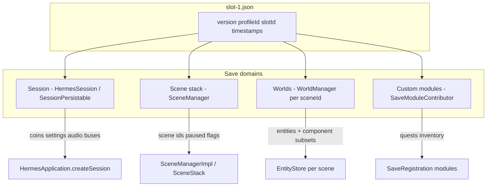
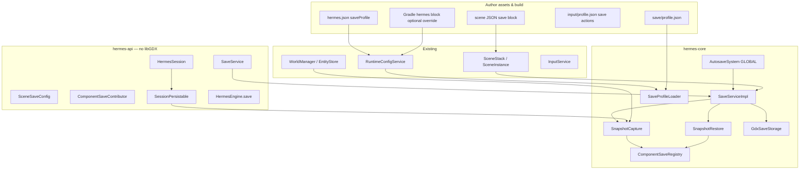
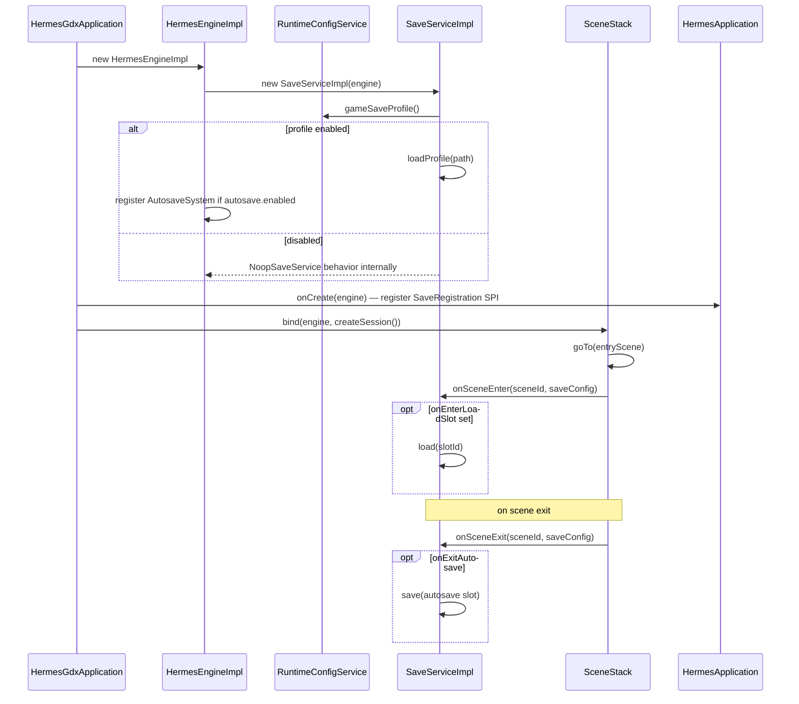

# Save / Load User Sessions Implementation Plan

> **For agentic workers:** REQUIRED SUB-SKILL: Use superpowers:subagent-driven-development (recommended) or superpowers:executing-plans to implement this plan task-by-task. Steps use checkbox (`- [ ]`) syntax for tracking.

> **Pre-release policy:** Nothing is shipped. Prefer clean design over compatibility. Delete interim stubs; no migration shims. Break APIs freely until release.

**Goal:** Ship a first-class `SaveService` as the **only** persistence path in Hermes — config-driven session data, scene stacks, and per-scene ECS snapshots with multi-slot support — so authors can save/load most games from assets alone while heavy projects can override every capture step via Java/SPI.

**Architecture:** `SaveService` on `HermesEngine` (libGDX-free API in `hermes-api`). Capture/restore runs in `hermes-core` using libGDX `JsonValue`/`JsonWriter` and `Gdx.files` only inside storage adapters. Save schema is **independent** of scene/component registration: `assets/save/profile.json` declares slots, capture scope, and per-component field subsets; optional `SaveRegistration` SPI mirrors `ComponentRegistration` for custom types. `HermesSession` implements `SessionPersistable` for cross-scene state; worlds are keyed by scene id and captured via `WorldManager.entities()`. Default path is no-op (`NoopSaveService`) until runtime config enables saves. Scene hooks mirror `UiService.onSceneEnter/Exit`.

**Tech Stack:** Java 11, libGDX JSON + `FileHandle` (core only), JUnit 5, `LaunchConfigResolver` / `RuntimeConfigService`, existing `WorldManager`, `EntityStore`, `SceneManager`, `ComponentRegistry`, `EntityTypeRegistry`, `HermesSession`.

---

## Current baseline (repo state)

| Area | Today | After this plan |
|------|-------|-----------------|
| Persistence | **None** — no `SaveService`, no save assets | `HermesEngine.save()`, full stack below |
| `HermesEngine` | `scenes`, `viewport`, `input`, `runtimeConfig`, `ui`, `entityTypes` — **no `save()`** | `SaveService save()` |
| `HermesSession` | `EMPTY` stub; `SampleHermesSession` in dogfood | `SessionPersistable` hook; session block in save files |
| Scene root | `WorldManager` + `EntityStore` (entity-types **landed**) | Capture/restore via `manager.entities()` per scene id |
| Entity identity | Scene `"id"` = stable **name**; `"type"` → `EntityKind`; `spawn(kind, name)` | Restore matches by name; optional spawn via `entities().spawn(kind, name)` |
| Scene metadata | `SceneLoadMetadata`: `renderPipeline`, `inputContext`, `uiConfig` | Add `SceneSaveConfig` → `saveConfig` |
| `SceneStack` | Calls `engine.ui().onSceneEnter/Exit`; binds `HermesSession` | Also calls `engine.save().onSceneEnter/Exit` for load/autosave hooks |
| Config launch | `RuntimeConfigService.gameInputProfile()` via `LaunchConfigResolver` | Add `gameSaveProfile()`; optional `hermes.json` `saveProfile` |
| Game module | `dogfood-simulation` | Sample profile + `SampleHermesSession` + SpinMarker save SPI |
| libGDX in api | Forbidden — `InputService`, `UiService` pattern | Same: all GDX in `hermes-core` behind storage adapters |

Representative patterns to **reuse** (do not reinvent):

- `InputServiceImpl` + `InputProfileLoader` — profile load at engine init, path from `RuntimeConfigService`
- `UiServiceImpl.onSceneEnter(id, config)` — scene metadata drives service behavior
- `SceneDocument` / `SceneLoadMetadata` — parse top-level scene fields
- `ComponentRegistration` SPI via `ServiceLoader` — custom save contributors
- `EntityStore.spawn(kind, name)` — recreate save-only entities with correct template merge
- `LaunchConfigResolver` + `RuntimeConfigKeys` — single writer for `hermes.game.saveProfile`

---

## Relationship to other plans

| Plan | Status | How save plan uses it |
|------|--------|------------------------|
| [Entity types & WorldManager](2026-05-21-entity-types-and-world-manager.md) | **Landed** | Capture/restore on `EntityStore`; `EntityKind` + `spawn()` for missing entities; **prerequisite satisfied** |
| [Unified runtime config](2026-05-24-unified-runtime-config-service.md) | **Landed** | `RuntimeConfigService.gameSaveProfile()`; `LaunchConfigResolver` key — no duplicate HTML/desktop lists |
| [Custom UI service](2026-05-29-custom-ui-service.md) | Landed / in progress | Save/load menus via UI button `action` + input profile; v2: persist UI binding state |
| [Unified input](2026-05-21-unified-input-system.md) | **Landed** | `"save.quick"`, `"load.continue"` actions in profile → `SaveService` from `InputActionSystem` or save hooks |
| [Audio system](2026-05-22-audio-system.md) | Future | v1: document `SessionPersistable` hook for `AudioMixer` bus volumes; audio plan implements when both land |
| [World lighting](2026-05-26-world-lighting.md) | Future | Lighting state on reserved entities — exclude `Light*` builtins from default capture; scene reload reconstructs lights |
| [Debug mode](2026-05-30-debug-mode.md) | Future | v2: debug commands `save.slot1`, `load.autosave`; v1 documents extension point |

**Recommended order:** Implement save/load **after** entity-types (done) and **in parallel with** audio or debug. Use `WorldManager` / `EntityStore` in all new APIs and tests.

---

## Design goals

| Goal | How |
|------|-----|
| **No-code-first** | `save/profile.json` + scene `"save"` block + input actions for slot save/load |
| **Progressive complexity** | Tiers 0–4 (below): disabled → profile-only → scene hooks → SPI → programmatic scope |
| **One persistence system** | All save/load through `SaveService`; no ad-hoc JSON files in game code |
| **Save schema ≠ scene schema** | Scene JSON = initial world; save profile = **runtime** fields to persist |
| **Generalized & extensible** | Layered domains (session, stack, worlds, modules); `SaveRegistration` SPI |
| **Efficient** | Capture only profile-listed components; stream JSON to disk; single parse on load |
| **Fail safe** | Version check, corrupt file → `SaveResult.failed`; never crash the game loop |
| **Maintainable** | libGDX-free `hermes-api`; scene hooks mirror UI/audio lifecycle |

### Author complexity tiers

| Tier | Author writes | Engine does |
|------|---------------|-------------|
| **0 — Disabled** | Nothing (default) | `NoopSaveService`; zero file I/O, no extra systems |
| **1 — Profile only** | `save/profile.json` + `hermes.json` `saveProfile` + named entities in scenes | Capture listed component fields; restore patches in place |
| **2 — Scene hooks** | Scene `"save": { "onExitAutosave": true, "onEnterLoadSlot": "slot-1" }` | Autosave on exit; load slot after scene enter — no Java |
| **3 — Session + SPI** | `SampleHermesSession implements SessionPersistable` + `SaveRegistration` for custom components | Session block + custom component contributors |
| **4 — Full control** | `engine.save().save(SaveRequest.builder().scope(...).build())` from systems/UI callbacks | Partial scopes, custom slot logic, module contributors |

**Honest v1 limit:** Declarative `"capture": { "components": { "Health": "all" } }` auto-deriving fields from component shape is v2 — v1 requires explicit field lists per type in profile (or SPI contributor with full read/write).

---

## Requirements coverage

| Requirement | Mechanism |
|-------------|-----------|
| Optional service | `SaveService` on `HermesEngine`; `NoopSaveService` when profile disabled or absent |
| Easy config of what to save | `save/profile.json` → `capture.components` field lists + `excludeComponents` |
| Different from scene/component registration | Separate profile + `ComponentSaveContributor`; no reuse of scene deserializers |
| Multiple save slots | Profile `slots.ids` + `SaveSlotCatalog`; one JSON file per slot under `storage.root` |
| Configurable + automated defaults | Profile drives capture; built-in serializers for `BuiltinComponents`; `AutosaveSystem` |
| Efficient runtime/memory | Capture only listed components; stream write; load parses once; skip asset-heavy types |
| Reuse existing types | `WorldManager`, `EntityStore`, `SceneManager`, `HermesSession`, `ServiceLoader`, `RuntimeConfigService` |
| No-code games | `hermes.json` + `save/profile.json` + scene `save` block + input actions |
| Heavy/custom games | `SaveRegistration` SPI, `SessionPersistable`, `SaveScope` from code |

**Out of scope (v1):** Cloud sync, encryption, binary formats, delta/incremental chunking, editor undo, persisting UI binding state, HTML localStorage quirks (document desktop/Android first; same API on HTML with storage limitations noted in docs).

---

## Architecture

### Design principles

| Principle | Application |
|-----------|-------------|
| Optional by default | Engine boots with `NoopSaveService`; zero file I/O and no extra systems |
| Save schema ≠ scene schema | Scene JSON describes initial world; save profile describes **runtime** fields to persist |
| Stable entity identity | Primary key = entity **name** (scene `"id"`); `EntityKind` for spawn-on-load via `EntityStore.spawn` |
| Layered capture | Session → scene stack → world(s) → custom modules; each layer skippable in profile |
| Symmetric contributors | Config field maps use built-in writers; custom components register `ComponentSaveContributor` |
| Scene lifecycle hooks | Same pattern as UI/audio: `SaveService.onSceneEnter/Exit` driven by `SceneSaveConfig` |
| Fail safe | Version check, corrupt file → `SaveResult.failed` with message; never crash the game loop |

### What gets saved (domains)



| Domain | Source | Typical content | Config knob |
|--------|--------|-----------------|-------------|
| **Session** | `HermesSession` | Coins, unlocked levels, audio mixer prefs (when audio lands) | `capture.session` |
| **Scene stack** | `SceneManager` | Ordered `sceneId`, `paused` | `capture.sceneStack` |
| **Worlds** | `WorldManager` per stacked/active scene | Entity name/kind + component subsets | `capture.worlds`, `capture.components` |
| **Modules** | Registered contributors | Arbitrary JSON object per module id | `capture.modules` |

### System context



### Bootstrap and lifecycle



Custom save contributors **must** register via `SaveRegistration` SPI (loaded in `SaveServiceImpl` init, after `ComponentRegistration` SPI in engine ctor).

### Save file format (version 1)

Path on disk (desktop): `{Gdx.files.local()}/{storage.root}/{profileId}/{slotId}.json`  
Default `storage.root`: `saves/{gameTitle}` where `gameTitle` comes from `hermes.json` title.

```json
{
  "version": 1,
  "profileId": "default",
  "slotId": "slot-1",
  "createdAtMs": 1716300000000,
  "updatedAtMs": 1716303600000,
  "session": {
    "coins": 42,
    "level": "world-2"
  },
  "sceneStack": {
    "entries": [
      { "sceneId": "game", "paused": false },
      { "sceneId": "pause", "paused": true }
    ]
  },
  "worlds": {
    "game": {
      "entities": [
        {
          "name": "cube",
          "kind": "spin-cube",
          "components": {
            "Transform": {
              "x": 12.5,
              "y": 3.0,
              "z": 0.0,
              "rotationZ": 45.0,
              "scaleX": 1.0,
              "scaleY": 1.0,
              "scaleZ": 1.0
            },
            "SpinMarker": {
              "speedRadiansPerSecond": 1.2,
              "centerX": 0.0,
              "centerY": 0.0,
              "radius": 2.0,
              "angleRadians": 0.8
            }
          }
        }
      ]
    }
  },
  "modules": {
    "quests": { "activeQuest": "find-key" }
  }
}
```

| Field | Required | Description |
|-------|----------|-------------|
| `version` | Yes | Must be `1` |
| `profileId` | Yes | Matches `save/profile.json` `storage.profileId` |
| `slotId` | Yes | Slot file name |
| `session` | No | Opaque object from `SessionPersistable` |
| `sceneStack` | No | Omit when `capture.sceneStack=false` |
| `worlds` | No | Map scene id → entity snapshots |
| `modules` | No | Map module id → JSON object |

### `save/profile.json` (version 1)

Path: `assets/save/profile.json`

```json
{
  "version": 1,
  "enabled": true,
  "storage": {
    "profileId": "default",
    "root": "saves/HermesSample"
  },
  "slots": {
    "max": 5,
    "ids": ["slot-1", "slot-2", "slot-3", "autosave"]
  },
  "capture": {
    "session": true,
    "sceneStack": true,
    "worlds": "stack",
    "createMissingEntities": false,
    "excludeComponents": [
      "Mesh", "Material", "Sprite", "Camera", "RenderLayer", "UiAttach"
    ],
    "components": {
      "Transform": {
        "fields": ["x", "y", "z", "rotationX", "rotationY", "rotationZ", "scaleX", "scaleY", "scaleZ"]
      },
      "SpinMarker": {
        "fields": ["speedRadiansPerSecond", "centerX", "centerY", "radius", "angleRadians"]
      }
    }
  },
  "autosave": {
    "enabled": true,
    "slotId": "autosave",
    "intervalSeconds": 120,
    "onSceneExit": true
  }
}
```

| `capture.worlds` | Behavior |
|------------------|----------|
| `"none"` | Skip world snapshots |
| `"active"` | Only `SceneManager.activeManager()` |
| `"stack"` | All worlds on the scene stack (bottom → top) |

### Scene JSON optional block

```json
{
  "entities": [],
  "save": {
    "world": true,
    "onEnterLoadSlot": "slot-1",
    "onExitAutosave": true
  }
}
```

| Field | Description |
|-------|-------------|
| `save.world` | When `false`, skip this scene's world even if profile captures worlds |
| `onEnterLoadSlot` | After scene enter, call `SaveService.load(slot)` if file exists |
| `onExitAutosave` | On scene exit, autosave to profile `autosave.slotId` when profile allows |

Parsed into `SceneSaveConfig` (api) and carried on `SceneLoadMetadata` / `SceneInstance` like `SceneUiConfig`.

### Runtime enablement

**`dogfood-simulation/hermes.json`:**

```json
{
  "title": "HermesSample",
  "scene": "scenes/main-menu.json",
  "renderPipeline": "render/pipeline.json",
  "inputProfile": "input/profile.json",
  "saveProfile": "save/profile.json"
}
```

Generated `hermes-runtime.properties` (via `LaunchConfigResolver`):

```properties
hermes.game.saveProfile=save/profile.json
```

`SaveServiceImpl` reads profile at init when `gameSaveProfile()` is non-blank and profile JSON has `"enabled": true`. Missing file or `"enabled": false` → service reports `isEnabled() == false` but still returns safe no-op results (same as explicit disable).

Optional Gradle override (future-friendly, same pattern as logging):

```groovy
hermes {
    runtime {
        put 'hermes.game.saveProfile', 'save/profile.json'
    }
}
```

### No-code save/load menu (Tier 2 example)

Wire input actions in `input/profile.json`:

```json
{
  "actions": {
    "save.quick": { "keyboard": ["F5"] },
    "load.continue": { "keyboard": ["F9"] }
  }
}
```

Scene or global system (v1: small built-in `SaveInputSystem` registered when saves enabled) maps actions to `engine.save().save(SaveRequest.of("slot-1"))` / `load(...)`. Alternatively, UI button `"action": "save.quick"` once UI service routes actions.

---

## User-facing usage

### Tier 0 — saves disabled (default)

No save assets. `engine.save().isEnabled()` is `false`. No `AutosaveSystem` registered.

### Tier 1 — config only

1. Add `assets/save/profile.json` with `capture.components` field lists.
2. Add `"saveProfile": "save/profile.json"` to `hermes.json`.
3. Ensure entities have stable `"id"` in scene JSON (e.g. `"id": "cube"`).
4. Override `createSession()` with a class implementing `SessionPersistable` when session data is needed.

Named entities are restored by name; components not listed in profile keep scene-load values.

### Tier 2 — scene hooks

Scene `"save"` block for per-scene autosave and load-on-enter — no Java.

### Tier 3 — custom components and modules

```java
public final class SpinMarkerSaveRegistration implements SaveRegistration {
    @Override
    public void register(HermesEngine engine, SaveConfigurator config) {
        config.component("SpinMarker", SpinMarker.class, new SpinMarkerSaveContributor());
    }
}
```

`META-INF/services/dev.hermes.api.save.SaveRegistration`

For cross-cutting game state outside ECS:

```java
config.module("quests", new QuestSaveModule(questState));
```

### Tier 4 — full control

```java
SaveResult r = engine.save().save(
        SaveRequest.builder()
                .slotId("slot-2")
                .scope(SaveScope.SESSION_AND_WORLDS)
                .build());
```

---

## Module layout

| Module | Path | Responsibility |
|--------|------|----------------|
| `hermes-api` | `dev.hermes.api.save.*` | `SaveService`, requests/results, contributors, `SceneSaveConfig` |
| `hermes-api` | `HermesEngine.save()`, `HermesSession` + `SessionPersistable` | Engine access |
| `hermes-api` | `SaveRegistration` | ServiceLoader entry |
| `hermes-core` | `dev.hermes.core.save.*` | Capture, restore, storage, profile loader |
| `hermes-core` | `BuiltinComponentSaves` | Field writers for Transform, SpinMarker, etc. |
| `hermes-core` | `AutosaveSystem`, `SaveInputSystem` | GLOBAL scope timer + scene exit + optional input bindings |
| `hermes-core` | `SceneStack`, `SceneDocument`, `SceneLoadMetadata` | Parse `save` block; lifecycle hooks |
| `hermes-tooling` | `HermesGameConfig`, `RuntimeConfigKeys` | `saveProfile` field + key constant |
| `hermes-gradle-plugin` | `LaunchConfigGradle` | Pass save profile into resolver |
| `dogfood-simulation` | profile + session + SPI | Dogfood |
| `docs` | `save-load.md` | Author documentation |

---

## Public API (`hermes-api`)

### `HermesEngine`

```java
import dev.hermes.api.save.SaveService;

/** Returns no-op implementation when saves are disabled. */
SaveService save();
```

### `SceneSaveConfig`

```java
package dev.hermes.api.scene;

/** Parsed from scene JSON "save" block. */
public final class SceneSaveConfig {

    private final boolean captureWorld;
    private final String onEnterLoadSlot;
    private final boolean onExitAutosave;

    public SceneSaveConfig(boolean captureWorld, String onEnterLoadSlot, boolean onExitAutosave) {
        this.captureWorld = captureWorld;
        this.onEnterLoadSlot = onEnterLoadSlot;
        this.onExitAutosave = onExitAutosave;
    }

    public static SceneSaveConfig defaults() {
        return new SceneSaveConfig(true, null, false);
    }

    public boolean captureWorld() { return captureWorld; }
    public Optional<String> onEnterLoadSlot() { return Optional.ofNullable(onEnterLoadSlot); }
    public boolean onExitAutosave() { return onExitAutosave; }
}
```

### `SessionPersistable` + `HermesSession`

```java
package dev.hermes.api.save;

/** Cross-scene state serialized into the save file "session" object. */
public interface SessionPersistable {

    void writeSession(SaveObjectWriter writer) throws SaveException;

    void readSession(SaveObjectReader reader) throws SaveException;
}
```

```java
package dev.hermes.api;

import dev.hermes.api.save.SessionPersistable;

public interface HermesSession {

    HermesSession EMPTY = new HermesSession() {};

    /** Empty when session does not implement {@link SessionPersistable}. */
    default SessionPersistable persistable() {
        return this instanceof SessionPersistable ? (SessionPersistable) this : null;
    }
}
```

### `SaveService`

```java
package dev.hermes.api.save;

import dev.hermes.api.scene.SceneSaveConfig;
import java.util.List;
import java.util.Optional;

public interface SaveService {

    boolean isEnabled();

    List<String> slotIds();

    boolean exists(String slotId);

    Optional<SaveMetadata> metadata(String slotId);

    SaveResult save(SaveRequest request);

    SaveResult load(LoadRequest request);

    SaveResult delete(String slotId);

    /** Called by SceneStack after scene enter — handles onEnterLoadSlot. */
    void onSceneEnter(String sceneId, Optional<SceneSaveConfig> config);

    /** Called by SceneStack before scene exit — handles onExitAutosave. */
    void onSceneExit(String sceneId, Optional<SceneSaveConfig> config);
}
```

### `SaveRequest`, `LoadRequest`, `SaveScope`, `SaveResult`

```java
package dev.hermes.api.save;

public final class SaveRequest {

    public static SaveRequest of(String slotId) {
        return builder().slotId(slotId).build();
    }

    public static Builder builder() {
        return new Builder();
    }

    public static final class Builder {
        private String slotId;
        private SaveScope scope = SaveScope.FULL;

        public Builder slotId(String slotId) {
            this.slotId = slotId;
            return this;
        }

        public Builder scope(SaveScope scope) {
            this.scope = scope;
            return this;
        }

        public SaveRequest build() {
            if (slotId == null || slotId.isBlank()) {
                throw new IllegalArgumentException("slotId is required");
            }
            return new SaveRequest(slotId, scope);
        }
    }

    private final String slotId;
    private final SaveScope scope;

    private SaveRequest(String slotId, SaveScope scope) {
        this.slotId = slotId;
        this.scope = scope;
    }

    public String slotId() { return slotId; }
    public SaveScope scope() { return scope; }
}
```

```java
package dev.hermes.api.save;

public enum SaveScope {
    SESSION_ONLY,
    WORLDS_ONLY,
    SCENE_STACK_ONLY,
    SESSION_AND_WORLDS,
    FULL
}
```

```java
package dev.hermes.api.save;

import java.util.Optional;

public final class SaveResult {

    public static SaveResult ok() {
        return new SaveResult(true, null);
    }

    public static SaveResult failed(String message) {
        return new SaveResult(false, message);
    }

    private final boolean success;
    private final String message;

    private SaveResult(boolean success, String message) {
        this.success = success;
        this.message = message;
    }

    public boolean success() { return success; }
    public Optional<String> message() { return Optional.ofNullable(message); }
}
```

### `SaveObjectWriter` / `SaveObjectReader` (libGDX-free JSON tree)

```java
package dev.hermes.api.save;

public interface SaveObjectWriter {

    void writeInt(String key, int value);
    void writeLong(String key, long value);
    void writeFloat(String key, float value);
    void writeDouble(String key, double value);
    void writeBoolean(String key, boolean value);
    void writeString(String key, String value);
    void writeObject(String key, SaveObjectWriter nested);
    void writeArray(String key, SaveArrayWriter array);
}
```

```java
package dev.hermes.api.save;

public interface SaveObjectReader {

    boolean has(String key);
    int getInt(String key, int defaultValue);
    long getLong(String key, long defaultValue);
    float getFloat(String key, float defaultValue);
    double getDouble(String key, double defaultValue);
    boolean getBoolean(String key, boolean defaultValue);
    String getString(String key, String defaultValue);
    SaveObjectReader object(String key);
    SaveArrayReader array(String key);
}
```

(Implementations in core wrap `JsonValue` — not exposed in API.)

### `ComponentSaveContributor`

```java
package dev.hermes.api.save;

import dev.hermes.api.Component;
import dev.hermes.api.Entity;
import dev.hermes.api.ecs.EntityStore;

public interface ComponentSaveContributor<T extends Component> {

    String typeName();
    Class<T> componentType();

    void write(Entity entity, EntityStore store, T component, SaveObjectWriter out);

    void read(Entity entity, EntityStore store, SaveObjectReader in, T into);
}
```

### `SaveModuleContributor` + `SaveRegistration`

```java
package dev.hermes.api.save;

public interface SaveModuleContributor {

    String moduleId();
    void write(SaveObjectWriter out);
    void read(SaveObjectReader in);
}
```

```java
package dev.hermes.api.save;

import dev.hermes.api.ecs.HermesEngine;

public interface SaveRegistration {

    void register(HermesEngine engine, SaveConfigurator configurator);
}
```

```java
package dev.hermes.api.save;

import dev.hermes.api.Component;

public interface SaveConfigurator {

    <T extends Component> void component(
            String typeName, Class<T> type, ComponentSaveContributor<T> contributor);

    void module(String moduleId, SaveModuleContributor contributor);
}
```

### `NoopSaveService`

```java
package dev.hermes.api.save;

import dev.hermes.api.scene.SceneSaveConfig;
import java.util.List;
import java.util.Optional;

public final class NoopSaveService implements SaveService {

    public static final NoopSaveService INSTANCE = new NoopSaveService();

    private NoopSaveService() {}

    @Override public boolean isEnabled() { return false; }
    @Override public List<String> slotIds() { return List.of(); }
    @Override public boolean exists(String slotId) { return false; }
    @Override public Optional<SaveMetadata> metadata(String slotId) { return Optional.empty(); }
    @Override public SaveResult save(SaveRequest request) { return SaveResult.failed("Save service is disabled"); }
    @Override public SaveResult load(LoadRequest request) { return SaveResult.failed("Save service is disabled"); }
    @Override public SaveResult delete(String slotId) { return SaveResult.failed("Save service is disabled"); }
    @Override public void onSceneEnter(String sceneId, Optional<SceneSaveConfig> config) {}
    @Override public void onSceneExit(String sceneId, Optional<SceneSaveConfig> config) {}
}
```

---

## Runtime efficiency (required)

| Rule | Rationale |
|------|-----------|
| Skip disabled service early | `NoopSaveService` — no allocations, no systems |
| Capture only profile-listed components | Do not walk all component types on every entity |
| Default exclude asset-heavy components | Mesh/Material/Sprite/Camera/UiAttach not in save file |
| Single JSON parse on load | `JsonReader.parse` once per slot file |
| Reuse entity maps by name | `HashMap<String, EntityId>` built once per world restore |
| No save during render | Autosave/system hooks in update/lifecycle only |
| Writer streams to file | `JsonWriter` direct to `FileHandle` — avoid giant intermediate strings |
| Session write only if `SessionPersistable` | `HermesSession.EMPTY` skips session object |

---

## Restore semantics

| Situation | Behavior |
|-----------|----------|
| Save has entity name, store has same name | Patch listed components in place |
| Save has entity name, store missing, `createMissingEntities=false` | Skip (default) |
| Save has entity name + kind, store missing, `createMissingEntities=true` | `entities().spawn(kind, name)` then apply components |
| Save has entity name, no kind, store missing, `createMissingEntities=true` | `entities().create(name)` then apply components |
| Store has entity not in save | Unchanged |
| Load different scene stack | Replace stack via `SceneChangeRequest` sequence after snapshot applied |
| Version mismatch | `SaveResult.failed("Unsupported save version")` |
| `onEnterLoadSlot` file missing | Skip load silently (scene keeps fresh load state) |

---

## Future extensions (document only — not v1 tasks)

| Extension | Hook |
|-----------|------|
| UI binding persistence | `SaveModuleContributor` for `UiService` binding map |
| Audio mixer | `SessionPersistable` on session wrapping `AudioMixer` |
| Debug commands | `DebugRegistration` commands calling `SaveService` |
| Auto field discovery | Profile `"fields": "*"` with reflection behind explicit opt-in |
| Cloud sync | New `SaveStorage` implementation |
| Compression | Wrap `SaveStorage` write/read streams |

---

## Implementation tasks

### Task 1: Save API types and no-op service

**Files:**
- Create: `hermes-api/src/main/java/dev/hermes/api/save/SaveScope.java`
- Create: `hermes-api/src/main/java/dev/hermes/api/save/SaveResult.java`
- Create: `hermes-api/src/main/java/dev/hermes/api/save/SaveMetadata.java`
- Create: `hermes-api/src/main/java/dev/hermes/api/save/SaveRequest.java`
- Create: `hermes-api/src/main/java/dev/hermes/api/save/LoadRequest.java`
- Create: `hermes-api/src/main/java/dev/hermes/api/save/SaveException.java`
- Create: `hermes-api/src/main/java/dev/hermes/api/save/NoopSaveService.java`
- Create: `hermes-api/src/test/java/dev/hermes/api/save/SaveRequestTest.java`

- [ ] **Step 1: Write the failing test**

```java
package dev.hermes.api.save;

import static org.junit.jupiter.api.Assertions.assertEquals;
import static org.junit.jupiter.api.Assertions.assertThrows;

import org.junit.jupiter.api.Test;

final class SaveRequestTest {

    @Test
    void builderRequiresSlotId() {
        assertThrows(IllegalArgumentException.class, () -> SaveRequest.builder().build());
    }

    @Test
    void ofUsesFullScopeByDefault() {
        SaveRequest request = SaveRequest.of("slot-1");
        assertEquals("slot-1", request.slotId());
        assertEquals(SaveScope.FULL, request.scope());
    }
}
```

- [ ] **Step 2: Run test to verify it fails**

Run: `./gradlew :hermes-api:test --tests dev.hermes.api.save.SaveRequestTest -q`  
Expected: FAIL (class not found)

- [ ] **Step 3: Write minimal implementation**

Create `SaveScope`, `SaveResult`, `SaveMetadata` (fields: `slotId`, `createdAtMs`, `updatedAtMs`), `SaveRequest`, `LoadRequest` (mirror `SaveRequest` with `slotId` only), `SaveException`, and `NoopSaveService` as specified in Public API section.

- [ ] **Step 4: Run test to verify it passes**

Run: `./gradlew :hermes-api:test --tests dev.hermes.api.save.SaveRequestTest -q`  
Expected: PASS

- [ ] **Step 5: Commit**

```bash
git add hermes-api/src/main/java/dev/hermes/api/save/ hermes-api/src/test/java/dev/hermes/api/save/
git commit -m "feat(api): add save/load request types and noop service"
```

---

### Task 2: SaveObjectWriter / SaveObjectReader interfaces

**Files:**
- Create: `hermes-api/src/main/java/dev/hermes/api/save/SaveObjectWriter.java`
- Create: `hermes-api/src/main/java/dev/hermes/api/save/SaveObjectReader.java`
- Create: `hermes-api/src/main/java/dev/hermes/api/save/SaveArrayWriter.java`
- Create: `hermes-api/src/main/java/dev/hermes/api/save/SaveArrayReader.java`
- Create: `hermes-core/src/main/java/dev/hermes/core/save/JsonSaveTreeWriter.java`
- Create: `hermes-core/src/main/java/dev/hermes/core/save/JsonSaveTreeReader.java`
- Create: `hermes-core/src/test/java/dev/hermes/core/save/JsonSaveTreeAdapterTest.java`

- [ ] **Step 1: Write the failing test**

```java
package dev.hermes.core.save;

import static org.junit.jupiter.api.Assertions.assertEquals;

import com.badlogic.gdx.utils.JsonReader;
import com.badlogic.gdx.utils.JsonValue;
import dev.hermes.api.save.SaveObjectReader;
import dev.hermes.api.save.SaveObjectWriter;
import org.junit.jupiter.api.Test;

final class JsonSaveTreeAdapterTest {

    @Test
    void roundTripsPrimitives() {
        JsonValue root = new JsonValue(JsonValue.ValueType.object);
        SaveObjectWriter writer = new JsonSaveTreeWriter(root);
        writer.writeInt("a", 1);
        writer.writeFloat("b", 2.5f);
        writer.writeString("c", "x");

        SaveObjectReader reader = new JsonSaveTreeReader(root);
        assertEquals(1, reader.getInt("a", 0));
        assertEquals(2.5f, reader.getFloat("b", 0f), 0.001f);
        assertEquals("x", reader.getString("c", ""));
    }
}
```

- [ ] **Step 2: Run test to verify it fails**

Run: `./gradlew :hermes-core:test --tests dev.hermes.core.save.JsonSaveTreeAdapterTest -q`  
Expected: FAIL (class not found)

- [ ] **Step 3: Write minimal implementation**

`JsonSaveTreeWriter` and `JsonSaveTreeReader` in `hermes-core` implementing API interfaces using `JsonValue` child mutation.

- [ ] **Step 4: Run test to verify it passes**

Run: `./gradlew :hermes-core:test --tests dev.hermes.core.save.JsonSaveTreeAdapterTest -q`  
Expected: PASS

- [ ] **Step 5: Commit**

```bash
git add hermes-api/src/main/java/dev/hermes/api/save/SaveObject*.java hermes-api/src/main/java/dev/hermes/api/save/SaveArray*.java
git add hermes-core/src/main/java/dev/hermes/core/save/JsonSaveTree*.java hermes-core/src/test/java/dev/hermes/core/save/JsonSaveTreeAdapterTest.java
git commit -m "feat(save): JSON tree adapters for save read/write"
```

---

### Task 3: SessionPersistable and HermesSession hook

**Files:**
- Create: `hermes-api/src/main/java/dev/hermes/api/save/SessionPersistable.java`
- Modify: `hermes-api/src/main/java/dev/hermes/api/HermesSession.java`
- Create: `hermes-core/src/main/java/dev/hermes/core/save/SessionSnapshot.java`
- Create: `hermes-core/src/test/java/dev/hermes/core/save/SessionSnapshotTest.java`

- [ ] **Step 1: Write the failing test**

```java
package dev.hermes.core.save;

import static org.junit.jupiter.api.Assertions.assertEquals;

import com.badlogic.gdx.utils.JsonValue;
import dev.hermes.api.save.SaveObjectReader;
import dev.hermes.api.save.SaveObjectWriter;
import dev.hermes.api.save.SessionPersistable;
import org.junit.jupiter.api.Test;

final class SessionSnapshotTest {

    @Test
    void writesAndReadsSessionBlock() {
        TestSession session = new TestSession();
        session.coins = 7;

        JsonValue root = new JsonValue(JsonValue.ValueType.object);
        SessionSnapshot.capture(session, new JsonSaveTreeWriter(root));

        TestSession read = new TestSession();
        SessionSnapshot.apply(read, new JsonSaveTreeReader(root));
        assertEquals(7, read.coins);
    }

    private static final class TestSession implements SessionPersistable {
        int coins;

        @Override
        public void writeSession(SaveObjectWriter writer) {
            writer.writeInt("coins", coins);
        }

        @Override
        public void readSession(SaveObjectReader reader) {
            coins = reader.getInt("coins", 0);
        }
    }
}
```

- [ ] **Step 2: Run test to verify it fails**

Run: `./gradlew :hermes-core:test --tests dev.hermes.core.save.SessionSnapshotTest -q`  
Expected: FAIL

- [ ] **Step 3: Write minimal implementation**

`SessionSnapshot` utility with `capture` / `apply` static methods; update `HermesSession` with `persistable()` default.

- [ ] **Step 4: Run test to verify it passes**

Run: `./gradlew :hermes-core:test --tests dev.hermes.core.save.SessionSnapshotTest -q`  
Expected: PASS

- [ ] **Step 5: Commit**

```bash
git add hermes-api/src/main/java/dev/hermes/api/save/SessionPersistable.java hermes-api/src/main/java/dev/hermes/api/HermesSession.java
git add hermes-core/src/main/java/dev/hermes/core/save/SessionSnapshot.java hermes-core/src/test/java/dev/hermes/core/save/SessionSnapshotTest.java
git commit -m "feat(save): session persistable hook on HermesSession"
```

---

### Task 4: SceneSaveConfig and scene JSON parsing

**Files:**
- Create: `hermes-api/src/main/java/dev/hermes/api/scene/SceneSaveConfig.java`
- Modify: `hermes-core/src/main/java/dev/hermes/core/ecs/SceneDocument.java`
- Modify: `hermes-core/src/main/java/dev/hermes/core/ecs/SceneLoadMetadata.java`
- Modify: `hermes-core/src/main/java/dev/hermes/core/scene/SceneInstance.java`
- Modify: `hermes-core/src/main/java/dev/hermes/core/scene/SceneStack.java` (pass saveConfig to SceneInstance)
- Create: `hermes-core/src/test/java/dev/hermes/core/ecs/SceneSaveConfigParseTest.java`

- [ ] **Step 1: Write the failing test**

```java
package dev.hermes.core.ecs;

import static org.junit.jupiter.api.Assertions.assertEquals;
import static org.junit.jupiter.api.Assertions.assertTrue;

import org.junit.jupiter.api.Test;

final class SceneSaveConfigParseTest {

    @Test
    void parsesSaveBlock() {
        String json =
                "{"
                        + "\"entities\":[],"
                        + "\"save\":{"
                        + "\"world\":false,"
                        + "\"onEnterLoadSlot\":\"slot-1\","
                        + "\"onExitAutosave\":true"
                        + "}"
                        + "}";
        SceneDocument doc = SceneDocument.parse("scenes/test.json", json);
        assertTrue(doc.saveConfig().isPresent());
        assertEquals(false, doc.saveConfig().get().captureWorld());
        assertEquals("slot-1", doc.saveConfig().get().onEnterLoadSlot().orElseThrow());
        assertEquals(true, doc.saveConfig().get().onExitAutosave());
    }
}
```

- [ ] **Step 2: Run test to verify it fails**

Run: `./gradlew :hermes-core:test --tests dev.hermes.core.ecs.SceneSaveConfigParseTest -q`  
Expected: FAIL

- [ ] **Step 3: Write minimal implementation**

Add `parseSaveConfig` to `SceneDocument`; extend `SceneLoadMetadata` with `saveConfig()`; wire through `SceneParser`, `SceneInstance`, `SceneStack.loadScene`.

- [ ] **Step 4: Run test to verify it passes**

Run: `./gradlew :hermes-core:test --tests dev.hermes.core.ecs.SceneSaveConfigParseTest -q`  
Expected: PASS

- [ ] **Step 5: Commit**

```bash
git add hermes-api/src/main/java/dev/hermes/api/scene/SceneSaveConfig.java
git add hermes-core/src/main/java/dev/hermes/core/ecs/SceneDocument.java hermes-core/src/main/java/dev/hermes/core/ecs/SceneLoadMetadata.java
git add hermes-core/src/main/java/dev/hermes/core/scene/SceneInstance.java hermes-core/src/main/java/dev/hermes/core/scene/SceneStack.java
git add hermes-core/src/test/java/dev/hermes/core/ecs/SceneSaveConfigParseTest.java
git commit -m "feat(save): parse scene save block into SceneSaveConfig"
```

---

### Task 5: Save profile loader

**Files:**
- Create: `hermes-core/src/main/java/dev/hermes/core/save/SaveProfileDocument.java`
- Create: `hermes-core/src/main/java/dev/hermes/core/save/SaveCaptureConfig.java`
- Create: `hermes-core/src/main/java/dev/hermes/core/save/SaveProfileLoader.java`
- Create: `hermes-core/src/test/java/dev/hermes/core/save/SaveProfileDocumentTest.java`
- Create: `dogfood-simulation/src/main/resources/assets/save/profile.json`

- [ ] **Step 1: Write the failing test**

```java
package dev.hermes.core.save;

import static org.junit.jupiter.api.Assertions.assertEquals;
import static org.junit.jupiter.api.Assertions.assertTrue;

import org.junit.jupiter.api.Test;

final class SaveProfileDocumentTest {

    @Test
    void parsesCaptureComponents() {
        String json =
                "{"
                        + "\"version\":1,"
                        + "\"enabled\":true,"
                        + "\"storage\":{\"profileId\":\"default\",\"root\":\"saves/test\"},"
                        + "\"slots\":{\"max\":3,\"ids\":[\"a\"]},"
                        + "\"capture\":{"
                        + "\"worlds\":\"active\","
                        + "\"components\":{\"Transform\":{\"fields\":[\"x\",\"y\"]}}"
                        + "}"
                        + "}";
        SaveProfileDocument doc = SaveProfileDocument.parse("save/profile.json", json);
        assertTrue(doc.enabled());
        assertEquals("active", doc.capture().worldsMode());
        assertEquals(2, doc.capture().fieldsFor("Transform").size());
    }
}
```

- [ ] **Step 2: Run test to verify it fails**

Run: `./gradlew :hermes-core:test --tests dev.hermes.core.save.SaveProfileDocumentTest -q`  
Expected: FAIL

- [ ] **Step 3: Write minimal implementation**

Parse profile JSON with `JsonReader`; validate `version==1`; expose `SaveProfileDocument` with `enabled()`, `storage()`, `slots()`, `capture()`, `autosave()`. `SaveProfileLoader.load(path)` reads from `HermesAssetPaths.internal(path)`.

- [ ] **Step 4: Run test to verify it passes**

Run: `./gradlew :hermes-core:test --tests dev.hermes.core.save.SaveProfileDocumentTest -q`  
Expected: PASS

- [ ] **Step 5: Commit**

```bash
git add hermes-core/src/main/java/dev/hermes/core/save/SaveProfile*.java hermes-core/src/main/java/dev/hermes/core/save/SaveCaptureConfig.java
git add hermes-core/src/test/java/dev/hermes/core/save/SaveProfileDocumentTest.java
git add dogfood-simulation/src/main/resources/assets/save/profile.json
git commit -m "feat(save): parse save profile JSON"
```

---

### Task 6: Builtin component save contributors

**Files:**
- Create: `hermes-core/src/main/java/dev/hermes/core/save/BuiltinComponentSaves.java`
- Create: `hermes-core/src/main/java/dev/hermes/core/save/ComponentSaveRegistry.java`
- Create: `hermes-core/src/main/java/dev/hermes/core/save/WorldSnapshotCapture.java`
- Create: `hermes-core/src/test/java/dev/hermes/core/save/WorldSnapshotCaptureTest.java`

- [ ] **Step 1: Write the failing test**

```java
package dev.hermes.core.save;

import static org.junit.jupiter.api.Assertions.assertEquals;

import com.badlogic.gdx.utils.JsonValue;
import dev.hermes.api.ecs.Transform;
import dev.hermes.core.ecs.WorldManagerImpl;
import org.junit.jupiter.api.Test;

final class WorldSnapshotCaptureTest {

    @Test
    void capturesTransformSubset() {
        WorldManagerImpl manager = new WorldManagerImpl();
        var entity = manager.entities().create("player");
        Transform t = new Transform(5f, 6f, 0f);
        manager.entities().addComponent(entity.id(), t);

        SaveProfileDocument profile =
                SaveProfileDocument.parse(
                        "test",
                        "{\"version\":1,\"enabled\":true,\"capture\":{\"components\":{\"Transform\":{\"fields\":[\"x\",\"y\"]}}}}");
        ComponentSaveRegistry registry = BuiltinComponentSaves.createRegistry();
        JsonValue worlds = new JsonValue(JsonValue.ValueType.object);
        WorldSnapshotCapture.captureWorld("main", manager.entities(), profile.capture(), registry, worlds);

        JsonValue player = worlds.get("main").get("entities").child(0);
        assertEquals(5.0, player.get("components").get("Transform").getDouble("x"), 0.001);
        assertEquals(6.0, player.get("components").get("Transform").getDouble("y"), 0.001);
    }
}
```

- [ ] **Step 2: Run test to verify it fails**

Run: `./gradlew :hermes-core:test --tests dev.hermes.core.save.WorldSnapshotCaptureTest -q`  
Expected: FAIL

- [ ] **Step 3: Write minimal implementation**

`ComponentSaveRegistry` maps type name → contributor; `BuiltinComponentSaves` registers Transform field writers; `WorldSnapshotCapture.captureWorld` iterates `store.entities()`, writes name + kind + listed components.

- [ ] **Step 4: Run test to verify it passes**

Run: `./gradlew :hermes-core:test --tests dev.hermes.core.save.WorldSnapshotCaptureTest -q`  
Expected: PASS

- [ ] **Step 5: Commit**

```bash
git add hermes-core/src/main/java/dev/hermes/core/save/BuiltinComponentSaves.java hermes-core/src/main/java/dev/hermes/core/save/ComponentSaveRegistry.java
git add hermes-core/src/main/java/dev/hermes/core/save/WorldSnapshotCapture.java hermes-core/src/test/java/dev/hermes/core/save/WorldSnapshotCaptureTest.java
git commit -m "feat(save): capture world ECS subset from profile"
```

---

### Task 7: World restore

**Files:**
- Create: `hermes-core/src/main/java/dev/hermes/core/save/WorldSnapshotRestore.java`
- Modify: `hermes-core/src/test/java/dev/hermes/core/save/WorldSnapshotCaptureTest.java`

- [ ] **Step 1: Write the failing test**

Add to `WorldSnapshotCaptureTest`:

```java
    @Test
    void restorePatchesNamedEntity() {
        WorldManagerImpl manager = new WorldManagerImpl();
        var entity = manager.entities().create("player");
        manager.entities().addComponent(entity.id(), new Transform(0f, 0f, 0f));

        JsonValue saved = new JsonValue(JsonValue.ValueType.object);
        JsonValue entityNode = new JsonValue(JsonValue.ValueType.object);
        entityNode.addChild("name", new JsonValue("player"));
        JsonValue components = new JsonValue(JsonValue.ValueType.object);
        JsonValue transform = new JsonValue(JsonValue.ValueType.object);
        transform.addChild("x", new JsonValue(9.0));
        transform.addChild("y", new JsonValue(8.0));
        components.addChild("Transform", transform);
        entityNode.addChild("components", components);
        JsonValue entities = new JsonValue(JsonValue.ValueType.array);
        entities.addChild(entityNode);
        saved.addChild("entities", entities);

        SaveProfileDocument profile =
                SaveProfileDocument.parse(
                        "test",
                        "{\"version\":1,\"enabled\":true,\"capture\":{\"components\":{\"Transform\":{\"fields\":[\"x\",\"y\"]}}}}");
        WorldSnapshotRestore.apply(manager.entities(), saved, profile.capture(), BuiltinComponentSaves.createRegistry());

        Transform t = manager.entities().getComponent(entity.id(), Transform.class);
        assertEquals(9f, t.x(), 0.001f);
        assertEquals(8f, t.y(), 0.001f);
    }
```

- [ ] **Step 2: Run test to verify it fails**

Run: `./gradlew :hermes-core:test --tests dev.hermes.core.save.WorldSnapshotCaptureTest -q`  
Expected: FAIL on new test

- [ ] **Step 3: Write minimal implementation**

`WorldSnapshotRestore.apply` matches `findByName`, optionally `spawn(kind, name)` or `create(name)`, uses contributors `read(...)`.

- [ ] **Step 4: Run test to verify it passes**

Run: `./gradlew :hermes-core:test --tests dev.hermes.core.save.WorldSnapshotCaptureTest -q`  
Expected: PASS

- [ ] **Step 5: Commit**

```bash
git add hermes-core/src/main/java/dev/hermes/core/save/WorldSnapshotRestore.java hermes-core/src/test/java/dev/hermes/core/save/WorldSnapshotCaptureTest.java
git commit -m "feat(save): restore world ECS subset onto live EntityStore"
```

---

### Task 8: Scene stack snapshot

**Files:**
- Create: `hermes-core/src/main/java/dev/hermes/core/save/SceneStackSnapshot.java`
- Create: `hermes-core/src/test/java/dev/hermes/core/save/SceneStackSnapshotTest.java`

- [ ] **Step 1: Write the failing test**

```java
package dev.hermes.core.save;

import static org.junit.jupiter.api.Assertions.assertEquals;

import com.badlogic.gdx.utils.JsonValue;
import dev.hermes.core.ecs.ComponentRegistryImpl;
import dev.hermes.core.scene.SceneStack;
import dev.hermes.core.scene.AssetSceneSource;
import dev.hermes.core.ecs.SceneRegistryImpl;
import org.junit.jupiter.api.Test;

final class SceneStackSnapshotTest {

    @Test
    void capturesOrderedSceneIds() {
        ComponentRegistryImpl registry = new ComponentRegistryImpl();
        SceneRegistryImpl sceneRegistry = new SceneRegistryImpl(registry);
        sceneRegistry.register("a", new AssetSceneSource("scenes/a.json"));
        sceneRegistry.register("b", new AssetSceneSource("scenes/b.json"));
        SceneStack stack = new SceneStack(sceneRegistry);
        stack.goTo("a");
        stack.push("b");

        JsonValue out = new JsonValue(JsonValue.ValueType.object);
        SceneStackSnapshot.capture(stack, out);

        assertEquals("a", out.get("entries").get(0).getString("sceneId"));
        assertEquals("b", out.get("entries").get(1).getString("sceneId"));
        assertEquals(true, out.get("entries").get(0).getBoolean("paused"));
        assertEquals(true, out.get("entries").get(1).getBoolean("paused"));
    }
}
```

(Provide minimal `scenes/a.json` and `scenes/b.json` in test resources with empty entities arrays.)

- [ ] **Step 2: Run test to verify it fails**

Run: `./gradlew :hermes-core:test --tests dev.hermes.core.save.SceneStackSnapshotTest -q`  
Expected: FAIL

- [ ] **Step 3: Write minimal implementation**

`SceneStackSnapshot.capture` reads `visibleScenesBottomToTop()` + paused flags. `restore` applies stack via package-visible `SceneStack.restoreFromSnapshot(JsonValue)` that replays goTo/push.

- [ ] **Step 4: Run test to verify it passes**

Run: `./gradlew :hermes-core:test --tests dev.hermes.core.save.SceneStackSnapshotTest -q`  
Expected: PASS

- [ ] **Step 5: Commit**

```bash
git add hermes-core/src/main/java/dev/hermes/core/save/SceneStackSnapshot.java hermes-core/src/test/java/dev/hermes/core/save/SceneStackSnapshotTest.java
git commit -m "feat(save): scene stack capture and restore"
```

---

### Task 9: Gdx save storage

**Files:**
- Create: `hermes-core/src/main/java/dev/hermes/core/save/SaveStorage.java`
- Create: `hermes-core/src/main/java/dev/hermes/core/save/GdxSaveStorage.java`
- Create: `hermes-core/src/test/java/dev/hermes/core/save/GdxSaveStorageTest.java`

- [ ] **Step 1: Write the failing test**

```java
package dev.hermes.core.save;

import static org.junit.jupiter.api.Assertions.assertTrue;

import com.badlogic.gdx.utils.JsonValue;
import dev.hermes.core.TestGdx;
import org.junit.jupiter.api.BeforeAll;
import org.junit.jupiter.api.Test;

final class GdxSaveStorageTest {

    @BeforeAll
    static void initGdx() {
        TestGdx.init();
    }

    @Test
    void writesAndReadsSlotFile() {
        SaveStorage storage = new GdxSaveStorage("default", "saves-test");
        JsonValue doc = new JsonValue(JsonValue.ValueType.object);
        doc.addChild("version", new JsonValue(1));
        storage.write("slot-x", doc);
        assertTrue(storage.exists("slot-x"));
        JsonValue read = storage.read("slot-x");
        assertTrue(read.has("version"));
        storage.delete("slot-x");
    }
}
```

- [ ] **Step 2: Run test to verify it fails**

Run: `./gradlew :hermes-core:test --tests dev.hermes.core.save.GdxSaveStorageTest -q`  
Expected: FAIL

- [ ] **Step 3: Write minimal implementation**

`SaveStorage` interface; `GdxSaveStorage` uses `Gdx.files.local()` path `{root}/{profileId}/{slotId}.json`; stream write via `JsonWriter`.

- [ ] **Step 4: Run test to verify it passes**

Run: `./gradlew :hermes-core:test --tests dev.hermes.core.save.GdxSaveStorageTest -q`  
Expected: PASS

- [ ] **Step 5: Commit**

```bash
git add hermes-core/src/main/java/dev/hermes/core/save/SaveStorage.java hermes-core/src/main/java/dev/hermes/core/save/GdxSaveStorage.java
git add hermes-core/src/test/java/dev/hermes/core/save/GdxSaveStorageTest.java
git commit -m "feat(save): local file storage for save slots"
```

---

### Task 10: SaveService API and implementation

**Files:**
- Create: `hermes-api/src/main/java/dev/hermes/api/save/SaveService.java`
- Create: `hermes-api/src/main/java/dev/hermes/api/save/SaveRegistration.java`
- Create: `hermes-api/src/main/java/dev/hermes/api/save/SaveConfigurator.java`
- Create: `hermes-api/src/main/java/dev/hermes/api/save/ComponentSaveContributor.java`
- Create: `hermes-api/src/main/java/dev/hermes/api/save/SaveModuleContributor.java`
- Create: `hermes-core/src/main/java/dev/hermes/core/save/SaveServiceImpl.java`
- Create: `hermes-core/src/main/java/dev/hermes/core/save/SnapshotCapture.java`
- Create: `hermes-core/src/main/java/dev/hermes/core/save/SnapshotRestore.java`
- Modify: `hermes-api/src/main/java/dev/hermes/api/ecs/HermesEngine.java`
- Modify: `hermes-core/src/main/java/dev/hermes/core/ecs/HermesEngineImpl.java`
- Create: `hermes-core/src/test/java/dev/hermes/core/save/SaveServiceImplTest.java`

- [ ] **Step 1: Write the failing test**

Integration test with `HermesEngineImpl`, in-memory profile, `TestSession implements SessionPersistable`, one entity in active scene — save then load changes Transform and session field.

- [ ] **Step 2: Run test to verify it fails**

Run: `./gradlew :hermes-core:test --tests dev.hermes.core.save.SaveServiceImplTest -q`  
Expected: FAIL

- [ ] **Step 3: Write minimal implementation**

`SaveServiceImpl` orchestrates capture → `GdxSaveStorage` / restore; respects `SaveScope`; loads `SaveRegistration` SPI; `HermesEngineImpl.save()` returns impl (disabled mode when profile off).

- [ ] **Step 4: Run test to verify it passes**

Run: `./gradlew :hermes-core:test --tests dev.hermes.core.save.SaveServiceImplTest -q`  
Expected: PASS

- [ ] **Step 5: Commit**

```bash
git add hermes-api/src/main/java/dev/hermes/api/save/ hermes-api/src/main/java/dev/hermes/api/ecs/HermesEngine.java
git add hermes-core/src/main/java/dev/hermes/core/save/SaveServiceImpl.java hermes-core/src/main/java/dev/hermes/core/save/Snapshot*.java
git add hermes-core/src/main/java/dev/hermes/core/ecs/HermesEngineImpl.java hermes-core/src/test/java/dev/hermes/core/save/SaveServiceImplTest.java
git commit -m "feat(save): SaveService orchestration and engine wiring"
```

---

### Task 11: Runtime config integration

**Files:**
- Modify: `hermes-tooling/src/main/java/dev/hermes/tooling/launch/RuntimeConfigKeys.java`
- Modify: `hermes-tooling/src/main/java/dev/hermes/tooling/launch/HermesLaunchProperties.java`
- Modify: `hermes-tooling/src/main/java/dev/hermes/tooling/launch/LaunchConfigResolver.java`
- Modify: `hermes-tooling/src/main/java/dev/hermes/tooling/config/HermesGameConfig.java`
- Modify: `hermes-tooling/src/main/java/dev/hermes/tooling/config/HermesGameConfigParser.java`
- Modify: `hermes-api/src/main/java/dev/hermes/api/config/RuntimeConfigService.java`
- Modify: `hermes-core/src/main/java/dev/hermes/core/config/RuntimeConfigServiceImpl.java`
- Modify: `dogfood-simulation/hermes.json`
- Create: `hermes-tooling/src/test/java/dev/hermes/tooling/config/HermesGameConfigSaveProfileTest.java`

- [ ] **Step 1: Write the failing test**

```java
package dev.hermes.tooling.config;

import static org.junit.jupiter.api.Assertions.assertEquals;

import org.junit.jupiter.api.Test;

final class HermesGameConfigSaveProfileTest {

    @Test
    void parsesSaveProfileFromHermesJson() {
        HermesGameConfig config =
                HermesGameConfigParser.parse("{\"saveProfile\":\"save/profile.json\"}");
        assertEquals("save/profile.json", config.getSaveProfile());
    }
}
```

- [ ] **Step 2: Run test to verify it fails**

Run: `./gradlew :hermes-tooling:test --tests dev.hermes.tooling.config.HermesGameConfigSaveProfileTest -q`  
Expected: FAIL

- [ ] **Step 3: Write minimal implementation**

Add `GAME_SAVE_PROFILE` key; `HermesGameConfig.saveProfile`; resolver writes property; `RuntimeConfigService.gameSaveProfile()`; `SaveServiceImpl` reads at init.

- [ ] **Step 4: Run test to verify it passes**

Run: `./gradlew :hermes-tooling:test :hermes-core:test --tests '*SaveProfile*' -q`  
Expected: PASS

- [ ] **Step 5: Commit**

```bash
git add hermes-tooling/ hermes-api/src/main/java/dev/hermes/api/config/RuntimeConfigService.java
git add hermes-core/src/main/java/dev/hermes/core/config/RuntimeConfigServiceImpl.java dogfood-simulation/hermes.json
git commit -m "build: save profile in LaunchConfigResolver and RuntimeConfigService"
```

---

### Task 12: SaveRegistration SPI and dogfood sample

**Files:**
- Modify: `hermes-core/src/main/java/dev/hermes/core/save/SaveServiceImpl.java` (load SPI)
- Create: `dogfood-simulation/src/main/java/dev/hermes/sample/SampleHermesSession.java`
- Create: `dogfood-simulation/src/main/java/dev/hermes/sample/SpinMarkerSaveRegistration.java`
- Create: `dogfood-simulation/src/main/java/dev/hermes/sample/SpinMarkerSaveContributor.java`
- Create: `dogfood-simulation/src/main/resources/META-INF/services/dev.hermes.api.save.SaveRegistration`
- Modify: `dogfood-simulation/src/main/java/dev/hermes/sample/SampleHermesGame.java`
- Create: `hermes-core/src/test/java/dev/hermes/core/save/SaveRegistrationLoaderTest.java`

- [ ] **Step 1: Write the failing test**

Test that `ServiceLoader` loads registration and registry contains `SpinMarker` contributor (test META-INF in test resources).

- [ ] **Step 2: Run test to verify it fails**

Run: `./gradlew :hermes-core:test --tests dev.hermes.core.save.SaveRegistrationLoaderTest -q`  
Expected: FAIL

- [ ] **Step 3: Write minimal implementation**

`SampleHermesSession implements SessionPersistable` with demo `coins` field; SpinMarker save contributor matching profile fields; update `SampleHermesGame.createSession()`.

- [ ] **Step 4: Run test to verify it passes**

Run: `./gradlew :hermes-core:test --tests dev.hermes.core.save.SaveRegistrationLoaderTest -q`  
Expected: PASS

- [ ] **Step 5: Commit**

```bash
git add dogfood-simulation/src/main/java/dev/hermes/sample/ hermes-core/src/main/java/dev/hermes/core/save/SaveServiceImpl.java
git add hermes-core/src/test/java/dev/hermes/core/save/SaveRegistrationLoaderTest.java
git commit -m "feat(save): SaveRegistration SPI and dogfood sample session"
```

---

### Task 13: Autosave, scene lifecycle, and input hooks

**Files:**
- Create: `hermes-core/src/main/java/dev/hermes/core/save/AutosaveSystem.java`
- Create: `hermes-core/src/main/java/dev/hermes/core/save/SaveInputSystem.java`
- Modify: `hermes-core/src/main/java/dev/hermes/core/scene/SceneStack.java` (call save on enter/exit)
- Modify: `hermes-core/src/main/java/dev/hermes/core/HermesGdxApplication.java` (register systems when saves enabled)
- Create: `hermes-core/src/test/java/dev/hermes/core/save/AutosaveSystemTest.java`

- [ ] **Step 1: Write the failing test**

Timer-based autosave increments counter; scene exit triggers save when `onExitAutosave` true (mock `SaveService`).

- [ ] **Step 2: Run test to verify it fails**

Run: `./gradlew :hermes-core:test --tests dev.hermes.core.save.AutosaveSystemTest -q`  
Expected: FAIL

- [ ] **Step 3: Write minimal implementation**

`AutosaveSystem` GLOBAL scope accumulates delta; on interval calls `save(autosave slot)`. `SceneStack.enterScene/exitScene` calls `engine.save().onSceneEnter/Exit`. `SaveInputSystem` maps `save.quick` / `load.continue` when profile lists those actions (optional — register only if actions exist in input profile).

- [ ] **Step 4: Run test to verify it passes**

Run: `./gradlew :hermes-core:test --tests dev.hermes.core.save.AutosaveSystemTest -q`  
Expected: PASS

- [ ] **Step 5: Commit**

```bash
git add hermes-core/src/main/java/dev/hermes/core/save/AutosaveSystem.java hermes-core/src/main/java/dev/hermes/core/save/SaveInputSystem.java
git add hermes-core/src/main/java/dev/hermes/core/scene/SceneStack.java hermes-core/src/main/java/dev/hermes/core/HermesGdxApplication.java
git commit -m "feat(save): autosave, scene lifecycle hooks, and input bindings"
```

---

### Task 14: Documentation and dogfood wiring

**Files:**
- Create: `docs/save-load.md`
- Modify: `dogfood-simulation/src/main/resources/assets/scenes/main.json` (optional `save` block)
- Modify: `dogfood-simulation/src/main/resources/assets/input/profile.json` (optional F5/F9 actions)

- [ ] **Step 1: Document author workflows**

Write `docs/save-load.md` covering tiers 0–4, profile schema, slot layout, entity naming, HTML storage caveat, integration with UI input actions.

- [ ] **Step 2: Wire dogfood**

Add scene `save` block or input actions; verify `SampleHermesSession` coins persist across save/load.

- [ ] **Step 3: Verify full module tests**

Run: `./gradlew :hermes-api:test :hermes-core:test :hermes-tooling:test -q`  
Expected: BUILD SUCCESSFUL

- [ ] **Step 4: Manual smoke**

Run desktop dogfood; F5 save; move cube; F9 load; verify Transform and session coins.

- [ ] **Step 5: Commit**

```bash
git add docs/save-load.md dogfood-simulation/
git commit -m "docs: save/load guide and dogfood wiring"
```

---

## Self-review

**Spec coverage:**

| Requirement | Task |
|-------------|------|
| Optional service | Task 1, 10 (`NoopSaveService`) |
| Configurable save fields ≠ registration | Task 5 profile, Task 6 builtins |
| Multi-slot | Task 5 slots, Task 9 storage |
| Defaults + automation | Task 5 profile, Task 13 autosave |
| Efficient | Efficiency section + Task 6–7 capture scope |
| Reuse existing types | WorldManager, EntityStore, SceneManager, HermesSession, ServiceLoader, RuntimeConfigService |
| Config-only path | Tiers in doc, Task 5, 11, 14 |
| Custom path | Task 3, 10–12 contributors/modules |
| Scene hooks (no-code) | Task 4, 13 |
| Entity-types integration | Task 6–7 use EntityStore.spawn |

**Placeholder scan:** None — all schemas and APIs are concrete.

**Type consistency:** `SaveScope`, `SaveRequest`, `SaveService`, profile `capture.worlds` modes, `SceneSaveConfig` aligned across tasks. Uses `EntityStore` not deleted `World`.

**Gaps vs future plans:** UI binding persistence and audio mixer — documented in Future extensions, not v1 tasks.

---

## Execution Handoff

Plan complete and saved to `docs/superpowers/plans/2026-05-22-save-load-sessions.md`. Two execution options:

**1. Subagent-Driven (recommended)** — dispatch a fresh subagent per task, review between tasks, fast iteration

**2. Inline Execution** — execute tasks in this session using executing-plans, batch execution with checkpoints

Which approach?
