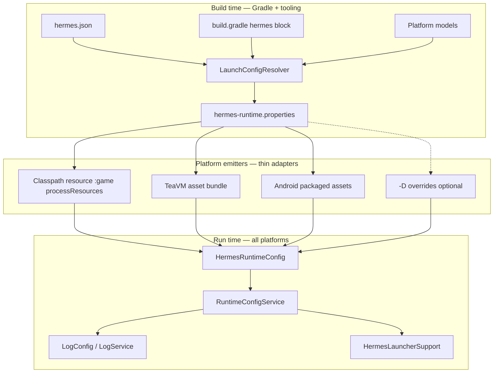

# Unified Runtime Config Service Implementation Plan

> **For agentic workers:** REQUIRED SUB-SKILL: Use superpowers:subagent-driven-development (recommended) or superpowers:executing-plans to implement this plan task-by-task. Steps use checkbox (`- [ ]`) syntax for tracking.

**Goal:** One canonical runtime-configuration pipeline that feeds desktop, HTML, Android, and export builds — fixing HTML logging today and giving Hermes a single, extensible place to add future launch/runtime settings with minimal per-platform code.

**Architecture:** Build time: `LaunchConfigResolver` (hermes-tooling) merges `hermes.json`, Gradle `hermes { }` DSL, platform models, and launch mode into one property map, written once to `hermes-runtime.properties`. All Gradle launch/export tasks and `TeaVMBuilder` consume that same file — no duplicated key lists. Run time: `RuntimeConfigService` (hermes-api + hermes-core) wraps `HermesRuntimeConfig` with typed accessors; logging, scene paths, window settings, and future services read config through it.

**Tech Stack:** Java 11, Gradle `HermesExtension`, hermes-tooling config models, TeaVM HTML launcher, libGDX backends, JUnit 5, Gradle TestKit.

---

## Root cause: HTML logging works on desktop but not HTML

### What works today (desktop)

1. `:game:generateHermesRuntimeConfig` writes `build/generated/hermes-runtime/hermes-runtime.properties` including logging keys.
2. That directory is on the `:game` classpath via `processResources`.
3. `hermesRunDesktop` puts `:game` classes on the launcher classpath.
4. `LogConfig` static init calls `HermesRuntimeConfig.get("hermes.log.*")` → reads the packaged file → **logging filters apply**.

Example generated file (from `:game` with `patterns = ['*SceneStack*']`):

```properties
hermes.log.minLevel=DEBUG
hermes.log.patterns=*SceneStack*
```

### What breaks (HTML)

1. `HermesRunTasks.applyHtmlSystemProperties` builds `HermesLaunchProperties` **without** `.logMinLevel()`, `.logPatternType()`, or `.logPatterns()`.
2. `TeaVMBuilder` reads logging only from JVM system properties (`System.getProperty("hermes.log.*")`) — which are empty for HTML runs.
3. `TeaVMBuilder.writeRuntimeProperties` writes a **separate**, incomplete copy under `hermes-launcher-html/build/hermes-runtime/` instead of reusing `:game`'s generated file.
4. Result: HTML bundle gets no `hermes.log.patterns` / explicit `hermes.log.minLevel`; category filtering never activates; explicit level overrides are ignored.

### Fragmentation map (why every new knob needs 4 edits today)

| Location | Includes logging? | Used by |
|----------|-------------------|---------|
| `HermesRuntimeConfigGenerator` | ✅ | Desktop classpath, Android resources |
| `HermesRunTasks.applyDesktopSystemProperties` | ❌ | Desktop dev run (relies on classpath file) |
| `HermesRunTasks.applyHtmlSystemProperties` | ❌ | HTML dev run |
| `HermesDistributionMode.applyHtml` | ❌ | HTML export |
| `HermesDistributionMode.applyDesktop` | ❌ | Desktop export |
| `TeaVMBuilder.writeRuntimeProperties` | Partial (manual duplicate) | HTML/WASM bundle |
| `HermesAndroidLauncherConfigurer` | ❌ | Android BuildConfig |

**Fix strategy:** Delete duplication. One resolver → one properties file → all platforms read or bundle that file.

---

## Target architecture

### Layer diagram



### Configuration sources (priority: high → low)

| Priority | Source | Audience |
|----------|--------|----------|
| 1 | JVM `-Dhermes.*` / `System.setProperty` | CI, tests, power users |
| 2 | Packaged `hermes-runtime.properties` | All shipped builds |
| 3 | Gradle DSL defaults (`debug`, platform blocks) | Game authors |
| 4 | `hermes.json` | No-code game metadata |

Future (Task 12): optional `assets/hermes.runtime.json` merged at build time for pure-config games.

### Key design rules

1. **Single writer:** only `LaunchConfigResolver` + `HermesRuntimeConfigGenerator` decide property keys and values.
2. **Thin platform adapters:** desktop/HTML/Android tasks only *locate* and *bundle* the file; they do not assemble keys.
3. **Typed runtime API:** engine code uses `RuntimeConfigService`, not raw string keys scattered in callers.
4. **Extensibility:** custom keys use `hermes.custom.<name>`; documented in DSL as `hermes { runtime { put 'custom.foo', 'bar' } }`.
5. **No-code first:** every setting reachable from Gradle/hermes.json; code overrides optional via `HermesApplication.configureRuntime(...)`.

---

## File structure

### New files

| File | Responsibility |
|------|----------------|
| `hermes-tooling/.../launch/RuntimeConfigKeys.java` | Canonical `hermes.*` key constants |
| `hermes-tooling/.../launch/LaunchMode.java` | `DEV`, `DISTRIBUTION_EXPORT` |
| `hermes-tooling/.../launch/LaunchConfigRequest.java` | Immutable input to resolver |
| `hermes-tooling/.../launch/LaunchConfigResolver.java` | Merge all inputs → `HermesLaunchProperties` |
| `hermes-tooling/.../launch/RuntimeConfigWriter.java` | Write/load `.properties` file |
| `hermes-gradle-plugin/.../internal/LaunchConfigGradle.java` | Project → `LaunchConfigRequest` bridge |
| `hermes-api/.../config/RuntimeConfigService.java` | Public typed runtime config API |
| `hermes-core/.../config/RuntimeConfigServiceImpl.java` | Backed by `HermesRuntimeConfig` |
| `hermes-api/.../HermesApplication.java` | Add optional `configureRuntime(RuntimeConfigBuilder)` hook |

### Modified files

| File | Change |
|------|--------|
| `HermesRuntimeConfigGenerator.java` | Delegate to `LaunchConfigResolver` |
| `HermesRunTasks.java` | Use `LaunchConfigGradle`; HTML depends on `generateHermesRuntimeConfig` |
| `HermesDistributionMode.java` | Use `LaunchConfigGradle` with export mode |
| `TeaVMBuilder.java` | Bundle `:game` generated config dir; delete `writeRuntimeProperties` duplicate |
| `HermesLaunchProperties.java` | Add `runtimeConfigDir`, `custom` map support |
| `HermesLauncherSupport.java` | Delegate to `RuntimeConfigService` |
| `LogConfig.java` | Read via `RuntimeConfigService` |
| `HermesAndroidLauncherConfigurer.java` | Package runtime config into Android assets |
| `HermesExtension.java` | Add `RuntimeExtension` for custom keys |

---

## Public API (for game authors)

### Gradle — no-code path (primary)

```groovy
// game/build.gradle
hermes {
    applicationClass = 'com.example.MyGame'
    debug = true

    logging {
        minLevel = 'INFO'          // DEBUG | INFO | WARN | ERROR
        patternType = 'WILDCARD'   // WILDCARD | REGEX
        patterns = ['hermes.scene.*', '*Render*']
    }

    runtime {
        // optional custom keys for game systems
        put 'custom.difficulty', 'normal'
    }

    platforms {
        desktop { width = 1280; height = 720 }
        html    { devServerPort = 8080 }
    }
}
```

### hermes.json — game metadata (existing)

```json
{
  "title": "My Game",
  "scene": "scenes/main.json",
  "renderPipeline": "render/pipeline.json"
}
```

### Code — complex games (optional override)

```java
public final class MyGame implements HermesApplication {

    @Override
    public void configureRuntime(RuntimeConfigBuilder config) {
        // Runs once at startup; can override packaged values programmatically
        config.put("custom.seed", Long.toString(System.nanoTime()));
    }

    @Override
    public void onCreate(HermesEngine engine) {
        RuntimeConfigService cfg = engine.runtimeConfig();
        String difficulty = cfg.get("custom.difficulty", "normal");
        Logger log = engine.logs().get("mygame");
        log.info("Starting on difficulty=" + difficulty);
    }
}
```

### JVM override (CI / local debug)

```bash
./gradlew :game:hermesRunDesktop -Dhermes.log.minLevel=ERROR
./gradlew :game:hermesRunHtml   -Dhermes.log.patterns='*Scene*'
```

---

## Implementation tasks

### Task 1: RuntimeConfigKeys + LaunchMode

**Files:**
- Create: `hermes-tooling/src/main/java/dev/hermes/tooling/launch/RuntimeConfigKeys.java`
- Create: `hermes-tooling/src/main/java/dev/hermes/tooling/launch/LaunchMode.java`
- Test: `hermes-tooling/src/test/java/dev/hermes/tooling/launch/RuntimeConfigKeysTest.java`

- [ ] **Step 1: Write failing test**

```java
package dev.hermes.tooling.launch;

import static org.junit.jupiter.api.Assertions.assertEquals;

import org.junit.jupiter.api.Test;

final class RuntimeConfigKeysTest {

    @Test
    void logKeys_useHermesPrefix() {
        assertEquals("hermes.log.minLevel", RuntimeConfigKeys.LOG_MIN_LEVEL);
        assertEquals("hermes.log.patternType", RuntimeConfigKeys.LOG_PATTERN_TYPE);
        assertEquals("hermes.log.patterns", RuntimeConfigKeys.LOG_PATTERNS);
    }
}
```

- [ ] **Step 2: Run test to verify it fails**

Run: `./gradlew :hermes-tooling:test --tests dev.hermes.tooling.launch.RuntimeConfigKeysTest -q`  
Expected: FAIL — class not found

- [ ] **Step 3: Implement keys + LaunchMode enum**

```java
package dev.hermes.tooling.launch;

public final class RuntimeConfigKeys {

    public static final String APPLICATION_CLASS = "hermes.applicationClass";
    public static final String DEBUG = "hermes.debug";
    public static final String WINDOW_TITLE = "hermes.window.title";
    public static final String WINDOW_WIDTH = "hermes.window.width";
    public static final String WINDOW_HEIGHT = "hermes.window.height";
    public static final String GAME_SCENE = "hermes.game.scene";
    public static final String GAME_RENDER_PIPELINE = "hermes.game.renderPipeline";
    public static final String LOG_MIN_LEVEL = "hermes.log.minLevel";
    public static final String LOG_PATTERN_TYPE = "hermes.log.patternType";
    public static final String LOG_PATTERNS = "hermes.log.patterns";
    public static final String DESKTOP_VSYNC = "hermes.desktop.vsync";
    public static final String DESKTOP_RESIZABLE = "hermes.desktop.resizable";
    public static final String DESKTOP_FOREGROUND_FPS = "hermes.desktop.foregroundFps";
    public static final String HTML_DEV_SERVER_PORT = "hermes.html.devServerPort";
    public static final String HTML_WEB_ASSEMBLY = "hermes.html.webAssembly";
    public static final String RUNTIME_CONFIG_DIR = "hermes.runtime.config.dir";

    private RuntimeConfigKeys() {}
}
```

```java
package dev.hermes.tooling.launch;

public enum LaunchMode {
    DEV,
    DISTRIBUTION_EXPORT
}
```

- [ ] **Step 4: Run test to verify it passes**

Run: `./gradlew :hermes-tooling:test --tests dev.hermes.tooling.launch.RuntimeConfigKeysTest -q`  
Expected: PASS

- [ ] **Step 5: Commit**

```bash
git add hermes-tooling/src/main/java/dev/hermes/tooling/launch/RuntimeConfigKeys.java \
        hermes-tooling/src/main/java/dev/hermes/tooling/launch/LaunchMode.java \
        hermes-tooling/src/test/java/dev/hermes/tooling/launch/RuntimeConfigKeysTest.java
git commit -m "feat(config): add runtime config key constants and launch modes"
```

---

### Task 2: LaunchConfigResolver (single source of truth)

**Files:**
- Create: `hermes-tooling/src/main/java/dev/hermes/tooling/launch/LaunchConfigRequest.java`
- Create: `hermes-tooling/src/main/java/dev/hermes/tooling/launch/LaunchConfigResolver.java`
- Create: `hermes-tooling/src/main/java/dev/hermes/tooling/launch/RuntimeConfigWriter.java`
- Test: `hermes-tooling/src/test/java/dev/hermes/tooling/launch/LaunchConfigResolverTest.java`

- [ ] **Step 1: Write failing resolver test**

```java
package dev.hermes.tooling.launch;

import static org.junit.jupiter.api.Assertions.assertEquals;
import static org.junit.jupiter.api.Assertions.assertTrue;

import dev.hermes.tooling.config.HermesGameConfig;
import dev.hermes.tooling.platform.DesktopPlatform;
import dev.hermes.tooling.platform.HtmlPlatform;
import dev.hermes.tooling.platform.Platforms;
import java.util.List;
import java.util.Map;
import org.junit.jupiter.api.Test;

final class LaunchConfigResolverTest {

    @Test
    void resolve_includesLoggingPatternsInDevMode() {
        HermesGameConfig game = new HermesGameConfig();
        game.setTitle("Test");
        game.setScene("scenes/a.json");
        game.setRenderPipeline("render/p.json");

        DesktopPlatform desktop = new DesktopPlatform();
        desktop.setWidth(800);
        desktop.setHeight(600);

        HtmlPlatform html = new HtmlPlatform();
        html.setDevServerPort(9090);

        Platforms platforms = new Platforms();
        platforms.setDesktop(desktop);
        platforms.setHtml(html);

        LaunchConfigRequest request =
                new LaunchConfigRequest(
                        "com.example.Game",
                        true,
                        LaunchMode.DEV,
                        "DEBUG",
                        "WILDCARD",
                        List.of("*SceneStack*"),
                        Map.of("custom.difficulty", "hard"),
                        game,
                        platforms);

        Map<String, String> props = LaunchConfigResolver.resolve(request).asMap();

        assertEquals("com.example.Game", props.get(RuntimeConfigKeys.APPLICATION_CLASS));
        assertEquals("true", props.get(RuntimeConfigKeys.DEBUG));
        assertEquals("DEBUG", props.get(RuntimeConfigKeys.LOG_MIN_LEVEL));
        assertEquals("WILDCARD", props.get(RuntimeConfigKeys.LOG_PATTERN_TYPE));
        assertEquals("*SceneStack*", props.get(RuntimeConfigKeys.LOG_PATTERNS));
        assertEquals("hard", props.get("hermes.custom.difficulty"));
        assertEquals("9090", props.get(RuntimeConfigKeys.HTML_DEV_SERVER_PORT));
    }

    @Test
    void resolve_exportModeForcesNonDebugAndWarnLevelWhenUnset() {
        HermesGameConfig game = new HermesGameConfig();
        Platforms platforms = new Platforms();

        LaunchConfigRequest request =
                new LaunchConfigRequest(
                        "com.example.Game",
                        true,
                        LaunchMode.DISTRIBUTION_EXPORT,
                        null,
                        null,
                        List.of(),
                        Map.of(),
                        game,
                        platforms);

        Map<String, String> props = LaunchConfigResolver.resolve(request).asMap();

        assertEquals("false", props.get(RuntimeConfigKeys.DEBUG));
        assertEquals("WARN", props.get(RuntimeConfigKeys.LOG_MIN_LEVEL));
        assertTrue(!props.containsKey(RuntimeConfigKeys.LOG_PATTERNS));
    }
}
```

- [ ] **Step 2: Run test to verify it fails**

Run: `./gradlew :hermes-tooling:test --tests dev.hermes.tooling.launch.LaunchConfigResolverTest -q`  
Expected: FAIL

- [ ] **Step 3: Implement request, resolver, writer**

```java
package dev.hermes.tooling.launch;

import dev.hermes.tooling.config.HermesGameConfig;
import dev.hermes.tooling.platform.Platforms;
import java.util.List;
import java.util.Map;

public record LaunchConfigRequest(
        String applicationClass,
        boolean debugFlag,
        LaunchMode mode,
        String loggingMinLevel,
        String loggingPatternType,
        List<String> loggingPatterns,
        Map<String, String> customProperties,
        HermesGameConfig gameConfig,
        Platforms platforms) {}
```

```java
package dev.hermes.tooling.launch;

import dev.hermes.tooling.config.HermesGameConfig;
import dev.hermes.tooling.platform.DesktopPlatform;
import dev.hermes.tooling.platform.HtmlPlatform;
import dev.hermes.tooling.platform.Platforms;
import java.util.LinkedHashMap;
import java.util.List;
import java.util.Locale;
import java.util.Map;

public final class LaunchConfigResolver {

    private LaunchConfigResolver() {}

    public static HermesLaunchProperties resolve(LaunchConfigRequest request) {
        boolean export = request.mode() == LaunchMode.DISTRIBUTION_EXPORT;
        boolean debug = !export && request.debugFlag();
        String minLevel = resolveMinLevel(request.loggingMinLevel(), debug, export);
        String patternType = normalizePatternType(request.loggingPatternType());

        HermesGameConfig game = request.gameConfig();
        DesktopPlatform desktop = request.platforms().getDesktop();
        HtmlPlatform html = request.platforms().getHtml();

        HermesLaunchProperties.Builder builder =
                HermesLaunchProperties.builder()
                        .applicationClass(request.applicationClass())
                        .debug(debug)
                        .windowTitle(game.getTitle())
                        .windowSize(desktop.getWidth(), desktop.getHeight())
                        .scene(game.getScene())
                        .renderPipeline(game.getRenderPipeline())
                        .desktopVsync(desktop.isVsync())
                        .desktopResizable(desktop.isResizable())
                        .desktopForegroundFps(desktop.getForegroundFps())
                        .htmlDevServerPort(html.getDevServerPort())
                        .htmlWebAssembly(html.isWebAssembly())
                        .logMinLevel(minLevel);

        if (request.loggingPatterns() != null && !request.loggingPatterns().isEmpty()) {
            builder.logPatternType(patternType);
            builder.logPatterns(request.loggingPatterns());
        }

        if (request.customProperties() != null) {
            for (Map.Entry<String, String> entry : request.customProperties().entrySet()) {
                builder.custom(entry.getKey(), entry.getValue());
            }
        }

        return builder.build();
    }

    private static String resolveMinLevel(String explicit, boolean debug, boolean export) {
        if (explicit != null && !explicit.isBlank()) {
            return explicit.trim().toUpperCase(Locale.ROOT);
        }
        if (export) {
            return "WARN";
        }
        return debug ? "DEBUG" : "INFO";
    }

    private static String normalizePatternType(String patternType) {
        if (patternType == null || patternType.isBlank()) {
            return "WILDCARD";
        }
        return patternType.trim().toUpperCase(Locale.ROOT);
    }
}
```

```java
package dev.hermes.tooling.launch;

import java.io.File;
import java.io.FileOutputStream;
import java.io.IOException;
import java.io.OutputStreamWriter;
import java.nio.charset.StandardCharsets;
import java.util.Map;
import java.util.Properties;

public final class RuntimeConfigWriter {

    private RuntimeConfigWriter() {}

    public static void write(File outputDir, Map<String, String> properties) throws IOException {
        if (!outputDir.exists() && !outputDir.mkdirs()) {
            throw new IOException("Could not create " + outputDir.getAbsolutePath());
        }
        Properties props = new Properties();
        for (Map.Entry<String, String> entry : properties.entrySet()) {
            props.setProperty(entry.getKey(), entry.getValue());
        }
        File file = new File(outputDir, "hermes-runtime.properties");
        try (OutputStreamWriter writer =
                     new OutputStreamWriter(new FileOutputStream(file), StandardCharsets.UTF_8)) {
            props.store(writer, "Generated by Hermes LaunchConfigResolver");
        }
    }
}
```

Extend `HermesLaunchProperties.Builder`:

```java
public Builder custom(String key, String value) {
    String normalized = key.startsWith("hermes.") ? key : "hermes.custom." + key;
    return put(normalized, value);
}

public Builder runtimeConfigDir(String absolutePath) {
    return put(RuntimeConfigKeys.RUNTIME_CONFIG_DIR, absolutePath);
}
```

- [ ] **Step 4: Run test to verify it passes**

Run: `./gradlew :hermes-tooling:test --tests dev.hermes.tooling.launch.LaunchConfigResolverTest -q`  
Expected: PASS

- [ ] **Step 5: Commit**

```bash
git add hermes-tooling/src/main/java/dev/hermes/tooling/launch/ \
        hermes-tooling/src/test/java/dev/hermes/tooling/launch/LaunchConfigResolverTest.java \
        hermes-tooling/src/main/java/dev/hermes/tooling/launch/HermesLaunchProperties.java
git commit -m "feat(config): add LaunchConfigResolver as single config assembly point"
```

---

### Task 3: Gradle bridge + refactor generator

**Files:**
- Create: `hermes-gradle-plugin/src/main/java/dev/hermes/gradle/internal/LaunchConfigGradle.java`
- Modify: `hermes-gradle-plugin/src/main/java/dev/hermes/gradle/internal/HermesRuntimeConfigGenerator.java`
- Create: `hermes-gradle-plugin/src/test/java/dev/hermes/gradle/internal/LaunchConfigGradleTest.java`

- [ ] **Step 1: Write failing test**

```java
package dev.hermes.gradle.internal;

import static org.junit.jupiter.api.Assertions.assertEquals;

import dev.hermes.gradle.dsl.HermesExtension;
import dev.hermes.gradle.dsl.LoggingExtension;
import dev.hermes.tooling.config.HermesGameConfig;
import dev.hermes.tooling.launch.LaunchMode;
import dev.hermes.tooling.launch.RuntimeConfigKeys;
import dev.hermes.tooling.platform.Platforms;
import org.junit.jupiter.api.Test;

final class LaunchConfigGradleTest {

    @Test
    void resolveFromParts_includesLoggingForHtmlPath() {
        HermesExtension extension = new HermesExtension();
        extension.setDebug(true);
        LoggingExtension logging = extension.getLogging();
        logging.setMinLevel("ERROR");
        logging.setPatternType("WILDCARD");
        logging.setPatterns(java.util.List.of("*Scene*"));

        HermesGameConfig game = new HermesGameConfig();
        Platforms platforms = new Platforms();

        var props =
                LaunchConfigGradle.resolveFromParts(
                                extension, game, platforms, LaunchMode.DEV)
                        .asMap();

        assertEquals("ERROR", props.get(RuntimeConfigKeys.LOG_MIN_LEVEL));
        assertEquals("*Scene*", props.get(RuntimeConfigKeys.LOG_PATTERNS));
    }
}
```

- [ ] **Step 2: Run test — expect FAIL**

Run: `./gradlew :hermes-gradle-plugin:test --tests dev.hermes.gradle.internal.LaunchConfigGradleTest -q`

- [ ] **Step 3: Implement LaunchConfigGradle + slim generator**

```java
package dev.hermes.gradle.internal;

import dev.hermes.gradle.dsl.HermesExtension;
import dev.hermes.tooling.config.HermesGameConfig;
import dev.hermes.tooling.launch.HermesLaunchProperties;
import dev.hermes.tooling.launch.LaunchConfigRequest;
import dev.hermes.tooling.launch.LaunchConfigResolver;
import dev.hermes.tooling.launch.LaunchMode;
import dev.hermes.tooling.platform.Platforms;
import java.util.Map;
import org.gradle.api.Project;

public final class LaunchConfigGradle {

    private LaunchConfigGradle() {}

    public static HermesLaunchProperties resolve(Project gameProject, LaunchMode mode) {
        HermesExtension extension = gameProject.getExtensions().getByType(HermesExtension.class);
        HermesGameConfig game = HermesGameConfigs.parse(gameProject);
        Platforms platforms = HermesPlatforms.resolve(gameProject);
        return resolveFromParts(extension, game, platforms, mode);
    }

    public static HermesLaunchProperties resolveFromParts(
            HermesExtension extension,
            HermesGameConfig game,
            Platforms platforms,
            LaunchMode mode) {
        boolean export = mode == LaunchMode.DISTRIBUTION_EXPORT;
        boolean debug = export ? false : extension.isDebug();
        String minLevel = extension.getLogging().resolveMinLevel(debug, export);

        LaunchConfigRequest request =
                new LaunchConfigRequest(
                        extension.getApplicationClass(),
                        extension.isDebug(),
                        mode,
                        minLevel,
                        extension.getLogging().getPatternType(),
                        extension.getLogging().getPatterns(),
                        extension.getRuntime().asMap(),
                        game,
                        platforms);

        return LaunchConfigResolver.resolve(request);
    }
}
```

Replace body of `HermesRuntimeConfigGenerator.write`:

```java
public static void write(Project gameProject, HermesExtension extension, File outputDir) {
    LaunchMode mode =
            HermesDistributionMode.isDistributionExport(gameProject)
                    ? LaunchMode.DISTRIBUTION_EXPORT
                    : LaunchMode.DEV;
    Map<String, String> props = LaunchConfigGradle.resolveFromParts(
                    extension,
                    HermesGameConfigs.parse(gameProject),
                    HermesPlatforms.resolve(gameProject),
                    mode)
            .asMap();
    try {
        RuntimeConfigWriter.write(outputDir, props);
    } catch (IOException e) {
        throw new GradleException("Failed to write hermes-runtime.properties", e);
    }
}
```

- [ ] **Step 4: Run test — expect PASS**

Run: `./gradlew :hermes-gradle-plugin:test --tests dev.hermes.gradle.internal.LaunchConfigGradleTest -q`

- [ ] **Step 5: Commit**

```bash
git add hermes-gradle-plugin/src/main/java/dev/hermes/gradle/internal/LaunchConfigGradle.java \
        hermes-gradle-plugin/src/main/java/dev/hermes/gradle/internal/HermesRuntimeConfigGenerator.java \
        hermes-gradle-plugin/src/test/java/dev/hermes/gradle/internal/LaunchConfigGradleTest.java
git commit -m "refactor(config): route runtime config generation through LaunchConfigGradle"
```

---

### Task 4: RuntimeExtension on HermesExtension

**Files:**
- Create: `hermes-gradle-plugin/src/main/java/dev/hermes/gradle/dsl/RuntimeExtension.java`
- Modify: `hermes-gradle-plugin/src/main/java/dev/hermes/gradle/dsl/HermesExtension.java`

- [ ] **Step 1: Write failing test**

```java
package dev.hermes.gradle.dsl;

import static org.junit.jupiter.api.Assertions.assertEquals;

import org.junit.jupiter.api.Test;

final class RuntimeExtensionTest {

    @Test
    void put_prefixesCustomKeys() {
        RuntimeExtension runtime = new RuntimeExtension();
        runtime.put("seed", "42");
        assertEquals("42", runtime.asMap().get("seed"));
    }
}
```

- [ ] **Step 2: Run — expect FAIL**

Run: `./gradlew :hermes-gradle-plugin:test --tests dev.hermes.gradle.dsl.RuntimeExtensionTest -q`

- [ ] **Step 3: Implement**

```java
package dev.hermes.gradle.dsl;

import java.util.LinkedHashMap;
import java.util.Map;

public final class RuntimeExtension {

    private final Map<String, String> values = new LinkedHashMap<>();

    public void put(String key, String value) {
        if (key == null || key.isBlank() || value == null) {
            return;
        }
        values.put(key, value);
    }

    public Map<String, String> asMap() {
        return Map.copyOf(values);
    }
}
```

Add to `HermesExtension`:

```java
private final RuntimeExtension runtime = new RuntimeExtension();

public RuntimeExtension getRuntime() {
    return runtime;
}

@SuppressWarnings("rawtypes")
public void runtime(Closure configure) {
    configure.setDelegate(runtime);
    configure.setResolveStrategy(Closure.DELEGATE_FIRST);
    configure.call(runtime);
}
```

- [ ] **Step 4: Run — expect PASS**

- [ ] **Step 5: Commit**

```bash
git commit -m "feat(config): add hermes.runtime DSL for custom properties"
```

---

### Task 5: Unify Gradle launch wiring (fixes HTML logging)

**Files:**
- Modify: `hermes-gradle-plugin/src/main/java/dev/hermes/gradle/tasks/run/HermesRunTasks.java`
- Modify: `hermes-gradle-plugin/src/main/java/dev/hermes/gradle/internal/HermesDistributionMode.java`
- Create: `hermes-gradle-plugin/src/test/java/dev/hermes/gradle/tasks/run/LaunchConfigWiringTest.java`

- [ ] **Step 1: Write failing HTML wiring test**

```java
package dev.hermes.gradle.tasks.run;

import static org.junit.jupiter.api.Assertions.assertTrue;

import java.io.IOException;
import java.nio.file.Files;
import java.nio.file.Path;
import org.gradle.testkit.runner.GradleRunner;
import org.junit.jupiter.api.Test;
import org.junit.jupiter.api.io.TempDir;

final class LaunchConfigWiringTest {

    @Test
    void generatedRuntimeConfig_containsLoggingPatterns(@TempDir Path projectDir) throws IOException {
        // Use minimal synthetic project or HermesPluginIntegrationTest helper
        Path props = projectDir.resolve("game/build/generated/hermes-runtime/hermes-runtime.properties");
        // After `./gradlew :game:generateHermesRuntimeConfig` with logging patterns in build.gradle:
        String content = Files.readString(props);
        assertTrue(content.contains("hermes.log.patterns="));
        assertTrue(content.contains("hermes.log.minLevel="));
    }
}
```

Adapt test to reuse `HermesPluginIntegrationTest.materializeTemplate` pattern with:

```groovy
hermes {
  logging { patterns = ['*SceneStack*']; minLevel = 'WARN' }
}
```

- [ ] **Step 2: Refactor HermesRunTasks**

Replace `applyDesktopSystemProperties` and `applyHtmlSystemProperties` bodies with shared helper:

```java
private static void applyLaunchProperties(
        JavaExec task,
        Project gameProject,
        HermesExtension extension,
        LaunchMode mode,
        File assetsDir) {
    HermesLaunchProperties props = LaunchConfigGradle.resolveFromParts(
            extension,
            HermesGameConfigs.parse(gameProject),
            HermesPlatforms.resolve(gameProject),
            mode);

    File runtimeDir = gameProject.file("build/generated/hermes-runtime");
    HermesLaunchProperties withDir =
            HermesLaunchProperties.builder()
                    .putAll(props.asMap())
                    .runtimeConfigDir(runtimeDir.getAbsolutePath())
                    .assetsDir(assetsDir != null ? assetsDir.getAbsolutePath() : null)
                    .build();

    if (task.getName().contains("Desktop") || "hermesRunDesktop".equals(task.getName())) {
        List<String> jvmArgs = new ArrayList<>(task.getJvmArgs());
        withDir.toJvmArgs().forEach(arg -> {
            if (arg.startsWith("-D" + RuntimeConfigKeys.LOG_) || arg.startsWith("-Dhermes.debug=")) {
                // Desktop dev run: classpath file is canonical; skip duplicate log/debug JVM args
                return;
            }
            jvmArgs.add(arg);
        });
        jvmArgs.add("-D" + RuntimeConfigKeys.DESKTOP_GRADLE_RUN + "=true");
        task.setJvmArgs(jvmArgs);
    } else {
        for (var entry : withDir.asMap().entrySet()) {
            task.systemProperty(entry.getKey(), entry.getValue());
        }
    }
}
```

Add to `HermesLaunchProperties.Builder`:

```java
public Builder putAll(Map<String, String> values) { ... }
public Builder assetsDir(String path) { return put("hermes.assets.dir", path); }
```

Wire HTML task dependencies:

```java
task.dependsOn("generateHermesRuntimeConfig", ...);
```

Replace `HermesDistributionMode.applyHtml` / `applyDesktop` to call `LaunchConfigGradle.resolve(..., DISTRIBUTION_EXPORT)`.

- [ ] **Step 3: Run tests**

Run: `./gradlew :hermes-gradle-plugin:test --tests "dev.hermes.gradle.tasks.run.*" -q`  
Expected: PASS

- [ ] **Step 4: Commit**

```bash
git commit -m "fix(config): unify launch property wiring; include logging for HTML runs"
```

---

### Task 6: TeaVMBuilder bundles canonical config (delete duplicate writer)

**Files:**
- Modify: `hermes-launcher-html/src/main/java/dev/hermes/launcher/html/TeaVMBuilder.java`
- Create: `hermes-tooling/src/test/java/dev/hermes/tooling/launch/RuntimeConfigWriterTest.java`

- [ ] **Step 1: Write failing writer round-trip test**

```java
@Test
void write_producesReadablePropertiesFile(@TempDir Path dir) throws Exception {
    RuntimeConfigWriter.write(dir.toFile(), Map.of("hermes.log.minLevel", "WARN"));
    Properties loaded = new Properties();
    try (InputStream in = Files.newInputStream(dir.resolve("hermes-runtime.properties"))) {
        loaded.load(in);
    }
    assertEquals("WARN", loaded.getProperty("hermes.log.minLevel"));
}
```

- [ ] **Step 2: Refactor TeaVMBuilder**

Delete `writeRuntimeProperties` method entirely. Replace with:

```java
String runtimeConfigDir = System.getProperty(RuntimeConfigKeys.RUNTIME_CONFIG_DIR);
if (runtimeConfigDir == null || runtimeConfigDir.isBlank()) {
    throw new IllegalStateException(
            RuntimeConfigKeys.RUNTIME_CONFIG_DIR + " is required (set by :game:hermesRunHtml).");
}
File runtimeConfig = new File(runtimeConfigDir, "hermes-runtime.properties");
if (!runtimeConfig.isFile()) {
    throw new IllegalStateException("Missing canonical runtime config: " + runtimeConfig.getAbsolutePath());
}

// ... in TeaCompiler chain:
.addAssets(new AssetFileHandle(runtimeConfigDir))
```

Remove manual reads of `hermes.log.*` system properties from `TeaVMBuilder.main` — the bundled file is authoritative.

Keep reading `hermes.window.*`, `hermes.html.*`, `hermes.assets.dir` from system properties for the **compiler/host** process only (not runtime game config).

- [ ] **Step 3: Manual verification**

Run:

```bash
./gradlew :game:generateHermesRuntimeConfig :game:hermesRunHtml
```

Open browser console → confirm only matching categories log (e.g. `*SceneStack*` filters others out).  
Change `minLevel = 'ERROR'` in `game/build.gradle`, regenerate, rerun → INFO/DEBUG lines absent.

- [ ] **Step 4: Commit**

```bash
git commit -m "fix(html): bundle canonical hermes-runtime.properties in TeaVM build"
```

---

### Task 7: RuntimeConfigService (runtime typed API)

**Files:**
- Create: `hermes-api/src/main/java/dev/hermes/api/config/RuntimeConfigService.java`
- Create: `hermes-api/src/main/java/dev/hermes/api/config/RuntimeConfigBuilder.java`
- Create: `hermes-core/src/main/java/dev/hermes/core/config/RuntimeConfigServiceImpl.java`
- Modify: `hermes-core/src/main/java/dev/hermes/core/log/LogConfig.java`
- Modify: `hermes-core/src/main/java/dev/hermes/core/HermesLauncherSupport.java`
- Modify: `hermes-api/src/main/java/dev/hermes/api/HermesApplication.java`
- Modify: `hermes-core/src/main/java/dev/hermes/core/HermesGdxApplication.java`
- Test: `hermes-core/src/test/java/dev/hermes/core/config/RuntimeConfigServiceImplTest.java`

- [ ] **Step 1: Write failing runtime service test**

```java
package dev.hermes.core.config;

import static org.junit.jupiter.api.Assertions.assertEquals;
import static org.junit.jupiter.api.Assertions.assertTrue;

import dev.hermes.api.log.LogLevel;
import dev.hermes.core.log.LogConfig;
import org.junit.jupiter.api.Test;

final class RuntimeConfigServiceImplTest {

    @Test
    void logMinLevel_readsFromSystemProperty() {
        System.setProperty("hermes.log.minLevel", "ERROR");
        try {
            RuntimeConfigServiceImpl service = new RuntimeConfigServiceImpl();
            assertEquals("ERROR", service.logMinLevel());
            assertTrue(LogConfig.isEnabled(LogLevel.WARN) == false);
        } finally {
            System.clearProperty("hermes.log.minLevel");
        }
    }
}
```

Note: `LogConfig` static init runs before properties can be set — test should use a package-private test hook or test via `RuntimeConfigServiceImpl` methods directly; adjust `LogConfig` to read through lazy `RuntimeConfigServiceImpl` holder instead of static field init for testability:

```java
final class LogConfig {
    private static RuntimeConfigService cfg() {
        return RuntimeConfigServices.get();
    }
    static boolean isEnabled(LogLevel level) {
        return level.severity() >= cfg().logMinSeverity();
    }
}
```

- [ ] **Step 2: Implement API**

```java
package dev.hermes.api.config;

public interface RuntimeConfigService {

    String get(String key, String defaultValue);

    boolean getBoolean(String key, boolean defaultValue);

    int getInt(String key, int defaultValue);

  // typed shortcuts
    boolean debug();

    String gameScene();

    String gameRenderPipeline();

    String logMinLevel();

    int logMinSeverity();

    String logPatternType();

    String logPatterns();
}
```

```java
package dev.hermes.api.config;

public interface RuntimeConfigBuilder {

    void put(String key, String value);
}
```

Wire in `HermesGdxApplication.create()` before engine boot:

```java
RuntimeConfigServiceImpl runtimeConfig = new RuntimeConfigServiceImpl();
RuntimeConfigBuilder builder = runtimeConfig.builder();
application.configureRuntime(builder);
runtimeConfig.applyOverrides();
RuntimeConfigServices.install(runtimeConfig);
```

Default no-op on `HermesApplication`:

```java
default void configureRuntime(RuntimeConfigBuilder config) {}
```

- [ ] **Step 3: Run tests**

Run: `./gradlew :hermes-core:test --tests "dev.hermes.core.config.*" :hermes-core:test --tests "dev.hermes.core.log.*" -q`  
Expected: PASS

- [ ] **Step 4: Commit**

```bash
git commit -m "feat(config): add RuntimeConfigService typed runtime API"
```

---

### Task 8: Android runtime config alignment

**Files:**
- Modify: `hermes-gradle-plugin/src/main/java/dev/hermes/gradle/android/HermesAndroidLauncherConfigurer.java`
- Modify: `hermes-launcher-android/src/main/java/dev/hermes/launcher/android/AndroidLauncher.java`

- [ ] **Step 1: Package runtime config into Android assets**

In `HermesAndroidLauncherConfigurer.configure`, add copy task dependency so `:game:build/generated/hermes-runtime/hermes-runtime.properties` is packaged into Android assets (via existing `:game` resource sync or launcher `assets` source set pointing at generated dir).

- [ ] **Step 2: Simplify AndroidLauncher**

Remove hard-coded `BuildConfig.HERMES_GAME_SCENE` fallback once packaged properties load correctly; keep BuildConfig as compile-time fallback only when properties file missing.

- [ ] **Step 3: Verify**

Run: `./gradlew :hermes-launcher-android:assembleDebug` (if Android SDK available)  
Expected: APK contains `hermes-runtime.properties` in assets.

- [ ] **Step 4: Commit**

```bash
git commit -m "fix(android): bundle canonical runtime config in Android assets"
```

---

### Task 9: Integration tests + doctor

**Files:**
- Modify: `hermes-gradle-plugin/src/test/java/dev/hermes/gradle/HermesPluginIntegrationTest.java`
- Modify: `hermes-tooling/src/main/java/dev/hermes/tooling/doctor/HermesDoctorSupport.java`

- [ ] **Step 1: Add integration test for logging in generated config**

```java
@Test
void generateHermesRuntimeConfig_writesLoggingKeys(@TempDir Path tempDir) throws IOException {
    Path projectDir = materializeTemplate(tempDir.resolve("logging-config"));
    Files.writeString(
            projectDir.resolve("game/build.gradle"),
            Files.readString(projectDir.resolve("game/build.gradle"))
                    + "\nhermes { logging { minLevel = 'WARN'; patterns = ['*Scene*'] } }\n");

    GradleRunner.create()
            .withProjectDir(projectDir.toFile())
            .withPluginClasspath()
            .withArguments(":game:generateHermesRuntimeConfig", "-q")
            .build();

    String props = Files.readString(
            projectDir.resolve("game/build/generated/hermes-runtime/hermes-runtime.properties"));
    assertTrue(props.contains("hermes.log.minLevel=WARN"));
    assertTrue(props.contains("hermes.log.patterns=*Scene*"));
}
```

- [ ] **Step 2: Doctor check — warn if HTML launcher module missing generateHermesRuntimeConfig dep**

Add doctor rule: `hermesRunHtml` must depend on `:game:generateHermesRuntimeConfig`.

- [ ] **Step 3: Run full test suite**

Run: `./gradlew :hermes-tooling:test :hermes-gradle-plugin:test :hermes-core:test -q`  
Expected: PASS

- [ ] **Step 4: Commit**

```bash
git commit -m "test(config): add runtime config integration coverage"
```

---

### Task 10: Documentation

**Files:**
- Create: `docs/runtime-config.md`
- Modify: `docs/README.md`
- Modify: `docs/ARCHITECTURE.md`
- Modify: `game/build.gradle` (comment examples)
- Modify: `hermes-templates/minimal/game/build.gradle`

- [ ] **Step 1: Write docs/runtime-config.md**

Must include:
- Root cause summary (desktop vs HTML)
- Configuration layers diagram (same as this plan)
- Gradle DSL reference (`logging`, `runtime`, `platforms`)
- JVM override examples
- `configureRuntime` hook for advanced games
- How to add a new config key (checklist: `RuntimeConfigKeys` → `LaunchConfigResolver` → typed accessor → docs)

- [ ] **Step 2: Link from docs/README.md and ARCHITECTURE.md**

- [ ] **Step 3: Commit**

```bash
git commit -m "docs(config): add unified runtime config guide"
```

---

### Task 11: Full verification

- [ ] **Step 1: Compile all modules**

Run: `./gradlew :hermes-api:compileJava :hermes-tooling:test :hermes-gradle-plugin:test :hermes-core:test :game:compileJava -q`  
Expected: BUILD SUCCESSFUL

- [ ] **Step 2: Desktop logging**

Run: `./gradlew :game:hermesRunDesktop` with `patterns = ['*SceneStack*']`  
Expected: only SceneStack category logs appear.

- [ ] **Step 3: HTML logging**

Run: `./gradlew :game:hermesRunHtml` with same patterns  
Expected: identical filtering behaviour in browser console.

- [ ] **Step 4: Export**

Run: `./gradlew :game:hermesExportHtml :game:hermesExportDesktop`  
Expected: exported bundles contain `hermes-runtime.properties` with `hermes.log.minLevel=WARN` (export default).

- [ ] **Step 5: Doctor**

Run: `./gradlew :game:hermesDoctor`  
Expected: SUCCESS

---

## Adding a new config knob (developer checklist)

When adding any future setting (audio volume, input profile, save slot, etc.):

1. Add key constant to `RuntimeConfigKeys`.
2. Add typed field to Gradle DSL extension (if user-facing).
3. Add merge logic in `LaunchConfigResolver` (one line in builder chain).
4. Add typed accessor on `RuntimeConfigService` (if read at runtime).
5. **Do not** touch platform launchers individually — they already bundle the canonical file.
6. Document in `docs/runtime-config.md`.
7. Add resolver unit test + integration test.

---

## Self-review

### Spec coverage

| Requirement | Task |
|-------------|------|
| Investigate desktop vs HTML logging | Root cause section + Task 5–6 |
| Fix HTML level/patterns | Task 5–6 |
| One place to add changes | Task 2–3, checklist |
| All platforms aligned | Task 5–8 |
| Auto-configurable service | Task 2, 7 |
| Easy no-code config | Gradle DSL + hermes.json (Tasks 4, 10) |
| Extensible for complex games | `configureRuntime`, `hermes.runtime` (Tasks 4, 7) |
| Detailed architecture | This document |
| TDD + frequent commits | Every task |

### Placeholder scan

No TBD/TODO/similar-to-task steps. All code blocks are complete snippets.

### Type consistency

- `LaunchConfigRequest` fields match `LaunchConfigGradle.resolveFromParts` arguments.
- `RuntimeConfigKeys` used in Gradle, tooling, TeaVMBuilder, and runtime service.
- `HermesLaunchProperties.asMap()` is the only property transport between resolver and emitters.

---

## Execution handoff

Plan complete and saved to `docs/superpowers/plans/2026-05-24-unified-runtime-config-service.md`. Two execution options:

**1. Subagent-Driven (recommended)** — dispatch a fresh subagent per task, review between tasks, fast iteration

**2. Inline Execution** — execute tasks in this session using executing-plans, batch execution with checkpoints

Which approach?
