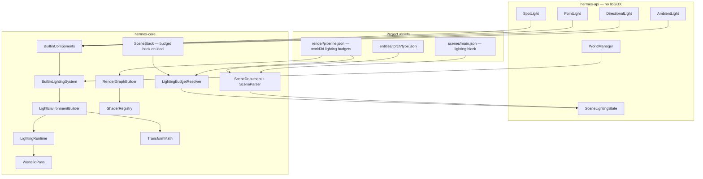
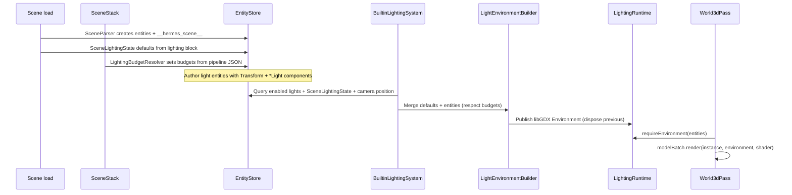

# World Lighting Implementation Plan

> **For agentic workers:** REQUIRED SUB-SKILL: Use superpowers:subagent-driven-development (recommended) or superpowers:executing-plans to implement this plan task-by-task. Steps use checkbox (`- [ ]`) syntax for tracking.

> **Pre-release policy:** Nothing is shipped. Delete hardcoded lights in `World3dPass`; rename misleading shader ids; update all templates in the same pass. No deprecation shims.

**Goal:** Config-driven 3D world lighting (ambient, directional, point, spot) from scene JSON and entity templates, compiled each frame into libGDX's forward lighting model, with pipeline-declared GPU light budgets — so authors build lit worlds from assets alone while heavy games can override every step in Java or custom shaders.

**Architecture:** Light sources are ECS components (`AmbientLight`, `DirectionalLight`, `PointLight`, `SpotLight`) on regular entities; position and direction come from `Transform` (or explicit `direction` overrides). An optional scene-level `lighting` block sets defaults without spawning entities. A reserved `__hermes_scene__` entity holds `SceneLightingState` (defaults + budgets + revision). `BuiltinLightingSystem` (ACTIVE_SCENE scope) gathers enabled lights into a libGDX `Environment` stored in core-only `LightingRuntime`, keyed by `EntityStore`. `World3dPass` reads that environment at draw time. Render pipeline `world3d` passes declare `lighting` budgets consumed by `ShaderRegistry` when compiling custom `DefaultShader` variants.

**Tech Stack:** Java 11, libGDX g3d (`Environment`, `DirectionalLight`, `PointLight`, `SpotLight`, `DefaultShader`), existing ECS (`WorldManager`, `EntityStore`, `EntityFactory`), render pipeline JSON v1, scene JSON v1, JUnit 5, Gradle `:hermes-core:test`, `:dogfood-simulation:compileJava`.

---

## Current baseline (repo state)

| Area | Today | After this plan |
|------|-------|-----------------|
| 3D lighting | Hardcoded ambient + one directional in `World3dPass` constructor | Dynamic `Environment` from ECS + scene defaults |
| Light components | None | Four light components + `SceneLightingState` |
| Scene JSON | No `lighting` block | Optional top-level `lighting` (version 1) |
| Entity templates | `EntityFactory` + `type.json` landed ([entity-types plan](2026-05-21-entity-types-and-world-manager.md)) | Light templates e.g. `entities/torch/type.json` |
| ECS root | `WorldManager` + `EntityStore` (landed) | Reserved `__hermes_scene__` entity per loaded scene |
| Systems | `System.update(WorldManager, float)` | `BuiltinLightingSystem` registered in `BuiltinComponents.registerSystems` |
| Render | `World3dPass.render(EntityStore, layers, BoundCamera)` | Reads compiled environment via `LightingRuntime` |
| Shader ids | `default/unlit` used for lit 3D meshes (misleading name) | `default/lit` = forward-lit; `default/unlit` = flat, ignores lights |
| Pipeline budgets | Fixed 1 dir / 0 point / 0 spot in `ShaderRegistry` | Parsed from pass `lighting` block; max across `world3d` passes |
| Custom passes | e.g. `WaterPass` mutates material uniforms | Can import `LightingRuntime` from core for 3D draws |

Hardcoded lights to remove:

```67:68:hermes-core/src/main/java/dev/hermes/core/render/pass/World3dPass.java
        environment.set(new ColorAttribute(ColorAttribute.AmbientLight, 0.4f, 0.4f, 0.4f, 1f));
        environment.add(new DirectionalLight().set(0.8f, 0.8f, 0.8f, -1f, -0.8f, -0.2f));
```

---

## Relationship to other plans

| Plan | Status | How lighting uses it |
|------|--------|----------------------|
| [Entity types & WorldManager](2026-05-21-entity-types-and-world-manager.md) | **Largely landed** | Light entities use `"type": "torch"` templates; reserved scene entity created via `EntityStore.create` after `EntityFactory` pass |
| [Custom UI service](2026-05-29-custom-ui-service.md) | In progress / partial | Independent; both attach to `WorldManager`. Lit 3D behind UI overlay unchanged. |
| [Debug mode](2026-05-30-debug-mode.md) | Not landed | v2: light gizmo panel listing light entities + wireframe draw (extension point documented below) |
| [Save/load sessions](2026-05-22-save-load-sessions.md) | Not landed | v2: persist light component fields + `SceneLightingState` defaults; v1 stateless per run |
| [Unified input](2026-05-21-unified-input-system.md) | Landed | No direct coupling; orbit camera affects point/spot culling via active camera position |
| [Physics & collisions](2026-05-30-physics-and-collisions.md) | Not landed | Light entities have no colliders by default; physics ignores them unless author adds bodies |

**Recommended order:** Entity-types polish can finish in parallel. Implement lighting **after** `EntityFactory` is stable (it is today). No hard dependency on UI or debug plans.

---

## Design goals

| Goal | How |
|------|-----|
| **No-code games** | Scene `lighting` block + `entities/sun/type.json` / `entities/torch/type.json` — zero Java for outdoor sun, dungeon torches, ambient fill |
| **Progressive complexity** | Tier 0 engine defaults → Tier 1 scene block → Tier 2 light entity templates → Tier 3 Java systems + custom shaders |
| **Generalized** | Same components for all 3D meshes; caps from render pipeline, not per-mesh hacks |
| **Expandable** | v1: forward g3d lights. Documented v2 hooks: shadow maps, IBL cubemaps, 2D normal-mapped sprites, light probes |
| **libGDX-free API** | Light components + `SceneLightingState` in `hermes-api`; compiled `Environment` stays in `hermes-core` only |
| **Maintainable** | One gather system, one builder, one runtime cache; no thread-locals |

### Author complexity tiers

| Tier | Author writes | Engine does |
|------|---------------|-------------|
| **0 — Defaults** | Nothing (omit `lighting`) | Engine defaults on `SceneLightingState` → same look as today's hardcoded pass |
| **1 — Scene block** | `"lighting": { ... }` in scene JSON | Apply ambient + default directional without light entities |
| **2 — Light entities** | `"type": "torch"` instances or inline `DirectionalLight` components | Transform-driven positions/directions; template merge via `EntityFactory` |
| **3 — Dynamic / custom** | Java `System` mutating light components; custom pipeline shaders + budgets | `BuiltinLightingSystem` recompiles each frame; `ShaderRegistry` matches pass caps |

---

## Architecture

### Principles

| Principle | Application |
|-----------|-------------|
| Lights are entities | Invisible by default — no `Mesh`/`Sprite` required. Optional debug gizmo later. |
| Scene defaults ≠ entities | Top-level `lighting` block seeds `SceneLightingState`; avoids spawning throwaway entities for static sun/ambient |
| Reserved scene root entity | Single `__hermes_scene__` per `EntityStore` holds `SceneLightingState`; render path unchanged (`RenderGraph.render(EntityStore)`) |
| Budgets from pipeline | Parsed once when scene loads; stored on `SceneLightingState`; gather respects caps |
| Camera-aware culling | When point/spot count exceeds budget, keep lights nearest active camera |
| Direction convention | Directional/spot aim along entity **−Z** in world space after `Transform` rotation; JSON `direction` overrides |
| Shader honesty | `default/lit` receives full forward lighting; `default/unlit` ignores lights (flat albedo) |

### Layer diagram



### Per-frame data flow



### Why `LightingRuntime` instead of a libGDX component?

`hermes-api` stays libGDX-free (same rule as UI/debug plans). The compiled `Environment` is a core implementation detail:

```java
// hermes-core — not exposed in hermes-api
final class LightingRuntime {
    private static final Map<EntityStore, Entry> ENTRIES = new WeakHashMap<>();

    static Environment require(EntityStore entities) { /* ... */ }
    static void publish(EntityStore entities, Environment next) { /* dispose previous */ }
    static void remove(EntityStore entities) { /* called from SceneStack.exitScene */ }
}
```

Custom 3D code in game modules that already depend on libGDX (e.g. advanced render demos) may call `LightingRuntime.require(entities)` directly. Passes in `hermes-api` (`RenderPass`) stay libGDX-free; only core draw paths touch `Environment`.

### Reserved entity `__hermes_scene__`

| Constant | Value |
|----------|-------|
| Name | `__hermes_scene__` |
| Component | `SceneLightingState` |
| Created by | `SceneParser` after all scene entities (not via `EntityFactory` — avoids template merge) |

Validation: if a scene entity uses `id: "__hermes_scene__"`, fail at load with `SceneParseException` (same as duplicate id).

On scene exit (`SceneStack.exitScene`), call `LightingRuntime.remove(entities)` before `entities.clear()` so GPU-side environment attributes are disposed promptly.

### Light component model (`hermes-api`)

All lights share optional `enabled` (default `true`) and `intensity` (default `1f`). Colors are RGB or RGBA float arrays; alpha is ignored for lighting.

| Component | Role | Transform usage |
|-----------|------|-----------------|
| `AmbientLight` | Global fill on the entity (typically one) | Ignored — ambient is scene-wide when gathered |
| `DirectionalLight` | Sun/moon | Direction = **−Z** axis in world space after rotation, unless JSON `direction` set |
| `PointLight` | Lamps, explosions | Position from `Transform`; `range` default `10f` |
| `SpotLight` | Flashlights, spots | Position from `Transform`; direction = **−Z** or override; `cutoffAngle` default `45°`, `exponent` default `1f`, `range` default `10f` |

**Gather rules:**

- **Ambient:** at most one effective ambient — last enabled `AmbientLight` entity wins; else scene default from `SceneLightingState`; else engine default `{0.4, 0.4, 0.4}`.
- **Directional:** scene default first (if present), then all enabled directional entities up to `maxDirectional` (stable entity iteration order).
- **Point/spot over budget:** sort by distance to active camera position (`CameraResolver.resolve` → `ActiveCamera.x/y/z`); nearest kept.

### `SceneLightingState` (`hermes-api`)

Holder on reserved entity — defaults, budgets, revision counter for tests:

```java
public final class SceneLightingState implements Component {
    // Engine defaults (match removed hardcoded pass)
    private float[] defaultAmbientColor = {0.4f, 0.4f, 0.4f, 1f};
    private float defaultAmbientIntensity = 1f;
    private float[] defaultDirectionalColor = {0.8f, 0.8f, 0.8f, 1f};
    private float defaultDirectionalIntensity = 1f;
    private float[] defaultDirectionalDirection = {-1f, -0.8f, -0.2f};
    private boolean hasDefaultDirectional = true;

    // Static lights from scene lighting.point / lighting.spot arrays (no entities)
    private List<PointLightSpec> scenePointLights = List.of();
    private List<SpotLightSpec> sceneSpotLights = List.of();

    // From pipeline at scene load
    private int maxDirectional = 1;
    private int maxPoint = 0;
    private int maxSpot = 0;

    private int revision;
    public int revision() { return revision; }
    public void bumpRevision() { revision++; }
    // getters/setters ...
}
```

`PointLightSpec` / `SpotLightSpec` are small immutable records in `hermes-api` (position, color, intensity, range, etc.) — plain data parsed from scene JSON arrays.

### Scene-level `lighting` block (version 1)

Optional top-level scene field — sets defaults on `SceneLightingState` and optional static point/spot lists.

```json
{
  "lighting": {
    "version": 1,
    "ambient": { "color": [0.35, 0.35, 0.4, 1], "intensity": 1 },
    "directional": {
      "color": [1, 0.95, 0.85, 1],
      "intensity": 1.1,
      "direction": [-0.4, -1, -0.3]
    },
    "point": [
      { "position": [0, 2, 0], "color": [1, 0.8, 0.5, 1], "intensity": 1.5, "range": 12 }
    ]
  },
  "entities": []
}
```

| Field | Required | Description |
|-------|----------|-------------|
| `lighting.version` | Yes | Must be `1`. |
| `lighting.ambient` | No | Default ambient color/intensity. |
| `lighting.directional` | No | Default sun; omitted → engine default directional. |
| `lighting.point` | No | Static point lights without entities (pure config sims). |
| `lighting.spot` | No | Static spot lights without entities. |

For moving lights (day/night sun, flickering torches), prefer light **entities** with `Transform`.

### Entity-based lights (templates)

**Reusable template** `assets/entities/torch/type.json`:

```json
{
  "version": 1,
  "components": {
    "Transform": { "y": 0.5 },
    "PointLight": {
      "color": [1, 0.6, 0.2, 1],
      "intensity": 2,
      "range": 8
    }
  }
}
```

**Scene instance** (merge overrides position only):

```json
{ "type": "torch", "id": "torch-a", "components": { "Transform": { "x": 3, "z": 1 } } }
```

**Inline sun entity:**

```json
{
  "id": "sun",
  "components": {
    "Transform": { "rotationX": -45, "rotationY": 30 },
    "DirectionalLight": {
      "color": [1, 0.95, 0.8, 1],
      "intensity": 1.2
    }
  }
}
```

**Outdoor template** `assets/entities/sun/type.json` optional for reuse across scenes.

### Render pipeline: light budgets

Extend `world3d` pass definitions in `assets/render/pipeline.json`:

```json
{
  "id": "world3d",
  "type": "world3d",
  "target": "screen",
  "layers": ["WORLD"],
  "lighting": {
    "maxDirectional": 1,
    "maxPoint": 8,
    "maxSpot": 2
  }
}
```

| Field | Default | Maps to |
|-------|---------|---------|
| `maxDirectional` | `1` | `DefaultShader.Config.numDirectionalLights` |
| `maxPoint` | `0` | `numPointLights` |
| `maxSpot` | `0` | `numSpotLights` |

Omitted `lighting` on pass → `{1, 0, 0}`. When a pipeline has multiple `world3d` passes, `LightingBudgetResolver` takes the **element-wise max** across passes (one shader registry per graph).

**HTML / GLES note:** document that high point counts are expensive on WebGL; dogfood default stays `{1, 0, 0}`; dungeon demo uses `{0, 16, 0}`.

### Materials and shaders

| Shader id | Behavior |
|-----------|----------|
| `default/lit` | Forward-lit `default.vert` / `default.frag`; requires mesh **vertex normals** |
| `default/unlit` | Flat albedo — fragment shader skips lighting varyings (new `default-unlit.frag` or compile flag) |
| Custom pipeline shaders | Must declare libGDX lighting uniforms consistent with pass budgets |

**Migration:** change `spin-cube` and templates from `default/unlit` → `default/lit` where meshes have normals. Sprites keep `default/unlit`.

**Visible lighting requirement:** Wavefront models need vertex normals. Verify `models/cube.obj` includes normals in dogfood assets.

### `TransformMath` (core)

Shared utility for light direction extraction (same rotation order as `World3dPass.applyTransform`):

```java
final class TransformMath {
    /** World-space unit vector along entity local −Z after rotation (Hermes light aim convention). */
    static void worldNegZ(Transform transform, Vector3 out) {
        out.set(0f, 0f, -1f);
        if (transform.rotationX() != 0f) out.rotate(Vector3.X, transform.rotationX());
        if (transform.rotationY() != 0f) out.rotate(Vector3.Y, transform.rotationY());
        if (transform.rotationZ() != 0f) out.rotate(Vector3.Z, transform.rotationZ());
        out.nor();
    }

    static void worldPosition(Transform transform, Vector3 out) {
        out.set(transform.x(), transform.y(), transform.z());
    }
}
```

### Code extension (Tier 3)

```java
public final class DayNightSystem implements System {
    @Override
    public void update(WorldManager manager, float deltaSeconds) {
        EntityStore entities = manager.entities();
        Entity sun = entities.findByName("sun");
        if (sun == null) return;
        DirectionalLight light = entities.getComponent(sun.id(), DirectionalLight.class);
        if (light == null) return;
        float t = (float) Math.sin(worldTime);
        light.setIntensity(0.4f + 0.6f * Math.max(0f, t));
    }
}
```

Register in `HermesApplication.onCreate` via `engine.addSystem(new DayNightSystem(), SystemScope.ACTIVE_SCENE)`.

Custom 3D render code in core or game modules:

```java
Environment env = LightingRuntime.require(entities);
modelBatch.render(instance, env, shader);
```

### Out of scope (v1) — documented extension points

| Feature | v2 approach |
|---------|-------------|
| Shadow maps | `DirectionalLight.shadowMapSize`, pipeline `shadow` pass type |
| Image-based ambient | `AmbientCubemap` component + HDR env texture asset |
| 2D sprite lighting | Separate `sprites` pass lighting mode + normal map on `Sprite` |
| Light probes | `LightProbe` component + SH coefficients in shader |
| Debug gizmos | [Debug mode plan](2026-05-30-debug-mode.md) — `DebugMetricProvider` listing light count; wireframe pass |
| Declarative day/night | Scene `"systems"` array (future) — v1 uses Java registration |

---

## How projects use it

### Minimal 3D scene (Tier 0)

No changes — omit `lighting`; engine defaults reproduce today's look.

### Styled outdoor scene (Tier 1)

`assets/scenes/outdoor.json`:

```json
{
  "lighting": {
    "version": 1,
    "ambient": { "color": [0.25, 0.28, 0.35, 1] },
    "directional": {
      "color": [1, 0.92, 0.75, 1],
      "intensity": 1.15,
      "direction": [-0.5, -1, -0.2]
    }
  },
  "entities": [
    {
      "id": "cam",
      "components": {
        "Transform": { "y": 2, "z": 6 },
        "Camera": { "projection": "perspective", "active": true }
      }
    },
    {
      "id": "ground",
      "components": {
        "Transform": { "y": -1 },
        "Mesh": { "model": "models/cube.obj", "texture": "grass.png" },
        "Material": { "shader": "default/lit" }
      }
    }
  ]
}
```

Set `"scene": "scenes/outdoor.json"` in `hermes.json`.

### Dungeon with torches (Tier 2)

1. Add `assets/entities/torch/type.json` (template above).
2. Scene:

```json
{
  "lighting": {
    "version": 1,
    "ambient": { "color": [0.08, 0.08, 0.12, 1], "intensity": 1 }
  },
  "entities": [
    { "type": "torch", "id": "t1", "components": { "Transform": { "x": -2, "z": 0 } } },
    { "type": "torch", "id": "t2", "components": { "Transform": { "x": 2, "z": 0 } } }
  ]
}
```

3. Pipeline for torches — `assets/render/dungeon-pipeline.json`:

```json
"passes": [
  {
    "id": "world3d",
    "type": "world3d",
    "target": "screen",
    "layers": ["WORLD"],
    "lighting": { "maxDirectional": 0, "maxPoint": 16, "maxSpot": 0 }
  }
]
```

Reference from scene: `"renderPipeline": "render/dungeon-pipeline.json"`.

### Heavy game (Tier 3)

- Register `DayNightSystem`, `FlickerSystem` with `SystemScope.ACTIVE_SCENE`.
- Custom shader `shaders/hero.frag` + pipeline registration; set pass `lighting` budgets to match shader `#define numPointLights`.
- Optional custom `RenderPass` prepass (deferred) — read `LightingRuntime` or bypass for custom lighting model.

---

## File map

| File | Responsibility |
|------|----------------|
| `hermes-api/.../ecs/AmbientLight.java` | Ambient component |
| `hermes-api/.../ecs/DirectionalLight.java` | Directional component |
| `hermes-api/.../ecs/PointLight.java` | Point component |
| `hermes-api/.../ecs/SpotLight.java` | Spot component |
| `hermes-api/.../ecs/SceneLightingState.java` | Defaults, static specs, budgets, revision |
| `hermes-api/.../ecs/PointLightSpec.java` | Static point entry for scene block |
| `hermes-api/.../ecs/SpotLightSpec.java` | Static spot entry for scene block |
| `hermes-api/.../lighting/SceneLightingNames.java` | `SCENE_ENTITY_NAME` constant |
| `hermes-core/.../ecs/BuiltinComponents.java` | JSON deserializers + register `BuiltinLightingSystem` |
| `hermes-core/.../ecs/SceneDocument.java` | Parse `lighting` block |
| `hermes-core/.../ecs/SceneParser.java` | Create `__hermes_scene__` + apply defaults; reject reserved id |
| `hermes-core/.../lighting/LightEnvironmentBuilder.java` | ECS + defaults → libGDX `Environment` |
| `hermes-core/.../lighting/LightingBudgets.java` | Immutable `{maxDirectional, maxPoint, maxSpot}` |
| `hermes-core/.../lighting/LightingBudgetResolver.java` | Parse pipeline JSON → write budgets on `SceneLightingState` |
| `hermes-core/.../lighting/LightingRuntime.java` | Per-`EntityStore` compiled `Environment` cache |
| `hermes-core/.../lighting/BuiltinLightingSystem.java` | Frame gather; ACTIVE_SCENE scope |
| `hermes-core/.../lighting/TransformMath.java` | World position / −Z direction from `Transform` |
| `hermes-core/.../scene/SceneStack.java` | Call `LightingBudgetResolver` after load; `LightingRuntime.remove` on exit |
| `hermes-core/.../render/pass/World3dPass.java` | Remove hardcoded lights; use `LightingRuntime` |
| `hermes-core/.../render/PipelineDocument.java` | Parse pass `lighting` budgets |
| `hermes-core/.../render/RenderGraphBuilder.java` | Pass budgets into `ShaderRegistry` |
| `hermes-core/.../render/resource/ShaderRegistry.java` | Per-registry light slot counts from budgets |
| `docs/scene-format-v1.md` | Document `lighting` block + light components |
| `docs/world-lighting.md` | User guide (examples above) |
| `docs/render-pipeline.md` | Pass `lighting` budgets |
| `dogfood-simulation/.../scenes/lit-demo.json` | Dogfood lit scene |
| `dogfood-simulation/.../entities/torch/type.json` | Torch template |
| `hermes-templates/*/game/...` | Migrate 3D meshes to `default/lit` |

---

### Task 1: Light component API

**Files:**
- Create: `hermes-api/src/main/java/dev/hermes/api/ecs/AmbientLight.java`
- Create: `hermes-api/src/main/java/dev/hermes/api/ecs/DirectionalLight.java`
- Create: `hermes-api/src/main/java/dev/hermes/api/ecs/PointLight.java`
- Create: `hermes-api/src/main/java/dev/hermes/api/ecs/SpotLight.java`
- Create: `hermes-api/src/main/java/dev/hermes/api/ecs/SceneLightingState.java`
- Create: `hermes-api/src/main/java/dev/hermes/api/ecs/PointLightSpec.java`
- Create: `hermes-api/src/main/java/dev/hermes/api/ecs/SpotLightSpec.java`
- Create: `hermes-api/src/main/java/dev/hermes/api/lighting/SceneLightingNames.java`
- Test: `hermes-core/src/test/java/dev/hermes/core/lighting/LightComponentsTest.java`

- [ ] **Step 1: Write the failing test**

```java
package dev.hermes.core.lighting;

import static org.junit.jupiter.api.Assertions.assertEquals;
import static org.junit.jupiter.api.Assertions.assertTrue;

import dev.hermes.api.ecs.DirectionalLight;
import dev.hermes.api.ecs.PointLight;
import dev.hermes.api.ecs.SceneLightingState;

import org.junit.jupiter.api.Test;

final class LightComponentsTest {

    @Test
    void directionalLight_defaults() {
        DirectionalLight light = new DirectionalLight();
        assertTrue(light.enabled());
        assertEquals(1f, light.intensity(), 0.001f);
        assertEquals(4, light.color().length);
    }

    @Test
    void pointLight_rangeDefault() {
        PointLight light = new PointLight();
        assertEquals(10f, light.range(), 0.001f);
    }

    @Test
    void sceneLightingState_engineDefaults() {
        SceneLightingState state = new SceneLightingState();
        assertEquals(0.4f, state.defaultAmbientColor()[0], 0.001f);
        assertTrue(state.hasDefaultDirectional());
        assertEquals(1, state.maxDirectional());
    }
}
```

- [ ] **Step 2: Run test to verify it fails**

Run: `./gradlew :hermes-core:test --tests "dev.hermes.core.lighting.LightComponentsTest" -q`
Expected: FAIL — class `DirectionalLight` not found

- [ ] **Step 3: Implement API types**

`DirectionalLight.java`:

```java
package dev.hermes.api.ecs;

import dev.hermes.api.Component;

public final class DirectionalLight implements Component {
    private boolean enabled = true;
    private float intensity = 1f;
    private final float[] color = {1f, 1f, 1f, 1f};
    private final float[] direction = {0f, 0f, -1f};
    private boolean directionOverridden;

    public boolean enabled() { return enabled; }
    public void setEnabled(boolean enabled) { this.enabled = enabled; }
    public float intensity() { return intensity; }
    public void setIntensity(float intensity) { this.intensity = intensity; }
    public float[] color() { return color; }
    public void setColor(float r, float g, float b, float a) {
        color[0] = r; color[1] = g; color[2] = b; color[3] = a;
    }
    public float[] direction() { return direction; }
    public void setDirection(float x, float y, float z) {
        direction[0] = x; direction[1] = y; direction[2] = z;
        directionOverridden = true;
    }
    public boolean directionOverridden() { return directionOverridden; }
}
```

Implement `AmbientLight` (no direction), `PointLight` (`range` default `10f`), `SpotLight` (`cutoffAngle` default `45f`, `exponent` default `1f`, `range` default `10f`) similarly.

`PointLightSpec` / `SpotLightSpec`: immutable records with `position`, `color`, `intensity`, `range`, and spot-specific `direction`, `cutoffAngle`, `exponent`.

`SceneLightingNames.java`:

```java
package dev.hermes.api.lighting;

public final class SceneLightingNames {
    public static final String SCENE_ENTITY_NAME = "__hermes_scene__";
    private SceneLightingNames() {}
}
```

- [ ] **Step 4: Run test — PASS**

- [ ] **Step 5: Commit**

```bash
git add hermes-api/src/main/java/dev/hermes/api/ecs/*Light*.java hermes-api/src/main/java/dev/hermes/api/ecs/SceneLightingState.java hermes-api/src/main/java/dev/hermes/api/lighting/SceneLightingNames.java hermes-core/src/test/java/dev/hermes/core/lighting/LightComponentsTest.java
git commit -m "feat(api): add ECS light components and scene lighting state"
```

---

### Task 2: Builtin component deserialization

**Files:**
- Modify: `hermes-core/src/main/java/dev/hermes/core/ecs/BuiltinComponents.java`
- Test: `hermes-core/src/test/java/dev/hermes/core/ecs/BuiltinLightComponentsTest.java`

- [ ] **Step 1: Write failing test**

```java
@Test
void deserialize_pointLight_fromJson() {
    ComponentRegistryImpl registry = new ComponentRegistryImpl();
    BuiltinComponents.register(registry);
    JsonComponentData data = new JsonComponentData(new JsonReader().parse(
        "{ \"color\": [1,0,0,1], \"intensity\": 2, \"range\": 5 }"));
    PointLight light = (PointLight) registry.deserialize(
        "scene.json", "lamp", "PointLight", data, ComponentContext.empty());
    assertEquals(2f, light.intensity(), 0.001f);
    assertEquals(5f, light.range(), 0.001f);
}
```

- [ ] **Step 2: Run — FAIL** (`PointLight` not registered)

- [ ] **Step 3: Register deserializers in `BuiltinComponents.register`**

Parse `color` as float array length 3 or 4; `enabled` boolean; `intensity` float; `range` / `cutoffAngle` / `exponent` for spot/point; `direction` as 3 floats sets override flag on `DirectionalLight` / `SpotLight`.

- [ ] **Step 4: Run — PASS**

- [ ] **Step 5: Commit**

```bash
git add hermes-core/src/main/java/dev/hermes/core/ecs/BuiltinComponents.java hermes-core/src/test/java/dev/hermes/core/ecs/BuiltinLightComponentsTest.java
git commit -m "feat: deserialize light components from scene JSON"
```

---

### Task 3: Scene `lighting` block + reserved entity

**Files:**
- Modify: `hermes-core/src/main/java/dev/hermes/core/ecs/SceneDocument.java`
- Modify: `hermes-core/src/main/java/dev/hermes/core/ecs/SceneParser.java`
- Test: `hermes-core/src/test/java/dev/hermes/core/ecs/SceneLightingParseTest.java`

- [ ] **Step 1: Write failing test**

```java
@Test
void sceneLighting_populatesSceneLightingState() {
    String json = """
        {
          "lighting": {
            "version": 1,
            "ambient": { "color": [0.1, 0.1, 0.2, 1] }
          },
          "entities": []
        }
        """;
    WorldManagerImpl manager = new WorldManagerImpl();
    ComponentRegistryImpl registry = new ComponentRegistryImpl();
    BuiltinComponents.register(registry);
    SceneLoader.loadFromString("s.json", json, manager.entities(), registry);
    Entity sceneEntity = manager.entities().findByName(SceneLightingNames.SCENE_ENTITY_NAME);
    assertNotNull(sceneEntity);
    SceneLightingState state =
            manager.entities().getComponent(sceneEntity.id(), SceneLightingState.class);
    assertEquals(0.1f, state.defaultAmbientColor()[0], 0.001f);
}

@Test
void sceneEntity_reservedNameRejected() {
    String json = """
        { "entities": [{ "id": "__hermes_scene__", "components": {} }] }
        """;
    WorldManagerImpl manager = new WorldManagerImpl();
    ComponentRegistryImpl registry = new ComponentRegistryImpl();
    BuiltinComponents.register(registry);
    assertThrows(SceneParseException.class, () ->
            SceneLoader.loadFromString("bad.json", json, manager.entities(), registry));
}
```

- [ ] **Step 2: Run — FAIL**

- [ ] **Step 3: Implement parsing**

Add `SceneDocument.LightingSpec` with version + ambient/directional/point/spot lists. In `SceneParser.loadIntoEntities`:

1. Reject entity id `SceneLightingNames.SCENE_ENTITY_NAME` during entity loop.
2. After entity loop, create reserved entity and attach `SceneLightingState`:

```java
Entity sceneEntity = entities.create(SceneLightingNames.SCENE_ENTITY_NAME);
SceneLightingState state = new SceneLightingState();
document.lighting().ifPresent(spec -> LightingDefaultsMapper.apply(spec, state));
entities.addComponent(sceneEntity.id(), state);
```

Implement `LightingDefaultsMapper` in `hermes-core/.../lighting/`.

- [ ] **Step 4: Run — PASS**

- [ ] **Step 5: Commit**

```bash
git add hermes-core/src/main/java/dev/hermes/core/ecs/SceneDocument.java hermes-core/src/main/java/dev/hermes/core/ecs/SceneParser.java hermes-core/src/main/java/dev/hermes/core/lighting/LightingDefaultsMapper.java hermes-core/src/test/java/dev/hermes/core/ecs/SceneLightingParseTest.java
git commit -m "feat: parse scene lighting block and create scene lighting entity"
```

---

### Task 4: TransformMath + LightEnvironmentBuilder

**Files:**
- Create: `hermes-core/src/main/java/dev/hermes/core/lighting/TransformMath.java`
- Create: `hermes-core/src/main/java/dev/hermes/core/lighting/LightEnvironmentBuilder.java`
- Create: `hermes-core/src/main/java/dev/hermes/core/lighting/LightingBudgets.java`
- Test: `hermes-core/src/test/java/dev/hermes/core/lighting/LightEnvironmentBuilderTest.java`

- [ ] **Step 1: Write failing test**

```java
@Test
void build_includesDirectionalFromEntityTransform() {
    WorldManagerImpl manager = new WorldManagerImpl();
    EntityStore entities = manager.entities();
    ComponentRegistryImpl registry = new ComponentRegistryImpl();
    BuiltinComponents.register(registry);
    SceneLoader.loadFromString("s.json", "{\"entities\":[]}", entities, registry);

    Entity sun = entities.create("sun");
    Transform transform = new Transform();
    transform.setRotationX(-90f);
    entities.addComponent(sun.id(), transform);
    DirectionalLight dl = new DirectionalLight();
    dl.setColor(1, 1, 1, 1);
    entities.addComponent(sun.id(), dl);

    ActiveCamera cam = CameraResolver.resolve(entities, 800, 600);
    Vector3 camPos = new Vector3(cam.x(), cam.y(), cam.z());
    SceneLightingState state = sceneState(entities);
    Environment env = LightEnvironmentBuilder.build(entities, state, LightingBudgets.defaults(), camPos);
    assertEquals(1, env.directionalLights.size);
}
```

- [ ] **Step 2: Run — FAIL**

- [ ] **Step 3: Implement builder**

- Read `SceneLightingState` from reserved entity.
- Apply default ambient + directional when `hasDefaultDirectional`.
- Append static `scenePointLights` / `sceneSpotLights` from state.
- Iterate `entities.entitiesWith(DirectionalLight.class)` etc.; skip `!enabled()`.
- Use `TransformMath` for directions and positions.
- Normalize directions; multiply colors by `intensity`.
- Enforce `LightingBudgets` caps; sort point/spot by distance to camera.
- Return new `Environment` (caller disposes previous).

- [ ] **Step 4: Run — PASS**

- [ ] **Step 5: Commit**

```bash
git add hermes-core/src/main/java/dev/hermes/core/lighting/*.java hermes-core/src/test/java/dev/hermes/core/lighting/LightEnvironmentBuilderTest.java
git commit -m "feat: build libGDX Environment from ECS lights"
```

---

### Task 5: LightingRuntime + BuiltinLightingSystem

**Files:**
- Create: `hermes-core/src/main/java/dev/hermes/core/lighting/LightingRuntime.java`
- Create: `hermes-core/src/main/java/dev/hermes/core/lighting/BuiltinLightingSystem.java`
- Modify: `hermes-core/src/main/java/dev/hermes/core/ecs/BuiltinComponents.java` (`registerSystems`)
- Modify: `hermes-core/src/main/java/dev/hermes/core/scene/SceneStack.java` (`exitScene` → `LightingRuntime.remove`)
- Test: `hermes-core/src/test/java/dev/hermes/core/lighting/BuiltinLightingSystemTest.java`

- [ ] **Step 1: Write failing test** — after `update()`, `SceneLightingState.revision()` increments when a point light entity moves.

- [ ] **Step 2: Run — FAIL**

- [ ] **Step 3: Implement system**

```java
public final class BuiltinLightingSystem implements System {
    @Override
    public void update(WorldManager manager, float deltaSeconds) {
        EntityStore entities = manager.entities();
        Entity scene = entities.findByName(SceneLightingNames.SCENE_ENTITY_NAME);
        if (scene == null) return;
        SceneLightingState state = entities.getComponent(scene.id(), SceneLightingState.class);
        if (state == null) return;

        ActiveCamera cam = CameraResolver.resolve(entities, BackbufferSize.width(), BackbufferSize.height());
        Vector3 camPos = new Vector3(cam.x(), cam.y(), cam.z());
        LightingBudgets budgets = LightingBudgets.from(state);
        Environment env = LightEnvironmentBuilder.build(entities, state, budgets, camPos);
        LightingRuntime.publish(entities, env);
        state.bumpRevision();
    }
}
```

Register in `BuiltinComponents.registerSystems`:

```java
engine.addSystem(new BuiltinLightingSystem(), SystemScope.ACTIVE_SCENE);
```

Place **before** render-driven systems if order matters (lighting only in `update`, so any ACTIVE_SCENE order works).

- [ ] **Step 4: Run — PASS**

- [ ] **Step 5: Commit**

```bash
git add hermes-core/src/main/java/dev/hermes/core/lighting/LightingRuntime.java hermes-core/src/main/java/dev/hermes/core/lighting/BuiltinLightingSystem.java hermes-core/src/main/java/dev/hermes/core/ecs/BuiltinComponents.java hermes-core/src/main/java/dev/hermes/core/scene/SceneStack.java
git commit -m "feat: gather scene lighting each frame via BuiltinLightingSystem"
```

---

### Task 6: Pipeline pass lighting budgets

**Files:**
- Modify: `hermes-core/src/main/java/dev/hermes/core/render/PipelineDocument.java`
- Modify: `hermes-core/src/main/java/dev/hermes/core/render/RenderGraphBuilder.java`
- Modify: `hermes-core/src/main/java/dev/hermes/core/render/resource/ShaderRegistry.java`
- Create: `hermes-core/src/main/java/dev/hermes/core/lighting/LightingBudgetResolver.java`
- Modify: `hermes-core/src/main/java/dev/hermes/core/scene/SceneStack.java` (call resolver after scene load)
- Test: `hermes-core/src/test/java/dev/hermes/core/render/PipelineLightingBudgetTest.java`
- Test: `hermes-core/src/test/java/dev/hermes/core/lighting/LightingBudgetResolverTest.java`

- [ ] **Step 1: Write failing test** — parse pipeline JSON with `"lighting": { "maxPoint": 4 }` on world3d pass; assert budgets; assert resolver writes `maxPoint` on `SceneLightingState`.

- [ ] **Step 2: Run — FAIL**

- [ ] **Step 3: Implement**

Add `PassDef.LightingBudgets` nested record. Parse under each pass.

`ShaderRegistry` constructor accepts `LightingBudgets` (max across world3d passes in document):

```java
public ShaderRegistry(Map<String, PipelineDocument.ShaderDef> shaders, LightingBudgets budgets) {
    // ...
    config.numDirectionalLights = budgets.maxDirectional();
    config.numPointLights = budgets.maxPoint();
    config.numSpotLights = budgets.maxSpot();
}
```

`LightingBudgetResolver.apply(WorldManager manager, String pipelineAssetPath)` loads/caches pipeline document, computes max budgets, writes to `SceneLightingState`.

Call from `SceneStack.loadScene` after `SceneLoader.load`:

```java
String pipelinePath = RenderPipelineExecutor.resolvePipelinePath(instance, projectDefault);
LightingBudgetResolver.apply(manager, pipelinePath);
```

Pass project default pipeline path into `SceneStack` via `SceneManagerImpl` (constructor or bind).

- [ ] **Step 4: Run — PASS**

- [ ] **Step 5: Commit**

```bash
git add hermes-core/src/main/java/dev/hermes/core/render/PipelineDocument.java hermes-core/src/main/java/dev/hermes/core/render/RenderGraphBuilder.java hermes-core/src/main/java/dev/hermes/core/render/resource/ShaderRegistry.java hermes-core/src/main/java/dev/hermes/core/lighting/LightingBudgetResolver.java hermes-core/src/main/java/dev/hermes/core/scene/SceneStack.java
git commit -m "feat: configure 3D light budgets from render pipeline JSON"
```

---

### Task 7: World3dPass uses dynamic environment

**Files:**
- Modify: `hermes-core/src/main/java/dev/hermes/core/render/pass/World3dPass.java`
- Test: `hermes-core/src/test/java/dev/hermes/core/render/World3dPassLightingTest.java`

- [ ] **Step 1: Write failing test** — load scene with dark ambient in `lighting` block; assert rendered environment is not hardcoded 0.4 (via `LightingRuntime` after running `BuiltinLightingSystem`).

- [ ] **Step 2: Run — FAIL**

- [ ] **Step 3: Remove hardcoded constructor lights**

```java
public void render(EntityStore entities, Set<RenderLayer.Layer> layers, BoundCamera bound) {
    Environment environment = LightingRuntime.require(entities);
    // ...
    modelBatch.render(instance, environment, g3dShader);
}
```

Delete lines 67–68. Remove the unused field initializer pattern — `LightingRuntime.require` supplies each frame's environment. `dispose()` must not dispose the shared compiled environment.

- [ ] **Step 4: Run full render tests**

Run: `./gradlew :hermes-core:test --tests "dev.hermes.core.render.*" -q`
Expected: PASS

- [ ] **Step 5: Commit**

```bash
git add hermes-core/src/main/java/dev/hermes/core/render/pass/World3dPass.java hermes-core/src/test/java/dev/hermes/core/render/World3dPassLightingTest.java
git commit -m "feat: drive World3dPass lighting from scene ECS state"
```

---

### Task 8: Shaders, dogfood demo, docs

**Files:**
- Modify: `hermes-core/src/main/resources/assets/render/builtin-forward.json`
- Modify: `dogfood-simulation/src/main/resources/assets/render/pipeline.json`
- Create: `dogfood-simulation/src/main/resources/assets/shaders/default-unlit.frag` (or equivalent)
- Create: `dogfood-simulation/src/main/resources/assets/entities/torch/type.json`
- Create: `dogfood-simulation/src/main/resources/assets/scenes/lit-demo.json`
- Modify: `dogfood-simulation/src/main/resources/assets/entities/spin-cube/type.json` (`default/lit`)
- Create: `docs/world-lighting.md`
- Modify: `docs/scene-format-v1.md`, `docs/render-pipeline.md`
- Modify: `hermes-templates/*/game/...` — 3D templates use `default/lit`

- [ ] **Step 1: Register shaders in pipeline JSON**

```json
"shaders": {
  "default/lit": {
    "vertex": "shaders/default.vert",
    "fragment": "shaders/default.frag"
  },
  "default/unlit": {
    "vertex": "shaders/default.vert",
    "fragment": "shaders/default-unlit.frag"
  }
}
```

- [ ] **Step 2: Add dogfood lit-demo scene with `lighting` + torch entities**

- [ ] **Step 3: Manual verify**

Run: `./gradlew :dogfood-simulation:run`
Expected: lit-demo shows directional sun + warm torch falloff on cube

- [ ] **Step 4: Document in `docs/world-lighting.md`**

- [ ] **Step 5: Commit**

```bash
git add dogfood-simulation/ hermes-core/src/main/resources/assets/render/builtin-forward.json docs/ hermes-templates/
git commit -m "docs: world lighting guide and dogfood lit demo"
```

---

## Self-review

**Spec coverage**

| Requirement | Task |
|-------------|------|
| Config-only scene lighting | Task 3 |
| Entity/template lights | Task 2, 8 |
| Replace hardcoded World3dPass | Task 7 |
| Pipeline budgets / custom shaders | Task 6 |
| Code-driven dynamic lights | Task 5 + Tier 3 docs |
| Easy defaults | Task 1, 3 |
| WorldManager / EntityStore (not World) | All tasks |
| libGDX-free api | Task 1, 5 (`LightingRuntime` in core) |
| Expandable (v2 table) | Architecture section |
| No backward-compat shims | Pre-release policy; shader rename in Task 8 |

**Placeholder scan:** None.

**Type consistency:** `SceneLightingNames.SCENE_ENTITY_NAME`, `SceneLightingState`, `LightingBudgets`, `LightingRuntime` used consistently across Tasks 3–7.

---

## Execution handoff

Plan complete and saved to `docs/superpowers/plans/2026-05-26-world-lighting.md`. Two execution options:

**1. Subagent-Driven (recommended)** — dispatch a fresh subagent per task, review between tasks, fast iteration

**2. Inline Execution** — execute tasks in this session using executing-plans, batch execution with checkpoints

Which approach?
