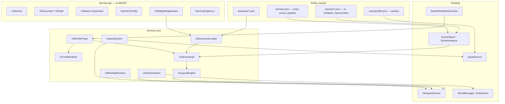

# Custom UI Service Implementation Plan

> **For agentic workers:** REQUIRED SUB-SKILL: Use superpowers:subagent-driven-development (recommended) or superpowers:executing-plans to implement this plan task-by-task. Steps use checkbox (`- [ ]`) syntax for tracking.

> **Pre-release policy:** Nothing is shipped. Prefer clean design over compatibility. Delete dead code; do not layer new systems on interim hacks.

**Goal:** Ship a first-class `UiService` as the **only** 2D UI path in Hermes — config-driven menus/HUDs, world-attached overlays (HP bars), and a Java/SPI extension surface for custom widgets — so authors can build most games from assets alone while heavy projects can override every step.

**Architecture:** Retained **widget trees** in `assets/ui/*.json`. Scenes declare screen-space UI via a top-level `"ui"` field; world-attached UI uses an `UiAttach` ECS component on lightweight marker entities. `UiService` owns document load/cache, per-scene activation, layout, bindings, focus, and draw dispatch. The `ui` render pass draws widget trees only (no `Sprite` + `RenderLayer.UI`). Pointer hits use `UiInputSystem` in SURFACE space; gameplay picking stays on `Selectable` + `PickLayer.WORLD` via `InputService`.

**Tech Stack:** Java 11, libGDX `SpriteBatch` / `BitmapFont` (hermes-core only), Gson JSON, JUnit 5, existing ECS (`WorldManager`, `EntityStore`), scene stack, `ViewportService`, `InputService`, `RuntimeConfigService`.

---

## Current baseline (repo state)

| Area | Today | After this plan |
|------|-------|-----------------|
| UI rendering | `UiPass` draws `Sprite` entities with `RenderLayer.UI` | `UiRenderPass` draws widget trees via `UiService` |
| UI scenes | Manual `ui-camera` entity + sprites (e.g. `pause.json`) | Top-level `"ui": "ui/....json"` — no UI camera entity |
| `RenderLayer` | `WORLD`, `UI` | `WORLD` only (delete `UI`) |
| `PickLayer` | `WORLD`, `UI`, `ANY` | `WORLD` only |
| `HermesEngine` | `scenes`, `viewport`, `input`, `runtimeConfig`, … — **no `ui()`** | `UiService ui()` |
| Scene metadata | `SceneLoadMetadata`: `renderPipeline`, `inputContext` | Add `ui` → `SceneUiConfig` |
| `SceneViewport` | SCREEN/WORLD/SURFACE; **no** `normalizedToSurface` yet | Add NORMALIZED ↔ SURFACE for layout |
| Coordinates | Documented in `docs/coordinate-spaces.md` | UI layout uses NORMALIZED anchors on full backbuffer SURFACE |
| Scene root | `WorldManager` + `EntityStore` (entity-types plan largely landed) | `UiAttach` resolves `follow` via `entities().findByName` |
| Input | `InputService` + `input/profile.json` actions/contexts | UI buttons pulse action strings into same namespace |
| Config launch | `RuntimeConfigService` (scene path, pipeline, logging) | **Not** per-frame game state — dynamic UI values use bindings (below) |

Representative legacy UI today (`dogfood-simulation/.../scenes/pause.json`): orthographic `ui-camera`, `Sprite` + `RenderLayer.UI`, pipeline `ui` pass with `"layers": ["UI"]` and `"camera": "ui-camera"`.

---

## Relationship to other plans

| Plan | Status | How UI plan uses it |
|------|--------|---------------------|
| [Unified input](2026-05-21-unified-input-system.md) | Landed | UI clicks → action strings; no `PickLayer.UI`. Use `engine.viewport().mapScreenToSurface` for hit tests. |
| [Unified runtime config](2026-05-24-unified-runtime-config-service.md) | Landed | Boot scene/pipeline/profile only — **not** HP/score bindings. |
| [Entity types & WorldManager](2026-05-21-entity-types-and-world-manager.md) | Largely landed | `UiAttach.follow` = scene entity **name**; attach entities can use `"type": "ui-marker"` template (optional). |
| [World lighting](2026-05-26-world-lighting.md) | Future | No UI conflict; both use `WorldManager`. |
| [Save/load](2026-05-22-save-load-sessions.md) | Future | v2: persist UI binding state / focus; v1 stateless each run. |
| [Audio](2026-05-22-audio-system.md) | Future | v2: `onClick` → `"ui.click"` sound via actions. |

**Prerequisites:** Unified input and viewport coordinate docs are in place. Implement **NORMALIZED ↔ SURFACE** on `SceneViewport` (Task 1) before layout. No separate “retina viewport” plan file — follow `docs/coordinate-spaces.md` and `BackbufferSize` for SURFACE sizing.

**Recommended order:** This plan can run in parallel with remaining entity-types polish; use `WorldManager` / `EntityStore` in all new APIs and tests.

---

## Design goals

| Goal | How |
|------|-----|
| **No-code-first** | Menus, HUD chrome, static labels, pause overlays from `assets/ui/*.json` + scene `"ui"` + `input/profile.json` actions. |
| **Progressive complexity** | Tiers 0–4 (below): pure config → bindings in Java → custom widgets → full programmatic trees. |
| **One UI system** | No parallel sprite HUD path; delete `RenderLayer.UI` and sprite-based `UiPass`. |
| **Generalized** | Widget trees, anchors, bindings, SPI — same model for HUD, menu, and world-attached bars. |
| **Easy to extend** | `UiWidgetRegistration` SPI; optional `UiBindingProvider`; programmatic `UiNode` builders. |
| **Maintainable** | Single render pass, single hit-test path, `hermes-api` stays libGDX-free. |

### Author complexity tiers

| Tier | Author writes | Engine does |
|------|---------------|-------------|
| **0 — Static UI** | `ui/menu.json` + scene `"ui": "ui/menu.json"` + `inputContext` + action bindings | Load tree, layout, draw, route button `action` to `InputService` |
| **1 — Scene stack modals** | `render/ui-overlay.json` pipeline + `push("pause")` + overlay scene `"ui"` | Transparent clear + top scene UI; input context from top scene |
| **2 — Dynamic values** | Widget `"binding": "player.hp"` + tiny Java/system `engine.ui().setBinding(...)` or `UiBindingProvider` | Resolve bindings each frame before layout |
| **3 — World-attached** | `UiAttach` entity + `ui/hp-bar.json` + `follow: "player"` | `UiAttachSystem` projects world position → screen anchor |
| **4 — Custom widgets** | SPI `UiWidgetRegistration` + optional programmatic tree edits in `onCreate` | Custom deserialize + draw ops in `UiTreeRenderer` |

**Honest v1 limit:** Fully dynamic HP/score with **zero** Java requires either `setBinding` from an existing gameplay system or a future declarative `binding: { "component": "Health", "field": "current" }` (planned v2 — not in v1 tasks).

---

## Architecture

### System context



### UiService responsibilities

| Responsibility | Owner | Notes |
|----------------|-------|-------|
| Load/cache `UiDocument` | `UiDocumentLoader` | Keyed by asset path; immutable trees; clone for programmatic edits. |
| Scene activation | `UiServiceImpl` | `SceneStack` calls on enter/exit with `SceneUiConfig` from `SceneLoadMetadata`. |
| Per-scene roots | `UiServiceImpl` | Map `sceneId` → screen tree + list of `UiAttach` instances. |
| Layout | `UiLayoutEngine` | Design pixels → SURFACE `Rect4` per node id. |
| Bindings | `UiBindingResolver` | Dot-keys → string/number/bool for widgets; runs before layout. |
| Focus | `UiServiceImpl` | Keyboard/gamepad focus id; `UiInputSystem` mutates. |
| Draw | `UiTreeRenderer` via `UiRenderPass` | One batch begin/end per pass invocation per scene. |
| Hit-test | `UiInputSystem` | Active scene only (top of stack). |

### Widget tree model

- **Document:** `version`, `designSize`, optional `defaultFont`, `root` node.
- **Node:** `type`, `id`, `layout`, `style`, `children`, type-specific props (`text`, `action`, `binding`, …).
- **Runtime:** `UiNode` mutable only when authors use programmatic API (`addChild`, `setProp`); loaded documents are copied if edited.
- **Built-in types (v1):** `panel`, `image`, `label`, `button`, `progressBar`, `spacer`.
- **Z-order:** Pre-order tree draw order; optional `layout.zIndex` on nodes (higher later).

**Anti-pattern:** Do not spawn one ECS entity per label/button. One menu = one document tree. `UiAttach` marker entities are anchors only (no `Sprite`).

### Coordinate model

| Space | Role in UI |
|-------|------------|
| **NORMALIZED** | Anchor math: `0..1` on **full backbuffer** viewport rect (same SURFACE as `ui` pass target). |
| **SURFACE** | Layout output + draw + hit-test rectangles (physical pixels). |
| **WORLD** | `UiAttach` reads target `Transform`, projects with `ViewportService.worldToScreen(activeWorld, …)`. |
| **SCREEN** | Raw pointer from `InputService`; convert with `mapScreenToSurface` before hit-test. |

**Design resolution:** `designSize` (default `1280×720`) is the authoring coordinate system. `SceneUiConfig.fitMode` (`fit`, `stretch`, `fill`) scales design → SURFACE (same concepts as `Camera.fitMode`). `UiService` owns an internal ortho projection for UI draw — **no** `ui-camera` entity in scenes.

**Task 1 API** on `SceneViewport`:

```java
void normalizedToSurface(float nx, float ny, Vec2 out);
void surfaceToNormalized(float sx, float sy, Vec2 out);
```

Layout anchors (`topCenter`, `center`, `stretch`, …) map to NORMALIZED parent rect, then to SURFACE via `UiLayoutEngine`.

### UI placement model

| Mechanism | When | Config example |
|-----------|------|----------------|
| Scene `"ui"` | Full-screen HUD, menu, pause | `"ui": "ui/hud.json"` or object with `document`, `fitMode` |
| `UiAttach` | HP bar, nameplate, world prompt | Component on entity; `follow` = entity name |
| Scene stack | Modal over gameplay | `push("pause")` + overlay pipeline + pause scene `"ui"` |
| `image` widget | Logos, icons | `style.texture` — not world `Sprite` |

### Frame lifecycle

```text
[each frame]
  input.poll()
  UiAttachSystem (GLOBAL)     — update screen anchors for UiAttach entities on all updating scenes
  gameplay systems (ACTIVE_SCENE / GLOBAL per policy)
  UiInputSystem (GLOBAL)      — hit-test top scene UI; focus; pulse widget actions
  RenderPipelineExecutor:
    for each visible scene (bottom → top):
      world3d / sprites passes (WORLD only)
      ui pass → UiRenderPass → UiService.renderSceneUi(sceneId, entities, bound)
```

**Stacked scenes:** Each visible scene with a `"ui"` document draws in stack order (gameplay HUD under pause menu). **Input:** Only the **active** (top) scene’s tree receives pointer focus and hits; `inputContext` on that scene selects profile bindings.

**Scene activation hook** (in `SceneStack.enterScene` / `exitScene`):

```java
engine.ui().onSceneEnter(instance.id(), metadata.uiConfig());
engine.ui().onSceneExit(instance.id());
```

### Render integration

**Pipeline pass (v1 — simplified):**

```json
{ "id": "ui", "type": "ui", "target": "screen", "depthTest": false }
```

Remove from all pipelines: `"layers": ["UI"]`, `"camera": "ui-camera"`.

`UiRenderPass.render(EntityStore entities, RenderSurface surface, BoundCamera bound)`:

1. Resolve `sceneId` from render context (pass executor passes `SceneInstance` id via graph — wire `RenderGraph` with scene id per visible scene).
2. `UiService.layoutScene(sceneId, surface)` — bindings → measure → SURFACE bounds.
3. `UiService.drawScene(sceneId, batch, bound)` — `UiTreeRenderer` walks tree.

`SpritesPass` / `World3dPass`: WORLD layer only; ignore removed `RenderLayer.UI`.

**Future (out of v1):** `target: "hud"` FBO + composite pass (see `docs/render-pipeline.md` HUD note).

### Input and actions

```text
Pointer SCREEN → mapScreenToSurface → walk scene UI tree (front-to-back by zIndex)
  → button: InputService.pulseAction("start_game") or fire UiEvent.CLICK
Keyboard/gamepad → focus ring on focused widget → activate default button action
```

Widget JSON:

```json
{ "type": "button", "id": "play", "text": "Play", "action": "start_game" }
```

**`input/profile.json`** (no Java):

```json
{
  "defaultContext": "gameplay",
  "bindings": [
    { "action": "start_game", "source": "keyboard", "key": "ENTER" },
    { "action": "start_game", "source": "pointer", "button": "LEFT", "trigger": "press" }
  ]
}
```

**Scene JSON:** `"inputContext": "menu"` while menu scene is active.

Gameplay entity picking unchanged: `engine.input().pick(entities, x, y, PickLayer.WORLD)`.

### Data binding (v1)

Widget example:

```json
{
  "type": "progressBar",
  "binding": "player.hp",
  "maxBinding": "player.hpMax"
}
```

**Resolution order** (first hit wins):

1. `engine.ui().setBinding(key, value)` — gameplay systems / one-liner in `onCreate`.
2. Registered `UiBindingProvider` callbacks (Java, optional SPI later).
3. *(v2)* Declarative ECS/component bindings.

`RuntimeConfigService` is **not** in this chain — it holds launch-time Hermes settings, not simulation state.

**Types:** `Number` for bars; `String` / `Boolean` for labels and toggles. Missing binding → widget hidden or zero (document per widget type in `docs/ui-format-v1.md`).

### Extension model

```java
// META-INF/services/dev.hermes.api.ui.UiWidgetRegistration
public final class MinimapRegistration implements UiWidgetRegistration {
    @Override
    public void register(UiWidgetRegistry registry) {
        registry.register("minimap", MinimapWidget::fromJson, new MinimapRenderer());
    }
}
```

Loaded in `HermesEngineImpl` alongside `ComponentRegistration`.

Programmatic (Tier 4):

```java
UiDocument hud = engine.ui().load("ui/hud.json");
hud.root().addChild(UiNode.panel("debug").layout(UiLayout.topRight(200, 100)));
engine.ui().setSceneDocument("main", hud);
```

### Breaking changes (intentional)

| Remove / change | Replace with |
|-----------------|--------------|
| `UiPass` + `Sprite` on `RenderLayer.UI` | `UiRenderPass` + widget trees |
| `RenderLayer.Layer.UI` | Delete; WORLD-only |
| `PickLayer.UI`, `PickLayer.ANY` | Delete; WORLD-only |
| `Selectable.layer: "UI"` for menus | Widget hit-test |
| `ui-camera` entities in UI scenes | `UiService` internal ortho from `designSize` + `fitMode` |
| `layers: ["UI"]` on pipeline `ui` pass | Omit `layers`; pass draws all scene UI |
| `camera: "ui-camera"` on `ui` pass | Omit `camera` |

**Delete:** `hermes-core/.../render/pass/UiPass.java` (replace with `UiRenderPass.java`).

**Migrate assets:** `dogfood-simulation/.../pause.json`, `hermes-templates/multi-scene/.../pause.json`, `**/render/ui-overlay.json`, `**/render/pipeline.json` `ui` passes, `with-pipeline.json` test scene.

---

## File structure

| File | Responsibility |
|------|----------------|
| **API (`hermes-api`)** | |
| `dev/hermes/api/ui/UiService.java` | Documents, bindings, scene lifecycle, focus, widget registry |
| `dev/hermes/api/ui/UiDocument.java` | Immutable loaded tree + design size |
| `dev/hermes/api/ui/UiNode.java` | Runtime node: type, id, layout, children, props |
| `dev/hermes/api/ui/UiLayout.java` | Anchor, offsets, size, padding, zIndex |
| `dev/hermes/api/ui/UiAnchor.java` | `TOP_LEFT`, `CENTER`, `STRETCH`, … |
| `dev/hermes/api/ui/UiFitMode.java` | `fit`, `stretch`, `fill` |
| `dev/hermes/api/ui/UiEvent.java` | `CLICK`, `FOCUS`, `VALUE_CHANGED` |
| `dev/hermes/api/ui/UiBindingProvider.java` | `Optional<Object> resolve(String key)` |
| `dev/hermes/api/ui/UiWidgetRegistration.java` | SPI |
| `dev/hermes/api/ui/UiWidgetRegistry.java` | Custom type registration |
| `dev/hermes/api/ecs/UiAttach.java` | `document`, `follow`, offsets, `visible` |
| `dev/hermes/api/scene/SceneUiConfig.java` | `document`, `fitMode`, `designAspect` |
| `dev/hermes/api/ecs/HermesEngine.java` | `UiService ui()` |
| `dev/hermes/api/ecs/RenderLayer.java` | Remove `UI` |
| `dev/hermes/api/input/PickLayer.java` | Remove `UI`, `ANY` |
| `dev/hermes/api/viewport/SceneViewport.java` | NORMALIZED ↔ SURFACE |
| **Core (`hermes-core`)** | |
| `dev/hermes/core/ui/UiServiceImpl.java` | Implementation + per-scene state |
| `dev/hermes/core/ui/UiDocumentLoader.java` | Parse `ui/*.json` |
| `dev/hermes/core/ui/BuiltinUiWidgets.java` | Built-in deserializers |
| `dev/hermes/core/ui/UiBindingResolver.java` | Binding chain |
| `dev/hermes/core/ui/UiLayoutEngine.java` | Layout → SURFACE bounds |
| `dev/hermes/core/ui/UiAttachSystem.java` | Project `follow` targets |
| `dev/hermes/core/ui/UiInputSystem.java` | Hit-test + actions + focus |
| `dev/hermes/core/ui/UiTreeRenderer.java` | Draw tree |
| `dev/hermes/core/ui/UiFontRegistry.java` | BitmapFont cache |
| `dev/hermes/core/ui/UiTextureCache.java` | TextureRegion cache |
| `dev/hermes/core/render/pass/UiRenderPass.java` | Replaces `UiPass` |
| `dev/hermes/core/render/UiGraphPass.java` | Delegate to `UiRenderPass` |
| `dev/hermes/core/render/RenderGraphBuilder.java` | No layers on UI pass |
| `dev/hermes/core/ecs/SceneDocument.java` | Parse `"ui"` |
| `dev/hermes/core/ecs/SceneLoadMetadata.java` | Add `uiConfig()` |
| `dev/hermes/core/ecs/SceneParser.java` | Wire `SceneUiConfig` |
| `dev/hermes/core/scene/SceneStack.java` | `engine.ui().onSceneEnter/Exit` |
| `dev/hermes/core/scene/SceneInstance.java` | Store `Optional<SceneUiConfig>` |
| `dev/hermes/core/ecs/BuiltinComponents.java` | `UiAttach`; drop UI `RenderLayer` parse |
| `dev/hermes/core/ecs/HermesEngineImpl.java` | Wire `UiService`, UI SPI, register UI systems |
| **Delete** | `dev/hermes/core/render/pass/UiPass.java` |
| **Docs** | `docs/ui-format-v1.md`, updates to scene/render/input/architecture docs |

---

## Config formats

### Scene top-level UI

```json
{
  "ui": {
    "document": "ui/main-menu.json",
    "fitMode": "fit",
    "designAspect": 1.777
  },
  "inputContext": "menu",
  "entities": []
}
```

Shorthand: `"ui": "ui/main-menu.json"` → defaults `fitMode: "fit"`, `designAspect` from document `designSize`.

### World-attached UI

```json
{
  "id": "player-hp",
  "components": {
    "UiAttach": {
      "document": "ui/hp-bar.json",
      "follow": "player",
      "offsetY": 2.2,
      "visible": true
    }
  }
}
```

No `RenderLayer`, no `Transform` required on marker — position from `follow` + offsets.

### UI document v1

Path: `assets/ui/<name>.json`

```json
{
  "version": 1,
  "designSize": { "width": 1280, "height": 720 },
  "root": {
    "type": "panel",
    "id": "root",
    "layout": { "anchor": "stretch" },
    "style": { "background": "ui/panel-bg.png", "slice": [12, 12, 12, 12] },
    "children": [
      {
        "type": "image",
        "id": "logo",
        "layout": { "anchor": "topCenter", "offsetY": -80, "width": 128, "height": 128 },
        "style": { "texture": "hermes-logo.png" }
      },
      {
        "type": "label",
        "id": "title",
        "text": "Hermes Sample",
        "layout": { "anchor": "topCenter", "offsetY": -48, "width": 400, "height": 64 },
        "style": { "font": "fonts/default.fnt", "color": [1, 1, 1, 1], "align": "center" }
      },
      {
        "type": "button",
        "id": "play-btn",
        "text": "Play",
        "action": "start_game",
        "layout": { "anchor": "center", "width": 220, "height": 56 },
        "style": { "background": "ui/button.png", "slice": [8, 8, 8, 8] }
      },
      {
        "type": "progressBar",
        "id": "loading",
        "layout": { "anchor": "bottomCenter", "offsetY": 32, "width": 400, "height": 16 },
        "binding": "load.progress",
        "style": { "fill": "ui/progress-fill.png", "background": "ui/progress-bg.png" }
      }
    ]
  }
}
```

### Layout anchors

| `anchor` | Placement |
|----------|-----------|
| `topLeft`, `topCenter`, `topRight` | Top edge |
| `centerLeft`, `center`, `centerRight` | Vertical middle |
| `bottomLeft`, `bottomCenter`, `bottomRight` | Bottom edge |
| `stretch` | Fill parent (default for root panels) |

`offsetX` / `offsetY` in **design pixels**. `width` / `height` of `0` → intrinsic size (font measure / texture size).

---

## How users adopt it

### Project layout (typical)

```text
assets/
  hermes.json              # "scene": "scenes/main-menu.json"
  scenes/
    main-menu.json
    main.json
    pause.json
  ui/
    main-menu.json
    hud.json
    hp-bar.json
    pause-menu.json
  input/
    profile.json
  render/
    pipeline.json
    ui-overlay.json
```

### Tier 0 — Config-only main menu (no Java)

**`assets/scenes/main-menu.json`**

```json
{
  "renderPipeline": "render/ui-overlay.json",
  "inputContext": "menu",
  "ui": "ui/main-menu.json",
  "entities": []
}
```

**`assets/hermes.json`** — `"scene": "scenes/main-menu.json"`.

**`assets/input/profile.json`** — map `start_game`, `quit`, pointer + keyboard.

Buttons in UI JSON use `"action": "start_game"`. A GLOBAL system (or existing sample pattern) handles `engine.input().wasActionPressed("start_game")` → `engine.scenes().request(goTo("main"))`.

No `ui-camera`. No `Sprite` HUD entities.

### Tier 1 — Gameplay HUD + scene stack pause

**`assets/scenes/main.json`**

```json
{
  "ui": "ui/hud.json",
  "inputContext": "gameplay",
  "entities": [
    { "id": "cam", "components": { "Transform": { "z": 5 }, "Camera": { "projection": "perspective", "active": true } } },
    { "type": "spin-cube", "id": "cube" }
  ]
}
```

**Pause (Java once per game):**

```java
engine.scenes().setStackPolicy(new SceneStackPolicy(true, true));
engine.scenes().request(SceneChangeRequest.push("pause"));
```

**`assets/scenes/pause.json`**

```json
{
  "renderPipeline": "render/ui-overlay.json",
  "inputContext": "menu",
  "ui": "ui/pause-menu.json",
  "entities": []
}
```

### Tier 2 — Dynamic HP (minimal Java)

**`assets/ui/hp-bar.json`** — bindings `entity.hp` / `entity.hpMax`.

**Scene marker + follow:**

```json
{
  "id": "player-hp",
  "components": {
    "UiAttach": { "document": "ui/hp-bar.json", "follow": "player", "offsetY": 2.2 }
  }
}
```

**`onCreate` or gameplay system:**

```java
engine.ui().setBinding("entity.hp", health.current);
engine.ui().setBinding("entity.hpMax", health.max);
```

### Tier 3 — Custom widget (mod / heavy game)

Register SPI + use in JSON `"type": "minimap"`. Override render and layout measure in renderer.

### HermesApplication contract (unchanged pattern)

Games implement `HermesApplication` in a **game module** (API-only imports). UI does not require libGDX in the game module — only `engine.ui()` from `onCreate` when needed.

---

## Task breakdown

### Task 0: Remove legacy sprite-based UI

**Files:**
- Delete: `hermes-core/src/main/java/dev/hermes/core/render/pass/UiPass.java`
- Create: `hermes-core/src/main/java/dev/hermes/core/render/pass/UiRenderPass.java` (stub)
- Modify: `hermes-core/src/main/java/dev/hermes/core/render/UiGraphPass.java`
- Modify: `hermes-core/src/main/java/dev/hermes/core/render/RenderGraphBuilder.java`
- Modify: `hermes-api/src/main/java/dev/hermes/api/ecs/RenderLayer.java`
- Modify: `hermes-api/src/main/java/dev/hermes/api/input/PickLayer.java`
- Modify: `hermes-core/src/main/java/dev/hermes/core/ecs/BuiltinComponents.java`
- Modify: all `**/render/pipeline.json`, `**/render/ui-overlay.json`
- Modify: `dogfood-simulation/.../scenes/pause.json`, `hermes-templates/multi-scene/.../scenes/pause.json`
- Modify: `hermes-core/src/test/resources/assets/scenes/with-pipeline.json`
- Modify: `hermes-core/src/test/java/dev/hermes/core/render/RenderGraphBuilderTest.java`
- Modify: `hermes-core/src/test/java/dev/hermes/core/render/PipelineDocumentTest.java`
- Modify: `docs/scene-format-v1.md`, `docs/render-pipeline.md`, `docs/input.md`

- [ ] **Step 1: Write failing test** — `RenderGraphBuilderTest` expects `UiRenderPass` delegate, not `UiPass`; pipeline JSON has no `layers`/`camera` on `ui` pass.

- [ ] **Step 2: Run test — expect FAIL**

Run: `./gradlew :hermes-core:test --tests dev.hermes.core.render.RenderGraphBuilderTest -q`

- [ ] **Step 3: Apply breaking cleanup**

`RenderLayer.java`:

```java
public enum Layer {
    WORLD
}
```

`PickLayer.java`:

```java
public enum PickLayer {
    WORLD
}
```

`UiRenderPass.java` stub:

```java
public final class UiRenderPass {
    public void render(EntityStore entities, BoundCamera bound) {
        // Task 6 implements
    }
}
```

`RenderGraphBuilder` UI branch: `new UiRenderPass(...)` — drop `layers` and `camera` parameters for UI.

Pipeline `ui` pass everywhere:

```json
{ "id": "ui", "type": "ui", "target": "screen", "depthTest": false }
```

Pause scenes: remove `ui-camera` / sprite entities; add temporary `"ui": "ui/placeholder.json"` (minimal panel doc in Task 11) or empty entities until Task 11.

- [ ] **Step 4: Run full core tests**

Run: `./gradlew :hermes-core:test -q`

- [ ] **Step 5: Commit**

```bash
git add -A
git commit -m "refactor(ui): remove sprite-based UI pass and RenderLayer.UI"
```

---

### Task 1: NORMALIZED coordinate conversions

**Files:**
- Modify: `hermes-api/src/main/java/dev/hermes/api/viewport/SceneViewport.java`
- Modify: `hermes-core/src/main/java/dev/hermes/core/viewport/SceneViewportImpl.java`
- Create: `hermes-core/src/test/java/dev/hermes/core/viewport/NormalizedCoordinateTest.java`

- [ ] **Step 1: Write the failing test**

```java
package dev.hermes.core.viewport;

import static org.junit.jupiter.api.Assertions.assertEquals;

import dev.hermes.api.math.Vec2;
import org.junit.jupiter.api.Test;

class NormalizedCoordinateTest {

    @Test
    void normalizedCenterMapsToViewportCenter() {
        SceneViewportImpl vp = SceneViewportImpl.forRect(0, 0, 800, 600, 800, 600);
        Vec2 out = new Vec2();
        vp.normalizedToSurface(0.5f, 0.5f, out);
        assertEquals(400f, out.x(), 0.01f);
        assertEquals(300f, out.y(), 0.01f);
    }
}
```

- [ ] **Step 2: Run test — expect FAIL**

Run: `./gradlew :hermes-core:test --tests dev.hermes.core.viewport.NormalizedCoordinateTest -q`

- [ ] **Step 3: Add API and implementation**

`SceneViewport`:

```java
void normalizedToSurface(float nx, float ny, Vec2 out);
void surfaceToNormalized(float sx, float sy, Vec2 out);
```

`SceneViewportImpl`:

```java
@Override
public void normalizedToSurface(float nx, float ny, Vec2 out) {
    out.set(viewportX + nx * viewportW, viewportY + ny * viewportH);
}
```

- [ ] **Step 4: Run test — expect PASS**

- [ ] **Step 5: Commit**

```bash
git commit -m "feat(viewport): add NORMALIZED to SURFACE coordinate conversion"
```

---

### Task 2: UiService API skeleton

**Files:**
- Create: `hermes-api/src/main/java/dev/hermes/api/ui/*.java` (see file structure)
- Modify: `hermes-api/src/main/java/dev/hermes/api/ecs/HermesEngine.java`
- Create: `hermes-core/src/main/java/dev/hermes/core/ui/UiServiceImpl.java`
- Modify: `hermes-core/src/main/java/dev/hermes/core/ecs/HermesEngineImpl.java`
- Create: `hermes-core/src/test/java/dev/hermes/core/ui/UiServiceSmokeTest.java`

- [ ] **Step 1: Write the failing test**

```java
@Test
void engineExposesUiService() {
    HermesEngineImpl engine = new HermesEngineImpl();
    assertNotNull(engine.ui());
}
```

- [ ] **Step 2: Run test — expect FAIL**

- [ ] **Step 3: Add minimal API**

`UiService.java`:

```java
package dev.hermes.api.ui;

import java.util.Optional;

public interface UiService {
    UiDocument load(String assetPath);
    void onSceneEnter(String sceneId, Optional<SceneUiConfig> config);
    void onSceneExit(String sceneId);
    void setBinding(String key, Object value);
    Object getBinding(String key);
    void addBindingProvider(UiBindingProvider provider);
    UiWidgetRegistry widgets();
}
```

`HermesEngine`:

```java
UiService ui();
```

- [ ] **Step 4: Run test — expect PASS**

- [ ] **Step 5: Commit**

```bash
git commit -m "feat(ui): add UiService API, SceneUiConfig, and UiAttach component"
```

---

### Task 3: UI document JSON loader

**Files:**
- Create: `hermes-core/src/main/java/dev/hermes/core/ui/UiDocumentLoader.java`
- Create: `hermes-core/src/main/java/dev/hermes/core/ui/BuiltinUiWidgets.java`
- Create: `hermes-core/src/test/resources/assets/ui/test-panel.json`
- Create: `hermes-core/src/test/java/dev/hermes/core/ui/UiDocumentLoaderTest.java`

- [ ] **Step 1: Write the failing test**

`test-panel.json` + loader test asserting `designWidth`, child `type`, `text` prop.

- [ ] **Step 2–4: Implement Gson loader** — validate `version == 1`, recursive `children`.

- [ ] **Step 5: Commit**

```bash
git commit -m "feat(ui): parse ui-format v1 documents from assets"
```

---

### Task 4: Scene `"ui"` field, metadata, and UiAttach

**Files:**
- Modify: `hermes-core/src/main/java/dev/hermes/core/ecs/SceneDocument.java`
- Modify: `hermes-core/src/main/java/dev/hermes/core/ecs/SceneParser.java`
- Modify: `hermes-core/src/main/java/dev/hermes/core/ecs/SceneLoadMetadata.java`
- Modify: `hermes-core/src/main/java/dev/hermes/core/scene/SceneStack.java`
- Modify: `hermes-core/src/main/java/dev/hermes/core/scene/SceneInstance.java`
- Modify: `hermes-core/src/main/java/dev/hermes/core/ecs/BuiltinComponents.java`
- Create: `hermes-core/src/test/resources/assets/scenes/ui-scene-test.json`
- Create: `hermes-core/src/test/java/dev/hermes/core/ecs/UiSceneLoadTest.java`

- [ ] **Step 1: Write the failing test**

```java
@Test
void sceneLoaderParsesUiFieldAndUiAttach() {
    WorldManagerImpl manager = new WorldManagerImpl(types, components);
    SceneLoadMetadata metadata =
            SceneLoader.loadFromString("scenes/ui-scene-test.json", json, manager.entities(), components, types);
    assertEquals("ui/test-panel.json", metadata.uiConfig().orElseThrow().document());
    Entity hp = manager.entities().findByName("hp");
    assertNotNull(hp);
    assertTrue(manager.entities().hasComponent(hp.id(), UiAttach.class));
}
```

- [ ] **Step 3: Implement** — `SceneLoadMetadata` third field `Optional<SceneUiConfig> uiConfig()`; `SceneStack` calls `engine.ui().onSceneEnter` with config; `BuiltinComponents` registers `UiAttach`.

- [ ] **Step 5: Commit**

```bash
git commit -m "feat(ui): parse scene ui field and UiAttach from scene JSON"
```

---

### Task 5: Layout engine

**Files:**
- Create: `hermes-core/src/main/java/dev/hermes/core/ui/UiLayoutEngine.java`
- Create: `hermes-core/src/main/java/dev/hermes/core/ui/UiLayoutResult.java`
- Create: `hermes-core/src/test/java/dev/hermes/core/ui/UiLayoutEngineTest.java`

- [ ] **Step 1: Write the failing test** (center anchor in 800×600 design space).

- [ ] **Step 3: Implement** post-order layout; `Map<String, Rect4>` bounds by node id.

- [ ] **Step 5: Commit**

```bash
git commit -m "feat(ui): anchor-based layout engine for widget trees"
```

---

### Task 6: UiTreeRenderer + UiRenderPass

**Files:**
- Create: `hermes-core/src/main/java/dev/hermes/core/ui/UiTreeRenderer.java`
- Create: `hermes-core/src/main/java/dev/hermes/core/ui/UiFontRegistry.java`
- Create: `hermes-core/src/main/java/dev/hermes/core/ui/UiTextureCache.java`
- Modify: `hermes-core/src/main/java/dev/hermes/core/render/pass/UiRenderPass.java`
- Modify: `hermes-core/src/main/java/dev/hermes/core/render/RenderGraph.java` (pass scene id if needed)
- Create: `hermes-core/src/test/java/dev/hermes/core/ui/UiTreeRendererTest.java`

- [ ] **Step 1: Write failing test** — `debugOps` lists draw ops for label node.

- [ ] **Step 3: Implement** panel/image/label/button/progressBar; wire `UiRenderPass` to `UiServiceImpl.renderScene`.

- [ ] **Step 5: Commit**

```bash
git commit -m "feat(ui): render widget trees in UiRenderPass"
```

---

### Task 7: UiInputSystem

**Files:**
- Create: `hermes-api/src/main/java/dev/hermes/api/ui/UiEvent.java`
- Create: `hermes-core/src/main/java/dev/hermes/core/ui/UiInputSystem.java`
- Modify: `hermes-core/src/main/java/dev/hermes/core/ecs/BuiltinComponents.java` or `HermesEngineImpl` — register GLOBAL system
- Create: `hermes-core/src/test/java/dev/hermes/core/ui/UiInputSystemTest.java`

- [ ] **Step 1: Write failing test** — click center of button layout → `start_game` action recorded.

- [ ] **Step 3: Implement** — active scene tree only; `mapScreenToSurface`; back-to-front hit-test; `InputService.pulseAction`.

- [ ] **Step 5: Commit**

```bash
git commit -m "feat(ui): pointer hit-testing and button action dispatch"
```

---

### Task 8: UiAttachSystem

**Files:**
- Create: `hermes-core/src/main/java/dev/hermes/core/ui/UiAttachSystem.java`
- Create: `hermes-core/src/test/java/dev/hermes/core/ui/UiAttachSystemTest.java`

- [ ] **Step 1: Write failing test** — mock `worldToScreen`, assert attach root anchor near projected point + offset.

- [ ] **Step 3: Implement** GLOBAL system; skip when `follow` missing or target not found; `visible: false` skips.

- [ ] **Step 5: Commit**

```bash
git commit -m "feat(ui): project world-attached UI each frame"
```

---

### Task 9: UiBindingResolver + UiWidgetRegistration SPI

**Files:**
- Create: `hermes-core/src/main/java/dev/hermes/core/ui/UiBindingResolver.java`
- Create: `hermes-api/src/main/java/dev/hermes/api/ui/UiWidgetRegistration.java`
- Create: `hermes-api/src/main/java/dev/hermes/api/ui/UiWidgetRegistry.java`
- Modify: `hermes-core/src/main/java/dev/hermes/core/ecs/HermesEngineImpl.java`
- Create: `hermes-core/src/test/java/dev/hermes/core/ui/UiBindingResolverTest.java`
- Create: `hermes-core/src/test/java/dev/hermes/core/ui/UiWidgetRegistrationTest.java`

- [ ] **Step 1–5:** Binding precedence test; custom `"badge"` widget via test `META-INF/services`.

```bash
git commit -m "feat(ui): bindings resolver and SPI for custom widget types"
```

---

### Task 10: Documentation

**Files:**
- Create: `docs/ui-format-v1.md`
- Modify: `docs/scene-format-v1.md`, `docs/ARCHITECTURE.md`, `docs/README.md`, `docs/render-pipeline.md`, `docs/input.md`, `docs/coordinate-spaces.md`

- [ ] Document tiers, breaking changes, `"ui"` field, `UiAttach`, binding rules, removed `RenderLayer.UI`.

```bash
git commit -m "docs: ui-format v1 and UI architecture"
```

---

### Task 11: Dogfood — menu + HUD + HP bar

**Files:**
- Create: `dogfood-simulation/src/main/resources/assets/ui/*.json` + textures/fonts
- Create: `dogfood-simulation/src/main/resources/assets/scenes/main-menu.json`
- Modify: `dogfood-simulation/.../scenes/main.json`, `pause.json`
- Modify: `dogfood-simulation/.../input/profile.json`
- Modify: `SceneNavigationSystem` or add menu handler for `start_game` action

- [ ] Replace sprite UI; verify `./gradlew :dogfood-simulation:runDesktop` — menu, HUD, pause overlay, HP attach if demo entity exists.

```bash
git commit -m "feat(dogfood): migrate to widget-tree UI system"
```

---

### Task 12: Template migration

**Files:**
- Modify: `hermes-templates/multi-scene/game/...`
- Modify: `hermes-templates/2d/game/...` pipelines if needed

- [ ] Migrate pause scenes and pipelines; `./gradlew :hermes-core:test :dogfood-simulation:compileJava -q`.

```bash
git commit -m "feat(templates): migrate to widget-tree UI system"
```

---

## Self-review

### Spec coverage

| Requirement | Task |
|-------------|------|
| Single clean UI system | Task 0 |
| Config-only menus/HUD | Tasks 3–4, 10–12 |
| World-attached UI | Tasks 8, 11 |
| Extensible SPI | Task 9 |
| Code path for heavy games | Tasks 2, 9 |
| WorldManager integration | Tasks 4, 8 |
| Input action bridge | Task 7 |
| No legacy sprite UI | Task 0 |

### Placeholder scan

No TBD steps. Tasks include concrete code paths and commands.

### Type consistency

- `SceneUiConfig.document` ↔ scene `"ui"` shorthand
- `UiAttach.follow` ↔ `EntityStore.findByName`
- `onSceneEnter(sceneId, config)` ↔ `SceneStack` lifecycle
- Pipeline `ui` pass: no `layers`, no `camera`

### Out of scope (v1)

- Flexbox / grid layout
- Rich text, text fields, IME
- Declarative `binding: { "component": "..." }` (v2)
- JSON `onAction` → scene transition without Java (v2)
- HUD FBO + composite pass
- Per-widget shaders / material graphs

### v2 roadmap (after v1 ships)

- Component-backed declarative bindings (no-code dynamic HUD)
- `UiAction` registry mapping actions → `SceneChangeRequest` in JSON
- Focus navigation schema in UI JSON
- Save/load of UI-related session state

---

## Execution handoff

Plan saved at `docs/superpowers/plans/2026-05-29-custom-ui-service.md`.

**1. Subagent-Driven (recommended)** — fresh subagent per task, review between tasks.

**2. Inline Execution** — run tasks in this session with checkpoints (`executing-plans` skill).

Which approach?
