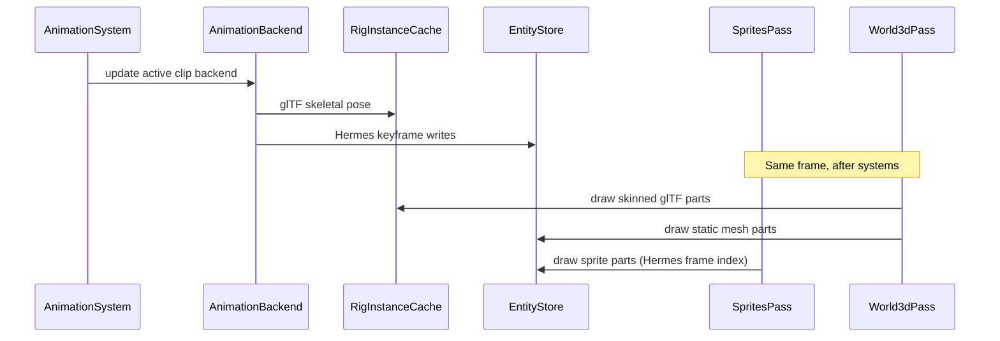

# Animations, Multi-Part Drawables, and Procedural Meshes Plan

> **For agentic workers:** REQUIRED SUB-SKILL: Use superpowers:subagent-driven-development (recommended) or superpowers:executing-plans to implement this plan task-by-task. Steps use checkbox (`- [ ]`) syntax for tracking.

> **Pre-release policy:** Nothing is shipped. Delete `Mesh` and `Sprite` components; replace with `Drawables`. Update every template, test scene, and doc in the same pass. No migration shims or deprecated aliases.

**Goal:** Replace single-mesh/single-sprite entities with **multi-part drawables**, two animation sources — **Hermes keyframe JSON** (2D/3D/props, no external tooling) and **glTF/GLB skeletal clips** (Blender/Maya/etc. exports) — plus optional **procedural mesh primitives** and **`AnimationService`**. Authors build animated games from config + assets alone; heavy projects override any step in Java or via SPI.

**Architecture:** `Drawables` holds static or **rigged** parts (`rig: gltf`). `AnimationController` maps logical names to **`AnimationClipRef`** (`hermes` path or `gltf` clip name). `AnimationSystem` delegates to exactly **two built-in backends** — `HermesTrackBackend` (ECS keyframes) and `GltfAnimationBackend` (skeletal `ModelInstance`) — registered in an **`AnimationBackendRegistry`** so future formats (Spine, atlas sequences, etc.) plug in without rewriting the system. glTF loading goes through `ResourceKind.GLTF_MODEL` on **`ResourceService`**; skinned instances live in core-only `RigInstanceCache`. API types stay libGDX-free.

**Platform policy:** Implement on **desktop first**, but **HTML (TeaVM) parity is a merge gate** — same animation JSON, same glTF assets (split `.gltf` where required), `:hermes-launcher-html:compileJava` green, and dogfood animation scene verified in browser before merge.

**Tech Stack:** Java 11, libGDX 1.14.0, **`com.github.mgsx-dev.gdx-gltf:gdx-gltf`**, TeaVM/`gdx-teavm` (HTML), existing ECS, JUnit 5, Gradle `:hermes-core:test`, `:hermes-launcher-html:compileJava`, `:dogfood-simulation` HTML export.

**Plan status:** **Not started** — `Mesh` and `Sprite` remain in `hermes-api`; no `Drawables`, `AnimationController`, or animation backends. Dogfood still uses `SpinMarker` / `BounceMarker` Java systems on `spin-cube`. Prerequisites below are **landed**.

---

## Current baseline (repo state)

| Area | Today | After this plan |
|------|-------|-----------------|
| 3D draw | One `Mesh` per entity → one `ModelInstance` via `ResourceService` (`ResourceKind.MODEL`) | `Drawables` with N mesh/primitive parts |
| 2D draw | One `Sprite` per entity → texture via `ResourceService` (`ResourceKind.TEXTURE`) | `Drawables` with N sprite parts + sprite sheets |
| Animation | Manual Java systems (`SpinMarker`, `BounceMarker`, template `PulseMarker`) | **Hermes JSON** + **glTF/GLB** clip names |
| Models | OBJ via `ModelResourceLoader` + `ResourceService` (no `ModelCache`) | OBJ + glTF/GLB + procedural primitives (new loaders on `ResourceService`) |
| Asset aliases | `resources/catalog.json` `@aliases` (e.g. `@cube`, `@logo` on spin-cube) | Same catalog; add `@hero-gltf`, animation clip aliases as needed |
| External formats | None | **v1:** Hermes JSON, glTF/GLB only — extensible registry for future backends |
| HTML animations | Static meshes/sprites compile on TeaVM; no animation system | **Required at merge:** Hermes clips + glTF (split `.gltf` assets) compile and run on TeaVM |
| 3D lighting | `BuiltinLightingSystem` + `default/lit` shader ([world lighting plan](2026-05-26-world-lighting.md) — **landed**) | Unchanged; lit animated mesh parts use entity `Material` |
| Material | One `Material` per entity (required for `Mesh`/`Sprite`) | Entity default + optional per-part override |
| Entity hierarchy | Flat entities only | Flat entities; **part locals** replace child entities for visuals |
| Validation | `Mesh`/`Sprite` require `Material` | `Drawables` requires `Material` (entity or all parts) |

Relevant existing types to reuse:

- `Transform` — entity root pose; animation tracks can target root or part locals
- `Material` / `MaterialUniform` — default shader; tracks can animate `uniforms.*`
- `EntityFactory` / entity templates — animated enemy as `entities/walker/type.json`
- `ComponentRegistration` SPI — custom animation drivers or track resolvers
- `WorldManager` — per-scene simulation root ([entity-types plan](2026-05-21-entity-types-and-world-manager.md) — **landed**)
- `ResourceService` / `ResourceAccess` / `ResourceKind` / `ResourceRef` — all asset loads ([central resource plan](2026-06-08-central-resource-management.md) — **landed** v1 sync path; extend with `GLTF_MODEL`, `SPRITE_SHEET`, `ANIMATION_CLIP`)
- `ModelResourceLoader` — extend for procedural generator JSON; do not reintroduce per-pass caches
- `SpritesPass` / `World3dPass` — already on `ResourceManagerImpl`; refactor to part iteration
- `SpriteDrawOrder` — sort entities; within entity, parts draw in list order
- `LightingRuntime` — compiled `Environment` for `default/lit` draws

---

## Design goals

| Goal | How |
|------|-----|
| **No-code games** | Entity templates + animation clip JSON + sprite sheets — walk cycles, spinning props, pulsing logos without Java |
| **Progressive complexity** | Tiers 0–4 (below): shorthand drawable → multi-part → clips → Java control → SPI/custom tracks |
| **Multi-mesh entities** | `Drawables.parts[]` with per-part `local` transform and optional material |
| **Generalized animation** | Track path grammar targets Transform, part locals, sprite frames, visibility, material uniforms |
| **Two animation sources** | Hermes JSON (everything) + glTF/GLB (skeletal 3D); one registry, two v1 backends |
| **HTML parity** | Same APIs and scene JSON on TeaVM; glTF assets authored for web (split format); CI merge gate |
| **Easy to extend** | `AnimationBackendRegistry` + `AnimationRegistration` SPI — add Spine/atlas/g3db later without API break |
| **Maintainable** | libGDX-free clip model in `hermes-api`; one `AnimationSystem`; rendering unchanged at pipeline level |
| **Performance** | Clip assets cached via `ResourceService`; runtime evaluation is O(tracks × keyframes) with small N; models/textures ref-counted in shared resource cache |

### Author complexity tiers

| Tier | Author writes | Engine does |
|------|---------------|-------------|
| **0 — Single drawable** | `"Drawables": { "sprite": "logo.png" }` or `{ "mesh": "models/cube.obj" }` | Expands to one default part; same as today's single mesh/sprite |
| **1 — Multi-part** | `Drawables.parts[]` with `id`, `kind`, `model`/`texture`, `local` | Composes root `Transform` × part `local` at draw time |
| **2 — Hermes clip** | `AnimationController` + `assets/animations/walk.json` | Keyframes on Transform, part locals, sprite frames, uniforms — **primary 2D path** |
| **2b — glTF clip** | Export `.glb`/`.gltf` from Blender; `{ "type": "gltf", "clip": "Walk" }` | Skeletal 3D; named clips from DCC export |
| **3 — Java control** | `engine.animation().play(entity.id(), "attack")` | Switch clips; query `finished()` / `clipTime()` |
| **4 — Custom / SPI** | `AnimationRegistration` new backend or track resolver | Future formats, procedural IK, gameplay tracks |

**Honest v1 limits:** Only **Hermes JSON** and **glTF/GLB** animation backends ship in tasks (no Spine, atlas-sequence, or g3db backends — add via registry later). No clip cross-fade. No JSON state machine graph. Colliders on entity root only. **HTML:** `.glb` with embedded buffers may fail on TeaVM (libGDX Pixmap limitation) — merge-gate assets use **split `.gltf` + `.bin` + PNG**; desktop may also use `.glb`. glTF skinning uses `DefaultShader`/`default/lit` path compatible with TeaVM custom-shader doctor rules (no PBR-only shaders in stock pipeline).

---

## Relationship to other plans

| Plan | Status | How this plan uses it |
|------|--------|------------------------|
| [Central resource management](2026-06-08-central-resource-management.md) | **Landed** (v1) | **Prerequisite.** Extend `ResourceKind` with `GLTF_MODEL`, `SPRITE_SHEET`, `ANIMATION_CLIP`; register loaders on `ResourceLoaderRegistry`. Passes already use `ResourceManagerImpl` — no private model/texture caches. |
| [Entity types](2026-05-21-entity-types-and-world-manager.md) | Landed | Animated templates under `assets/entities/<kind>/type.json`; `$ref` still v1 Transform-only |
| [Unified input](2026-05-21-unified-input-system.md) | Landed | Gameplay code switches clips on `justPressed("attack")` — tier 3 |
| [Unified runtime config](2026-05-24-unified-runtime-config-service.md) | Landed | Boot profiles unchanged; animation assets use same `HermesAssetPaths` / catalog aliases |
| [Custom UI service](2026-05-29-custom-ui-service.md) | Landed | Independent; Hermes clips can animate UI-adjacent entities (logo pulse) |
| [World lighting](2026-05-26-world-lighting.md) | **Landed** | Lit mesh parts use entity `Material` shader `default/lit`; glTF skinning must stay on same forward-lit path |
| [Audio](2026-05-22-audio-system.md) | **Landed** | Independent; sync SFX to clip `events` (v2 hook) |
| [Dogfood sample games](2026-06-08-dogfood-sample-games.md) | Not landed | v1 samples use static `Mesh`/`Sprite`; M4 adopts sprite-sheet walks after this plan lands |
| [Localization](2026-05-30-localization-i18n.md) | Not landed | Independent; animated UI text stays literal/`textKey` as today |
| [Physics & collisions](2026-05-30-physics-and-collisions.md) | Not landed | Collider on entity `Transform`; animated part offsets do not move colliders in v1 |
| [Debug mode](2026-05-30-debug-mode.md) | Not landed | v2: overlay rows `animation.activeClip`, `animation.clipTime`; uses `SimulationClock` scaled delta when landed |
| [Save/load](2026-05-22-save-load-sessions.md) | Not landed | v2: persist `AnimationController.currentClip` + `timeSeconds` |

**Prerequisites:** [Central resource management](2026-06-08-central-resource-management.md) v1 sync loaders + [world lighting](2026-05-26-world-lighting.md) `default/lit` — both **landed**.

**Recommended order:**

1. Execute **this plan** (drawables → resource loaders → Hermes clips → glTF backend → **HTML merge gate** → dogfood animation scene).
2. [Dogfood sample games](2026-06-08-dogfood-sample-games.md) M4 can migrate Pac-Man mouth / ghost wobble to Hermes sprite-sheet clips.
3. **Physics plan** can follow; hitboxes use root transform until v2 per-part colliders.

---

## Merge gate (required before merge)

This feature is **not done** until all checks pass:

| Check | Command / action | Expected |
|-------|------------------|----------|
| Unit + integration tests | `./gradlew test -q` | PASS |
| Desktop compile | `./gradlew :dogfood-simulation:compileJava -q` | PASS |
| **HTML compile** | `./gradlew :hermes-launcher-html:compileJava -q` | PASS — TeaVM must compile all animation + glTF code paths |
| **HTML export** | `./gradlew :hermes-launcher-html:buildRelease -q` (or template html export task) | Produces non-empty zip |
| **Browser smoke** | Open animation-starter scene in TeaVM dev server | Hermes pulse + glTF character animates; no WebGL/shader errors in console |
| Doctor | `./gradlew doctor` (or CLI) with `html { enabled = true }` | No new HTML shader violations from skinning path |

Implementation order: build and test **desktop paths first** (faster iteration), then **immediately** run HTML compile/export before marking any glTF task complete. Do not defer HTML to a follow-up PR.

---

## Architecture

### System context

```mermaid
flowchart TB
  subgraph author [Author assets]
    ET["entities/hero/type.json"]
    HAC["animations/walk.json — Hermes keyframes"]
    GLTF["models/hero.gltf + .bin + textures — or hero.glb on desktop"]
    PR["models/primitives/floor.json"]
  end

  subgraph api [hermes-api — no libGDX]
    DR[Drawables / DrawablePart]
    ACmp[AnimationController / AnimationClipRef]
    CL[AnimationClip — Hermes tracks]
    ACT[AnimationClipType — HERMES | GLTF]
    AS[AnimationService]
    AR[AnimationRegistration SPI]
    RS[ResourceService / ResourceKind]
  end

  subgraph core [hermes-core]
    BR[BuiltinComponents]
    REG[AnimationBackendRegistry]
    HB[HermesTrackBackend]
    GB[GltfAnimationBackend]
    RI[RigInstanceCache]
    LR[ResourceLoaderRegistry — GLTF_MODEL SPRITE_SHEET ANIMATION_CLIP]
    ANS[AnimationSystem]
    ASI[AnimationServiceImpl]
    W3[World3dPass — static + skinned]
    SP[SpritesPass — static parts]
  end

  subgraph platforms [Platforms — same scene JSON]
    DESK[Desktop LWJGL3 — GLB or glTF]
    HTML[HTML TeaVM — split glTF + Hermes]
  end

  ET --> BR
  HAC --> LR
  GLTF --> LR --> GB
  ACmp --> ANS
  ANS --> REG
  REG --> HB
  REG --> GB
  GB --> RI
  HB --> DR
  RI --> W3
  DR --> SP
  DR --> W3
  AS --> ASI --> ANS
  AR --> REG
  W3 --> RS
  SP --> RS
  LR --> RS
  core --> DESK
  core --> HTML
```

### Core concepts

#### Entity pose vs part pose

| Layer | Component | Role |
|-------|-----------|------|
| Root | `Transform` | Entity position in WORLD space (physics, picking, audio follow) |
| Part | `DrawablePart.local` (`LocalTransform`) | Offset from root — weapon bob, wheel spin, sprite body vs shadow |
| Composed | *(runtime)* | `worldPart = rootTransform × localTransform` — used only at draw time |

No parent/child entity graph in v1. Multiple visual pieces on one logical entity use `Drawables.parts`. Cross-entity attachment (weapon held by hand bone) is v2 (skeletal or attach component).

#### Drawables replace Mesh and Sprite

**Delete:**

- `dev.hermes.api.ecs.Mesh`
- `dev.hermes.api.ecs.Sprite`

**Add:**

- `dev.hermes.api.ecs.Drawables` — component holding `List<DrawablePart> parts()`
- `dev.hermes.api.ecs.DrawablePart` — immutable config + mutable runtime fields (`local`, `spriteFrame`, `visible`)
- `dev.hermes.api.ecs.LocalTransform` — x/y/z, rotations, scales, `visible`, `spriteFrame`
- `dev.hermes.api.ecs.DrawableKind` — `MESH`, `SPRITE` (static draw)
- `dev.hermes.api.ecs.DrawableRig` — optional; v1 value **`GLTF`** only (null = static part)
- `dev.hermes.api.ecs.SpriteSheet` — manual grid for sprite parts (`columns`, `rows`, `frameWidth`, `frameHeight`); animate frames via **Hermes** `parts.<id>.frame` tracks

Shorthand JSON (tier 0) normalizes to a single part with `id: "default"` during deserialize.

#### Animation sources (v1: two backends)

| Source | `type` | Use for | Author workflow |
|--------|--------|---------|-----------------|
| **Hermes JSON** | `hermes` (default) | 2D sprite cycles, prop motion, UI pulse, material tweens, multi-part offsets | Write or generate `assets/animations/*.json` |
| **glTF / GLB** | `gltf` | Skeletal/skinned **3D** characters and props | Export from Blender/Maya/Mixamo → drop under `assets/models/` |

Future backends (Spine, LibGDX atlas sequences, g3db) register on the same **`AnimationBackendRegistry`** via SPI — not in v1 task list.

**Not supported at runtime:** raw `.fbx`, `.dae`, `.blend`. Export to glTF or animate with Hermes JSON.

##### glTF / GLB (3D skeletal)

```json
"Drawables": {
  "parts": [
    {
      "id": "body",
      "kind": "mesh",
      "model": "models/hero.gltf",
      "rig": "gltf"
    }
  ]
},
"AnimationController": {
  "rigPart": "body",
  "clips": {
    "idle": { "type": "gltf", "clip": "Idle" },
    "walk": { "type": "gltf", "clip": "Walk" },
    "attack": { "type": "gltf", "clip": "Attack", "loop": false }
  },
  "default": "idle"
}
```

**Blender export:** File → Export → glTF 2.0. Enable **Animation**; each action/NLA strip becomes a named clip. Use **`hero.glb`** on desktop/Android for convenience, or **split `.gltf` + `.bin` + PNG textures** for cross-platform (required for HTML — see below).

**Desktop `.glb` shorthand:** `"model": "models/hero.glb"` works on LWJGL3/Android. For projects targeting HTML, prefer split `.gltf` in shared assets so one scene JSON works everywhere.

##### Hermes JSON (2D and 3D procedural)

Primary **no-code 2D** path: sprite sheet PNG + grid metadata + Hermes clip animating `parts.body.frame`:

```json
"Drawables": {
  "parts": [{
    "id": "body",
    "kind": "sprite",
    "texture": "sprites/hero-sheet.png",
    "sheet": { "columns": 4, "rows": 1, "frameWidth": 32, "frameHeight": 48 }
  }]
},
"AnimationController": {
  "clips": { "walk": "animations/hero-walk.json" },
  "default": "walk"
}
```

`animations/hero-walk.json` contains a `parts.body.frame` step track (see [Hermes keyframe clips](#hermes-keyframe-clips-hand-authored-json)). Export the PNG from Aseprite/Photoshop; frame indices are authored in JSON (future Hermes tooling may generate clips from sheet metadata).

##### Platform notes: glTF on HTML (TeaVM)

| Topic | Desktop / Android | HTML (TeaVM) |
|-------|-------------------|--------------|
| Hermes JSON clips | Yes | Yes — pure Java, no platform deps |
| `.glb` single file | Yes | **Avoid** — embedded buffers hit libGDX Pixmap/TeaVM limits |
| Split `.gltf` + `.bin` + PNG | Yes | **Yes — merge-gate format** |
| Skinning shader | `default/lit` + gdx-gltf `DefaultShaderProvider` | Same — must pass `HermesDoctor` html-custom-shaders check |
| WebGL | 3.x / ES 3.0 | WebGL 2.0 preferred (project baseline) |

**Implementation requirements for HTML:**

1. `GltfModelResourceLoader` (`ResourceKind.GLTF_MODEL`) loads via `Gdx.files.internal` — no `Pixmap` from embedded GLB buffers on TeaVM.
2. Dogfood + test assets ship as **split glTF** under `assets/models/hero.gltf` (+ `hero.bin`, textures).
3. `hermes-launcher-html` depends on `gdx-gltf` (and any TeaVM reflection config it needs).
4. Skinned draw path uses the same `DefaultShader`/`default/lit` route as static meshes — **not** stock gdx-gltf PBR shader in v1 (PBR breaks HTML doctor rules and is optional complexity).

##### AnimationClipRef (API + JSON)

Each entry in `AnimationController.clips` is a **string** (Hermes path) or **object**:

```json
"walk": "animations/hero-walk.json",
"run": { "type": "gltf", "clip": "Run", "loop": true, "speed": 1.2 }
```

| Field | Default | Description |
|-------|---------|-------------|
| `type` | `hermes` for string paths; else `gltf` | v1: `hermes` \| `gltf` only |
| `path` | — | Hermes clip JSON path (when `type` is `hermes`) |
| `clip` | — | glTF animation name (when `type` is `gltf`) |
| `loop` | `true` | Override loop for this logical clip |
| `speed` | controller `speed` | Per-clip multiplier |

```java
// hermes-api
public enum AnimationClipType { HERMES, GLTF }

public final class AnimationClipRef {
    AnimationClipType type();
    String path();       // hermes JSON; null for gltf
    String clipName();   // glTF animation name; null for hermes
    boolean loop();
    float speed();
}
```

##### AnimationBackend registry (extensibility)

```java
// hermes-core — internal
public interface AnimationBackend {
    AnimationClipType type();
    void bind(EntityId id, DrawablePart rigPart, EntityStore entities, ResourceAccess resources);
    void update(EntityId id, AnimationController ctrl, AnimationClipRef clip,
                float deltaSeconds, EntityStore entities, ResourceAccess resources);
    void unbind(EntityId id);
    boolean isFinished(EntityId id, AnimationClipRef clip);
}

public final class AnimationBackendRegistry {
    void register(AnimationBackend backend);
    AnimationBackend require(AnimationClipType type);
}
```

**v1 registrations:** `HermesTrackBackend`, `GltfAnimationBackend`.

**Future (SPI, not v1 tasks):** `AtlasSequenceBackend`, `SpineAnimationBackend`, `G3dbAnimationBackend` — games implement `AnimationRegistration` and call `registrar.backend(new MyBackend())`.

`AnimationSystem` flow:

1. Read `ctrl.activeRef()`.
2. `registry.require(ref.type()).update(...)`.
3. Hermes backend mutates `Transform` / `Drawables` / `Material`.
4. glTF backend mutates `RigInstanceCache` entry; `World3dPass` draws skinned mesh.

**v1 playback rule:** One active clip, one backend per frame. Switch clips with `AnimationService.play` or scene `default`. To combine glTF body + Hermes shadow bob, use **two entities** (character + shadow decal) or switch clips — composite dual-backend playback is v2.

#### Hermes keyframe clips (hand-authored JSON)

Clips live at `assets/animations/<name>.json` (any path; referenced by controller).

```json
{
  "version": 1,
  "duration": 0.8,
  "loop": true,
  "tracks": [
    {
      "target": "parts.body.local.rotationZ",
      "interpolation": "linear",
      "keyframes": [
        { "t": 0.0, "v": -10 },
        { "t": 0.4, "v": 10 },
        { "t": 0.8, "v": -10 }
      ]
    },
    {
      "target": "parts.shadow.local.y",
      "interpolation": "linear",
      "keyframes": [
        { "t": 0.0, "v": -0.05 },
        { "t": 0.4, "v": 0.05 },
        { "t": 0.8, "v": -0.05 }
      ]
    },
    {
      "target": "parts.hero.frame",
      "interpolation": "step",
      "keyframes": [
        { "t": 0.0, "v": 0 },
        { "t": 0.2, "v": 1 },
        { "t": 0.4, "v": 2 },
        { "t": 0.6, "v": 3 }
      ]
    },
    {
      "target": "Transform.scaleX",
      "interpolation": "linear",
      "keyframes": [
        { "t": 0.0, "v": 1.0 },
        { "t": 0.5, "v": 1.15 },
        { "t": 1.0, "v": 1.0 }
      ]
    },
    {
      "target": "Material.uniforms.u_glow",
      "interpolation": "linear",
      "keyframes": [
        { "t": 0.0, "v": [0, 0, 0, 1] },
        { "t": 0.5, "v": [1, 0.5, 0, 1] },
        { "t": 1.0, "v": [0, 0, 0, 1] }
      ]
    }
  ]
}
```

**Track target grammar (v1):**

| Target pattern | Writes to |
|----------------|-----------|
| `Transform.x` … `Transform.scaleZ` | Entity root `Transform` |
| `parts.<id>.local.x` … `parts.<id>.local.scaleZ` | Part `LocalTransform` |
| `parts.<id>.frame` | Part `spriteFrame` (int) |
| `parts.<id>.visible` | Part visibility (bool; keyframe `v` 0/1) |
| `Material.uniforms.<name>` | Entity `Material` uniform (float[]; length must match existing uniform) |

Unknown part id or path → `SceneParseException` at clip load (fail fast).

**Interpolation:** `step` (hold previous) or `linear` (numeric lerp; arrays lerp per element). Rotations use linear degrees (no quaternion slerp in v1 — sufficient for props and 2D).

#### AnimationController (component)

```json
"AnimationController": {
  "rigPart": "body",
  "clips": {
    "idle": "animations/hero-idle.json",
    "walk": "animations/hero-walk.json",
    "run": { "type": "gltf", "clip": "Run" }
  },
  "default": "idle",
  "speed": 1.0,
  "autoPlay": true
}
```

| Field | Default | Description |
|-------|---------|-------------|
| `clips` | required map | Logical name → Hermes path string **or** `AnimationClipRef` object |
| `rigPart` | — | Part id with `"rig": "gltf"`; required when any clip has `"type": "gltf"` |
| `default` | first clip key | Plays on spawn when `autoPlay` true |
| `speed` | `1.0` | Global playback multiplier (per-clip `speed` stacks) |
| `autoPlay` | `true` | Start `default` clip at entity creation |

Runtime fields (Java, not JSON): `currentClip`, `activeRef` (`AnimationClipRef`), `timeSeconds`, `playing`, `finished`.

#### AnimationService (HermesEngine)

```java
// hermes-api
public interface AnimationService {
    void play(EntityId entityId, String clipName);
    void play(EntityId entityId, String clipName, boolean restart);
    void stop(EntityId entityId);
    void setSpeed(EntityId entityId, float speed);
    String currentClip(EntityId entityId);
    float timeSeconds(EntityId entityId);
    boolean isPlaying(EntityId entityId);
    boolean isFinished(EntityId entityId);
}
```

Add `AnimationService animation()` to `HermesEngine`. Implementation in `hermes-core` reads/writes `AnimationController` on the active scene's `EntityStore`.

#### Procedural meshes (mesh generator)

Two equivalent authoring paths:

**Inline on part:**

```json
{
  "id": "floor",
  "kind": "mesh",
  "primitive": "box",
  "size": [20, 0.2, 20],
  "material": { "shader": "default/lit" }
}
```

**Standalone generator asset** (reusable):

`assets/models/primitives/floor.json`:

```json
{
  "version": 1,
  "generator": "box",
  "width": 20,
  "height": 0.2,
  "depth": 20
}
```

Referenced as `"model": "models/primitives/floor.json"` on a mesh part (loader detects `"generator"` key).

**v1 generators:** `box`, `plane`, `sphere`. Parameters:

| Generator | Parameters | Default |
|-----------|------------|---------|
| `box` | `width`, `height`, `depth` | `1` each |
| `plane` | `width`, `height` | `1` each (XZ plane, Y-up) |
| `sphere` | `radius`, `segments` | `0.5`, `16` |

Implementation: `PrimitiveModelGenerator` in core uses `ModelBuilder`; procedural JSON and inline primitives route through `ModelResourceLoader` (extend decode/upload) with cache key = generator content hash in `ResourceService`.

### Rendering pipeline changes



- **Rigged draw:** When `part.rig() != null`, pass delegates to `RigInstanceCache.draw(part, rootTransform, material)` instead of static model/sprite path.
- **Sort order:** Entities sorted as today (`SpriteDrawOrder` / mesh list). Parts draw in array order (author controls layering via part order and `local.z`).
- **Material resolution:** Per-part `material` override if present; else entity-level `Material`.
- **Visibility:** Skip parts with `local.visible == false`.
- **Cameras:** Unchanged — entities with `Camera` still excluded from draw lists.

### System order

Register in `BuiltinComponents.registerSystems()`:

| Order | System | Scope |
|-------|--------|-------|
| 5 | `AnimationSystem` | ACTIVE_SCENE |

Runs before physics motor (10) and before render. Uses `deltaSeconds` from `WorldManager` update (when debug mode lands, use scaled delta from `SimulationClock` the same way as physics plan).

When clip not playing (`playing == false`), system skips entity.

### SPI extension

```java
// hermes-api
public interface AnimationRegistration {
    void register(HermesEngine engine, AnimationRegistrar registrar);
}

public interface AnimationRegistrar {
    void trackResolver(AnimationTrackResolver resolver);
    void backend(AnimationBackend backend);  // core impls register at startup; SPI for custom formats
}

public interface AnimationTrackResolver {
    /** Return true if resolver handled target; false to fall through to built-in grammar. */
    boolean apply(
            String target,
            float value,
            float[] valueArray,
            EntityId entityId,
            EntityStore entities);
}
```

Loaded via `ServiceLoader` in `HermesEngineImpl` (same pattern as `ComponentRegistration`, `PhysicsRegistration`).

### v2 extension hooks (document only — not in task list)

| Feature | Hook |
|---------|------|
| Clip cross-fade | `AnimationController` blend weight + two active clips |
| JSON state machine | `transitions` table + input events |
| Composite playback | Hermes + glTF on same entity (dual backend) |
| **Atlas / Spine / g3db backends** | Register via `AnimationRegistration` — same registry interface |
| Per-part colliders | Physics plan extension |
| Debug overlay | `AnimationDebugRegistration` rows |

---

## File structure

### New — hermes-api

| File | Responsibility |
|------|----------------|
| `dev/hermes/api/ecs/Drawables.java` | Multi-part drawable component |
| `dev/hermes/api/ecs/DrawablePart.java` | Single part config + runtime fields |
| `dev/hermes/api/ecs/DrawableKind.java` | `MESH`, `SPRITE` |
| `dev/hermes/api/ecs/DrawableRig.java` | v1: `GLTF` only |
| `dev/hermes/api/ecs/LocalTransform.java` | Part-local pose + visibility + frame |
| `dev/hermes/api/ecs/SpriteSheet.java` | Sheet layout metadata |
| `dev/hermes/api/ecs/PartMaterial.java` | Optional per-part shader/uniforms |
| `dev/hermes/api/ecs/AnimationController.java` | Clip map + runtime playback state |
| `dev/hermes/api/animation/AnimationClipType.java` | `HERMES`, `GLTF` |
| `dev/hermes/api/animation/AnimationClipRef.java` | Typed clip reference (path or imported name) |
| `dev/hermes/api/animation/AnimationClip.java` | Parsed Hermes clip (duration, loop, tracks) |
| `dev/hermes/api/animation/AnimationTrack.java` | Target path + keyframes |
| `dev/hermes/api/animation/Keyframe.java` | `t`, numeric `v`, optional `vArray` |
| `dev/hermes/api/animation/Interpolation.java` | `STEP`, `LINEAR` |
| `dev/hermes/api/animation/AnimationService.java` | Engine-facing playback API |
| `dev/hermes/api/animation/AnimationRegistration.java` | SPI |
| `dev/hermes/api/animation/AnimationRegistrar.java` | SPI registrar |
| `dev/hermes/api/animation/AnimationTrackResolver.java` | SPI custom targets |

**Modify:**

| File | Change |
|------|--------|
| `dev/hermes/api/resource/ResourceKind.java` | Add `GLTF_MODEL`, `SPRITE_SHEET`, `ANIMATION_CLIP` |
| `dev/hermes/api/ecs/HermesEngine.java` | Add `animation()` |
| `dev/hermes/api/ecs/EntityStore.java` | No change (queries use `Drawables.class`) |

**Delete:**

| File |
|------|
| `dev/hermes/api/ecs/Mesh.java` |
| `dev/hermes/api/ecs/Sprite.java` |

### New — hermes-core

| File | Responsibility |
|------|----------------|
| `dev/hermes/core/animation/AnimationClipLoader.java` | Parse Hermes clip JSON → `AnimationClip` (used by resource loader) |
| `dev/hermes/core/animation/AnimationBackend.java` | Internal backend interface |
| `dev/hermes/core/animation/AnimationBackendRegistry.java` | type → backend |
| `dev/hermes/core/animation/HermesTrackBackend.java` | Keyframe track playback |
| `dev/hermes/core/animation/GltfAnimationBackend.java` | glTF/GLB skeletal via gdx-gltf |
| `dev/hermes/core/animation/RigInstanceCache.java` | Per-entity skinned ModelInstance |
| `dev/hermes/core/resource/loaders/GltfModelResourceLoader.java` | `ResourceKind.GLTF_MODEL` — split glTF + optional `.glb` on desktop |
| `dev/hermes/core/resource/loaders/AnimationClipResourceLoader.java` | `ResourceKind.ANIMATION_CLIP` — Hermes clip JSON |
| `dev/hermes/core/resource/loaders/SpriteSheetResourceLoader.java` | `ResourceKind.SPRITE_SHEET` — grid regions from texture |
| `dev/hermes/core/animation/AnimationTrackEvaluator.java` | Sample keyframes at time t |
| `dev/hermes/core/animation/AnimationTargetApplier.java` | Apply sampled values to ECS components |
| `dev/hermes/core/animation/AnimationSystem.java` | Per-frame update |
| `dev/hermes/core/animation/AnimationServiceImpl.java` | `AnimationService` |
| `dev/hermes/core/render/TransformComposer.java` | Root × local → libGDX matrix |
| `dev/hermes/core/render/resource/PrimitiveModelGenerator.java` | box/plane/sphere |
| `dev/hermes/core/render/resource/PrimitiveModelDocument.java` | Parse generator JSON |

**Modify:**

| File | Change |
|------|--------|
| `dev/hermes/core/ecs/BuiltinComponents.java` | Remove Mesh/Sprite; register Drawables + AnimationController |
| `dev/hermes/core/ecs/EntityFactory.java` | Validate `Drawables` + `Material` |
| `dev/hermes/core/render/pass/World3dPass.java` | Static + skinned parts via `RigInstanceCache`; load models via `ResourceAccess` |
| `dev/hermes/core/render/pass/SpritesPass.java` | Multi-part sprites; Hermes `spriteFrame`; load textures/sheets via `ResourceAccess` |
| `dev/hermes/core/resource/loaders/ModelResourceLoader.java` | Extend for procedural generator JSON |
| `dev/hermes/core/resource/ResourceLoaderRegistry.java` | Register GLTF / clip / sheet loaders at engine startup |
| `hermes-core/build.gradle` | Add `gdx-gltf` |
| `hermes-launcher-html/build.gradle` | TeaVM compiles animation + glTF stack |
| `hermes-gradle-plugin/.../launcher/html.gradle` | `gdx-gltf` on HTML classpath |
| `dev/hermes/core/ecs/HermesEngineImpl.java` | Wire `AnimationServiceImpl`, load SPI |
| `dogfood-simulation/.../WaterPass.java` | Query `Drawables` instead of `Mesh` |
| All test fixtures, templates, scene JSON | Replace Mesh/Sprite with Drawables shorthand |

### Dogfood + docs

| File | Change |
|------|--------|
| `dogfood-simulation/.../entities/spin-cube/type.json` | `Drawables` with `@cube`/`@logo` catalog refs; optional Hermes clip replacing `BounceMarker` |
| `dogfood-simulation/.../entities/walker/type.json` | **New** — Hermes sprite-sheet walk (2D) |
| `dogfood-simulation/.../animations/hero-walk.json` | **New** — frame track for walker |
| `dogfood-simulation/.../animations/logo-pulse.json` | **New** — Hermes scale pulse (replaces `PulseMarker`) |
| `dogfood-simulation/.../scenes/animation-starter.json` | **New** — walker + logo + glTF character |
| `dogfood-simulation/.../entities/gltf-character/type.json` | **New** — split glTF rigged character |
| `dogfood-simulation/.../models/hero.gltf` | **New** — + `hero.bin`, textures (HTML merge-gate asset) |
| `hermes-templates/minimal/.../entities/logo/type.json` | Drawables shorthand |
| `hermes-templates/2d/.../scenes/main.json` | Drawables + optional Hermes pulse clip |
| `docs/animations.md` | **New** — Hermes + glTF workflows, HTML asset rules, tiers |
| `docs/scene-format-v1.md` | Drawables + AnimationController tables; remove Mesh/Sprite |
| `docs/entity-types.md` | Update examples |
| `docs/ARCHITECTURE.md` | Animation + drawables section |

---

## Config formats (author reference)

### Drawables shorthand (tier 0)

```json
"Drawables": { "sprite": "hermes-logo.png" }
```

```json
"Drawables": { "mesh": "models/cube.obj", "texture": "brick.png" }
```

Expands internally to one part `id: "default"`.

### Multi-part entity (tier 1)

```json
{
  "id": "character",
  "type": "walker",
  "components": {
    "Transform": { "x": 0, "y": 0 },
    "Drawables": {
      "parts": [
        {
          "id": "body",
          "kind": "sprite",
          "texture": "sprites/hero-sheet.png",
          "sheet": { "columns": 4, "rows": 1, "frameWidth": 32, "frameHeight": 48 },
          "local": { "y": 0 }
        },
        {
          "id": "shadow",
          "kind": "sprite",
          "texture": "sprites/shadow.png",
          "local": { "y": -0.1, "scaleX": 1.2, "scaleY": 0.4 }
        }
      ]
    },
    "Material": { "shader": "default/unlit" },
    "AnimationController": {
      "clips": { "walk": "animations/hero-walk.json" },
      "default": "walk"
    }
  }
}
```

### Entity template `entities/walker/type.json`

```json
{
  "version": 1,
  "components": {
    "Drawables": {
      "parts": [
        {
          "id": "body",
          "kind": "sprite",
          "texture": "sprites/hero-sheet.png",
          "sheet": { "columns": 4, "rows": 1, "frameWidth": 32, "frameHeight": 48 }
        }
      ]
    },
    "Material": { "shader": "default/unlit" },
    "AnimationController": {
      "clips": {
        "idle": "animations/hero-idle.json",
        "walk": "animations/hero-walk.json"
      },
      "default": "idle"
    },
    "FootstepEmitter": {
      "clips": ["footstep"],
      "clipIsId": true,
      "minSpeed": 1.0
    }
  }
}
```

Scene instance:

```json
{ "type": "walker", "id": "player", "components": { "Transform": { "x": 100, "y": 50 } } }
```

### 3D multi-mesh prop

```json
"Drawables": {
  "parts": [
    { "id": "base", "kind": "mesh", "model": "models/turret-base.obj" },
    { "id": "barrel", "kind": "mesh", "model": "models/turret-barrel.obj", "local": { "y": 0.5 } }
  ]
},
"Material": { "shader": "default/lit" },
"AnimationController": {
  "clips": { "scan": "animations/turret-scan.json" },
  "default": "scan"
}
```

Clip rotates `parts.barrel.local.rotationY` only.

### Procedural floor (tier 1 + generator)

```json
"Drawables": {
  "parts": [
    {
      "id": "floor",
      "kind": "mesh",
      "primitive": "box",
      "size": [40, 0.2, 40]
    }
  ]
},
"Material": { "shader": "default/lit" }
```

### 3D glTF character (imported from Blender)

```json
{
  "type": "gltf-character",
  "id": "player",
  "components": {
    "Transform": { "x": 0, "y": 0, "z": 0 },
    "Drawables": {
      "parts": [{ "id": "body", "kind": "mesh", "model": "models/hero.gltf", "rig": "gltf" }]
    },
    "Material": { "shader": "default/lit" },
    "AnimationController": {
      "rigPart": "body",
      "clips": {
        "idle": { "type": "gltf", "clip": "Idle" },
        "walk": { "type": "gltf", "clip": "Walk" }
      },
      "default": "idle"
    }
  }
}
```

### Java tier 3 — switch clip on input

```java
@Override
public void update(WorldManager manager, float deltaSeconds) {
    EntityStore entities = manager.entities();
    InputActions actions = engine.input().actions();
    for (Entity e : entities.entitiesWith(AnimationController.class)) {
        if (actions.justPressed("attack")) {
            engine.animation().play(e.id(), "attack");
        } else if (actions.axis("move_x") != 0f) {
            if (!"walk".equals(engine.animation().currentClip(e.id()))) {
                engine.animation().play(e.id(), "walk");
            }
        } else if (engine.animation().isFinished(e.id())) {
            engine.animation().play(e.id(), "idle");
        }
    }
}
```

Register system in `onCreate` or scene definition `systems`.

---

## How user projects consume this

### Config-only simulation (no Java)

**Hermes keyframe clips (2D and props):**

1. Add sprite sheet PNG under `assets/sprites/`.
2. Add clip JSON under `assets/animations/` (frame tracks, transforms, etc.).
3. Define `assets/entities/my-character/type.json` with `Drawables`, `AnimationController`, `Material`.
4. Place instances in scene JSON with `"type": "my-character"`.
5. Run — works on **desktop and HTML** identically.

**glTF skeletal (3D characters):**

| Step | Action |
|------|--------|
| Export | Blender → glTF 2.0; enable Animation; use **split `.gltf`** for HTML projects |
| Assets | `assets/models/hero.gltf`, `hero.bin`, textures (or `.glb` desktop-only) |
| Entity | `"rig": "gltf"` on mesh part; clips `{ "type": "gltf", "clip": "Walk" }` |
| Verify HTML | `./gradlew :hermes-launcher-html:compileJava` + browser smoke before merge |

Clip names match Blender action / glTF animation names. Template holds clip map; scene instances override `Transform` only.

Same patterns for multi-part OBJ props, procedural floors, or rigged glTF heroes.

### Template projects

| Template | Change |
|----------|--------|
| `minimal` | Logo entity uses `Drawables` shorthand |
| `2d` | Optional `animations/logo-pulse.json` instead of `PulseMarker` (keep `PulseMarker` as tier-4 Java example or remove) |
| `multi-scene` | Update spin-cube entity type |
| `dogfood-simulation` | Migrate `spin-cube` (`@cube`/`@logo`); add `animation-starter` scene; retire `SpinMarker`/`BounceMarker` when clips cover motion |

### Heavy / custom games

- Implement `AnimationTrackResolver` for gameplay-specific targets (e.g. `stats.healthRatio` → uniform).
- Replace `AnimationSystem` entirely via custom `System` at same scope if needed (document: disable built-in by not registering — or register custom system with higher priority that sets `playing=false` on controller).
- Procedural mesh parts: generate paths in Java and assign to `DrawablePart` at runtime via mutable API on `Drawables`.

---

## Implementation tasks

### Task 1: Drawables API types

**Files:**
- Create: `hermes-api/src/main/java/dev/hermes/api/ecs/DrawableKind.java`
- Create: `hermes-api/src/main/java/dev/hermes/api/ecs/LocalTransform.java`
- Create: `hermes-api/src/main/java/dev/hermes/api/ecs/SpriteSheet.java`
- Create: `hermes-api/src/main/java/dev/hermes/api/ecs/PartMaterial.java`
- Create: `hermes-api/src/main/java/dev/hermes/api/ecs/DrawablePart.java`
- Create: `hermes-api/src/main/java/dev/hermes/api/ecs/Drawables.java`
- Test: `hermes-api/src/test/java/dev/hermes/api/ecs/DrawablesTest.java`

- [ ] **Step 1: Write the failing test**

```java
package dev.hermes.api.ecs;

import org.junit.jupiter.api.Test;

import static org.junit.jupiter.api.Assertions.*;

final class DrawablesTest {

    @Test
    void defaultPart_hasVisibleLocalTransform() {
        DrawablePart part = DrawablePart.mesh("body", "models/cube.obj");
        assertEquals(DrawableKind.MESH, part.kind());
        assertEquals("body", part.id());
        assertTrue(part.local().visible());
        assertEquals(0, part.local().spriteFrame());
    }

    @Test
    void drawables_shorthandMesh() {
        Drawables d = Drawables.singleMesh("models/cube.obj");
        assertEquals(1, d.parts().size());
        assertEquals("default", d.parts().get(0).id());
    }
}
```

- [ ] **Step 2: Run test to verify it fails**

Run: `./gradlew :hermes-api:test --tests dev.hermes.api.ecs.DrawablesTest -q`
Expected: FAIL — classes not found

- [ ] **Step 3: Write minimal implementation**

```java
// DrawableKind.java
package dev.hermes.api.ecs;

public enum DrawableKind { MESH, SPRITE }

// LocalTransform.java — mutable fields with getters/setters for x,y,z, rotationX/Y/Z, scaleX/Y/Z, visible, spriteFrame

// SpriteSheet.java — columns, rows, frameWidth, frameHeight (ints, defaults 1)

// PartMaterial.java — optional shader String + Map<String, MaterialUniform>

// DrawablePart.java — factory methods mesh(id, model), sprite(id, texture); fields: kind, id, model, texture, primitive, size[], local, sheet, partMaterial

// Drawables.java
public final class Drawables implements Component {
    private final List<DrawablePart> parts;
    public static Drawables singleMesh(String model) {
        return new Drawables(List.of(DrawablePart.mesh("default", model)));
    }
    public static Drawables singleSprite(String texture) {
        return new Drawables(List.of(DrawablePart.sprite("default", texture)));
    }
    public List<DrawablePart> parts() { return parts; }
}
```

- [ ] **Step 4: Run test to verify it passes**

Run: `./gradlew :hermes-api:test --tests dev.hermes.api.ecs.DrawablesTest -q`
Expected: PASS

- [ ] **Step 5: Commit**

```bash
git add hermes-api/src/main/java/dev/hermes/api/ecs/Drawable*.java hermes-api/src/main/java/dev/hermes/api/ecs/LocalTransform.java hermes-api/src/main/java/dev/hermes/api/ecs/SpriteSheet.java hermes-api/src/main/java/dev/hermes/api/ecs/PartMaterial.java hermes-api/src/test/java/dev/hermes/api/ecs/DrawablesTest.java
git commit -m "feat: add Drawables API for multi-part entities"
```

---

### Task 2: Drawables JSON deserializer + remove Mesh/Sprite

**Files:**
- Modify: `hermes-core/src/main/java/dev/hermes/core/ecs/BuiltinComponents.java`
- Modify: `hermes-core/src/main/java/dev/hermes/core/ecs/EntityFactory.java`
- Delete: `hermes-api/src/main/java/dev/hermes/api/ecs/Mesh.java`
- Delete: `hermes-api/src/main/java/dev/hermes/api/ecs/Sprite.java`
- Test: `hermes-core/src/test/java/dev/hermes/core/ecs/DrawablesDeserializerTest.java`

- [ ] **Step 1: Write the failing test**

```java
package dev.hermes.core.ecs;

import dev.hermes.api.ecs.Drawables;
import dev.hermes.api.ecs.DrawableKind;
import org.junit.jupiter.api.Test;

import static org.junit.jupiter.api.Assertions.*;

final class DrawablesDeserializerTest {

    @Test
    void shorthandSprite() {
        ComponentRegistryImpl registry = new ComponentRegistryImpl();
        BuiltinComponents.register(registry);
        Drawables d = (Drawables) registry.deserialize("Drawables",
                JsonComponentData.parse("{\"sprite\":\"logo.png\"}"), ComponentContext.EMPTY);
        assertEquals(1, d.parts().size());
        assertEquals(DrawableKind.SPRITE, d.parts().get(0).kind());
        assertEquals("logo.png", d.parts().get(0).texture());
    }

    @Test
    void multiPartMesh() {
        ComponentRegistryImpl registry = new ComponentRegistryImpl();
        BuiltinComponents.register(registry);
        String json = "{\"parts\":[{\"id\":\"a\",\"kind\":\"mesh\",\"model\":\"models/cube.obj\"}]}";
        Drawables d = (Drawables) registry.deserialize("Drawables", JsonComponentData.parse(json), ComponentContext.EMPTY);
        assertEquals("a", d.parts().get(0).id());
    }
}
```

- [ ] **Step 2: Run test to verify it fails**

Run: `./gradlew :hermes-core:test --tests dev.hermes.core.ecs.DrawablesDeserializerTest -q`
Expected: FAIL

- [ ] **Step 3: Implement deserializer**

In `BuiltinComponents`:
- Remove `MESH`, `SPRITE` constants and registrations.
- Add `DRAWABLES = "Drawables"`.
- Parse shorthand `{ "sprite": "..." }`, `{ "mesh": "...", "texture": "..." }`.
- Parse `parts[]` with `id`, `kind`, `model`, `texture`, `primitive`, `size`, `local`, `sheet`, `material`.
- Default `kind` from presence of `model`/`primitive` → mesh, `texture` → sprite.

In `EntityFactory.validateDrawableMaterial`:
- Check `Drawables` instead of Mesh/Sprite.

- [ ] **Step 4: Run test to verify it passes**

Run: `./gradlew :hermes-core:test --tests dev.hermes.core.ecs.DrawablesDeserializerTest -q`
Expected: PASS

- [ ] **Step 5: Commit**

```bash
git add hermes-core/src/main/java/dev/hermes/core/ecs/BuiltinComponents.java hermes-core/src/main/java/dev/hermes/core/ecs/EntityFactory.java hermes-api/src/main/java/dev/hermes/api/ecs/Drawables.java hermes-core/src/test/java/dev/hermes/core/ecs/DrawablesDeserializerTest.java
git rm hermes-api/src/main/java/dev/hermes/api/ecs/Mesh.java hermes-api/src/main/java/dev/hermes/api/ecs/Sprite.java
git commit -m "feat: deserialize Drawables; remove Mesh and Sprite components"
```

---

### Task 3: TransformComposer

**Files:**
- Create: `hermes-core/src/main/java/dev/hermes/core/render/TransformComposer.java`
- Test: `hermes-core/src/test/java/dev/hermes/core/render/TransformComposerTest.java`

- [ ] **Step 1: Write the failing test**

```java
package dev.hermes.core.render;

import com.badlogic.gdx.math.Matrix4;
import dev.hermes.api.ecs.LocalTransform;
import dev.hermes.api.ecs.Transform;
import org.junit.jupiter.api.Test;

import static org.junit.jupiter.api.Assertions.*;

final class TransformComposerTest {

    @Test
    void compose_appliesLocalOffset() {
        Transform root = new Transform(10f, 20f, 0f);
        LocalTransform local = new LocalTransform();
        local.setX(1f);
        Matrix4 m = TransformComposer.compose(root, local);
        assertEquals(11f, m.getTranslation(new com.badlogic.gdx.math.Vector3()).x, 0.001f);
    }
}
```

- [ ] **Step 2: Run test — expect FAIL**

Run: `./gradlew :hermes-core:test --tests dev.hermes.core.render.TransformComposerTest -q`

- [ ] **Step 3: Implement**

```java
public final class TransformComposer {
    private TransformComposer() {}
    public static Matrix4 compose(Transform root, LocalTransform local) {
        Matrix4 m = new Matrix4();
        m.translate(root.x() + local.x(), root.y() + local.y(), root.z() + local.z());
        // apply rotations: root Euler then local Euler (Z,Y,X same order as World3dPass)
        // apply scale: root.scale * local.scale
        return m;
    }
}
```

Match rotation order in existing `World3dPass.applyTransform` for root-only case.

- [ ] **Step 4: Run test — expect PASS**

- [ ] **Step 5: Commit**

```bash
git commit -m "feat: compose root Transform with part LocalTransform"
```

---

### Task 4: World3dPass multi-part rendering

**Files:**
- Modify: `hermes-core/src/main/java/dev/hermes/core/render/pass/World3dPass.java`
- Modify: `hermes-core/src/test/java/dev/hermes/core/render/World3dPassTest.java` (or create)

- [ ] **Step 1: Write failing test** — entity with two mesh parts collects as one drawable entity; both parts rendered (mock `ResourceAccess` counting model loads = 2).

- [ ] **Step 2: Run — FAIL**

- [ ] **Step 3: Refactor `World3dPass`**

Replace `entities.entitiesWith(Mesh.class)` with `Drawables.class`.

In `drawMesh`:
```java
Drawables drawables = entities.getComponent(entity.id(), Drawables.class);
Material entityMaterial = entities.getComponent(entity.id(), Material.class);
for (DrawablePart part : drawables.parts()) {
    if (!part.local().visible() || part.kind() != DrawableKind.MESH) continue;
    Material material = resolveMaterial(entityMaterial, part);
    String modelPath = resolveModelPath(part);
    Model model = resources.require(ResourceRef.of(modelPath), ResourceKind.MODEL);
    ModelInstance instance = new ModelInstance(model);
    TransformComposer.composeInto(instance.transform, transform, part.local());
    // render with material shader as today
}
```

Add `resolveMaterial`: part.partMaterial() override or entity material.

- [ ] **Step 4: Run tests — PASS**

Run: `./gradlew :hermes-core:test --tests '*World3d*' -q`

- [ ] **Step 5: Commit**

```bash
git commit -m "feat: render multi-part mesh Drawables in World3dPass"
```

---

### Task 5: SpritesPass multi-part + sprite sheets

**Files:**
- Create: `hermes-core/src/main/java/dev/hermes/core/resource/loaders/SpriteSheetResourceLoader.java`
- Modify: `hermes-api/src/main/java/dev/hermes/api/resource/ResourceKind.java` — add `SPRITE_SHEET`
- Modify: `hermes-core/src/main/java/dev/hermes/core/resource/ResourceLoaderRegistry.java` — register loader
- Modify: `hermes-core/src/main/java/dev/hermes/core/render/pass/SpritesPass.java`
- Test: `hermes-core/src/test/java/dev/hermes/core/resource/SpriteSheetResourceLoaderTest.java`

- [ ] **Step 1: Write failing test** — sheet 4×1, frame 2 returns correct region offset via `ResourceService`.

- [ ] **Step 2: Run — FAIL**

- [ ] **Step 3: Implement `SpriteSheetResourceLoader`**

Register on `ResourceLoaderRegistry`. Cache key: texture path + sheet dimensions. Return `TextureRegion[]` indexed by frame.

Update `SpritesPass.drawSprite` loop over parts where `kind == SPRITE`, use `part.local().spriteFrame()` index, `TransformComposer` for position (2D uses x,y, rotationZ). Load base texture via existing `ResourceKind.TEXTURE`; load sheet regions via `SPRITE_SHEET` when `DrawablePart.sheet()` is set.

- [ ] **Step 4: Run tests — PASS**

- [ ] **Step 5: Commit**

```bash
git commit -m "feat: multi-part sprites with sprite sheet frames"
```

---

### Task 6: Primitive mesh generator

**Files:**
- Create: `hermes-core/src/main/java/dev/hermes/core/render/resource/PrimitiveModelDocument.java`
- Create: `hermes-core/src/main/java/dev/hermes/core/render/resource/PrimitiveModelGenerator.java`
- Modify: `hermes-core/src/main/java/dev/hermes/core/resource/loaders/ModelResourceLoader.java`
- Test: `hermes-core/src/test/java/dev/hermes/core/render/resource/PrimitiveModelGeneratorTest.java`

- [ ] **Step 1: Write failing test**

```java
@Test
void boxGenerator_producesModelWithNodes() {
    PrimitiveModelGenerator gen = new PrimitiveModelGenerator();
    Model model = gen.box(2f, 1f, 3f);
    assertNotNull(model);
    assertFalse(model.nodes.isEmpty());
    model.dispose();
}
```

- [ ] **Step 2: Run — FAIL**

- [ ] **Step 3: Implement**

`PrimitiveModelGenerator` uses `ModelBuilder` + `BoxShapeBuilder`, `SphereShapeBuilder`, etc.

`ModelResourceLoader.decode/upload`:
1. Load file text; if JSON with `"generator"`, parse `PrimitiveModelDocument` and generate via `PrimitiveModelGenerator`.
2. Else existing OBJ load.

`Drawables` deserializer: inline `"primitive": "box", "size": [w,h,d]` sets synthetic path key `primitive:box:w:h:d` without asset file (resolved by loader).

- [ ] **Step 4: Run tests — PASS**

- [ ] **Step 5: Commit**

```bash
git commit -m "feat: procedural box plane sphere meshes"
```

---

### Task 7: Animation clip model + loader

**Files:**
- Create: `hermes-api/src/main/java/dev/hermes/api/animation/Interpolation.java`
- Create: `hermes-api/src/main/java/dev/hermes/api/animation/Keyframe.java`
- Create: `hermes-api/src/main/java/dev/hermes/api/animation/AnimationTrack.java`
- Create: `hermes-api/src/main/java/dev/hermes/api/animation/AnimationClip.java`
- Create: `hermes-core/src/main/java/dev/hermes/core/animation/AnimationClipLoader.java`
- Create: `hermes-core/src/main/java/dev/hermes/core/resource/loaders/AnimationClipResourceLoader.java`
- Modify: `hermes-api/src/main/java/dev/hermes/api/resource/ResourceKind.java` — add `ANIMATION_CLIP`
- Test: `hermes-core/src/test/java/dev/hermes/core/animation/AnimationClipLoaderTest.java`

- [ ] **Step 1: Write failing test** — load sample clip JSON via `ResourceService`; assert duration, track count, keyframe values.

- [ ] **Step 2: Run — FAIL**

- [ ] **Step 3: Implement loader** using `JsonReader`; validate `version == 1`; reject unknown targets at load if part ids listed in optional `"parts": ["body"]` validation block, else defer to apply time. Register `AnimationClipResourceLoader` on `ResourceLoaderRegistry`; `HermesTrackBackend` loads clips through `ResourceService` (ref-counted, same lifecycle as textures/models).

- [ ] **Step 4: Run — PASS**

- [ ] **Step 5: Commit**

```bash
git commit -m "feat: animation clip JSON loader and cache"
```

---

### Task 8: AnimationTrackEvaluator + AnimationTargetApplier

**Files:**
- Create: `hermes-core/src/main/java/dev/hermes/core/animation/AnimationTrackEvaluator.java`
- Create: `hermes-core/src/main/java/dev/hermes/core/animation/AnimationTargetApplier.java`
- Test: `hermes-core/src/test/java/dev/hermes/core/animation/AnimationTrackEvaluatorTest.java`
- Test: `hermes-core/src/test/java/dev/hermes/core/animation/AnimationTargetApplierTest.java`

- [ ] **Step 1: Write failing evaluator test** — linear between t=0 v=0 and t=1 v=10 at t=0.5 → 5.

- [ ] **Step 2: Run — FAIL**

- [ ] **Step 3: Implement evaluator** — binary search keyframes; step vs linear.

- [ ] **Step 4: Write failing applier test** — apply `Transform.x` track to entity Transform.

- [ ] **Step 5: Implement applier** — parse target path; mutate `Transform`, `Drawables` part local, `Material` uniforms.

- [ ] **Step 6: Run all animation unit tests — PASS**

- [ ] **Step 7: Commit**

```bash
git commit -m "feat: evaluate and apply animation tracks to ECS state"
```

---

### Task 9: AnimationController component + deserializer

**Files:**
- Create: `hermes-api/src/main/java/dev/hermes/api/ecs/AnimationController.java`
- Modify: `hermes-core/src/main/java/dev/hermes/core/ecs/BuiltinComponents.java`
- Test: `hermes-core/src/test/java/dev/hermes/core/ecs/AnimationControllerDeserializerTest.java`

- [ ] **Step 1: Write failing test** — deserialize clips map + default.

- [ ] **Step 2: Run — FAIL**

- [ ] **Step 3: Implement `AnimationController`**

Fields: `Map<String, AnimationClipRef> clips`, `rigPart`, `defaultClip`, `speed`, `autoPlay`; runtime: `currentClip`, `activeRef`, `timeSeconds`, `playing`, `finished`.

Deserializer accepts string values (Hermes path → `AnimationClipRef.hermes(path)`) or objects with `type`, `clip`, `path`, `loop`, `speed`. Validates `rigPart` when any clip type is not `hermes`.

- [ ] **Step 4: Run — PASS**

- [ ] **Step 5: Commit**

```bash
git commit -m "feat: AnimationController component for clip playback"
```

---

### Task 10: AnimationSystem

**Files:**
- Create: `hermes-core/src/main/java/dev/hermes/core/animation/AnimationSystem.java`
- Modify: `hermes-core/src/main/java/dev/hermes/core/ecs/BuiltinComponents.java` — register system order 5

- [ ] **Step 1: Write failing integration test** — load scene with `AnimationController` + clip animating `Transform.scaleX`; after update(0.5f) scaleX ≈ expected.

Use headless backend + `HermesEngineImpl` test harness pattern from `HermesEngineImplTest`.

- [ ] **Step 2: Run — FAIL**

- [ ] **Step 3: Implement `AnimationSystem` with backend dispatch**

```java
public final class AnimationSystem implements System {
    private final AnimationBackendRegistry backends;
    private final ResourceAccess resources;

    @Override
    public void update(WorldManager manager, float deltaSeconds) {
        EntityStore entities = manager.entities();
        for (Entity entity : entities.entitiesWith(AnimationController.class)) {
            AnimationController ctrl = entities.getComponent(entity.id(), AnimationController.class);
            if (ctrl == null || !ctrl.playing()) continue;
            AnimationClipRef ref = ctrl.activeRef();
            AnimationBackend backend = backends.require(ref.type());
            backend.update(entity.id(), ctrl, ref, deltaSeconds * ctrl.speed(), entities, resources);
        }
    }
}
```

`HermesTrackBackend` loads `AnimationClip` via `ResourceService` (`ResourceKind.ANIMATION_CLIP`). Imported backends ignore Hermes tracks.

On entity add with `autoPlay`, set `currentClip = default`, `playing = true`, `timeSeconds = 0` — hook in deserializer post-step or first system frame (prefer `AnimationController` init method called from deserializer via `ComponentContext`).

- [ ] **Step 4: Run — PASS**

- [ ] **Step 5: Commit**

```bash
git commit -m "feat: AnimationSystem advances clips and applies tracks"
```

---

### Task 11: AnimationService + HermesEngine wiring

**Files:**
- Create: `hermes-api/src/main/java/dev/hermes/api/animation/AnimationService.java`
- Create: `hermes-api/src/main/java/dev/hermes/api/animation/AnimationRegistration.java`
- Create: `hermes-api/src/main/java/dev/hermes/api/animation/AnimationRegistrar.java`
- Create: `hermes-api/src/main/java/dev/hermes/api/animation/AnimationTrackResolver.java`
- Create: `hermes-core/src/main/java/dev/hermes/core/animation/AnimationServiceImpl.java`
- Modify: `hermes-api/src/main/java/dev/hermes/api/ecs/HermesEngine.java`
- Modify: `hermes-core/src/main/java/dev/hermes/core/ecs/HermesEngineImpl.java`
- Test: `hermes-core/src/test/java/dev/hermes/core/animation/AnimationServiceImplTest.java`

- [ ] **Step 1: Write failing test** — `play()` switches `currentClip` and resets time.

- [ ] **Step 2: Run — FAIL**

- [ ] **Step 3: Implement service + engine.animation()**

Load `AnimationRegistration` via `ServiceLoader`; pass resolvers to `AnimationTargetApplier`.

- [ ] **Step 4: Run — PASS**

- [ ] **Step 5: Commit**

```bash
git commit -m "feat: AnimationService API on HermesEngine"
```

---

### Task 12: Migrate tests, templates, and assets

**Files:**
- Modify: all scenes/templates listed in File structure section
- Modify: `hermes-core/src/test/resources/assets/scenes/mesh-cube.json` → Drawables
- Modify: `dogfood-simulation/.../entities/spin-cube/type.json`
- Modify: `hermes-templates/**`
- Modify: `dogfood-simulation/.../WaterPass.java`

- [ ] **Step 1: Replace Mesh/Sprite JSON globally**

Run: `rg -l '"Mesh"|"Sprite"' --glob '*.json'` and update each file.

Example mesh-cube:

```json
"Drawables": { "mesh": "models/cube.obj" }
```

- [ ] **Step 2: Fix Java references**

Run: `rg 'Mesh\.class|Sprite\.class|import.*\.Mesh|import.*\.Sprite' -g '*.java'` — update to `Drawables`.

- [ ] **Step 3: Run full test suite**

Run: `./gradlew test -q`
Expected: PASS

- [ ] **Step 4: Commit**

```bash
git commit -m "refactor: migrate scenes and templates from Mesh/Sprite to Drawables"
```

---

### Task 13: Dogfood animation starter scene

**Files:**
- Create: `dogfood-simulation/src/main/resources/assets/entities/walker/type.json`
- Create: `dogfood-simulation/src/main/resources/assets/animations/hero-walk.json`
- Create: `dogfood-simulation/src/main/resources/assets/animations/logo-pulse.json`
- Create: `dogfood-simulation/src/main/resources/assets/scenes/animation-starter.json`
- Modify: `dogfood-simulation/src/main/java/dev/hermes/sample/SampleHermesGame.java` — register scene

- [ ] **Step 1: Add walker template** — Hermes `hero-walk.json` frame track + sprite sheet grid on `Drawables.parts`.

- [ ] **Step 2: Add logo-pulse Hermes clip** (animates `Transform.scaleX/Y`).

- [ ] **Step 3: Add gltf-character template** — `models/hero.gltf` + bin + textures (HTML-safe split export).

- [ ] **Step 4: Add animation-starter scene** — walker + logo + glTF character.

- [ ] **Step 5: Desktop smoke test**

Run: `./gradlew :dogfood-simulation:run`
Expected: walker frames cycle; logo pulses; glTF idle plays.

- [ ] **Step 6: Commit**

```bash
git commit -m "demo: animation-starter with Hermes 2D walk and glTF character"
```

---

### Task 14: Documentation

**Files:**
- Create: `docs/animations.md`
- Modify: `docs/scene-format-v1.md`
- Modify: `docs/entity-types.md`
- Modify: `docs/ARCHITECTURE.md`

- [ ] **Step 1: Write `docs/animations.md`** — Hermes clip format, Blender→glTF export, HTML asset rules (split glTF; cross-link [resource-management.md](../resource-management.md) HTML table), tiers, Java API, SPI extension points.

- [ ] **Step 2: Update scene-format-v1** — Drawables, AnimationController (`hermes` \| `gltf` only); remove Mesh/Sprite.

- [ ] **Step 3: Update entity-types example** — spin-cube + glTF character template.

- [ ] **Step 4: Commit**

```bash
git commit -m "docs: Hermes and glTF animation guide with HTML parity rules"
```

---

### Task 15: AnimationBackend registry + HermesTrackBackend extraction

**Files:**
- Create: `hermes-core/src/main/java/dev/hermes/core/animation/AnimationBackend.java`
- Create: `hermes-core/src/main/java/dev/hermes/core/animation/AnimationBackendRegistry.java`
- Create: `hermes-core/src/main/java/dev/hermes/core/animation/HermesTrackBackend.java`
- Modify: `hermes-core/src/main/java/dev/hermes/core/animation/AnimationSystem.java`
- Test: `hermes-core/src/test/java/dev/hermes/core/animation/AnimationBackendRegistryTest.java`

- [ ] **Step 1: Write failing test** — registry returns `HermesTrackBackend` for `AnimationClipType.HERMES`.

- [ ] **Step 2: Run — FAIL**

- [ ] **Step 3: Extract keyframe logic from Task 10 into `HermesTrackBackend`**; `AnimationSystem` delegates via registry.

- [ ] **Step 4: Register builtin backends in `HermesEngineImpl` startup**

- [ ] **Step 5: Run tests — PASS**

- [ ] **Step 6: Commit**

```bash
git commit -m "feat: AnimationBackend registry with Hermes track backend"
```

---

### Task 16: glTF / GLB skeletal backend (desktop + HTML)

**Files:**
- Create: `hermes-core/src/main/java/dev/hermes/core/resource/loaders/GltfModelResourceLoader.java`
- Create: `hermes-core/src/main/java/dev/hermes/core/animation/GltfAnimationBackend.java`
- Create: `hermes-core/src/main/java/dev/hermes/core/animation/RigInstanceCache.java`
- Modify: `hermes-api/src/main/java/dev/hermes/api/resource/ResourceKind.java` — add `GLTF_MODEL`
- Modify: `hermes-core/src/main/java/dev/hermes/core/render/pass/World3dPass.java`
- Modify: `hermes-core/build.gradle`
- Modify: `hermes-launcher-html/build.gradle` (or launcher template) — `gdx-gltf` dependency
- Test: `hermes-core/src/test/java/dev/hermes/core/animation/GltfAnimationBackendTest.java`
- Test resource: `hermes-core/src/test/resources/assets/models/simple.gltf` + `simple.bin` (HTML-safe; add optional `simple.glb` desktop test)

**Gradle (`hermes-core/build.gradle`):**

```gradle
implementation "com.github.mgsx-dev.gdx-gltf:gdx-gltf:2.1.2"
```

- [ ] **Step 1: Write failing test** — load split test glTF; `play` clip `"Idle"`; after `update(0.1f)` animation time advances.

- [ ] **Step 2: Run — FAIL**

- [ ] **Step 3: Implement `GltfModelResourceLoader`**
  - Register `ResourceKind.GLTF_MODEL` on `ResourceLoaderRegistry`.
  - Load `.gltf` + external resources via `Gdx.files.internal` (HTML-safe).
  - Load `.glb` on desktop via gdx-gltf when file extension is `.glb`.
  - Use `DefaultShaderProvider` / material conversion compatible with `default/lit` (not stock PBR shader).

- [ ] **Step 4: Implement `GltfAnimationBackend` + `RigInstanceCache`**

- [ ] **Step 5: Update `World3dPass`** — skinned draw when `part.rig() == GLTF`.

- [ ] **Step 6: Run desktop tests — PASS**

Run: `./gradlew :hermes-core:test --tests '*Gltf*' -q`

- [ ] **Step 7: Commit**

```bash
git commit -m "feat: glTF/GLB skeletal animation backend"
```

---

### Task 17: HTML platform parity (merge gate)

**Files:**
- Modify: `hermes-launcher-html/build.gradle` or `hermes-gradle-plugin/.../launcher/html.gradle`
- Modify: `dogfood-simulation/.../scenes/animation-starter.json` — use split glTF paths
- Optional: `hermes-gradle-plugin/.../HermesPluginIntegrationTest.java` — extend html compile test

- [ ] **Step 1: Wire gdx-gltf on HTML classpath**

Ensure `hermes-launcher-html` resolves `hermes-core` + `gdx-gltf` without TeaVM errors.

- [ ] **Step 2: Run HTML compile (must pass before merge)**

Run: `./gradlew :hermes-launcher-html:compileJava -q`
Expected: PASS

- [ ] **Step 3: Build HTML release**

Run: `./gradlew :hermes-launcher-html:buildRelease -q`
Expected: non-empty output zip

- [ ] **Step 4: Browser smoke test**

Run TeaVM dev server; load animation-starter scene.
Expected: Hermes logo pulse + glTF character skeletal animation; no WebGL errors.

- [ ] **Step 5: Run doctor with HTML enabled**

Expected: no new custom-shader violations from skinning path.

- [ ] **Step 6: Commit**

```bash
git commit -m "ci: HTML parity for Hermes and glTF animations"
```

---

## Self-review

### Spec coverage

| Requirement | Task |
|-------------|------|
| Multi-mesh entities | Tasks 1, 4 |
| Multi-sprite / sheets | Tasks 1, 5 |
| Hermes keyframe clips | Tasks 7–10, 15 |
| glTF / GLB skeletal | Tasks 16, 17 |
| **HTML parity (merge gate)** | Task 17 |
| Java animation control | Task 11 |
| Mesh generator | Task 6 |
| ResourceService integration | Tasks 5–7, 16 (`GLTF_MODEL`, `SPRITE_SHEET`, `ANIMATION_CLIP`) |
| No backward compat / delete Mesh Sprite | Task 2, 12 |
| Config-first + tiers | Architecture + docs Task 14 |
| Extensible registry (future formats) | Tasks 15–16, SPI Task 11 |
| Fit entity-types / WorldManager | Throughout |
| Prerequisites landed | Central resource + world lighting (baseline table) |

### Placeholder scan

No TBD/TODO steps. Each task includes concrete code or commands.

### Type consistency

- Component name `Drawables` in JSON and Java.
- Track prefix `parts.<id>.local.*` matches deserializer part ids.
- `AnimationClipRef.type` is `HERMES` or `GLTF` only in v1.
- `AnimationController.activeRef()` used in system, service, and both backends.
- `rigPart` aligns with `Drawables.parts[].id` where `rig: gltf`.
- Merge gate (Task 17) required before feature is complete.

---

**Plan complete and saved to `docs/superpowers/plans/2026-05-30-animations-and-drawables.md`. Two execution options:**

**1. Subagent-Driven (recommended)** — dispatch a fresh subagent per task, review between tasks, fast iteration

**2. Inline Execution** — execute tasks in this session using executing-plans, batch execution with checkpoints

**Which approach?**
