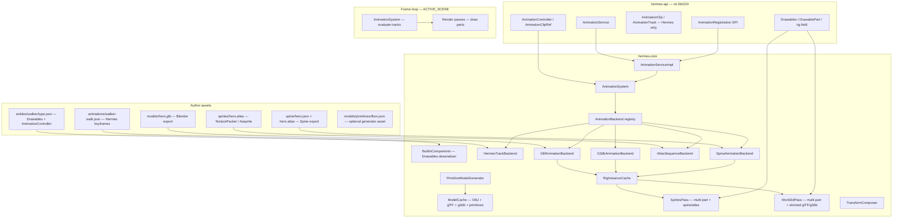
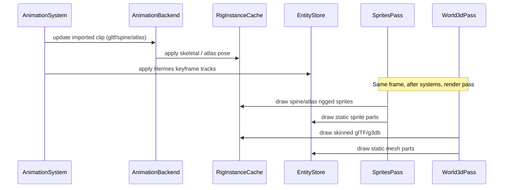

# Animations, Multi-Part Drawables, and Procedural Meshes Plan

> **For agentic workers:** REQUIRED SUB-SKILL: Use superpowers:subagent-driven-development (recommended) or superpowers:executing-plans to implement this plan task-by-task. Steps use checkbox (`- [ ]`) syntax for tracking.

> **Pre-release policy:** Nothing is shipped. Delete `Mesh` and `Sprite` components; replace with `Drawables`. Update every template, test scene, and doc in the same pass. No migration shims or deprecated aliases.

**Goal:** Replace single-mesh/single-sprite entities with **multi-part drawables** (local transforms per part), **config-driven Hermes clips**, **imported animation files from external tools** (2D atlases/Spine, 3D glTF/g3db skeletal), optional **procedural mesh primitives**, and a small **`AnimationService`** API — so authors build animated characters from exported assets + JSON alone while heavy games can drive clips from Java or custom backends.

**Architecture:** One `Drawables` component holds mesh, sprite, or rigged parts (`rig: gltf | g3db | spine | atlas`). `AnimationController` maps logical clip names to **`AnimationClipRef`** entries (Hermes keyframe JSON **or** a named clip inside an imported file). `AnimationSystem` delegates playback to pluggable **`AnimationBackend`** implementations (Hermes tracks, glTF skeletal, atlas sequences, Spine). Each backend updates either ECS fields (Hermes/atlas) or a core-only **`RigInstance`** cache (skeletal meshes) that `World3dPass` / `SpritesPass` read at draw time. Procedural shapes use libGDX `ModelBuilder`. libGDX and third-party loaders stay in `hermes-core`; clip refs, components, and `AnimationService` stay libGDX-free in `hermes-api`.

**Tech Stack:** Java 11, libGDX 1.14.0 g2d/g3d, **`com.github.mgsx-dev.gdx-gltf:gdx-gltf`** (glTF/GLB), optional **`com.esotericsoftware.spine:spine-libgdx`** (Spine 2D), existing ECS, JUnit 5, Gradle `:hermes-core:test`, `:dogfood-simulation:compileJava`.

---

## Current baseline (repo state)

| Area | Today | After this plan |
|------|-------|-----------------|
| 3D draw | One `Mesh` per entity → one `ModelInstance` | `Drawables` with N mesh/primitive parts |
| 2D draw | One `Sprite` per entity → one texture | `Drawables` with N sprite parts + sprite sheets |
| Animation | Manual Java systems (`SpinMarker`, `PulseMarker`) | Hermes clips + imported files (glTF, atlas, Spine, g3db) |
| Models | OBJ only via `ModelCache` + `ObjLoader` | OBJ + glTF/GLB + g3db + procedural primitives |
| External 2D | None | TexturePacker/LibGDX `.atlas` sequences; Spine skeleton exports |
| External 3D | None | glTF/GLB skeletal from Blender/Maya/etc.; legacy g3db from fbx-conv |
| Material | One `Material` per entity (required for drawables) | Entity default + optional per-part override |
| Entity hierarchy | Flat entities only | Flat entities; **part locals** replace child entities for visuals |
| Validation | `Mesh`/`Sprite` require `Material` | `Drawables` requires `Material` (entity or all parts) |

Relevant existing types to reuse:

- `Transform` — entity root pose; animation tracks can target root or part locals
- `Material` / `MaterialUniform` — default shader; tracks can animate `uniforms.*`
- `EntityFactory` / entity templates — animated enemy as `entities/walker/type.json`
- `ComponentRegistration` SPI — custom animation drivers or track resolvers
- `WorldManager` — per-scene simulation root ([entity-types plan](2026-05-21-entity-types-and-world-manager.md) — **landed**)
- `ModelCache` — extend, do not duplicate
- `SpritesPass` / `World3dPass` — refactor to part iteration
- `SpriteDrawOrder` — sort entities; within entity, parts draw in list order

---

## Design goals

| Goal | How |
|------|-----|
| **No-code games** | Entity templates + animation clip JSON + sprite sheets — walk cycles, spinning props, pulsing logos without Java |
| **Progressive complexity** | Tiers 0–4 (below): shorthand drawable → multi-part → clips → Java control → SPI/custom tracks |
| **Multi-mesh entities** | `Drawables.parts[]` with per-part `local` transform and optional material |
| **Generalized animation** | Track path grammar targets Transform, part locals, sprite frames, visibility, material uniforms |
| **Imported animations** | `AnimationBackend` per format; drop exported files under `assets/` and reference by name in JSON |
| **Easy to extend** | `AnimationRegistration` SPI registers custom backends; v2 hooks for blend trees, morph targets |
| **Maintainable** | libGDX-free clip model in `hermes-api`; one `AnimationSystem`; rendering unchanged at pipeline level |
| **Performance** | Clip assets cached; runtime evaluation is O(tracks × keyframes) with small N; models cached in `ModelCache` |

### Author complexity tiers

| Tier | Author writes | Engine does |
|------|---------------|-------------|
| **0 — Single drawable** | `"Drawables": { "sprite": "logo.png" }` or `{ "mesh": "models/cube.obj" }` | Expands to one default part; same as today's single mesh/sprite |
| **1 — Multi-part** | `Drawables.parts[]` with `id`, `kind`, `model`/`texture`, `local` | Composes root `Transform` × part `local` at draw time |
| **2 — Hermes clip** | `AnimationController` + `assets/animations/walk.json` (keyframes) | Engine evaluates tracks on Transform / part locals / frames |
| **2b — Imported clip** | Export from Blender/Aseprite/Spine → drop file; JSON `{ "type": "gltf", "clip": "Walk" }` | Backend loads file once; plays named clip; no Java |
| **3 — Java control** | `engine.animation().play(entity.id(), "attack")` in gameplay code | Switches clips; reads `finished()` / `clipTime()` |
| **4 — Custom / SPI** | `AnimationRegistration` custom backend or track resolver | Procedural IK, custom formats, gameplay-driven tracks |

**Honest v1 limits:** No runtime FBX loading (export to glTF or pre-convert to g3db). No clip cross-fade (instant switch). No JSON animation state machine graph (single active clip + Java switches). Colliders stay on entity root (physics plan) — skeletal bones do not drive hitboxes in v1. HTML/TeaVM: Hermes clips + atlas sequences only; glTF/Spine/g3db **desktop + Android** first (doctor warns on HTML export). Morph targets / shape keys: glTF backend plays them if present in file; not exposed as Hermes track targets in v1.

---

## Relationship to other plans

| Plan | Status | How this plan uses it |
|------|--------|------------------------|
| [Entity types](2026-05-21-entity-types-and-world-manager.md) | Landed | Animated templates under `assets/entities/<kind>/type.json`; `$ref` still v1 Transform-only |
| [Unified input](2026-05-21-unified-input-system.md) | Landed | Gameplay code switches clips on `justPressed("attack")` — tier 3 |
| [World lighting](2026-05-26-world-lighting.md) | Landed / partial | Lit mesh parts use entity `Material` shader `default/lit` |
| [Physics & collisions](2026-05-30-physics-and-collisions.md) | Not landed | Collider on entity `Transform`; animated part offsets do not move colliders in v1 |
| [Debug mode](2026-05-30-debug-mode.md) | Not landed | v2: overlay rows `animation.activeClip`, `animation.clipTime`; uses `SimulationClock` scaled delta when landed |
| [Save/load](2026-05-22-save-load-sessions.md) | Not landed | v2: persist `AnimationController.currentClip` + `timeSeconds` |
| [Audio](2026-05-22-audio-system.md) | Landed | Independent; sync SFX to clip `events` (v2 hook) |

**Recommended order:**

1. Land **world lighting** shader rename (`default/lit`) if not already on branch — lit animated meshes need correct shader id.
2. Execute **this plan** (drawables → render → clips → animation system → dogfood).
3. **Physics plan** can follow; document that hitboxes use root transform only until v2 per-part colliders.

---

## Architecture

### System context



### Core concepts

#### Entity pose vs part pose

| Layer | Component | Role |
|-------|-----------|------|
| Root | `Transform` | Entity position in WORLD space (physics, picking, audio follow) |
| Part | `DrawablePart.local` (`LocalTransform`) | Offset from root — weapon bob, wheel spin, sprite body vs shadow |
| Composed | *(runtime)* | `worldPart = rootTransform × localTransform` — used only at draw time |

No parent/child entity graph in v1. Multiple visual pieces on one logical entity use `Drawables.parts`. Cross-entity attachment (weapon held by hand bone) is v2 (skeletal or attach component).

#### Drawables replace Mesh and Sprite

**Delete:**

- `dev.hermes.api.ecs.Mesh`
- `dev.hermes.api.ecs.Sprite`

**Add:**

- `dev.hermes.api.ecs.Drawables` — component holding `List<DrawablePart> parts()`
- `dev.hermes.api.ecs.DrawablePart` — immutable config + mutable runtime fields (`local`, `spriteFrame`, `visible`)
- `dev.hermes.api.ecs.LocalTransform` — x/y/z, rotations, scales, `visible`, `spriteFrame`
- `dev.hermes.api.ecs.DrawableKind` — `MESH`, `SPRITE` (static draw)
- `dev.hermes.api.ecs.DrawableRig` — optional rig kind on a part: `GLTF`, `G3DB`, `SPINE`, `ATLAS` (see [External animation files](#external-animation-files))
- `dev.hermes.api.ecs.SpriteSheet` — columns, rows, frame width/height (manual grid; superseded by `rig: atlas` when using TexturePacker)

Shorthand JSON (tier 0) normalizes to a single part with `id: "default"` during deserialize.

#### External animation files

Authors export from DCC / animation tools, copy files into `assets/`, and reference clips by **logical name** in `AnimationController`. Hermes auto-selects a backend from the clip ref `type` (or from the rigged part when omitted).

**Supported formats (v1):**

| Backend | `type` | Typical export source | Asset files | Clip identity |
|---------|--------|----------------------|-------------|---------------|
| Hermes keyframes | `hermes` (default) | Hand-authored / tooling | `animations/*.json` | Whole file |
| glTF skeletal | `gltf` | Blender, Maya, Mixamo, etc. | `.gltf` / `.glb` on rigged mesh part | Animation **name** inside file |
| libGDX g3db | `g3db` | FBX → [fbx-conv](https://github.com/libgdx/fbx-conv) | `.g3db` on rigged mesh part | Animation id / name in model |
| Texture atlas sequence | `atlas` | TexturePacker, Aseprite (LibGDX atlas export) | `.atlas` + `.png` on sprite part | Sequence / prefix name in atlas |
| Spine 2D | `spine` | Spine Editor | `.json` or `.skel` + `.atlas` + `.png` | Spine animation name |

**Not supported at runtime (v1):** raw `.fbx`, `.dae`, `.blend`, video, Lottie. Export to glTF or atlas/Spine instead.

##### Rigged drawable parts

Static parts behave as today. **Rigged** parts declare where imported animations live:

**3D glTF (Blender workflow):**

```json
"Drawables": {
  "parts": [
    {
      "id": "body",
      "kind": "mesh",
      "model": "models/hero.glb",
      "rig": "gltf"
    }
  ]
},
"AnimationController": {
  "rigPart": "body",
  "clips": {
    "idle": { "type": "gltf", "clip": "Idle" },
    "walk": { "type": "gltf", "clip": "Walk" },
    "attack": { "type": "gltf", "clip": "Attack", "loop": false }
  },
  "default": "idle"
}
```

Export from Blender: **File → Export → glTF 2.0 (.glb)**, enable **Animation** (single or NLA strips → multiple clips). Drop `hero.glb` under `assets/models/`. List clip names with Blender's action list or glTF viewer — those strings are the `clip` values.

**2D atlas sequence (Aseprite / TexturePacker workflow):**

```json
"Drawables": {
  "parts": [
    {
      "id": "body",
      "kind": "sprite",
      "atlas": "sprites/hero.atlas",
      "rig": "atlas"
    }
  ]
},
"AnimationController": {
  "rigPart": "body",
  "clips": {
    "walk": { "type": "atlas", "clip": "walk" },
    "idle": { "type": "atlas", "clip": "idle" }
  },
  "default": "idle"
}
```

Export: Aseprite **File → Export Sprite Sheet → LibGDX** (`.png` + `.atlas` with tagged frames), or TexturePacker with **LibGDX** format and animation tags matching sequence names (`walk_001`, `walk_002`, … → sequence `walk`).

**Spine 2D:**

```json
"Drawables": {
  "parts": [
    {
      "id": "body",
      "kind": "sprite",
      "skeleton": "spine/hero.json",
      "atlas": "spine/hero.atlas",
      "rig": "spine"
    }
  ]
},
"AnimationController": {
  "rigPart": "body",
  "clips": {
    "walk": { "type": "spine", "clip": "walk" },
    "jump": { "type": "spine", "clip": "jump", "loop": false }
  },
  "default": "walk"
}
```

Export from Spine: **Export → JSON** + texture atlas. Requires `spine-libgdx` on the classpath (declared in `hermes-core`; games inherit transitively).

**Legacy g3db:**

```json
"Drawables": {
  "parts": [{ "id": "body", "kind": "mesh", "model": "models/hero.g3db", "rig": "g3db" }]
},
"AnimationController": {
  "rigPart": "body",
  "clips": { "walk": { "type": "g3db", "clip": "walk" } }
}
```

Convert: `fbx-conv -o hero.g3db hero.fbx`. Prefer glTF for new projects.

##### AnimationClipRef (API + JSON)

Each entry in `AnimationController.clips` is either a **string** (Hermes shorthand) or an object:

```json
"walk": "animations/hero-walk.json"
"run": { "type": "gltf", "clip": "Run", "loop": true, "speed": 1.2 }
```

| Field | Default | Description |
|-------|---------|-------------|
| `type` | `hermes` if string path; else inferred from `rigPart.rig` | Backend id: `hermes`, `gltf`, `g3db`, `atlas`, `spine` |
| `path` | — | Required for `hermes` only (clip JSON path) |
| `clip` | — | Animation / sequence name inside imported file |
| `loop` | backend default (usually `true`) | Override loop for this logical clip |
| `speed` | controller `speed` | Per-clip speed multiplier |

```java
// hermes-api
public final class AnimationClipRef {
    AnimationClipType type();   // HERMES, GLTF, G3DB, ATLAS, SPINE
    String path();              // hermes JSON path; null for imported
    String clipName();          // named clip inside glTF/spine/atlas/g3db
    boolean loop();
    float speed();
}
```

##### AnimationBackend (core)

```java
// hermes-core — internal
interface AnimationBackend {
    AnimationClipType type();
    /** Bind runtime state when entity first plays a clip of this type. */
    void bind(EntityId id, DrawablePart rigPart, EntityStore entities);
    /** Advance playback; update RigInstance or ECS fields. */
    void update(EntityId id, AnimationController ctrl, AnimationClipRef clip, float deltaSeconds, EntityStore entities);
    void unbind(EntityId id);
    boolean isFinished(EntityId id, AnimationClipRef clip);
}
```

`AnimationSystem` resolves `ctrl.activeRef()` → backend from registry. **HermesTrackBackend** keeps existing keyframe evaluator. **GltfAnimationBackend** uses `gdx-gltf` + libGDX `AnimationController` on a cached `RigInstance`. **AtlasSequenceBackend** maps sequence names to ordered `TextureRegion`s and sets `part.local().spriteFrame`. **SpineAnimationBackend** wraps `SkeletonAnimation`. **G3dbAnimationBackend** uses libGDX `ModelInstance.animationController`.

`RigInstanceCache` (core-only): `EntityId` → skinned `ModelInstance` / `SkeletonAnimation` / atlas player. `World3dPass` / `SpritesPass` call `RigInstanceCache.applyPose(entityId)` before draw when `rig != null`.

##### Mixing Hermes tracks with imported clips

One entity may use **only one active backend at a time** (v1). Typical patterns:

- **Imported locomotion** (`gltf` walk/run) + **Java** for gameplay (`engine.animation().play`).
- **Separate entities**: glTF character body + Hermes-animated shadow sprite part on a second entity (or Hermes clip targeting `parts.shadow.local` on same entity when not playing skeletal clip — document: shadow bob via Hermes `idle` clip on a static rig-less part while body uses glTF; two controllers not supported — use one Hermes clip on shadow part only by splitting shadow to child-less second part updated by Hermes clip on same entity without AnimationController on body... Actually simpler: allow **per-part** animation only for Hermes tracks; skeletal uses whole rig part. Shadow can use Hermes clip file without AnimationController on whole entity if we allow Drawables-only part animation — too complex.

Simpler rule for v1: **one `AnimationController` per entity, one active clip, one backend per clip**. Multi-part Hermes tracks can still animate non-rigged parts (shadow) in same clip file while body uses glTF — that requires two backends simultaneously.

Refined rule: **each clip ref has one backend**. Hermes clips **may** target any part including rigged part's `local` (for additive bob) but when playing a `gltf` clip, glTF backend owns the rig part; Hermes clip cannot target bones in v1. Authors use glTF for body, Hermes clip targeting `parts.shadow.*` only — AnimationSystem runs **Hermes backend for tracks** and **gltf backend for rig** if we allow composite — too heavy for v1.

**v1 rule:** If active clip `type` is `gltf|g3db|spine|atlas`, only that backend runs. If `hermes`, keyframe tracks run (can target multiple parts). Cannot play glTF and Hermes keyframes simultaneously — switch clips or use separate entities.

#### Hermes keyframe clips (hand-authored JSON)

Clips live at `assets/animations/<name>.json` (any path; referenced by controller).

```json
{
  "version": 1,
  "duration": 0.8,
  "loop": true,
  "tracks": [
    {
      "target": "parts.body.local.rotationZ",
      "interpolation": "linear",
      "keyframes": [
        { "t": 0.0, "v": -10 },
        { "t": 0.4, "v": 10 },
        { "t": 0.8, "v": -10 }
      ]
    },
    {
      "target": "parts.shadow.local.y",
      "interpolation": "linear",
      "keyframes": [
        { "t": 0.0, "v": -0.05 },
        { "t": 0.4, "v": 0.05 },
        { "t": 0.8, "v": -0.05 }
      ]
    },
    {
      "target": "parts.hero.frame",
      "interpolation": "step",
      "keyframes": [
        { "t": 0.0, "v": 0 },
        { "t": 0.2, "v": 1 },
        { "t": 0.4, "v": 2 },
        { "t": 0.6, "v": 3 }
      ]
    },
    {
      "target": "Transform.scaleX",
      "interpolation": "linear",
      "keyframes": [
        { "t": 0.0, "v": 1.0 },
        { "t": 0.5, "v": 1.15 },
        { "t": 1.0, "v": 1.0 }
      ]
    },
    {
      "target": "Material.uniforms.u_glow",
      "interpolation": "linear",
      "keyframes": [
        { "t": 0.0, "v": [0, 0, 0, 1] },
        { "t": 0.5, "v": [1, 0.5, 0, 1] },
        { "t": 1.0, "v": [0, 0, 0, 1] }
      ]
    }
  ]
}
```

**Track target grammar (v1):**

| Target pattern | Writes to |
|----------------|-----------|
| `Transform.x` … `Transform.scaleZ` | Entity root `Transform` |
| `parts.<id>.local.x` … `parts.<id>.local.scaleZ` | Part `LocalTransform` |
| `parts.<id>.frame` | Part `spriteFrame` (int) |
| `parts.<id>.visible` | Part visibility (bool; keyframe `v` 0/1) |
| `Material.uniforms.<name>` | Entity `Material` uniform (float[]; length must match existing uniform) |

Unknown part id or path → `SceneParseException` at clip load (fail fast).

**Interpolation:** `step` (hold previous) or `linear` (numeric lerp; arrays lerp per element). Rotations use linear degrees (no quaternion slerp in v1 — sufficient for props and 2D).

#### AnimationController (component)

```json
"AnimationController": {
  "rigPart": "body",
  "clips": {
    "idle": "animations/hero-idle.json",
    "walk": "animations/hero-walk.json",
    "run": { "type": "gltf", "clip": "Run" }
  },
  "default": "idle",
  "speed": 1.0,
  "autoPlay": true
}
```

| Field | Default | Description |
|-------|---------|-------------|
| `clips` | required map | Logical name → Hermes path string **or** `AnimationClipRef` object |
| `rigPart` | — | Part id with `rig` set; required when any clip `type` is `gltf`/`g3db`/`spine`/`atlas` |
| `default` | first clip key | Plays on spawn when `autoPlay` true |
| `speed` | `1.0` | Global playback multiplier (per-clip `speed` stacks) |
| `autoPlay` | `true` | Start `default` clip at entity creation |

Runtime fields (Java, not JSON): `currentClip`, `activeRef` (`AnimationClipRef`), `timeSeconds`, `playing`, `finished`.

#### AnimationService (HermesEngine)

```java
// hermes-api
public interface AnimationService {
    void play(EntityId entityId, String clipName);
    void play(EntityId entityId, String clipName, boolean restart);
    void stop(EntityId entityId);
    void setSpeed(EntityId entityId, float speed);
    String currentClip(EntityId entityId);
    float timeSeconds(EntityId entityId);
    boolean isPlaying(EntityId entityId);
    boolean isFinished(EntityId entityId);
}
```

Add `AnimationService animation()` to `HermesEngine`. Implementation in `hermes-core` reads/writes `AnimationController` on the active scene's `EntityStore`.

#### Procedural meshes (mesh generator)

Two equivalent authoring paths:

**Inline on part:**

```json
{
  "id": "floor",
  "kind": "mesh",
  "primitive": "box",
  "size": [20, 0.2, 20],
  "material": { "shader": "default/lit" }
}
```

**Standalone generator asset** (reusable):

`assets/models/primitives/floor.json`:

```json
{
  "version": 1,
  "generator": "box",
  "width": 20,
  "height": 0.2,
  "depth": 20
}
```

Referenced as `"model": "models/primitives/floor.json"` on a mesh part (loader detects `"generator"` key).

**v1 generators:** `box`, `plane`, `sphere`. Parameters:

| Generator | Parameters | Default |
|-----------|------------|---------|
| `box` | `width`, `height`, `depth` | `1` each |
| `plane` | `width`, `height` | `1` each (XZ plane, Y-up) |
| `sphere` | `radius`, `segments` | `0.5`, `16` |

Implementation: `PrimitiveModelGenerator` in core uses `ModelBuilder`; cache key = generator JSON content hash in `ModelCache`.

### Rendering pipeline changes



- **Rigged draw:** When `part.rig() != null`, pass delegates to `RigInstanceCache.draw(part, rootTransform, material)` instead of static model/sprite path.
- **Sort order:** Entities sorted as today (`SpriteDrawOrder` / mesh list). Parts draw in array order (author controls layering via part order and `local.z`).
- **Material resolution:** Per-part `material` override if present; else entity-level `Material`.
- **Visibility:** Skip parts with `local.visible == false`.
- **Cameras:** Unchanged — entities with `Camera` still excluded from draw lists.

### System order

Register in `BuiltinComponents.registerSystems()`:

| Order | System | Scope |
|-------|--------|-------|
| 5 | `AnimationSystem` | ACTIVE_SCENE |

Runs before physics motor (10) and before render. Uses `deltaSeconds` from `WorldManager` update (when debug mode lands, use scaled delta from `SimulationClock` the same way as physics plan).

When clip not playing (`playing == false`), system skips entity.

### SPI extension

```java
// hermes-api
public interface AnimationRegistration {
    void register(HermesEngine engine, AnimationRegistrar registrar);
}

public interface AnimationRegistrar {
    void trackResolver(AnimationTrackResolver resolver);
    void backend(AnimationBackend backend);  // core impls register at startup; SPI for custom formats
}

public interface AnimationTrackResolver {
    /** Return true if resolver handled target; false to fall through to built-in grammar. */
    boolean apply(
            String target,
            float value,
            float[] valueArray,
            EntityId entityId,
            EntityStore entities);
}
```

Loaded via `ServiceLoader` in `HermesEngineImpl` (same pattern as `ComponentRegistration`, `PhysicsRegistration`).

### v2 extension hooks (document only — not in task list)

| Feature | Hook |
|---------|------|
| Clip cross-fade | `AnimationController` blend weight + two active clips |
| JSON state machine | `transitions: [{ "from": "idle", "on": "move", "to": "walk" }]` + input events |
| Composite playback | Hermes tracks layered on imported rig (additive bob while glTF runs) |
| Per-part colliders | `Collider` array keyed by part id (physics plan extension) |
| Bone hitboxes | `CollisionTag` bound to glTF bone name |
| `$ref` on part locals | Extend `ComponentRefResolver` paths |
| Debug overlay | `AnimationDebugRegistration` clip/time/backend rows |
| DragonBones / Live2D | New `AnimationBackend` via SPI |

---

## File structure

### New — hermes-api

| File | Responsibility |
|------|----------------|
| `dev/hermes/api/ecs/Drawables.java` | Multi-part drawable component |
| `dev/hermes/api/ecs/DrawablePart.java` | Single part config + runtime fields |
| `dev/hermes/api/ecs/DrawableKind.java` | `MESH`, `SPRITE` |
| `dev/hermes/api/ecs/DrawableRig.java` | `GLTF`, `G3DB`, `SPINE`, `ATLAS` enum for rigged parts |
| `dev/hermes/api/ecs/LocalTransform.java` | Part-local pose + visibility + frame |
| `dev/hermes/api/ecs/SpriteSheet.java` | Sheet layout metadata |
| `dev/hermes/api/ecs/PartMaterial.java` | Optional per-part shader/uniforms |
| `dev/hermes/api/ecs/AnimationController.java` | Clip map + runtime playback state |
| `dev/hermes/api/animation/AnimationClipType.java` | `HERMES`, `GLTF`, `G3DB`, `ATLAS`, `SPINE` |
| `dev/hermes/api/animation/AnimationClipRef.java` | Typed clip reference (path or imported name) |
| `dev/hermes/api/animation/AnimationClip.java` | Parsed Hermes clip (duration, loop, tracks) |
| `dev/hermes/api/animation/AnimationTrack.java` | Target path + keyframes |
| `dev/hermes/api/animation/Keyframe.java` | `t`, numeric `v`, optional `vArray` |
| `dev/hermes/api/animation/Interpolation.java` | `STEP`, `LINEAR` |
| `dev/hermes/api/animation/AnimationService.java` | Engine-facing playback API |
| `dev/hermes/api/animation/AnimationRegistration.java` | SPI |
| `dev/hermes/api/animation/AnimationRegistrar.java` | SPI registrar |
| `dev/hermes/api/animation/AnimationTrackResolver.java` | SPI custom targets |

**Delete:**

| File |
|------|
| `dev/hermes/api/ecs/Mesh.java` |
| `dev/hermes/api/ecs/Sprite.java` |

**Modify:**

| File | Change |
|------|--------|
| `dev/hermes/api/ecs/HermesEngine.java` | Add `animation()` |
| `dev/hermes/api/ecs/EntityStore.java` | No change (queries use `Drawables.class`) |

### New — hermes-core

| File | Responsibility |
|------|----------------|
| `dev/hermes/core/animation/AnimationClipLoader.java` | Parse Hermes clip JSON → `AnimationClip` |
| `dev/hermes/core/animation/AnimationClipCache.java` | Path → Hermes clip cache |
| `dev/hermes/core/animation/AnimationBackend.java` | Internal backend interface |
| `dev/hermes/core/animation/AnimationBackendRegistry.java` | type → backend |
| `dev/hermes/core/animation/HermesTrackBackend.java` | Keyframe track playback |
| `dev/hermes/core/animation/GltfAnimationBackend.java` | glTF/GLB via gdx-gltf |
| `dev/hermes/core/animation/G3dbAnimationBackend.java` | libGDX g3db `ModelInstance` |
| `dev/hermes/core/animation/AtlasSequenceBackend.java` | LibGDX atlas frame sequences |
| `dev/hermes/core/animation/SpineAnimationBackend.java` | spine-libgdx skeleton |
| `dev/hermes/core/animation/RigInstanceCache.java` | EntityId → runtime rig draw state |
| `dev/hermes/core/animation/AtlasSequenceCache.java` | atlas path + sequence → regions |
| `dev/hermes/core/animation/GltfModelCache.java` | glTF scene assets (wraps gdx-gltf) |
| `dev/hermes/core/animation/AnimationTrackEvaluator.java` | Sample keyframes at time t |
| `dev/hermes/core/animation/AnimationTargetApplier.java` | Apply sampled values to ECS components |
| `dev/hermes/core/animation/AnimationSystem.java` | Per-frame update |
| `dev/hermes/core/animation/AnimationServiceImpl.java` | `AnimationService` |
| `dev/hermes/core/render/TransformComposer.java` | Root × local → libGDX matrix |
| `dev/hermes/core/render/resource/PrimitiveModelGenerator.java` | box/plane/sphere |
| `dev/hermes/core/render/resource/PrimitiveModelDocument.java` | Parse generator JSON |
| `dev/hermes/core/render/resource/SpriteSheetCache.java` | Texture + sheet → `TextureRegion[]` |

**Modify:**

| File | Change |
|------|--------|
| `dev/hermes/core/ecs/BuiltinComponents.java` | Remove Mesh/Sprite; register Drawables + AnimationController |
| `dev/hermes/core/ecs/EntityFactory.java` | Validate `Drawables` + `Material` |
| `dev/hermes/core/render/pass/World3dPass.java` | Static + skinned parts via `RigInstanceCache` |
| `dev/hermes/core/render/pass/SpritesPass.java` | Static + atlas/spine via `RigInstanceCache` |
| `dev/hermes/core/render/resource/ModelCache.java` | OBJ + glTF + g3db + primitives |
| `hermes-core/build.gradle` | Add `gdx-gltf`, `spine-libgdx` dependencies |
| `hermes-gradle-plugin/.../launcher/html.gradle` | Document imported 3D/Spine unsupported on TeaVM |
| `dev/hermes/core/ecs/HermesEngineImpl.java` | Wire `AnimationServiceImpl`, load SPI |
| `dogfood-simulation/.../WaterPass.java` | Query `Drawables` instead of `Mesh` |
| All test fixtures, templates, scene JSON | Replace Mesh/Sprite with Drawables shorthand |

### Dogfood + docs

| File | Change |
|------|--------|
| `dogfood-simulation/.../entities/spin-cube/type.json` | `Drawables` + optional clip for bounce |
| `dogfood-simulation/.../entities/walker/type.json` | **New** — atlas sequence walk cycle |
| `dogfood-simulation/.../sprites/hero.atlas` | **New** — LibGDX atlas export (walk/idle tags) |
| `dogfood-simulation/.../animations/logo-pulse.json` | **New** — replaces `PulseMarker` for logo tier-2 demo |
| `dogfood-simulation/.../scenes/animation-starter.json` | **New** — walker + pulsing logo |
| `hermes-templates/minimal/.../entities/logo/type.json` | Drawables shorthand |
| `hermes-templates/2d/.../scenes/main.json` | Drawables |
| `dogfood-simulation/.../entities/gltf-character/type.json` | **New** — glTF rigged demo |
| `dogfood-simulation/.../models/hero.glb` | **New** — minimal rigged test model (or test resource) |
| `docs/animations.md` | **New** — export workflows (Blender, Aseprite, Spine), backends, tiers |
| `docs/scene-format-v1.md` | Drawables + AnimationController tables; remove Mesh/Sprite |
| `docs/entity-types.md` | Update examples |
| `docs/ARCHITECTURE.md` | Animation + drawables section |

---

## Config formats (author reference)

### Drawables shorthand (tier 0)

```json
"Drawables": { "sprite": "hermes-logo.png" }
```

```json
"Drawables": { "mesh": "models/cube.obj", "texture": "brick.png" }
```

Expands internally to one part `id: "default"`.

### Multi-part entity (tier 1)

```json
{
  "id": "character",
  "type": "walker",
  "components": {
    "Transform": { "x": 0, "y": 0 },
    "Drawables": {
      "parts": [
        {
          "id": "body",
          "kind": "sprite",
          "texture": "sprites/hero-sheet.png",
          "sheet": { "columns": 4, "rows": 1, "frameWidth": 32, "frameHeight": 48 },
          "local": { "y": 0 }
        },
        {
          "id": "shadow",
          "kind": "sprite",
          "texture": "sprites/shadow.png",
          "local": { "y": -0.1, "scaleX": 1.2, "scaleY": 0.4 }
        }
      ]
    },
    "Material": { "shader": "default/unlit" },
    "AnimationController": {
      "clips": { "walk": "animations/hero-walk.json" },
      "default": "walk"
    }
  }
}
```

### Entity template `entities/walker/type.json`

```json
{
  "version": 1,
  "components": {
    "Drawables": {
      "parts": [
        {
          "id": "body",
          "kind": "sprite",
          "texture": "sprites/hero-sheet.png",
          "sheet": { "columns": 4, "rows": 1, "frameWidth": 32, "frameHeight": 48 }
        }
      ]
    },
    "Material": { "shader": "default/unlit" },
    "AnimationController": {
      "clips": {
        "idle": "animations/hero-idle.json",
        "walk": "animations/hero-walk.json"
      },
      "default": "idle"
    },
    "FootstepEmitter": {
      "clips": ["footstep"],
      "clipIsId": true,
      "minSpeed": 1.0
    }
  }
}
```

Scene instance:

```json
{ "type": "walker", "id": "player", "components": { "Transform": { "x": 100, "y": 50 } } }
```

### 3D multi-mesh prop

```json
"Drawables": {
  "parts": [
    { "id": "base", "kind": "mesh", "model": "models/turret-base.obj" },
    { "id": "barrel", "kind": "mesh", "model": "models/turret-barrel.obj", "local": { "y": 0.5 } }
  ]
},
"Material": { "shader": "default/lit" },
"AnimationController": {
  "clips": { "scan": "animations/turret-scan.json" },
  "default": "scan"
}
```

Clip rotates `parts.barrel.local.rotationY` only.

### Procedural floor (tier 1 + generator)

```json
"Drawables": {
  "parts": [
    {
      "id": "floor",
      "kind": "mesh",
      "primitive": "box",
      "size": [40, 0.2, 40]
    }
  ]
},
"Material": { "shader": "default/lit" }
```

### 3D glTF character (imported from Blender)

```json
{
  "type": "gltf-character",
  "id": "player",
  "components": {
    "Transform": { "x": 0, "y": 0, "z": 0 },
    "Drawables": {
      "parts": [{ "id": "body", "kind": "mesh", "model": "models/hero.glb", "rig": "gltf" }]
    },
    "Material": { "shader": "default/lit" },
    "AnimationController": {
      "rigPart": "body",
      "clips": {
        "idle": { "type": "gltf", "clip": "Idle" },
        "walk": { "type": "gltf", "clip": "Walk" }
      },
      "default": "idle"
    }
  }
}
```

### Java tier 3 — switch clip on input

```java
@Override
public void update(WorldManager manager, float deltaSeconds) {
    EntityStore entities = manager.entities();
    InputActions actions = engine.input().actions();
    for (Entity e : entities.entitiesWith(AnimationController.class)) {
        if (actions.justPressed("attack")) {
            engine.animation().play(e.id(), "attack");
        } else if (actions.axis("move_x") != 0f) {
            if (!"walk".equals(engine.animation().currentClip(e.id()))) {
                engine.animation().play(e.id(), "walk");
            }
        } else if (engine.animation().isFinished(e.id())) {
            engine.animation().play(e.id(), "idle");
        }
    }
}
```

Register system in `onCreate` or scene definition `systems`.

---

## How user projects consume this

### Config-only simulation (no Java)

**Hermes keyframe clips:**

1. Add sprite sheet PNG under `assets/sprites/` (or use atlas export — see below).
2. Add clip JSON under `assets/animations/`.
3. Define `assets/entities/my-character/type.json` with `Drawables`, `AnimationController`, `Material`.
4. Place instances in `assets/scenes/main.json` with `"type": "my-character"`.
5. Run — clips auto-play from `default`.

**Imported animations (no Hermes clip JSON required):**

| Workflow | Export from | Drop into assets | Entity JSON |
|----------|-------------|------------------|-------------|
| 3D character | Blender → glTF 2.0 `.glb` | `assets/models/hero.glb` | `rig: gltf`, clips `{ "type": "gltf", "clip": "Walk" }` |
| 2D atlas | Aseprite / TexturePacker → LibGDX `.atlas` + `.png` | `assets/sprites/hero.atlas` | `rig: atlas`, clips `{ "type": "atlas", "clip": "walk" }` |
| 2D skeletal | Spine → JSON + atlas | `assets/spine/hero.json` + `.atlas` | `rig: spine`, clips `{ "type": "spine", "clip": "walk" }` |
| Legacy 3D | FBX → fbx-conv → `.g3db` | `assets/models/hero.g3db` | `rig: g3db`, clips `{ "type": "g3db", "clip": "walk" }` |

Clip names must match names in the exported file (Blender action names, Spine animation names, atlas sequence prefixes). List them once in a template; scene instances only override `Transform`.

Same flow for 3D props with multiple OBJ parts, procedural floor boxes, or a single rigged glTF mesh.

### Template projects

| Template | Change |
|----------|--------|
| `minimal` | Logo entity uses `Drawables` shorthand |
| `2d` | Optional `animations/logo-pulse.json` instead of `PulseMarker` (keep `PulseMarker` as tier-4 Java example or remove) |
| `multi-scene` | Update spin-cube entity type |

### Heavy / custom games

- Implement `AnimationTrackResolver` for gameplay-specific targets (e.g. `stats.healthRatio` → uniform).
- Replace `AnimationSystem` entirely via custom `System` at same scope if needed (document: disable built-in by not registering — or register custom system with higher priority that sets `playing=false` on controller).
- Procedural mesh parts: generate paths in Java and assign to `DrawablePart` at runtime via mutable API on `Drawables`.

---

## Implementation tasks

### Task 1: Drawables API types

**Files:**
- Create: `hermes-api/src/main/java/dev/hermes/api/ecs/DrawableKind.java`
- Create: `hermes-api/src/main/java/dev/hermes/api/ecs/LocalTransform.java`
- Create: `hermes-api/src/main/java/dev/hermes/api/ecs/SpriteSheet.java`
- Create: `hermes-api/src/main/java/dev/hermes/api/ecs/PartMaterial.java`
- Create: `hermes-api/src/main/java/dev/hermes/api/ecs/DrawablePart.java`
- Create: `hermes-api/src/main/java/dev/hermes/api/ecs/Drawables.java`
- Test: `hermes-api/src/test/java/dev/hermes/api/ecs/DrawablesTest.java`

- [ ] **Step 1: Write the failing test**

```java
package dev.hermes.api.ecs;

import org.junit.jupiter.api.Test;

import static org.junit.jupiter.api.Assertions.*;

final class DrawablesTest {

    @Test
    void defaultPart_hasVisibleLocalTransform() {
        DrawablePart part = DrawablePart.mesh("body", "models/cube.obj");
        assertEquals(DrawableKind.MESH, part.kind());
        assertEquals("body", part.id());
        assertTrue(part.local().visible());
        assertEquals(0, part.local().spriteFrame());
    }

    @Test
    void drawables_shorthandMesh() {
        Drawables d = Drawables.singleMesh("models/cube.obj");
        assertEquals(1, d.parts().size());
        assertEquals("default", d.parts().get(0).id());
    }
}
```

- [ ] **Step 2: Run test to verify it fails**

Run: `./gradlew :hermes-api:test --tests dev.hermes.api.ecs.DrawablesTest -q`
Expected: FAIL — classes not found

- [ ] **Step 3: Write minimal implementation**

```java
// DrawableKind.java
package dev.hermes.api.ecs;

public enum DrawableKind { MESH, SPRITE }

// LocalTransform.java — mutable fields with getters/setters for x,y,z, rotationX/Y/Z, scaleX/Y/Z, visible, spriteFrame

// SpriteSheet.java — columns, rows, frameWidth, frameHeight (ints, defaults 1)

// PartMaterial.java — optional shader String + Map<String, MaterialUniform>

// DrawablePart.java — factory methods mesh(id, model), sprite(id, texture); fields: kind, id, model, texture, primitive, size[], local, sheet, partMaterial

// Drawables.java
public final class Drawables implements Component {
    private final List<DrawablePart> parts;
    public static Drawables singleMesh(String model) {
        return new Drawables(List.of(DrawablePart.mesh("default", model)));
    }
    public static Drawables singleSprite(String texture) {
        return new Drawables(List.of(DrawablePart.sprite("default", texture)));
    }
    public List<DrawablePart> parts() { return parts; }
}
```

- [ ] **Step 4: Run test to verify it passes**

Run: `./gradlew :hermes-api:test --tests dev.hermes.api.ecs.DrawablesTest -q`
Expected: PASS

- [ ] **Step 5: Commit**

```bash
git add hermes-api/src/main/java/dev/hermes/api/ecs/Drawable*.java hermes-api/src/main/java/dev/hermes/api/ecs/LocalTransform.java hermes-api/src/main/java/dev/hermes/api/ecs/SpriteSheet.java hermes-api/src/main/java/dev/hermes/api/ecs/PartMaterial.java hermes-api/src/test/java/dev/hermes/api/ecs/DrawablesTest.java
git commit -m "feat: add Drawables API for multi-part entities"
```

---

### Task 2: Drawables JSON deserializer + remove Mesh/Sprite

**Files:**
- Modify: `hermes-core/src/main/java/dev/hermes/core/ecs/BuiltinComponents.java`
- Modify: `hermes-core/src/main/java/dev/hermes/core/ecs/EntityFactory.java`
- Delete: `hermes-api/src/main/java/dev/hermes/api/ecs/Mesh.java`
- Delete: `hermes-api/src/main/java/dev/hermes/api/ecs/Sprite.java`
- Test: `hermes-core/src/test/java/dev/hermes/core/ecs/DrawablesDeserializerTest.java`

- [ ] **Step 1: Write the failing test**

```java
package dev.hermes.core.ecs;

import dev.hermes.api.ecs.Drawables;
import dev.hermes.api.ecs.DrawableKind;
import org.junit.jupiter.api.Test;

import static org.junit.jupiter.api.Assertions.*;

final class DrawablesDeserializerTest {

    @Test
    void shorthandSprite() {
        ComponentRegistryImpl registry = new ComponentRegistryImpl();
        BuiltinComponents.register(registry);
        Drawables d = (Drawables) registry.deserialize("Drawables",
                JsonComponentData.parse("{\"sprite\":\"logo.png\"}"), ComponentContext.EMPTY);
        assertEquals(1, d.parts().size());
        assertEquals(DrawableKind.SPRITE, d.parts().get(0).kind());
        assertEquals("logo.png", d.parts().get(0).texture());
    }

    @Test
    void multiPartMesh() {
        ComponentRegistryImpl registry = new ComponentRegistryImpl();
        BuiltinComponents.register(registry);
        String json = "{\"parts\":[{\"id\":\"a\",\"kind\":\"mesh\",\"model\":\"models/cube.obj\"}]}";
        Drawables d = (Drawables) registry.deserialize("Drawables", JsonComponentData.parse(json), ComponentContext.EMPTY);
        assertEquals("a", d.parts().get(0).id());
    }
}
```

- [ ] **Step 2: Run test to verify it fails**

Run: `./gradlew :hermes-core:test --tests dev.hermes.core.ecs.DrawablesDeserializerTest -q`
Expected: FAIL

- [ ] **Step 3: Implement deserializer**

In `BuiltinComponents`:
- Remove `MESH`, `SPRITE` constants and registrations.
- Add `DRAWABLES = "Drawables"`.
- Parse shorthand `{ "sprite": "..." }`, `{ "mesh": "...", "texture": "..." }`.
- Parse `parts[]` with `id`, `kind`, `model`, `texture`, `primitive`, `size`, `local`, `sheet`, `material`.
- Default `kind` from presence of `model`/`primitive` → mesh, `texture` → sprite.

In `EntityFactory.validateDrawableMaterial`:
- Check `Drawables` instead of Mesh/Sprite.

- [ ] **Step 4: Run test to verify it passes**

Run: `./gradlew :hermes-core:test --tests dev.hermes.core.ecs.DrawablesDeserializerTest -q`
Expected: PASS

- [ ] **Step 5: Commit**

```bash
git add hermes-core/src/main/java/dev/hermes/core/ecs/BuiltinComponents.java hermes-core/src/main/java/dev/hermes/core/ecs/EntityFactory.java hermes-api/src/main/java/dev/hermes/api/ecs/Drawables.java hermes-core/src/test/java/dev/hermes/core/ecs/DrawablesDeserializerTest.java
git rm hermes-api/src/main/java/dev/hermes/api/ecs/Mesh.java hermes-api/src/main/java/dev/hermes/api/ecs/Sprite.java
git commit -m "feat: deserialize Drawables; remove Mesh and Sprite components"
```

---

### Task 3: TransformComposer

**Files:**
- Create: `hermes-core/src/main/java/dev/hermes/core/render/TransformComposer.java`
- Test: `hermes-core/src/test/java/dev/hermes/core/render/TransformComposerTest.java`

- [ ] **Step 1: Write the failing test**

```java
package dev.hermes.core.render;

import com.badlogic.gdx.math.Matrix4;
import dev.hermes.api.ecs.LocalTransform;
import dev.hermes.api.ecs.Transform;
import org.junit.jupiter.api.Test;

import static org.junit.jupiter.api.Assertions.*;

final class TransformComposerTest {

    @Test
    void compose_appliesLocalOffset() {
        Transform root = new Transform(10f, 20f, 0f);
        LocalTransform local = new LocalTransform();
        local.setX(1f);
        Matrix4 m = TransformComposer.compose(root, local);
        assertEquals(11f, m.getTranslation(new com.badlogic.gdx.math.Vector3()).x, 0.001f);
    }
}
```

- [ ] **Step 2: Run test — expect FAIL**

Run: `./gradlew :hermes-core:test --tests dev.hermes.core.render.TransformComposerTest -q`

- [ ] **Step 3: Implement**

```java
public final class TransformComposer {
    private TransformComposer() {}
    public static Matrix4 compose(Transform root, LocalTransform local) {
        Matrix4 m = new Matrix4();
        m.translate(root.x() + local.x(), root.y() + local.y(), root.z() + local.z());
        // apply rotations: root Euler then local Euler (Z,Y,X same order as World3dPass)
        // apply scale: root.scale * local.scale
        return m;
    }
}
```

Match rotation order in existing `World3dPass.applyTransform` for root-only case.

- [ ] **Step 4: Run test — expect PASS**

- [ ] **Step 5: Commit**

```bash
git commit -m "feat: compose root Transform with part LocalTransform"
```

---

### Task 4: World3dPass multi-part rendering

**Files:**
- Modify: `hermes-core/src/main/java/dev/hermes/core/render/pass/World3dPass.java`
- Modify: `hermes-core/src/test/java/dev/hermes/core/render/World3dPassTest.java` (or create)

- [ ] **Step 1: Write failing test** — entity with two mesh parts collects as one drawable entity; both parts rendered (mock `ModelCache` counting `get` calls = 2).

- [ ] **Step 2: Run — FAIL**

- [ ] **Step 3: Refactor `World3dPass`**

Replace `entities.entitiesWith(Mesh.class)` with `Drawables.class`.

In `drawMesh`:
```java
Drawables drawables = entities.getComponent(entity.id(), Drawables.class);
Material entityMaterial = entities.getComponent(entity.id(), Material.class);
for (DrawablePart part : drawables.parts()) {
    if (!part.local().visible() || part.kind() != DrawableKind.MESH) continue;
    Material material = resolveMaterial(entityMaterial, part);
    String modelPath = resolveModelPath(part);
    ModelInstance instance = new ModelInstance(modelCache.get(modelPath));
    TransformComposer.composeInto(instance.transform, transform, part.local());
    // render with material shader as today
}
```

Add `resolveMaterial`: part.partMaterial() override or entity material.

- [ ] **Step 4: Run tests — PASS**

Run: `./gradlew :hermes-core:test --tests '*World3d*' -q`

- [ ] **Step 5: Commit**

```bash
git commit -m "feat: render multi-part mesh Drawables in World3dPass"
```

---

### Task 5: SpritesPass multi-part + sprite sheets

**Files:**
- Create: `hermes-core/src/main/java/dev/hermes/core/render/resource/SpriteSheetCache.java`
- Modify: `hermes-core/src/main/java/dev/hermes/core/render/pass/SpritesPass.java`
- Test: `hermes-core/src/test/java/dev/hermes/core/render/SpriteSheetCacheTest.java`

- [ ] **Step 1: Write failing test** — sheet 4×1, frame 2 returns correct region offset.

- [ ] **Step 2: Run — FAIL**

- [ ] **Step 3: Implement `SpriteSheetCache`**

Cache key: `texturePath + sheet dimensions`. Return `TextureRegion[]` indexed by frame.

Update `SpritesPass.drawSprite` loop over parts where `kind == SPRITE`, use `part.local().spriteFrame()` index, `TransformComposer` for position (2D uses x,y, rotationZ).

- [ ] **Step 4: Run tests — PASS**

- [ ] **Step 5: Commit**

```bash
git commit -m "feat: multi-part sprites with sprite sheet frames"
```

---

### Task 6: Primitive mesh generator

**Files:**
- Create: `hermes-core/src/main/java/dev/hermes/core/render/resource/PrimitiveModelDocument.java`
- Create: `hermes-core/src/main/java/dev/hermes/core/render/resource/PrimitiveModelGenerator.java`
- Modify: `hermes-core/src/main/java/dev/hermes/core/render/resource/ModelCache.java`
- Test: `hermes-core/src/test/java/dev/hermes/core/render/resource/PrimitiveModelGeneratorTest.java`

- [ ] **Step 1: Write failing test**

```java
@Test
void boxGenerator_producesModelWithNodes() {
    PrimitiveModelGenerator gen = new PrimitiveModelGenerator();
    Model model = gen.box(2f, 1f, 3f);
    assertNotNull(model);
    assertFalse(model.nodes.isEmpty());
    model.dispose();
}
```

- [ ] **Step 2: Run — FAIL**

- [ ] **Step 3: Implement**

`PrimitiveModelGenerator` uses `ModelBuilder` + `BoxShapeBuilder`, `SphereShapeBuilder`, etc.

`ModelCache.get(path)`:
1. Load file text; if JSON with `"generator"`, parse `PrimitiveModelDocument` and generate.
2. Else existing OBJ load.

`Drawables` deserializer: inline `"primitive": "box", "size": [w,h,d]` sets synthetic cache key `primitive:box:w:h:d` without asset file.

- [ ] **Step 4: Run tests — PASS**

- [ ] **Step 5: Commit**

```bash
git commit -m "feat: procedural box plane sphere meshes"
```

---

### Task 7: Animation clip model + loader

**Files:**
- Create: `hermes-api/src/main/java/dev/hermes/api/animation/Interpolation.java`
- Create: `hermes-api/src/main/java/dev/hermes/api/animation/Keyframe.java`
- Create: `hermes-api/src/main/java/dev/hermes/api/animation/AnimationTrack.java`
- Create: `hermes-api/src/main/java/dev/hermes/api/animation/AnimationClip.java`
- Create: `hermes-core/src/main/java/dev/hermes/core/animation/AnimationClipLoader.java`
- Create: `hermes-core/src/main/java/dev/hermes/core/animation/AnimationClipCache.java`
- Test: `hermes-core/src/test/java/dev/hermes/core/animation/AnimationClipLoaderTest.java`

- [ ] **Step 1: Write failing test** — load sample clip JSON; assert duration, track count, keyframe values.

- [ ] **Step 2: Run — FAIL**

- [ ] **Step 3: Implement loader** using `JsonReader`; validate `version == 1`; reject unknown targets at load if part ids listed in optional `"parts": ["body"]` validation block, else defer to apply time.

- [ ] **Step 4: Run — PASS**

- [ ] **Step 5: Commit**

```bash
git commit -m "feat: animation clip JSON loader and cache"
```

---

### Task 8: AnimationTrackEvaluator + AnimationTargetApplier

**Files:**
- Create: `hermes-core/src/main/java/dev/hermes/core/animation/AnimationTrackEvaluator.java`
- Create: `hermes-core/src/main/java/dev/hermes/core/animation/AnimationTargetApplier.java`
- Test: `hermes-core/src/test/java/dev/hermes/core/animation/AnimationTrackEvaluatorTest.java`
- Test: `hermes-core/src/test/java/dev/hermes/core/animation/AnimationTargetApplierTest.java`

- [ ] **Step 1: Write failing evaluator test** — linear between t=0 v=0 and t=1 v=10 at t=0.5 → 5.

- [ ] **Step 2: Run — FAIL**

- [ ] **Step 3: Implement evaluator** — binary search keyframes; step vs linear.

- [ ] **Step 4: Write failing applier test** — apply `Transform.x` track to entity Transform.

- [ ] **Step 5: Implement applier** — parse target path; mutate `Transform`, `Drawables` part local, `Material` uniforms.

- [ ] **Step 6: Run all animation unit tests — PASS**

- [ ] **Step 7: Commit**

```bash
git commit -m "feat: evaluate and apply animation tracks to ECS state"
```

---

### Task 9: AnimationController component + deserializer

**Files:**
- Create: `hermes-api/src/main/java/dev/hermes/api/ecs/AnimationController.java`
- Modify: `hermes-core/src/main/java/dev/hermes/core/ecs/BuiltinComponents.java`
- Test: `hermes-core/src/test/java/dev/hermes/core/ecs/AnimationControllerDeserializerTest.java`

- [ ] **Step 1: Write failing test** — deserialize clips map + default.

- [ ] **Step 2: Run — FAIL**

- [ ] **Step 3: Implement `AnimationController`**

Fields: `Map<String, AnimationClipRef> clips`, `rigPart`, `defaultClip`, `speed`, `autoPlay`; runtime: `currentClip`, `activeRef`, `timeSeconds`, `playing`, `finished`.

Deserializer accepts string values (Hermes path → `AnimationClipRef.hermes(path)`) or objects with `type`, `clip`, `path`, `loop`, `speed`. Validates `rigPart` when any clip type is not `hermes`.

- [ ] **Step 4: Run — PASS**

- [ ] **Step 5: Commit**

```bash
git commit -m "feat: AnimationController component for clip playback"
```

---

### Task 10: AnimationSystem

**Files:**
- Create: `hermes-core/src/main/java/dev/hermes/core/animation/AnimationSystem.java`
- Modify: `hermes-core/src/main/java/dev/hermes/core/ecs/BuiltinComponents.java` — register system order 5

- [ ] **Step 1: Write failing integration test** — load scene with `AnimationController` + clip animating `Transform.scaleX`; after update(0.5f) scaleX ≈ expected.

Use headless backend + `HermesEngineImpl` test harness pattern from `HermesEngineImplTest`.

- [ ] **Step 2: Run — FAIL**

- [ ] **Step 3: Implement `AnimationSystem` with backend dispatch**

```java
public final class AnimationSystem implements System {
    private final AnimationBackendRegistry backends;
    private final AnimationClipCache hermesClips;

    @Override
    public void update(WorldManager manager, float deltaSeconds) {
        EntityStore entities = manager.entities();
        for (Entity entity : entities.entitiesWith(AnimationController.class)) {
            AnimationController ctrl = entities.getComponent(entity.id(), AnimationController.class);
            if (ctrl == null || !ctrl.playing()) continue;
            AnimationClipRef ref = ctrl.activeRef();
            AnimationBackend backend = backends.require(ref.type());
            backend.update(entity.id(), ctrl, ref, deltaSeconds * ctrl.speed(), entities);
        }
    }
}
```

`HermesTrackBackend` contains the keyframe loop from the original design (load `AnimationClip` from `hermesClips`, evaluate tracks, apply to ECS). Imported backends ignore Hermes tracks.

On entity add with `autoPlay`, set `currentClip = default`, `playing = true`, `timeSeconds = 0` — hook in deserializer post-step or first system frame (prefer `AnimationController` init method called from deserializer via `ComponentContext`).

- [ ] **Step 4: Run — PASS**

- [ ] **Step 5: Commit**

```bash
git commit -m "feat: AnimationSystem advances clips and applies tracks"
```

---

### Task 11: AnimationService + HermesEngine wiring

**Files:**
- Create: `hermes-api/src/main/java/dev/hermes/api/animation/AnimationService.java`
- Create: `hermes-api/src/main/java/dev/hermes/api/animation/AnimationRegistration.java`
- Create: `hermes-api/src/main/java/dev/hermes/api/animation/AnimationRegistrar.java`
- Create: `hermes-api/src/main/java/dev/hermes/api/animation/AnimationTrackResolver.java`
- Create: `hermes-core/src/main/java/dev/hermes/core/animation/AnimationServiceImpl.java`
- Modify: `hermes-api/src/main/java/dev/hermes/api/ecs/HermesEngine.java`
- Modify: `hermes-core/src/main/java/dev/hermes/core/ecs/HermesEngineImpl.java`
- Test: `hermes-core/src/test/java/dev/hermes/core/animation/AnimationServiceImplTest.java`

- [ ] **Step 1: Write failing test** — `play()` switches `currentClip` and resets time.

- [ ] **Step 2: Run — FAIL**

- [ ] **Step 3: Implement service + engine.animation()**

Load `AnimationRegistration` via `ServiceLoader`; pass resolvers to `AnimationTargetApplier`.

- [ ] **Step 4: Run — PASS**

- [ ] **Step 5: Commit**

```bash
git commit -m "feat: AnimationService API on HermesEngine"
```

---

### Task 12: Migrate tests, templates, and assets

**Files:**
- Modify: all scenes/templates listed in File structure section
- Modify: `hermes-core/src/test/resources/assets/scenes/mesh-cube.json` → Drawables
- Modify: `dogfood-simulation/.../entities/spin-cube/type.json`
- Modify: `hermes-templates/**`
- Modify: `dogfood-simulation/.../WaterPass.java`

- [ ] **Step 1: Replace Mesh/Sprite JSON globally**

Run: `rg -l '"Mesh"|"Sprite"' --glob '*.json'` and update each file.

Example mesh-cube:

```json
"Drawables": { "mesh": "models/cube.obj" }
```

- [ ] **Step 2: Fix Java references**

Run: `rg 'Mesh\.class|Sprite\.class|import.*\.Mesh|import.*\.Sprite' -g '*.java'` — update to `Drawables`.

- [ ] **Step 3: Run full test suite**

Run: `./gradlew test -q`
Expected: PASS

- [ ] **Step 4: Commit**

```bash
git commit -m "refactor: migrate scenes and templates from Mesh/Sprite to Drawables"
```

---

### Task 13: Dogfood animation starter scene

**Files:**
- Create: `dogfood-simulation/src/main/resources/assets/entities/walker/type.json`
- Create: `dogfood-simulation/src/main/resources/assets/animations/hero-walk.json`
- Create: `dogfood-simulation/src/main/resources/assets/animations/logo-pulse.json`
- Create: `dogfood-simulation/src/main/resources/assets/scenes/animation-starter.json`
- Modify: `dogfood-simulation/src/main/java/dev/hermes/sample/SampleHermesGame.java` — register scene

- [ ] **Step 1: Add walker template** — `rig: atlas` + `hero.atlas` with `walk`/`idle` sequences (exported from Aseprite or TexturePacker).

- [ ] **Step 2: Add logo-pulse Hermes clip** (animates `Transform.scaleX/Y` like old `PulseMarker`).

- [ ] **Step 3: Add gltf-character template** — minimal `hero.glb` with Idle/Walk clips (commit test asset or generate via Blender once).

- [ ] **Step 4: Add scene** with atlas walker + logo + optional glTF character instance.

- [ ] **Step 5: Manual smoke test**

Run: `./gradlew :dogfood-simulation:run` (or project run task)
Expected: atlas walker animates; logo pulses; glTF character plays idle/walk when switched via input.

- [ ] **Step 6: Commit**

```bash
git commit -m "demo: animation-starter with atlas, Hermes clips, and glTF character"
```

---

### Task 14: Documentation

**Files:**
- Create: `docs/animations.md`
- Modify: `docs/scene-format-v1.md`
- Modify: `docs/entity-types.md`
- Modify: `docs/ARCHITECTURE.md`

- [ ] **Step 1: Write `docs/animations.md`** — tiers, Hermes clip format, **export workflows** (Blender→glTF, Aseprite→atlas, Spine→json+atlas), backend table, track grammar, Java API, SPI, platform limits (HTML).

- [ ] **Step 2: Update scene-format-v1** — Drawables (`rig`, `atlas`, `skeleton`), AnimationController clip refs; remove Mesh/Sprite.

- [ ] **Step 3: Update entity-types example** — spin-cube with Drawables; add glTF character template example.

- [ ] **Step 4: Commit**

```bash
git commit -m "docs: animations including imported glTF, atlas, and Spine formats"
```

---

### Task 15: AnimationBackend registry + HermesTrackBackend extraction

**Files:**
- Create: `hermes-core/src/main/java/dev/hermes/core/animation/AnimationBackend.java`
- Create: `hermes-core/src/main/java/dev/hermes/core/animation/AnimationBackendRegistry.java`
- Create: `hermes-core/src/main/java/dev/hermes/core/animation/HermesTrackBackend.java`
- Modify: `hermes-core/src/main/java/dev/hermes/core/animation/AnimationSystem.java`
- Test: `hermes-core/src/test/java/dev/hermes/core/animation/AnimationBackendRegistryTest.java`

- [ ] **Step 1: Write failing test** — registry returns `HermesTrackBackend` for `AnimationClipType.HERMES`.

- [ ] **Step 2: Run — FAIL**

- [ ] **Step 3: Extract keyframe logic from Task 10 into `HermesTrackBackend`**; `AnimationSystem` delegates via registry.

- [ ] **Step 4: Register builtin backends in `HermesEngineImpl` startup**

- [ ] **Step 5: Run tests — PASS**

- [ ] **Step 6: Commit**

```bash
git commit -m "feat: AnimationBackend registry with Hermes track backend"
```

---

### Task 16: glTF / GLB skeletal backend

**Files:**
- Create: `hermes-core/src/main/java/dev/hermes/core/animation/GltfModelCache.java`
- Create: `hermes-core/src/main/java/dev/hermes/core/animation/GltfAnimationBackend.java`
- Create: `hermes-core/src/main/java/dev/hermes/core/animation/RigInstanceCache.java` (initial: glTF slot)
- Modify: `hermes-core/src/main/java/dev/hermes/core/render/pass/World3dPass.java`
- Modify: `hermes-core/build.gradle`
- Test: `hermes-core/src/test/java/dev/hermes/core/animation/GltfAnimationBackendTest.java`
- Test resource: `hermes-core/src/test/resources/assets/models/simple.glb` (minimal 2-bone idle/walk)

**Gradle addition:**

```gradle
implementation "com.github.mgsx-dev.gdx-gltf:gdx-gltf:2.1.2"
```

- [ ] **Step 1: Write failing test** — load test glb; `play` clip `"Idle"`; after `update(0.1f)` rig instance time advances.

- [ ] **Step 2: Run — FAIL**

- [ ] **Step 3: Implement `GltfModelCache`** using gdx-gltf `GLTFLoader`; store `Model` + animation names.

- [ ] **Step 4: Implement `GltfAnimationBackend`** — libGDX `AnimationController` on `ModelInstance`; `RigInstanceCache` stores per-entity instance.

- [ ] **Step 5: Update `World3dPass`** — when `part.rig() == GLTF`, draw via `RigInstanceCache.drawSkinnedMesh(...)`.

- [ ] **Step 6: Run tests — PASS**

- [ ] **Step 7: Commit**

```bash
git commit -m "feat: glTF/GLB skeletal animation backend"
```

---

### Task 17: Atlas sequence backend (TexturePacker / Aseprite exports)

**Files:**
- Create: `hermes-core/src/main/java/dev/hermes/core/animation/AtlasSequenceCache.java`
- Create: `hermes-core/src/main/java/dev/hermes/core/animation/AtlasSequenceBackend.java`
- Modify: `hermes-core/src/main/java/dev/hermes/core/render/pass/SpritesPass.java`
- Modify: `hermes-core/src/main/java/dev/hermes/core/animation/RigInstanceCache.java` (atlas slot)
- Test: `hermes-core/src/test/java/dev/hermes/core/animation/AtlasSequenceBackendTest.java`
- Test resource: `hermes-core/src/test/resources/assets/sprites/test.atlas` + `.png`

- [ ] **Step 1: Write failing test** — sequence `"walk"` with 4 regions; after full clip duration, frame index cycles 0..3.

- [ ] **Step 2: Run — FAIL**

- [ ] **Step 3: Implement `AtlasSequenceCache`** — parse LibGDX atlas; group regions by prefix (`walk/` or `walk_` naming convention documented in `docs/animations.md`).

- [ ] **Step 4: Implement `AtlasSequenceBackend`** — advance frame index from clip time; store current region in `RigInstanceCache`.

- [ ] **Step 5: Update `SpritesPass`** for `rig: atlas` parts.

- [ ] **Step 6: Run tests — PASS**

- [ ] **Step 7: Commit**

```bash
git commit -m "feat: LibGDX atlas sequence animation backend"
```

---

### Task 18: Spine 2D backend

**Files:**
- Create: `hermes-core/src/main/java/dev/hermes/core/animation/SpineAnimationBackend.java`
- Modify: `hermes-core/src/main/java/dev/hermes/core/animation/RigInstanceCache.java` (spine slot)
- Modify: `hermes-core/src/main/java/dev/hermes/core/render/pass/SpritesPass.java`
- Modify: `hermes-core/build.gradle`
- Test: `hermes-core/src/test/java/dev/hermes/core/animation/SpineAnimationBackendTest.java`
- Test resource: minimal Spine export under `hermes-core/src/test/resources/assets/spine/`

**Gradle addition:**

```gradle
implementation "com.esotericsoftware.spine:spine-libgdx:4.2.7"
```

- [ ] **Step 1: Write failing test** — load skeleton; set animation `"walk"`; verify `SkeletonAnimation` state after update.

- [ ] **Step 2: Run — FAIL**

- [ ] **Step 3: Implement `SpineAnimationBackend`** — `SkeletonJson` + `Atlas`; `SkeletonAnimation.update(delta)`.

- [ ] **Step 4: Update `SpritesPass`** — draw spine skeleton via `SkeletonRenderer` when `rig: spine`.

- [ ] **Step 5: Run tests — PASS**

- [ ] **Step 6: Commit**

```bash
git commit -m "feat: Spine 2D skeletal animation backend"
```

---

### Task 19: g3db backend (legacy libGDX pipeline)

**Files:**
- Create: `hermes-core/src/main/java/dev/hermes/core/animation/G3dbAnimationBackend.java`
- Modify: `hermes-core/src/main/java/dev/hermes/core/render/resource/ModelCache.java` — load `.g3db` via `G3dModelLoader`
- Test: `hermes-core/src/test/java/dev/hermes/core/animation/G3dbAnimationBackendTest.java`

- [ ] **Step 1: Write failing test** — load test g3db with one animation; play and advance.

- [ ] **Step 2: Run — FAIL**

- [ ] **Step 3: Implement backend** — reuse `RigInstanceCache` glTF draw path (same `ModelInstance.animationController` API).

- [ ] **Step 4: Run tests — PASS**

- [ ] **Step 5: Commit**

```bash
git commit -m "feat: g3db animation backend for fbx-conv assets"
```

---

## Self-review

### Spec coverage

| Requirement | Task |
|-------------|------|
| Multi-mesh entities | Tasks 1, 4 |
| Multi-sprite / sheets | Tasks 1, 5 |
| Hermes keyframe clips | Tasks 7–10, 15 |
| **Imported 2D (atlas, Spine)** | Tasks 17, 18 |
| **Imported 3D (glTF, g3db)** | Tasks 16, 19 |
| Java animation control | Task 11 |
| Mesh generator | Task 6 |
| No backward compat / delete Mesh Sprite | Task 2, 12 |
| Config-first + tiers | Architecture + docs Task 14 |
| SPI extension | Tasks 11, 15 |
| Fit entity-types / WorldManager | Throughout (EntityFactory, templates) |
| Future physics/debug/save hooks | Documented in Architecture v2 |

### Placeholder scan

No TBD/TODO steps. Each task includes concrete code or commands.

### Type consistency

- Component name `Drawables` in JSON and Java.
- Track prefix `parts.<id>.local.*` matches deserializer part ids.
- `AnimationClipRef.type` matches backend registry keys (`hermes`, `gltf`, `g3db`, `atlas`, `spine`).
- `AnimationController.activeRef()` used consistently in system, service, and backends.
- `rigPart` on controller aligns with `Drawables.parts[].id` and `rig` field.

---

**Plan complete and saved to `docs/superpowers/plans/2026-05-30-animations-and-drawables.md`. Two execution options:**

**1. Subagent-Driven (recommended)** — dispatch a fresh subagent per task, review between tasks, fast iteration

**2. Inline Execution** — execute tasks in this session using executing-plans, batch execution with checkpoints

**Which approach?**
