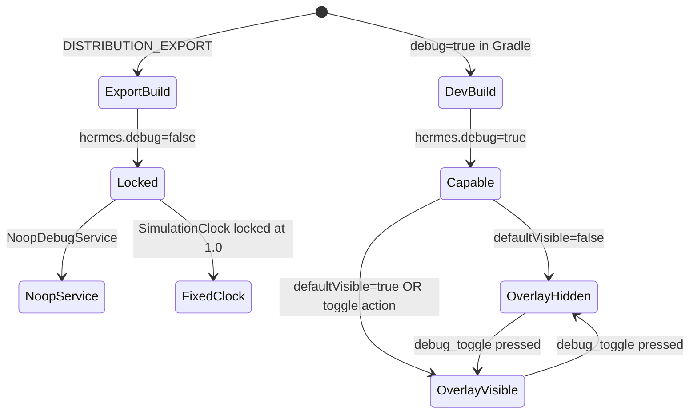

# Debug Mode Implementation Plan

> **For agentic workers:** REQUIRED SUB-SKILL: Use superpowers:subagent-driven-development (recommended) or superpowers:executing-plans to implement this plan task-by-task. Steps use checkbox (`- [ ]`) syntax for tracking.

> **Pre-release policy:** Nothing is shipped. Prefer clean design over compatibility. Delete dead code; do not layer interim hacks. Export builds must not pay runtime cost for debug tooling.

**Goal:** Ship a first-class **Debug Mode** that displays engine/game stats, lets authors pause/step/scale simulation time, and run config-driven debug commands — with zero impact on distribution exports unless explicitly enabled.

**Architecture:** Two-layer gating: **build gate** (`hermes.debug=true` in Gradle → `hermes.debug` in runtime properties) enables debug capability; **runtime toggle** (input action from `debug/profile.json`, default F3) shows/hides the overlay. `SimulationClock` scales `deltaSeconds` for all ECS systems. `DebugService` owns overlay visibility, metric collection, panel layout, and command dispatch. A minimal engine-owned `DebugOverlayRenderer` (BitmapFont + rects, same pattern as `HermesFatalErrorScreen`) draws on top of the render pipeline — independent of the future `UiService` plan. Extension via `DebugRegistration` SPI (ServiceLoader) for custom metrics, panels, and commands.

**Tech Stack:** Java 11, libGDX `SpriteBatch` / `BitmapFont` / `ShapeRenderer` (hermes-core only), Gson JSON, JUnit 5, existing ECS (`HermesEngine`, `WorldManager`, `EntityStore`), `InputService`, `RuntimeConfigService`, Gradle `LaunchConfigResolver`.

---

## Current baseline (repo state)

| Area | Today | After this plan |
|------|-------|-----------------|
| `hermes.debug` | Sets log level to DEBUG; export forces `false` via `LaunchConfigResolver` | Also gates `DebugService` registration, debug asset bundling, and simulation mutability |
| Simulation time | Raw `Gdx.graphics.getDeltaTime()` passed to all systems | `SimulationClock.scaledDelta(raw)` — respects pause, time scale, single-frame step |
| On-screen stats | None | Built-in FPS / frame-time / entity / scene panels + SPI metrics |
| Simulation control | Scene stack pause only (overlay scenes) | Global sim pause, step-one-frame, time-scale presets |
| Debug config | None | `assets/debug/profile.json` + optional `debug/panels/*.json` |
| `HermesEngine` | `scenes`, `viewport`, `input`, `runtimeConfig` | Adds `simulation()`, `debug()` |
| Export | `hermes.debug=false`, log level WARN | Same + debug assets excluded from bundle, `NoopDebugService` |

Existing hooks we build on:

- `RuntimeConfigService.debug()` — [`hermes-core/.../RuntimeConfigServiceImpl.java`](../../hermes-core/src/main/java/dev/hermes/core/config/RuntimeConfigServiceImpl.java)
- Export forces non-debug — [`hermes-tooling/.../LaunchConfigResolver.java`](../../hermes-tooling/src/main/java/dev/hermes/tooling/launch/LaunchConfigResolver.java) (`DISTRIBUTION_EXPORT` → `debug=false`)
- Input actions/contexts — [`docs/input.md`](../../input.md)
- SPI pattern — [`ComponentRegistration`](../../hermes-api/src/main/java/dev/hermes/api/ecs/ComponentRegistration.java) via `ServiceLoader`
- Overlay rendering precedent — [`HermesFatalErrorScreen`](../../hermes-core/src/main/java/dev/hermes/core/HermesFatalErrorScreen.java)

---

## Relationship to other plans

| Plan | Status | How debug plan uses it |
|------|--------|------------------------|
| [Custom UI service](2026-05-29-custom-ui-service.md) | Not landed | Debug overlay stays engine-owned (minimal font renderer). v2: optional `DebugPanelRenderer` delegate to `UiService` for rich panels. |
| [Unified runtime config](2026-05-24-unified-runtime-config-service.md) | Landed | `hermes.debug`, `hermes.debug.profile` keys flow through `LaunchConfigResolver` → `RuntimeConfigService`. |
| [Unified input](2026-05-21-unified-input-system.md) | Landed | Toggle + command bindings in `debug/profile.json` map to input actions. |
| [Entity types](2026-05-21-entity-types-and-world-manager.md) | Landed | Entity count, spawn-via-command, selected-entity inspector. |

**Recommended order:** Implement debug mode **before or in parallel with** UiService — no hard dependency. If UiService lands first, add Task 18 (optional adapter) as follow-up.

---

## Design goals

| Goal | How |
|------|-----|
| **Minimal export impact** | Build gate off → `NoopDebugService`, locked `SimulationClock`, debug assets not bundled, no debug systems registered |
| **No-code-first** | Drop `debug/profile.json` + bind F3 in input profile → FPS panel + sim controls work |
| **Progressive complexity** | Tiers 0–4 (below): stock panels → custom JSON panels → Java metrics → full command SPI |
| **Influence simulation** | Time scale, pause/step, spawn/kill/reload commands, runtime variable tweaks |
| **Generalized & extensible** | `DebugRegistration` SPI; panel/command/metric IDs are open strings |
| **Maintainable** | All libGDX in hermes-core; hermes-api stays libGDX-free |

### Author complexity tiers

| Tier | Author writes | Engine does |
|------|---------------|-------------|
| **0 — Stock debug** | `debug = true` in Gradle + default `debug/profile.json` in engine resources | FPS, frame ms, entity count, scene stack, time-scale keys |
| **1 — Config panels** | Custom `debug/panels/balance.json` referenced from profile | Layout + label/value rows from bindings |
| **2 — Input commands** | Actions in `input/profile.json` + command entries in debug profile | Dispatch built-in commands (`stepFrame`, `timescale.up`, …) |
| **3 — Java metrics** | `DebugRegistration` SPI registering `DebugMetricProvider` | Poll providers each frame, show in named panel section |
| **4 — Full custom** | Implement `DebugPanelProvider` + `DebugCommandHandler` in Java | Custom draw + command handling alongside config panels |

---

## Architecture

### System context

```mermaid
flowchart TB
  subgraph author [Author assets & Gradle]
    GRADLE["build.gradle — debug = true"]
    HJSON["hermes.json — debugProfile optional"]
    DPROF["assets/debug/profile.json"]
    DPANEL["assets/debug/panels/*.json"]
    INPUT["input/profile.json — debug_toggle action"]
  end

  subgraph build [Build time]
    RESOLVER[LaunchConfigResolver]
    PROPS[hermes-runtime.properties]
    ASSETS[Asset copy filter]
    GRADLE --> RESOLVER
    HJSON --> RESOLVER
    RESOLVER --> PROPS
    GRADLE --> ASSETS
  end

  subgraph api [hermes-api — no libGDX]
    SimClk[SimulationClock]
    DbgSvc[DebugService]
    DbgMet[DebugMetric / DebugPanel / DebugCommand]
    SPI[DebugRegistration]
    HE["HermesEngine.simulation() / .debug()"]
  end

  subgraph core [hermes-core]
    SimImpl[SimulationClockImpl]
    DbgImpl[DebugServiceImpl]
    Noop[NoopDebugService]
    Loader[DebugProfileLoader]
    Stats[DebugStatsCollector]
    InputSys[DebugInputSystem]
    Overlay[DebugOverlayRenderer]
    Builtin[BuiltinDebugPanels]
    Cmd[BuiltinDebugCommands]
  end

  subgraph tick [Frame loop — HermesGdxApplication]
    RAW["rawDelta = Gdx.graphics.getDeltaTime()"]
    SCALE["scaledDelta = simulation.scaledDelta(rawDelta)"]
    SYS[ECS systems]
    REN[RenderPipelineExecutor]
    DBGDRAW[debug overlay draw]
    RAW --> SCALE --> SYS
    SYS --> REN --> DBGDRAW
  end

  DPROF --> Loader
  DPANEL --> Loader
  INPUT --> InputSys
  PROPS --> DbgImpl
  PROPS --> SimImpl
  Loader --> DbgImpl
  Stats --> DbgImpl
  InputSys --> DbgImpl
  DbgImpl --> Overlay
  SPI --> DbgImpl
  HE --> SimImpl
  HE --> DbgImpl
```



### Two-layer gating



| Layer | Control | Effect when off |
|-------|---------|-----------------|
| **Build gate** | `hermes.debug` runtime property | No debug systems, noop service, sim clock locked, debug assets not bundled |
| **Runtime toggle** | Input action (configurable) | Overlay hidden; sim clock still active if author changed time scale via Java |

### SimulationClock

Central place for **simulation time** (distinct from libGDX app pause and scene-stack pause):

| State | `scaledDelta(raw)` behavior |
|-------|----------------------------|
| Normal | `raw * timeScale` (clamped 0…8) |
| Paused | `0`, unless `stepOnce()` was called this frame → `raw * timeScale` once |
| Locked (export) | Always `raw` (timeScale forced to 1, pause ignored) |

Systems and `InputService.poll` use **scaled** delta so pointer repeat rates slow with time scale. Debug overlay animation uses **raw** delta so the HUD stays responsive while sim is paused.

### DebugService responsibilities

| Responsibility | Owner | Notes |
|----------------|-------|-------|
| Overlay visibility | `DebugServiceImpl` | `visible()`, `setVisible()`, toggle via input |
| Profile load | `DebugProfileLoader` | Parses `debug/profile.json`; merges engine defaults |
| Frame stats | `DebugStatsCollector` | FPS, frame ms (avg/min/max), entity totals |
| Custom metrics | `DebugMetricProvider` (SPI) | String key → formatted value each frame |
| Panel layout | `DebugPanelLayout` | Anchor regions: `topLeft`, `topRight`, `bottomLeft`, `bottomRight` |
| Commands | `DebugCommandDispatcher` | Action string → handler (`BuiltinDebugCommands` + SPI) |
| Draw | `DebugOverlayRenderer` | After render pipeline, before `application.render()` |
| Variables | `DebugVariables` | Named tweakable floats/bools for balancing (config + Java set) |

### Frame order (after this plan)

```
processPending()
input.poll(rawDelta)
simulation.beginFrame(rawDelta)
for each global system:   update(manager, simulation.scaledDelta(rawDelta))
for each active-scene system: update(manager, simulation.scaledDelta(rawDelta))
simulation.endFrame()
renderPipeline.execute(visibleScenes)
if debug.enabled() && debug.visible(): debug.renderOverlay(width, height)
application.render()
```

---

## File structure

### New — hermes-api

| File | Responsibility |
|------|----------------|
| `dev/hermes/api/simulation/SimulationClock.java` | Time scale, pause, step, scaled delta |
| `dev/hermes/api/debug/DebugService.java` | Overlay, metrics, variables, commands |
| `dev/hermes/api/debug/DebugMetric.java` | Immutable id + label + value snapshot |
| `dev/hermes/api/debug/DebugPanelAnchor.java` | Enum: TOP_LEFT, TOP_RIGHT, BOTTOM_LEFT, BOTTOM_RIGHT |
| `dev/hermes/api/debug/DebugVariable.java` | Id, label, type (FLOAT/BOOL/INT), current value |
| `dev/hermes/api/debug/DebugRegistration.java` | SPI: register metrics, commands, panels |
| `dev/hermes/api/debug/DebugMetricProvider.java` | Functional: `Collection<DebugMetric> poll(HermesEngine engine)` |
| `dev/hermes/api/debug/DebugCommandHandler.java` | `boolean handle(String commandId, HermesEngine engine)` |
| `dev/hermes/api/debug/DebugPanelProvider.java` | Custom panel lines for overlay |

Modify:

| File | Change |
|------|--------|
| `dev/hermes/api/ecs/HermesEngine.java` | Add `simulation()`, `debug()` |
| `dev/hermes/api/config/RuntimeConfigService.java` | Add `debugProfile()` |

### New — hermes-core

| File | Responsibility |
|------|----------------|
| `dev/hermes/core/simulation/SimulationClockImpl.java` | Mutable clock; locked variant for export |
| `dev/hermes/core/simulation/LockedSimulationClock.java` | No-op mutations, always scale=1 |
| `dev/hermes/core/debug/NoopDebugService.java` | All methods no-op / empty |
| `dev/hermes/core/debug/DebugServiceImpl.java` | Full implementation |
| `dev/hermes/core/debug/DebugProfileLoader.java` | Parse debug JSON |
| `dev/hermes/core/debug/DebugProfileDocument.java` | Parsed model |
| `dev/hermes/core/debug/DebugStatsCollector.java` | FPS / frame timing |
| `dev/hermes/core/debug/DebugInputSystem.java` | Toggle + command actions |
| `dev/hermes/core/debug/DebugOverlayRenderer.java` | Draw panels |
| `dev/hermes/core/debug/DebugPanelLayout.java` | Anchor → pixel rect |
| `dev/hermes/core/debug/BuiltinDebugPanels.java` | performance, simulation, scene |
| `dev/hermes/core/debug/BuiltinDebugCommands.java` | step, timescale, reload, spawn |
| `dev/hermes/core/debug/DebugCommandDispatcher.java` | Route command ids |
| `dev/hermes/core/debug/DebugVariablesStore.java` | Named tweak values |

Default resource:

| File | Responsibility |
|------|----------------|
| `hermes-core/src/main/resources/assets/debug/profile.json` | Stock profile when game omits one |

Modify:

| File | Change |
|------|--------|
| `dev/hermes/core/ecs/HermesEngineImpl.java` | Wire clocks + debug service; conditional system registration |
| `dev/hermes/core/HermesGdxApplication.java` | Scaled delta loop; overlay draw hook |
| `dev/hermes/core/config/RuntimeConfigServiceImpl.java` | `debugProfile()` accessor |

### New — hermes-tooling / gradle

| File | Change |
|------|--------|
| `dev/hermes/tooling/config/HermesGameConfig.java` | Optional `debugProfile` field |
| `dev/hermes/tooling/config/HermesGameConfigParser.java` | Parse `debugProfile` |
| `dev/hermes/tooling/launch/RuntimeConfigKeys.java` | `DEBUG_PROFILE = "hermes.debug.profile"` |
| `dev/hermes/gradle/internal/HermesRuntimeConfigGenerator.java` | Emit `hermes.debug.profile` |
| `dev/hermes/gradle/tasks/HermesProcessResources` or copy spec | Exclude `assets/debug/**` when `debug=false` |

### Docs & dogfood

| File | Change |
|------|--------|
| `docs/debug-mode.md` | Author guide |
| `docs/ARCHITECTURE.md` | Debug section |
| `docs/input.md` | Debug actions note |
| `dogfood-simulation/src/main/resources/assets/debug/profile.json` | Demo profile |
| `dogfood-simulation/src/main/resources/assets/input/profile.json` | Add debug actions |
| `dogfood-simulation/src/main/java/.../BalanceDebugRegistration.java` | Example SPI (optional, Task 16) |

---

## Config formats

### Debug profile v1

Path: `assets/debug/profile.json` (or override via `hermes.json` → `"debugProfile"`)

```json
{
  "version": 1,
  "toggleAction": "debug_toggle",
  "defaultVisible": false,
  "panels": [
    { "type": "builtin", "id": "performance", "anchor": "topLeft" },
    { "type": "builtin", "id": "simulation", "anchor": "topRight" },
    { "type": "builtin", "id": "scene", "anchor": "bottomLeft" },
    {
      "type": "document",
      "path": "debug/panels/balance.json",
      "anchor": "bottomRight"
    }
  ],
  "commands": [
    { "action": "debug_step", "command": "simulation.step" },
    { "action": "debug_pause", "command": "simulation.togglePause" },
    { "action": "debug_timescale_down", "command": "simulation.timescale.down" },
    { "action": "debug_timescale_up", "command": "simulation.timescale.up" },
    { "action": "debug_reload_scene", "command": "scene.reload" }
  ],
  "variables": [
    { "id": "gravity", "label": "Gravity", "type": "float", "default": 9.8, "min": 0, "max": 30, "step": 0.5 }
  ]
}
```

Engine merges this over [`hermes-core/.../assets/debug/profile.json`](../../hermes-core/src/main/resources/assets/debug/profile.json) defaults (game file wins on conflict).

### Custom panel document v1

Path: `assets/debug/panels/balance.json`

```json
{
  "version": 1,
  "title": "Balance",
  "rows": [
    { "label": "Player HP", "binding": "player.hp" },
    { "label": "Enemy count", "metric": "game.enemies" },
    { "label": "Difficulty", "variable": "difficulty" }
  ]
}
```

Row resolution order: `metric` (SPI/`DebugService` metric) → `variable` (debug variables store) → `binding` (string lookup via `DebugService.getBinding(key)` — Java sets bindings).

### Input profile additions

Add to `input/profile.json`:

```json
{
  "actions": {
    "debug_toggle": { "type": "button" },
    "debug_step": { "type": "button" },
    "debug_pause": { "type": "button" },
    "debug_timescale_up": { "type": "button" },
    "debug_timescale_down": { "type": "button" },
    "debug_reload_scene": { "type": "button" }
  },
  "bindings": [
    { "action": "debug_toggle", "source": "keyboard", "key": "F3", "when": "justPressed" },
    { "action": "debug_step", "source": "keyboard", "key": "F6", "when": "justPressed" },
    { "action": "debug_pause", "source": "keyboard", "key": "F7", "when": "justPressed" },
    { "action": "debug_timescale_up", "source": "keyboard", "key": "EQUALS", "when": "justPressed", "modifiers": ["SHIFT"] },
    { "action": "debug_timescale_down", "source": "keyboard", "key": "MINUS", "when": "justPressed", "modifiers": ["SHIFT"] },
    { "action": "debug_reload_scene", "source": "keyboard", "key": "F5", "when": "justPressed" }
  ]
}
```

Bindings are **author-owned** — debug profile only maps action → command; it does not create hardware bindings.

### Gradle / hermes.json

`hermes.json` (optional):

```json
{
  "title": "MyGame",
  "scene": "scenes/main.json",
  "renderPipeline": "render/pipeline.json",
  "inputProfile": "input/profile.json",
  "debugProfile": "debug/profile.json"
}
```

`build.gradle`:

```groovy
hermes {
    debug = true   // dev runs only; export always forces false
}
```

Generated runtime property:

```properties
hermes.debug=true
hermes.debug.profile=debug/profile.json
```

---

## Built-in commands

| Command id | Behavior |
|------------|----------|
| `simulation.step` | If paused, advance one frame at current time scale |
| `simulation.togglePause` | Toggle global simulation pause |
| `simulation.timescale.up` | Cycle preset: 0.25 → 0.5 → 1 → 2 → 4 → 8 → 0.25 |
| `simulation.timescale.down` | Reverse cycle |
| `simulation.timescale.set` | Args via `DebugService.runCommand("simulation.timescale.set", "0.5")` from Java |
| `scene.reload` | `goTo` current scene id (reload from assets) |
| `entity.spawn` | `entities.spawn(kind)` — requires variable `debug.spawnKind` defaulting to first registered type |
| `entity.removeSelected` | Remove entity with `Selected` component if any |

---

## Export / distribution behavior

| Aspect | Dev (`hermes.debug=true`) | Export (`DISTRIBUTION_EXPORT`) |
|--------|---------------------------|--------------------------------|
| `DebugService` | `DebugServiceImpl` | `NoopDebugService` |
| `SimulationClock` | `SimulationClockImpl` | `LockedSimulationClock` |
| Debug systems | `DebugInputSystem` registered | Not registered |
| Overlay draw | When visible | Never |
| `assets/debug/**` | Bundled | **Excluded** from `processResources` |
| Log level | DEBUG (unless overridden) | WARN |
| Bytecode | Full debug classes present but inactive | Same JAR; noop paths only — no separate module in v1 |

v1 accepts debug classes in the shipped JAR (dead code via branching). v2 optional: split `hermes-core-debug` module if size becomes a concern.

---

## Usage examples

### Tier 0 — Gradle only

```groovy
hermes { debug = true }
```

Run game, press F3 → stock panels appear. No game JSON required (engine default profile).

### Tier 2 — Balance variables (minimal Java)

```java
@Override
public void onCreate(HermesEngine engine) {
    engine.debug().setVariable("difficulty", 1.0f);
    engine.debug().setBinding("player.hp", () -> String.valueOf(session.playerHp()));
}
```

Gameplay systems read `engine.debug().variableFloat("gravity", 9.8f)` — returns default when debug disabled (export).

### Tier 3 — Custom metric SPI

```java
public final class BalanceDebugRegistration implements DebugRegistration {
    @Override
    public void register(HermesEngine engine, DebugRegistrar registrar) {
        registrar.metric("game.enemies", "Enemies", eng ->
                String.valueOf(countEnemies(eng.scenes().activeManager())));
        registrar.command("game.addEnemy", (cmd, eng) -> {
            eng.scenes().activeManager().entities().spawn("enemy");
            return true;
        });
    }
}
```

`META-INF/services/dev.hermes.api.debug.DebugRegistration` lists the class.

---

## Implementation tasks

### Task 1: SimulationClock API

**Files:**
- Create: `hermes-api/src/main/java/dev/hermes/api/simulation/SimulationClock.java`
- Test: `hermes-core/src/test/java/dev/hermes/core/simulation/SimulationClockImplTest.java`

- [ ] **Step 1: Write the failing test**

```java
package dev.hermes.core.simulation;

import static org.junit.jupiter.api.Assertions.assertEquals;

import org.junit.jupiter.api.Test;

class SimulationClockImplTest {

    @Test
    void scaledDelta_appliesTimeScale() {
        SimulationClockImpl clock = new SimulationClockImpl(false);
        clock.setTimeScale(2f);
        assertEquals(0.032f, clock.scaledDelta(0.016f), 0.0001f);
    }

    @Test
    void scaledDelta_zeroWhenPaused() {
        SimulationClockImpl clock = new SimulationClockImpl(false);
        clock.setPaused(true);
        assertEquals(0f, clock.scaledDelta(0.016f), 0.0001f);
    }

    @Test
    void stepOnce_allowsSingleFrameWhilePaused() {
        SimulationClockImpl clock = new SimulationClockImpl(false);
        clock.setPaused(true);
        clock.stepOnce();
        assertEquals(0.016f, clock.scaledDelta(0.016f), 0.0001f);
        assertEquals(0f, clock.scaledDelta(0.016f), 0.0001f);
    }
}
```

- [ ] **Step 2: Run test to verify it fails**

Run: `./gradlew :hermes-core:test --tests dev.hermes.core.simulation.SimulationClockImplTest -q`

Expected: FAIL — class `SimulationClockImpl` not found

- [ ] **Step 3: Write API + implementation**

`hermes-api/.../SimulationClock.java`:

```java
package dev.hermes.api.simulation;

/** Controls simulation time scaling independent of libGDX app pause. */
public interface SimulationClock {

    float timeScale();

    void setTimeScale(float scale);

    boolean paused();

    void setPaused(boolean paused);

    void togglePause();

    void stepOnce();

    /** Delta for ECS systems this frame. */
    float scaledDelta(float rawDeltaSeconds);

    void beginFrame(float rawDeltaSeconds);

    void endFrame();
}
```

`hermes-core/.../SimulationClockImpl.java`:

```java
package dev.hermes.core.simulation;

import dev.hermes.api.simulation.SimulationClock;

public final class SimulationClockImpl implements SimulationClock {

    private static final float MIN_SCALE = 0f;
    private static final float MAX_SCALE = 8f;

    private final boolean locked;
    private float timeScale = 1f;
    private boolean paused;
    private boolean stepPending;

    public SimulationClockImpl(boolean locked) {
        this.locked = locked;
    }

    @Override
    public float timeScale() {
        return timeScale;
    }

    @Override
    public void setTimeScale(float scale) {
        if (locked) {
            return;
        }
        timeScale = Math.max(MIN_SCALE, Math.min(MAX_SCALE, scale));
    }

    @Override
    public boolean paused() {
        return paused;
    }

    @Override
    public void setPaused(boolean paused) {
        if (locked) {
            return;
        }
        this.paused = paused;
    }

    @Override
    public void togglePause() {
        setPaused(!paused);
    }

    @Override
    public void stepOnce() {
        if (locked) {
            return;
        }
        stepPending = true;
    }

    @Override
    public float scaledDelta(float rawDeltaSeconds) {
        if (locked) {
            return rawDeltaSeconds;
        }
        if (paused && !stepPending) {
            return 0f;
        }
        return rawDeltaSeconds * timeScale;
    }

    @Override
    public void beginFrame(float rawDeltaSeconds) {
        // step consumed on first scaledDelta call per frame
    }

    @Override
    public void endFrame() {
        stepPending = false;
    }
}
```

Fix `scaledDelta` to consume `stepPending` on first call:

```java
@Override
public float scaledDelta(float rawDeltaSeconds) {
    if (locked) {
        return rawDeltaSeconds;
    }
    boolean step = stepPending;
    if (paused && !step) {
        return 0f;
    }
    if (step) {
        stepPending = false;
    }
    return rawDeltaSeconds * timeScale;
}
```

Remove redundant `endFrame` step clearing if consumed in `scaledDelta`.

- [ ] **Step 4: Run test to verify it passes**

Run: `./gradlew :hermes-core:test --tests dev.hermes.core.simulation.SimulationClockImplTest -q`

Expected: PASS

- [ ] **Step 5: Commit**

```bash
git add hermes-api/src/main/java/dev/hermes/api/simulation/SimulationClock.java \
        hermes-core/src/main/java/dev/hermes/core/simulation/SimulationClockImpl.java \
        hermes-core/src/test/java/dev/hermes/core/simulation/SimulationClockImplTest.java
git commit -m "feat: add SimulationClock for debug time control"
```

---

### Task 2: LockedSimulationClock + wire HermesEngine.simulation()

**Files:**
- Create: `hermes-core/src/main/java/dev/hermes/core/simulation/LockedSimulationClock.java`
- Modify: `hermes-api/src/main/java/dev/hermes/api/ecs/HermesEngine.java`
- Modify: `hermes-core/src/main/java/dev/hermes/core/ecs/HermesEngineImpl.java`
- Test: `hermes-core/src/test/java/dev/hermes/core/ecs/HermesEngineSimulationTest.java`

- [ ] **Step 1: Write the failing test**

```java
package dev.hermes.core.ecs;

import static org.junit.jupiter.api.Assertions.assertEquals;

import dev.hermes.core.config.RuntimeConfigServiceImpl;
import dev.hermes.core.config.RuntimeConfigServices;
import org.junit.jupiter.api.AfterEach;
import org.junit.jupiter.api.Test;

class HermesEngineSimulationTest {

    @AfterEach
    void tearDown() {
        RuntimeConfigServices.resetForTests();
    }

    @Test
    void simulation_lockedWhenDebugFalse() {
        RuntimeConfigServiceImpl config = new RuntimeConfigServiceImpl();
        config.put("hermes.debug", "false");
        config.applyOverrides();
        RuntimeConfigServices.install(config);

        HermesEngineImpl engine = new HermesEngineImpl();
        engine.simulation().setTimeScale(0.5f);
        assertEquals(1f, engine.simulation().timeScale());
    }
}
```

Add `RuntimeConfigServices.resetForTests()` if missing (test-only helper).

- [ ] **Step 2: Run test — expect FAIL**

- [ ] **Step 3: Implement**

`LockedSimulationClock.java` — wraps `SimulationClockImpl(true)` or implements interface with fixed scale 1.

`HermesEngine.java`:

```java
import dev.hermes.api.simulation.SimulationClock;

SimulationClock simulation();
```

`HermesEngineImpl` constructor:

```java
private final SimulationClock simulation;

public HermesEngineImpl() {
    // ... existing ...
    boolean debug = RuntimeConfigServices.get().debug();
    this.simulation = debug ? new SimulationClockImpl(false) : new LockedSimulationClock();
    // ...
}

@Override
public SimulationClock simulation() {
    return simulation;
}
```

- [ ] **Step 4: Run test — expect PASS**

- [ ] **Step 5: Commit**

```bash
git commit -m "feat: expose SimulationClock on HermesEngine"
```

---

### Task 3: Scaled delta in frame loop

**Files:**
- Modify: `hermes-core/src/main/java/dev/hermes/core/HermesGdxApplication.java`
- Test: `hermes-core/src/test/java/dev/hermes/core/HermesGdxApplicationSimulationTest.java` (unit-test clock integration via package-private helper or extract `FrameTiming` class)

- [ ] **Step 1: Write failing test** for a small extracted helper:

```java
package dev.hermes.core;

import static org.junit.jupiter.api.Assertions.assertEquals;

import dev.hermes.core.simulation.SimulationClockImpl;
import org.junit.jupiter.api.Test;

class FrameTimingTest {

    @Test
    void usesScaledDeltaForSystems() {
        SimulationClockImpl clock = new SimulationClockImpl(false);
        clock.setTimeScale(2f);
        float raw = 0.016f;
        clock.beginFrame(raw);
        float scaled = clock.scaledDelta(raw);
        assertEquals(0.032f, scaled, 0.0001f);
    }
}
```

Extract `FrameTiming` if needed to avoid testing Gdx directly.

- [ ] **Step 2: Run — FAIL**

- [ ] **Step 3: Modify `HermesGdxApplication.render()`**

Replace:

```java
float delta = Gdx.graphics.getDeltaTime();
engine.input().poll(delta);
```

With:

```java
float rawDelta = Gdx.graphics.getDeltaTime();
engine.simulation().beginFrame(rawDelta);
engine.input().poll(engine.simulation().scaledDelta(rawDelta));
float scaledDelta = engine.simulation().scaledDelta(rawDelta);
// pass scaledDelta to updateGlobalSystem and ACTIVE_SCENE systems
engine.simulation().endFrame();
```

Cache `scaledDelta` once per frame (call `scaledDelta` only once — adjust `SimulationClockImpl` to store `lastScaled` per frame in `beginFrame`).

Preferred API refinement:

```java
// SimulationClockImpl
private float lastScaled;

public float beginFrame(float rawDelta) {
    if (locked) {
        lastScaled = rawDelta;
        return lastScaled;
    }
    if (paused && !stepPending) {
        lastScaled = 0f;
        return lastScaled;
    }
    if (stepPending) {
        stepPending = false;
    }
    lastScaled = rawDelta * timeScale;
    return lastScaled;
}
```

Then deprecate separate `scaledDelta` calls or make `scaledDelta()` return `lastScaled`.

- [ ] **Step 4: Run tests — PASS**

- [ ] **Step 5: Commit**

```bash
git commit -m "feat: drive ECS updates from SimulationClock scaled delta"
```

---

### Task 4: DebugService API + NoopDebugService

**Files:**
- Create: `hermes-api/src/main/java/dev/hermes/api/debug/DebugService.java`
- Create: `hermes-api/src/main/java/dev/hermes/api/debug/DebugMetric.java`
- Create: `hermes-api/src/main/java/dev/hermes/api/debug/DebugPanelAnchor.java`
- Create: `hermes-api/src/main/java/dev/hermes/api/debug/DebugVariable.java`
- Create: `hermes-core/src/main/java/dev/hermes/core/debug/NoopDebugService.java`
- Modify: `hermes-api/src/main/java/dev/hermes/api/ecs/HermesEngine.java`
- Modify: `hermes-core/src/main/java/dev/hermes/core/ecs/HermesEngineImpl.java`

- [ ] **Step 1: Write failing test**

```java
package dev.hermes.core.debug;

import static org.junit.jupiter.api.Assertions.*;

import dev.hermes.core.config.RuntimeConfigServiceImpl;
import dev.hermes.core.config.RuntimeConfigServices;
import dev.hermes.core.ecs.HermesEngineImpl;
import org.junit.jupiter.api.AfterEach;
import org.junit.jupiter.api.Test;

class NoopDebugServiceTest {

    @AfterEach
    void tearDown() {
        RuntimeConfigServices.resetForTests();
    }

    @Test
    void noopWhenDebugDisabled() {
        RuntimeConfigServiceImpl config = new RuntimeConfigServiceImpl();
        config.put("hermes.debug", "false");
        config.applyOverrides();
        RuntimeConfigServices.install(config);

        HermesEngineImpl engine = new HermesEngineImpl();
        assertFalse(engine.debug().enabled());
        assertFalse(engine.debug().visible());
        engine.debug().setVisible(true);
        assertFalse(engine.debug().visible());
    }
}
```

- [ ] **Step 2: Run — FAIL**

- [ ] **Step 3: Implement API**

`DebugService.java`:

```java
package dev.hermes.api.debug;

import java.util.Collection;
import java.util.function.Supplier;

public interface DebugService {

    boolean enabled();

    boolean visible();

    void setVisible(boolean visible);

    void toggleVisible();

    Collection<DebugMetric> metrics();

    float variableFloat(String id, float defaultValue);

    void setVariable(String id, float value);

    void setBinding(String key, Supplier<String> supplier);

    String getBinding(String key);

    boolean runCommand(String commandId);

    boolean runCommand(String commandId, String argument);
}
```

`NoopDebugService.java` — all mutators no-op; `enabled()` false; `variableFloat` returns default.

Wire in `HermesEngineImpl`:

```java
this.debug = debug ? new DebugServiceImpl(this) : new NoopDebugService();
```

(Stub `DebugServiceImpl` as empty enabled service until Task 7.)

- [ ] **Step 4: Run — PASS**

- [ ] **Step 5: Commit**

```bash
git commit -m "feat: add DebugService API and NoopDebugService for export builds"
```

---

### Task 5: Debug profile loader

**Files:**
- Create: `hermes-core/src/main/java/dev/hermes/core/debug/DebugProfileLoader.java`
- Create: `hermes-core/src/main/java/dev/hermes/core/debug/DebugProfileDocument.java`
- Create: `hermes-core/src/main/resources/assets/debug/profile.json` (stock defaults)
- Test: `hermes-core/src/test/java/dev/hermes/core/debug/DebugProfileLoaderTest.java`
- Test resource: `hermes-core/src/test/resources/assets/debug/profile.json`

- [ ] **Step 1: Write failing test**

```java
package dev.hermes.core.debug;

import static org.junit.jupiter.api.Assertions.*;

import org.junit.jupiter.api.Test;

class DebugProfileLoaderTest {

    @Test
    void loadsToggleActionAndPanels() {
        DebugProfileDocument doc = DebugProfileLoader.load("debug/profile.json");
        assertEquals("debug_toggle", doc.toggleAction());
        assertTrue(doc.panels().stream().anyMatch(p -> "performance".equals(p.id())));
    }
}
```

- [ ] **Step 2: Run — FAIL**

- [ ] **Step 3: Implement loader** (Gson or libGDX `JsonReader` matching `InputProfileLoader` style)

`DebugProfileDocument` record/class with `toggleAction`, `defaultVisible`, `panels`, `commands`, `variables`.

Stock `profile.json` content as in Config formats section above.

- [ ] **Step 4: Run — PASS**

- [ ] **Step 5: Commit**

```bash
git commit -m "feat: load debug/profile.json configuration"
```

---

### Task 6: DebugStatsCollector

**Files:**
- Create: `hermes-core/src/main/java/dev/hermes/core/debug/DebugStatsCollector.java`
- Test: `hermes-core/src/test/java/dev/hermes/core/debug/DebugStatsCollectorTest.java`

- [ ] **Step 1: Write failing test**

```java
@Test
void computesFpsFromConsecutiveFrames() {
    DebugStatsCollector stats = new DebugStatsCollector();
    stats.frame(0.016f);
    stats.frame(0.016f);
    assertTrue(stats.fps() > 55f);
    assertEquals(16f, stats.frameMsAvg(), 1f);
}
```

- [ ] **Step 2–5:** Implement rolling average (ring buffer 60 samples), expose `fps()`, `frameMsAvg()`, `frameMsMin()`, `frameMsMax()`.

- [ ] **Commit:** `feat: add DebugStatsCollector for performance panel`

---

### Task 7: DebugServiceImpl core

**Files:**
- Create: `hermes-core/src/main/java/dev/hermes/core/debug/DebugServiceImpl.java`
- Create: `hermes-core/src/main/java/dev/hermes/core/debug/DebugVariablesStore.java`
- Modify: `hermes-core/src/main/java/dev/hermes/core/ecs/HermesEngineImpl.java`
- Test: `hermes-core/src/test/java/dev/hermes/core/debug/DebugServiceImplTest.java`

- [ ] **Step 1: Test visibility + variables**

```java
@Test
void toggleAndVariables() {
    RuntimeConfigServices.install(debugEnabledConfig());
    HermesEngineImpl engine = new HermesEngineImpl();
    assertFalse(engine.debug().visible());
    engine.debug().toggleVisible();
    assertTrue(engine.debug().visible());
    engine.debug().setVariable("gravity", 12f);
    assertEquals(12f, engine.debug().variableFloat("gravity", 9.8f));
}
```

- [ ] **Step 3: Implement** — load profile on construct; hold visibility state; delegate variables to `DebugVariablesStore`; collect stats each `tick(rawDelta)` called from `DebugInputSystem`.

- [ ] **Commit:** `feat: implement DebugServiceImpl state and variables`

---

### Task 8: DebugInputSystem

**Files:**
- Create: `hermes-core/src/main/java/dev/hermes/core/debug/DebugInputSystem.java`
- Modify: `hermes-core/src/main/java/dev/hermes/core/ecs/HermesEngineImpl.java`
- Test: `hermes-core/src/test/java/dev/hermes/core/debug/DebugInputSystemTest.java`

- [ ] **Step 1: Test toggle action**

Use mock `InputService` or test harness that sets action pressed.

- [ ] **Step 3: Implement**

```java
public final class DebugInputSystem implements System {

    private final InputService input;
    private final DebugService debug;
    private final DebugProfileDocument profile;
    private final DebugCommandDispatcher commands;

    @Override
    public void update(WorldManager manager, float deltaSeconds) {
        if (!debug.enabled()) {
            return;
        }
        if (input.actions().justPressed(profile.toggleAction())) {
            debug.toggleVisible();
        }
        for (DebugProfileDocument.CommandBinding binding : profile.commands()) {
            if (input.actions().justPressed(binding.action())) {
                commands.dispatch(binding.command(), engine);
            }
        }
    }
}
```

Register only when `runtimeConfig.debug()`:

```java
if (RuntimeConfigServices.get().debug()) {
    engine.addSystem(new DebugInputSystem(...), SystemScope.GLOBAL);
}
```

- [ ] **Commit:** `feat: add DebugInputSystem for toggle and commands`

---

### Task 9: BuiltinDebugCommands + dispatcher

**Files:**
- Create: `hermes-core/src/main/java/dev/hermes/core/debug/DebugCommandDispatcher.java`
- Create: `hermes-core/src/main/java/dev/hermes/core/debug/BuiltinDebugCommands.java`
- Test: `hermes-core/src/test/java/dev/hermes/core/debug/BuiltinDebugCommandsTest.java`

- [ ] **Step 1: Test simulation.togglePause command**

- [ ] **Step 3: Implement dispatcher** routing `simulation.*` and `scene.reload` to handlers using `HermesEngine`.

- [ ] **Commit:** `feat: add built-in debug commands for simulation and scene reload`

---

### Task 10: DebugOverlayRenderer + BuiltinDebugPanels

**Files:**
- Create: `hermes-core/src/main/java/dev/hermes/core/debug/DebugOverlayRenderer.java`
- Create: `hermes-core/src/main/java/dev/hermes/core/debug/DebugPanelLayout.java`
- Create: `hermes-core/src/main/java/dev/hermes/core/debug/BuiltinDebugPanels.java`
- Modify: `hermes-core/src/main/java/dev/hermes/core/HermesGdxApplication.java`
- Test: `hermes-core/src/test/java/dev/hermes/core/debug/DebugPanelLayoutTest.java` (pixel math only)

- [ ] **Step 1: Test anchor layout**

```java
@Test
void topLeftAnchor() {
    Rect r = DebugPanelLayout.anchor(DebugPanelAnchor.TOP_LEFT, 800, 600, 200, 100);
    assertEquals(8, r.x());
    assertEquals(492, r.y()); // top-left origin bottom-left coords
}
```

- [ ] **Step 3: Implement renderer** — semi-transparent dark rects + `BitmapFont` lines; `BuiltinDebugPanels` formats performance/simulation/scene text from `DebugStatsCollector` + engine state.

- [ ] **Step 4: Hook draw in `HermesGdxApplication.render()`**

```java
if (engine.debug().enabled() && engine.debug().visible()) {
    ((DebugServiceImpl) engine.debug()).renderOverlay(width, height);
}
```

Prefer interface method `debug().render()` on `DebugService` to avoid cast.

- [ ] **Commit:** `feat: render debug overlay panels on top of frame`

---

### Task 11: DebugRegistration SPI

**Files:**
- Create: `hermes-api/src/main/java/dev/hermes/api/debug/DebugRegistration.java`
- Create: `hermes-api/src/main/java/dev/hermes/api/debug/DebugMetricProvider.java`
- Create: `hermes-api/src/main/java/dev/hermes/api/debug/DebugCommandHandler.java`
- Modify: `hermes-core/src/main/java/dev/hermes/core/debug/DebugServiceImpl.java`
- Modify: `hermes-core/src/main/java/dev/hermes/core/ecs/HermesEngineImpl.java`
- Test: `hermes-core/src/test/java/dev/hermes/core/debug/DebugRegistrationLoaderTest.java`

- [ ] **Step 1: Test SPI loading** with test `META-INF/services/...` resource.

- [ ] **Step 3: Implement**

```java
public interface DebugRegistration {
    void register(HermesEngine engine, DebugRegistrar registrar);
}
```

Load via `ServiceLoader` in `HermesEngineImpl` when debug enabled (mirror `ComponentRegistration`).

- [ ] **Commit:** `feat: add DebugRegistration SPI for custom metrics and commands`

---

### Task 12: Runtime config + hermes.json debugProfile

**Files:**
- Modify: `hermes-api/src/main/java/dev/hermes/api/config/RuntimeConfigService.java`
- Modify: `hermes-core/src/main/java/dev/hermes/core/config/RuntimeConfigServiceImpl.java`
- Modify: `hermes-tooling/src/main/java/dev/hermes/tooling/launch/RuntimeConfigKeys.java`
- Modify: `hermes-tooling/src/main/java/dev/hermes/tooling/launch/LaunchConfigResolver.java`
- Modify: `hermes-tooling/src/main/java/dev/hermes/tooling/config/HermesGameConfig.java`
- Modify: `hermes-tooling/src/main/java/dev/hermes/tooling/config/HermesGameConfigParser.java`
- Modify: `hermes-gradle-plugin/src/main/java/dev/hermes/gradle/internal/HermesRuntimeConfigGenerator.java`
- Test: `hermes-tooling/src/test/java/dev/hermes/tooling/launch/LaunchConfigResolverTest.java`

- [ ] **Step 1: Test export still forces debug false + profile omitted**

- [ ] **Step 3: Add key `hermes.debug.profile`** — default `debug/profile.json`; only written when `debug=true`.

- [ ] **Commit:** `feat: wire debug profile path through runtime config pipeline`

---

### Task 13: Exclude debug assets from export builds

**Files:**
- Modify: `hermes-gradle-plugin` resource processing (locate `processResources` configuration in `HermesPlugin` or game convention)
- Test: `hermes-gradle-plugin/src/test/java/dev/hermes/gradle/HermesDebugAssetExclusionTest.java`

- [ ] **Step 1: Integration test** — export mode task excludes `assets/debug/**` from output resources.

- [ ] **Step 3: When `LaunchMode.DISTRIBUTION_EXPORT`**, add `exclude 'debug/**'` to assets copy spec.

- [ ] **Commit:** `feat: exclude debug assets from distribution exports`

---

### Task 14: Dogfood demo

**Files:**
- Create: `dogfood-simulation/src/main/resources/assets/debug/profile.json`
- Modify: `dogfood-simulation/src/main/resources/assets/input/profile.json`
- Optional: `dogfood-simulation/src/main/java/dev/hermes/sample/BalanceDebugRegistration.java`

- [ ] **Step 1: Add debug input bindings and profile** referencing builtin panels.

- [ ] **Step 2: Manual verify** — `./gradlew :dogfood-simulation:hermesRunDesktop`; F3 toggles overlay; F7 pauses sim; Shift+/- changes time scale.

- [ ] **Commit:** `demo: enable debug mode in dogfood simulation`

---

### Task 15: Documentation

**Files:**
- Create: `docs/debug-mode.md`
- Modify: `docs/ARCHITECTURE.md`, `docs/runtime-config.md`, `docs/input.md`, `docs/README.md`

- [ ] **Step 1: Write author guide** covering tiers, config formats, export behavior, SPI.

- [ ] **Step 2: Link from architecture doc.**

- [ ] **Commit:** `docs: add debug mode author guide`

---

## Self-review (spec coverage)

| Requirement | Task |
|-------------|------|
| Display debug info/stats | Tasks 6, 10 (stats collector + performance panel) |
| Influence simulation (pause, step, time scale) | Tasks 1, 3, 9 |
| Minimal export impact | Tasks 2, 4, 13 (noop, locked clock, asset exclusion) |
| Config-first / no-code | Tasks 5, 14 (profile.json + input bindings) |
| Java extension for complex games | Task 11 (SPI) |
| Generalized & expandable | Open command/metric IDs, panel documents, SPI |
| No backward compat burden | Clean API on `HermesEngine`; no legacy debug hooks |

**Placeholder scan:** None — all tasks include concrete code paths and test commands.

**Type consistency:** `SimulationClock` on engine; `DebugService.runCommand` matches profile `command` strings; `DebugPanelAnchor` used in loader and layout.

---

## Future (out of scope v1)

- Rich UI widgets via `UiService` adapter when that plan lands
- In-game variable sliders (pointer drag) on overlay
- Entity/component inspector with JSON tree for selected entity
- Network debug console (WebSocket REPL)
- `hermes-core-debug` optional module for smaller export JAR
- Declarative binding `{ "component": "Health", "field": "current" }` without Java

---

**Plan complete and saved to `docs/superpowers/plans/2026-05-30-debug-mode.md`. Two execution options:**

**1. Subagent-Driven (recommended)** — I dispatch a fresh subagent per task, review between tasks, fast iteration

**2. Inline Execution** — Execute tasks in this session using executing-plans, batch execution with checkpoints

**Which approach?**
