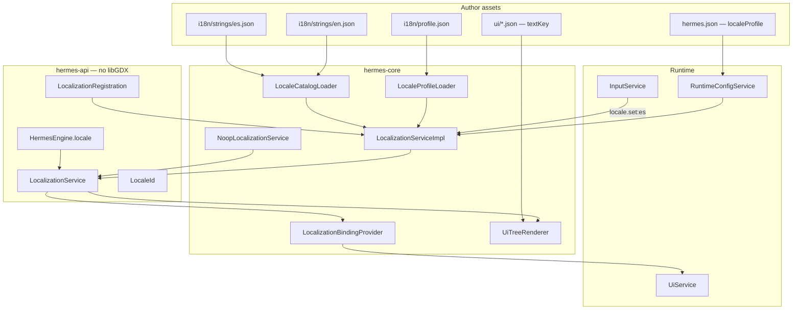

# Localization (i18n) Implementation Plan

> **For agentic workers:** REQUIRED SUB-SKILL: Use superpowers:subagent-driven-development (recommended) or superpowers:executing-plans to implement this plan task-by-task. Steps use checkbox (`- [ ]`) syntax for tracking.

> **Pre-release policy:** Nothing is shipped. Prefer clean design over compatibility. Games without a locale profile behave exactly as today (literal `"text"` in UI JSON). No migration shims — update dogfood, templates, tests, and docs in the same pass when `"textKey"` is adopted.

**Goal:** Ship an optional `LocalizationService` as the **single path** for player-facing text — config-driven string catalogs, runtime locale switching, and export/validate tooling — so authors can build monolingual games with zero i18n assets while multilingual projects can translate from one canonical key catalog with minimal Java.

**Architecture:** Stable **text keys** (dot-ids like `menu.play`) live in per-locale JSON catalogs under `assets/i18n/`. `LocalizationService` on `HermesEngine` resolves keys for the active locale with fallback chain. UI widgets gain optional `"textKey"` (and v1 `"textArgs"`) alongside existing literal `"text"`. When no `localeProfile` is configured, `NoopLocalizationService` passes through literals unchanged. Tooling (`hermes i18n export|validate`) scans UI/scene/entity assets and catalogs so translators receive one file per locale. libGDX-free types in `hermes-api`; JSON load and `MessageFormat` in `hermes-core`.

**Tech Stack:** Java 11, libGDX `JsonReader` / `FileHandle` (core only), `java.text.MessageFormat`, JUnit 5, Gradle `:hermes-core:test`, `hermes-tooling` for CLI, existing `RuntimeConfigService`, `UiService`, `SceneStack`.

---

## Current baseline (repo state)

| Area | Today | After this plan |
|------|-------|-----------------|
| Player text | Literal `"text"` on UI `label` / `button` only | Optional `"textKey"` + catalogs; literal `"text"` still valid |
| Engine services | `HermesEngine`: scenes, input, ui, audio, runtimeConfig — **no `locale()`** | `LocalizationService locale()` |
| Config | `hermes.json`: scene, pipeline, input, audio profiles | Optional `localeProfile` |
| Runtime override | `-Dhermes.*` via `RuntimeConfigService` | `-Dhermes.locale=es` selects active locale |
| Translation workflow | Manual copy/paste in JSON | `hermes i18n export` / `validate`; Gradle CI task |
| Dynamic text | `engine.ui().setBinding(...)` only | `engine.locale().format(key, args…)` + UI `textArgs` |
| Save preference | N/A | v2: `SessionPersistable` locale id (when save plan lands) |

Relevant existing types to reuse:

- `UiService` / `UiTreeRenderer` — resolve `textKey` at draw time (same pass as bindings)
- `UiBindingResolver` — pattern for `LocalizationBindingProvider` (`i18n.*` keys)
- `RuntimeConfigService` + `LaunchConfigResolver` + `RuntimeConfigKeys` — profile path + `-Dhermes.locale`
- `HermesGameConfig` / `HermesGameConfigParser` — `localeProfile` in `hermes.json`
- `InputService` + `input/profile.json` — `locale.next` / `locale.set` actions (no-code language menu)
- `SceneStack.onSceneEnter` — hook locale catalog preload per scene (optional scene `"locale"` block v2)
- `ServiceLoader` — `LocalizationRegistration` SPI (custom catalogs, remote strings)
- `HermesAssetPaths.internal(...)` — asset loading convention

---

## Design goals

| Goal | How |
|------|-----|
| **Optional** | No profile → `NoopLocalizationService`; literal UI text unchanged |
| **No-code-first** | `localeProfile` + catalogs + `"textKey"` in UI JSON + input actions for locale switch |
| **Easy translation handoff** | Flat dot-keys; one JSON per locale; `hermes i18n export --format csv` |
| **Maintainable catalogs** | Keys stable across locales; missing key → fallback locale → dev literal `"text"` |
| **Generalized** | Same service for UI, future dialogue/subtitles, entity nameplates, custom SPI |
| **Progressive complexity** | Tiers 0–5 (below) |
| **Extensible** | `LocalizationRegistration` SPI; programmatic `setLocale`, `format`, custom providers |
| **libGDX-free API** | `LocalizationService` in `hermes-api`; loaders in `hermes-core` |

### Author complexity tiers

| Tier | Author writes | Engine does |
|------|---------------|-------------|
| **0 — Monolingual** | Literal `"text": "Play"` in UI JSON (today) | No locale profile; zero i18n overhead |
| **1 — Profile + keys** | `i18n/profile.json`, `i18n/strings/en.json`, UI `"textKey": "menu.play"` | Resolve at draw; fallback to `"text"` if key missing |
| **2 — Multilingual** | `i18n/strings/es.json`, … + `"textKey"` everywhere | `setLocale("es")` or input action; fallback chain |
| **3 — Dynamic strings** | `"textKey": "hud.level"`, `"textArgs": { "level": { "binding": "player.level" } }` | `MessageFormat` with binding-resolved args |
| **4 — Settings menu** | UI language picker buttons → actions `locale.set:es` + input profile bindings | Switch locale at runtime; redraw active UI |
| **5 — Full control** | `LocalizationRegistration` SPI, `engine.locale().registerCatalog(...)`, Java `format()` | Custom sources, A/B text, live updates |

**Honest v1 limits:** No ICU plural rules (`{count, plural, …}`) — use separate keys (`items.one` / `items.other`) or Java `formatChoice()`. No RTL/bidi layout (document extension point). No automatic machine translation. Scene-level catalog overlays deferred to v2. Input action **display names** stay English in v1 (keys only in UI).

---

## Relationship to other plans

| Plan | Status | How this plan uses it |
|------|--------|------------------------|
| [Custom UI service](2026-05-29-custom-ui-service.md) | Landed | `"textKey"` / `"textArgs"` on `label`, `button`; draw-time resolve |
| [Unified runtime config](2026-05-24-unified-runtime-config-service.md) | Landed | `gameLocaleProfile()`, `hermes.locale` key via `LaunchConfigResolver` |
| [Save/load sessions](2026-05-22-save-load-sessions.md) | Not landed | v2: persist `locale` in session block via `SessionPersistable` |
| [Unified input](2026-05-21-unified-input-system.md) | Landed | `locale.next`, `locale.set:es` actions for no-code language toggle |
| [Audio system](2026-05-22-audio-system.md) | Not landed | v2: subtitle tracks reference same text keys |
| [Debug mode](2026-05-30-debug-mode.md) | Not landed | v2: overlay `locale.active`, `locale.missingKeys` |
| [World space & camera](2026-05-30-world-space-and-scene-camera.md) | Not landed | No conflict |
| [Animations & drawables](2026-05-30-animations-and-drawables.md) | Not landed | No conflict |

**Recommended order:**

1. **This plan** — after Custom UI (landed); parallel with save/audio.
2. **Save plan** — add `locale` to default session capture when both land.
3. **Audio plan** — subtitle component uses `textKey` field.

---

## Architecture

### Conceptual model

Hermes separates **identity** (stable text key), **locale** (which catalog), and **presentation** (UI widget, future subtitle, nameplate):

| Concept | Owner | Purpose |
|---------|-------|---------|
| **Text key** | Author + catalogs | Stable id (`menu.play`) — never translated, only looked up |
| **Locale** | `LocalizationService` | Active language tag (`en`, `es`, `pt-BR`) |
| **Catalog** | `assets/i18n/strings/<locale>.json` | Key → template string for one locale |
| **Literal fallback** | UI JSON `"text"` | Dev default / monolingual / missing-key safety net |
| **Resolution** | `LocalizationService.resolve(key)` | Locale → fallback → literal → `[missing:key]` |



### Resolution pipeline

```text
resolve("menu.play")
  1. active locale catalog["menu.play"]
  2. fallback locale catalog["menu.play"]     (profile.fallbackLocale)
  3. dev catalog / inline default if registered
  4. return "[missing:menu.play]"             (debug builds only; release → key or empty)
```

For UI widgets at draw time:

```text
displayText(node):
  if node has textKey:
    args = resolveTextArgs(node.textArgs)      // bindings → Object map
    return locale.format(textKey, args)        // MessageFormat
  else:
    return node.text                           // literal tier 0
  if result blank and node.text present:
    return node.text                           // literal fallback
```

### File layout (game module)

```text
assets/
  i18n/
    profile.json                 # locales list, default, fallback
    strings/
      en.json                    # canonical key set (source for translators)
      es.json
      fr.json
  ui/
    main-menu.json               # "textKey": "menu.play"
  scenes/
    main-menu.json
hermes.json                      # "localeProfile": "i18n/profile.json"
```

### Asset formats

#### `i18n/profile.json` (version 1)

```json
{
  "version": 1,
  "defaultLocale": "en",
  "fallbackLocale": "en",
  "locales": [
    { "id": "en", "catalog": "i18n/strings/en.json", "labelKey": "locale.en" },
    { "id": "es", "catalog": "i18n/strings/es.json", "labelKey": "locale.es" }
  ]
}
```

| Field | Required | Description |
|-------|----------|-------------|
| `version` | Yes | Must be `1`. |
| `defaultLocale` | Yes | Used at boot when `-Dhermes.locale` unset. |
| `fallbackLocale` | Yes | Second-chance lookup (typically same as default or `en`). |
| `locales[]` | Yes | At least one entry. |
| `locales[].id` | Yes | BCP 47-ish tag (`en`, `es`, `pt-BR`). |
| `locales[].catalog` | Yes | Asset path to string file. |
| `locales[].labelKey` | No | Key for language picker UI (`locale.en` → `"English"`). |

#### `i18n/strings/en.json` (version 1)

```json
{
  "version": 1,
  "strings": {
    "menu.title": "Hermes Sample",
    "menu.play": "Play",
    "menu.quit": "Quit",
    "hud.health": "HP: {current}/{max}",
    "locale.en": "English",
    "locale.es": "Español"
  }
}
```

| Field | Required | Description |
|-------|----------|-------------|
| `version` | Yes | Must be `1`. |
| `strings` | Yes | Flat map: dot-key → template. Templates use `{name}` placeholders (`MessageFormat`). |

**Key naming convention (recommended, not enforced):**

| Prefix | Use |
|--------|-----|
| `menu.*` | Main menu, pause menu |
| `hud.*` | In-game HUD |
| `dialog.*` | Dialogue lines (future) |
| `locale.*` | Language names in settings |
| `error.*` | Player-facing errors (not log messages) |

### UI widget changes

`label` and `button` gain optional fields (see [ui-format-v1.md](../../ui-format-v1.md) update in Task 14):

```json
{
  "type": "button",
  "id": "play",
  "textKey": "menu.play",
  "text": "Play",
  "action": "start_game",
  "layout": { "anchor": "center", "width": 220, "height": 56 }
}
```

| Prop | Description |
|------|-------------|
| `textKey` | Stable catalog key. When locale service active, used for display. |
| `text` | Literal fallback (tier 0 monolingual; safety net when key missing). |
| `textArgs` | v1: map of placeholder name → `{ "binding": "dot.key" }` or literal `{ "value": 42 }`. |

Example dynamic HUD label (tier 3):

```json
{
  "type": "label",
  "id": "hp",
  "textKey": "hud.health",
  "textArgs": {
    "current": { "binding": "player.hp" },
    "max": { "binding": "player.hpMax" }
  },
  "layout": { "anchor": "bottomLeft", "width": 200, "height": 24 }
}
```

Custom widgets (SPI) receive resolved text via a shared helper: `LocalizationTextResolver.resolve(node, bindings)`.

### Runtime API (`hermes-api`)

```java
public interface LocalizationService {
    /** Active locale; noop returns {@link LocaleId#NONE}. */
    LocaleId activeLocale();

    /** Available locales from profile; empty when disabled. */
    List<LocaleInfo> availableLocales();

    /** Resolve key for active locale with fallback chain. Never null. */
    String resolve(String textKey);

    /** Resolve with {@link java.text.MessageFormat} placeholders. */
    String format(String textKey, Map<String, Object> args);

    /** Switch locale; no-op if unknown or service disabled. Fires listeners. */
    void setLocale(LocaleId locale);

    /** Register listener for locale changes (refresh UI, reload subtitles). */
    void addLocaleChangeListener(LocaleChangeListener listener);

    /** True when a locale profile was loaded at boot. */
    boolean enabled();
}
```

```java
public final class LocaleId {
    public static final LocaleId NONE = new LocaleId("");
    public String value() { … }
    public static LocaleId of(String tag) { … }
}
```

```java
public interface LocaleChangeListener {
    void onLocaleChanged(LocaleId previous, LocaleId current);
}
```

`HermesEngine` addition:

```java
LocalizationService locale();
```

### No-op behavior (tier 0)

When `localeProfile` absent or file missing:

- `NoopLocalizationService.enabled()` → `false`
- `resolve(key)` → returns `key` unchanged (or empty — **pick: return key** so `"textKey"` without profile still shows something in dev)
- UI: **`textKey` ignored**; only literal `"text"` drawn (matches today exactly)
- Zero catalog I/O, zero listeners

### Locale switching (tier 2–4)

1. Input action `locale.set:es` or `engine.locale().setLocale(LocaleId.of("es"))`.
2. `LocalizationServiceImpl` validates locale id, swaps active catalog, fires `LocaleChangeListener`.
3. `UiServiceImpl` registers listener → marks active scene UI dirty (re-layout not required; redraw resolves new strings).
4. Optional settings scene: buttons with `"action": "locale.set:es"` and `"textKey": "locale.es"`.

Input profile snippet:

```json
{
  "bindings": [
    { "action": "locale.next", "source": "keyboard", "key": "L", "modifiers": ["CTRL"] }
  ]
}
```

`LocaleInputSystem` (GLOBAL): on `locale.next` / `locale.prev` / `locale.set:*`, delegate to `LocalizationService`.

### Translation workflow (tooling)

| Command | Purpose |
|---------|---------|
| `hermes i18n export [--format json\|csv] [--out dir]` | Scan `assets/ui`, `assets/scenes`, `assets/entities` for `textKey`; merge with `en.json`; output translator template |
| `hermes i18n validate [--locale es]` | Fail CI if locale catalog missing keys present in canonical (`defaultLocale`) |
| `hermes i18n stats` | Count keys, coverage % per locale |

Gradle (game module):

```gradle
hermes {
  i18n {
    canonicalLocale = 'en'
    validateLocales = ['es', 'fr']
  }
}
```

Task `validateI18n` runs `hermes i18n validate` before `check`.

Export CSV columns: `key,en,es,fr,context,sourceFile`

- **context**: optional `# translator note` from catalog `"meta"` block v2
- **sourceFile**: `ui/main-menu.json:play` for traceability

### SPI extension (tier 5)

```text
META-INF/services/dev.hermes.api.locale.LocalizationRegistration
```

```java
public interface LocalizationRegistration {
    /** Merge or override strings for a locale at boot. */
    void contribute(LocaleId locale, MutableLocaleCatalog catalog);

    /** Optional dynamic resolve (live ops, A/B). Return empty to defer to static catalog. */
    default Optional<String> resolveDynamic(LocaleId locale, String textKey) {
        return Optional.empty();
    }
}
```

### Future extension points (document only — not v1 tasks)

| Feature | Hook |
|---------|------|
| Scene `"locale": { "catalog": "i18n/strings/chapter2-en.json" }` | Merge overlay catalog on `onSceneEnter` |
| Dialogue component | `"lineKey": "dialog.intro.1"` |
| Audio subtitles | `"subtitleKey": "dialog.intro.1"` synced to audio |
| ICU plurals | `LocalizationService.formatPlural(key, count, args)` v2 |
| RTL | `LocaleInfo.direction(): LTR \| RTL` → UI layout mirror v2 |
| Save/load | `SessionPersistable.capture()` includes `"locale": "es"` |

---

## File structure

### New files — `hermes-api`

| File | Responsibility |
|------|----------------|
| `dev/hermes/api/locale/LocalizationService.java` | Public service interface |
| `dev/hermes/api/locale/LocaleId.java` | Locale tag value type |
| `dev/hermes/api/locale/LocaleInfo.java` | id + catalog path + labelKey |
| `dev/hermes/api/locale/LocaleChangeListener.java` | Locale switch callback |
| `dev/hermes/api/locale/LocalizationRegistration.java` | SPI |
| `dev/hermes/api/locale/MutableLocaleCatalog.java` | SPI merge target |

### New files — `hermes-core`

| File | Responsibility |
|------|----------------|
| `dev/hermes/core/locale/NoopLocalizationService.java` | Disabled passthrough |
| `dev/hermes/core/locale/LocalizationServiceImpl.java` | Profile + catalogs + resolve |
| `dev/hermes/core/locale/LocaleProfileLoader.java` | Parse `profile.json` |
| `dev/hermes/core/locale/LocaleCatalogLoader.java` | Parse `strings/*.json` |
| `dev/hermes/core/locale/LocaleCatalog.java` | Immutable key → template map |
| `dev/hermes/core/locale/LocalizationTextResolver.java` | UI node textKey + textArgs |
| `dev/hermes/core/locale/LocalizationBindingProvider.java` | `UiBindingProvider` for `i18n.*` |
| `dev/hermes/core/locale/LocaleInputSystem.java` | Input actions → setLocale |
| `dev/hermes/core/locale/LocaleParseException.java` | Parse errors |

### New files — `hermes-tooling`

| File | Responsibility |
|------|----------------|
| `dev/hermes/tooling/i18n/I18nKeyScanner.java` | Scan JSON assets for textKey |
| `dev/hermes/tooling/i18n/I18nCatalogMerger.java` | Export merge logic |
| `dev/hermes/tooling/i18n/I18nValidator.java` | Missing-key checks |

### New files — `hermes-cli`

| File | Responsibility |
|------|----------------|
| `dev/hermes/cli/commands/I18nCommand.java` | `export`, `validate`, `stats` subcommands |

### Modified files

| File | Change |
|------|--------|
| `hermes-api/.../HermesEngine.java` | `LocalizationService locale()` |
| `hermes-core/.../HermesEngineImpl.java` | Wire service; load SPI; register `LocaleInputSystem` |
| `hermes-core/.../UiTreeRenderer.java` | Resolve textKey via `LocalizationTextResolver` |
| `hermes-core/.../UiServiceImpl.java` | Accept `LocalizationService`; locale change → redraw |
| `hermes-core/.../UiDocumentLoader.java` | Parse `textKey`, `textArgs` into `UiNode` props |
| `hermes-tooling/.../HermesGameConfig.java` | `localeProfile` field |
| `hermes-tooling/.../HermesGameConfigParser.java` | Parse `localeProfile` |
| `hermes-tooling/.../RuntimeConfigKeys.java` | `GAME_LOCALE_PROFILE`, `LOCALE` |
| `hermes-tooling/.../LaunchConfigResolver.java` | Emit new keys |
| `hermes-api/.../RuntimeConfigService.java` | `gameLocaleProfile()`, `localeOverride()` |
| `hermes-core/.../RuntimeConfigServiceImpl.java` | Implement accessors |
| `dogfood-simulation/.../ui/*.json` | Add `textKey` + catalogs (Task 13) |
| `docs/ui-format-v1.md`, `docs/runtime-config.md` | Document new fields |

---

## Implementation tasks

### Task 1: LocaleId and API skeleton

**Files:**
- Create: `hermes-api/src/main/java/dev/hermes/api/locale/LocaleId.java`
- Create: `hermes-api/src/main/java/dev/hermes/api/locale/LocaleInfo.java`
- Create: `hermes-api/src/main/java/dev/hermes/api/locale/LocaleChangeListener.java`
- Create: `hermes-api/src/main/java/dev/hermes/api/locale/LocalizationService.java`
- Create: `hermes-api/src/main/java/dev/hermes/api/locale/MutableLocaleCatalog.java`
- Create: `hermes-api/src/main/java/dev/hermes/api/locale/LocalizationRegistration.java`
- Create: `hermes-core/src/main/java/dev/hermes/core/locale/NoopLocalizationService.java`
- Test: `hermes-core/src/test/java/dev/hermes/core/locale/LocaleIdTest.java`

- [ ] **Step 1: Write the failing test**

```java
package dev.hermes.core.locale;

import dev.hermes.api.locale.LocaleId;
import org.junit.jupiter.api.Test;

import static org.junit.jupiter.api.Assertions.*;

class LocaleIdTest {

    @Test
    void of_normalizesBlankToNone() {
        assertEquals(LocaleId.NONE, LocaleId.of(null));
        assertEquals(LocaleId.NONE, LocaleId.of("  "));
    }

    @Test
    void of_trimsTag() {
        assertEquals("es", LocaleId.of(" es ").value());
    }

    @Test
    void none_isEmptyString() {
        assertTrue(LocaleId.NONE.value().isEmpty());
    }
}
```

- [ ] **Step 2: Run test to verify it fails**

Run: `./gradlew :hermes-core:test --tests dev.hermes.core.locale.LocaleIdTest -q`
Expected: FAIL — class `LocaleId` not found

- [ ] **Step 3: Write minimal implementation**

`LocaleId.java`:

```java
package dev.hermes.api.locale;

import java.util.Objects;

public final class LocaleId {

    public static final LocaleId NONE = new LocaleId("");

    private final String value;

    private LocaleId(String value) {
        this.value = value;
    }

    public static LocaleId of(String tag) {
        if (tag == null || tag.isBlank()) {
            return NONE;
        }
        return new LocaleId(tag.trim());
    }

    public String value() {
        return value;
    }

    @Override
    public boolean equals(Object o) {
        if (this == o) return true;
        if (!(o instanceof LocaleId)) return false;
        LocaleId localeId = (LocaleId) o;
        return value.equals(localeId.value);
    }

    @Override
    public int hashCode() {
        return value.hashCode();
    }

    @Override
    public String toString() {
        return "LocaleId{" + value + "}";
    }
}
```

`LocaleInfo.java`:

```java
package dev.hermes.api.locale;

import java.util.Objects;

public final class LocaleInfo {

    private final LocaleId id;
    private final String catalogPath;
    private final String labelKey;

    public LocaleInfo(LocaleId id, String catalogPath, String labelKey) {
        this.id = Objects.requireNonNull(id, "id");
        this.catalogPath = Objects.requireNonNull(catalogPath, "catalogPath");
        this.labelKey = labelKey == null ? "" : labelKey;
    }

    public LocaleId id() {
        return id;
    }

    public String catalogPath() {
        return catalogPath;
    }

    public String labelKey() {
        return labelKey;
    }
}
```

`LocaleChangeListener.java`:

```java
package dev.hermes.api.locale;

public interface LocaleChangeListener {
    void onLocaleChanged(LocaleId previous, LocaleId current);
}
```

`MutableLocaleCatalog.java`:

```java
package dev.hermes.api.locale;

public interface MutableLocaleCatalog {
    void put(String textKey, String template);
}
```

`LocalizationRegistration.java`:

```java
package dev.hermes.api.locale;

import java.util.Optional;

public interface LocalizationRegistration {
    void contribute(LocaleId locale, MutableLocaleCatalog catalog);

    default Optional<String> resolveDynamic(LocaleId locale, String textKey) {
        return Optional.empty();
    }
}
```

`LocalizationService.java`:

```java
package dev.hermes.api.locale;

import java.util.List;
import java.util.Map;

public interface LocalizationService {

    LocaleId activeLocale();

    List<LocaleInfo> availableLocales();

    String resolve(String textKey);

    String format(String textKey, Map<String, Object> args);

    void setLocale(LocaleId locale);

    void addLocaleChangeListener(LocaleChangeListener listener);

    boolean enabled();
}
```

`NoopLocalizationService.java`:

```java
package dev.hermes.core.locale;

import dev.hermes.api.locale.*;

import java.util.Collections;
import java.util.List;
import java.util.Map;

public final class NoopLocalizationService implements LocalizationService {

    @Override
    public LocaleId activeLocale() {
        return LocaleId.NONE;
    }

    @Override
    public List<LocaleInfo> availableLocales() {
        return Collections.emptyList();
    }

    @Override
    public String resolve(String textKey) {
        return textKey == null ? "" : textKey;
    }

    @Override
    public String format(String textKey, Map<String, Object> args) {
        return resolve(textKey);
    }

    @Override
    public void setLocale(LocaleId locale) {
        // no-op
    }

    @Override
    public void addLocaleChangeListener(LocaleChangeListener listener) {
        // no-op
    }

    @Override
    public boolean enabled() {
        return false;
    }
}
```

- [ ] **Step 4: Run test to verify it passes**

Run: `./gradlew :hermes-core:test --tests dev.hermes.core.locale.LocaleIdTest -q`
Expected: PASS

- [ ] **Step 5: Commit**

```bash
git add hermes-api/src/main/java/dev/hermes/api/locale/ \
        hermes-core/src/main/java/dev/hermes/core/locale/NoopLocalizationService.java \
        hermes-core/src/test/java/dev/hermes/core/locale/LocaleIdTest.java
git commit -m "feat(i18n): add LocalizationService API skeleton and LocaleId"
```

---

### Task 2: Locale catalog loader

**Files:**
- Create: `hermes-core/src/main/java/dev/hermes/core/locale/LocaleCatalog.java`
- Create: `hermes-core/src/main/java/dev/hermes/core/locale/LocaleCatalogLoader.java`
- Create: `hermes-core/src/main/java/dev/hermes/core/locale/LocaleParseException.java`
- Test: `hermes-core/src/test/java/dev/hermes/core/locale/LocaleCatalogLoaderTest.java`
- Test resource: `hermes-core/src/test/resources/assets/i18n/strings/en.json`

- [ ] **Step 1: Write the failing test**

Test resource `hermes-core/src/test/resources/assets/i18n/strings/en.json`:

```json
{
  "version": 1,
  "strings": {
    "menu.play": "Play",
    "hud.health": "HP: {current}/{max}"
  }
}
```

```java
package dev.hermes.core.locale;

import org.junit.jupiter.api.Test;

import static org.junit.jupiter.api.Assertions.*;

class LocaleCatalogLoaderTest {

    @Test
    void load_parsesFlatStrings() {
        LocaleCatalog catalog = LocaleCatalogLoader.load("i18n/strings/en.json");
        assertEquals("Play", catalog.resolve("menu.play"));
        assertEquals("HP: {current}/{max}", catalog.resolve("hud.health"));
    }

    @Test
    void resolve_unknownKey_returnsEmpty() {
        LocaleCatalog catalog = LocaleCatalogLoader.load("i18n/strings/en.json");
        assertEquals("", catalog.resolve("missing.key"));
    }
}
```

- [ ] **Step 2: Run test to verify it fails**

Run: `./gradlew :hermes-core:test --tests dev.hermes.core.locale.LocaleCatalogLoaderTest -q`
Expected: FAIL

- [ ] **Step 3: Write minimal implementation**

`LocaleParseException.java`:

```java
package dev.hermes.core.locale;

public final class LocaleParseException extends RuntimeException {
    public LocaleParseException(String message) {
        super(message);
    }

    public LocaleParseException(String message, Throwable cause) {
        super(message, cause);
    }
}
```

`LocaleCatalog.java`:

```java
package dev.hermes.core.locale;

import java.util.Collections;
import java.util.HashMap;
import java.util.Map;

public final class LocaleCatalog implements dev.hermes.api.locale.MutableLocaleCatalog {

    private final Map<String, String> strings;

    private LocaleCatalog(Map<String, String> strings) {
        this.strings = Collections.unmodifiableMap(new HashMap<>(strings));
    }

    public static LocaleCatalog empty() {
        return new LocaleCatalog(Map.of());
    }

    public static LocaleCatalog of(Map<String, String> strings) {
        return new LocaleCatalog(strings == null ? Map.of() : strings);
    }

    public String resolve(String textKey) {
        if (textKey == null || textKey.isBlank()) {
            return "";
        }
        return strings.getOrDefault(textKey, "");
    }

    public Map<String, String> asMap() {
        return strings;
    }

    @Override
    public void put(String textKey, String template) {
        throw new UnsupportedOperationException("immutable catalog");
    }
}
```

`LocaleCatalogLoader.java`:

```java
package dev.hermes.core.locale;

import com.badlogic.gdx.files.FileHandle;
import com.badlogic.gdx.utils.JsonReader;
import com.badlogic.gdx.utils.JsonValue;
import dev.hermes.core.HermesAssetPaths;

import java.nio.charset.StandardCharsets;
import java.util.LinkedHashMap;
import java.util.Map;

public final class LocaleCatalogLoader {

    private LocaleCatalogLoader() {}

    public static LocaleCatalog load(String assetPath) {
        if (assetPath == null || assetPath.isBlank()) {
            throw new LocaleParseException("Locale catalog asset path is required");
        }
        FileHandle handle = HermesAssetPaths.internal(assetPath);
        if (!handle.exists()) {
            throw new LocaleParseException("Locale catalog not found: " + assetPath);
        }
        return parse(assetPath, handle.readString(StandardCharsets.UTF_8.name()));
    }

    static LocaleCatalog parse(String assetPath, String json) {
        try {
            JsonValue root = new JsonReader().parse(json);
            if (root == null || !root.isObject()) {
                throw new LocaleParseException(assetPath + ": root must be a JSON object");
            }
            int version = root.getInt("version", 0);
            if (version != 1) {
                throw new LocaleParseException(assetPath + ": \"version\" must be 1");
            }
            JsonValue stringsNode = root.get("strings");
            if (stringsNode == null || !stringsNode.isObject()) {
                throw new LocaleParseException(assetPath + ": \"strings\" object is required");
            }
            Map<String, String> strings = new LinkedHashMap<>();
            for (JsonValue entry : stringsNode) {
                if (entry.name == null || entry.name.isBlank()) {
                    continue;
                }
                strings.put(entry.name, entry.asString(""));
            }
            return LocaleCatalog.of(strings);
        } catch (LocaleParseException e) {
            throw e;
        } catch (Exception e) {
            throw new LocaleParseException(assetPath + ": invalid locale catalog JSON: " + e.getMessage(), e);
        }
    }
}
```

Note: `LocaleCatalog` implements `MutableLocaleCatalog` read-only; Task 8 adds `MutableLocaleCatalogImpl` for SPI merge.

- [ ] **Step 4: Run test to verify it passes**

Run: `./gradlew :hermes-core:test --tests dev.hermes.core.locale.LocaleCatalogLoaderTest -q`
Expected: PASS

- [ ] **Step 5: Commit**

```bash
git add hermes-core/src/main/java/dev/hermes/core/locale/LocaleCatalog*.java \
        hermes-core/src/main/java/dev/hermes/core/locale/LocaleParseException.java \
        hermes-core/src/test/java/dev/hermes/core/locale/LocaleCatalogLoaderTest.java \
        hermes-core/src/test/resources/assets/i18n/
git commit -m "feat(i18n): load flat locale string catalogs from assets"
```

---

### Task 3: Locale profile loader

**Files:**
- Create: `hermes-core/src/main/java/dev/hermes/core/locale/LocaleProfile.java`
- Create: `hermes-core/src/main/java/dev/hermes/core/locale/LocaleProfileLoader.java`
- Test: `hermes-core/src/test/java/dev/hermes/core/locale/LocaleProfileLoaderTest.java`
- Test resource: `hermes-core/src/test/resources/assets/i18n/profile.json`

- [ ] **Step 1: Write the failing test**

`hermes-core/src/test/resources/assets/i18n/profile.json`:

```json
{
  "version": 1,
  "defaultLocale": "en",
  "fallbackLocale": "en",
  "locales": [
    { "id": "en", "catalog": "i18n/strings/en.json", "labelKey": "locale.en" },
    { "id": "es", "catalog": "i18n/strings/es-missing.json", "labelKey": "locale.es" }
  ]
}
```

Also create minimal `es-missing.json` with `"strings": {}` for path validation.

```java
package dev.hermes.core.locale;

import dev.hermes.api.locale.LocaleId;
import org.junit.jupiter.api.Test;

import static org.junit.jupiter.api.Assertions.*;

class LocaleProfileLoaderTest {

    @Test
    void load_readsDefaultAndLocales() {
        LocaleProfile profile = LocaleProfileLoader.load("i18n/profile.json");
        assertEquals(LocaleId.of("en"), profile.defaultLocale());
        assertEquals(LocaleId.of("en"), profile.fallbackLocale());
        assertEquals(2, profile.locales().size());
        assertEquals("i18n/strings/en.json", profile.catalogPathFor(LocaleId.of("en")).orElseThrow());
    }
}
```

- [ ] **Step 2: Run test to verify it fails**

Run: `./gradlew :hermes-core:test --tests dev.hermes.core.locale.LocaleProfileLoaderTest -q`
Expected: FAIL

- [ ] **Step 3: Write minimal implementation**

`LocaleProfile.java`:

```java
package dev.hermes.core.locale;

import dev.hermes.api.locale.LocaleId;
import dev.hermes.api.locale.LocaleInfo;

import java.util.List;
import java.util.Optional;

public final class LocaleProfile {

    private final LocaleId defaultLocale;
    private final LocaleId fallbackLocale;
    private final List<LocaleInfo> locales;

    public LocaleProfile(LocaleId defaultLocale, LocaleId fallbackLocale, List<LocaleInfo> locales) {
        this.defaultLocale = defaultLocale;
        this.fallbackLocale = fallbackLocale;
        this.locales = List.copyOf(locales);
    }

    public LocaleId defaultLocale() {
        return defaultLocale;
    }

    public LocaleId fallbackLocale() {
        return fallbackLocale;
    }

    public List<LocaleInfo> locales() {
        return locales;
    }

    public Optional<String> catalogPathFor(LocaleId id) {
        for (LocaleInfo info : locales) {
            if (info.id().equals(id)) {
                return Optional.of(info.catalogPath());
            }
        }
        return Optional.empty();
    }
}
```

`LocaleProfileLoader.java`:

```java
package dev.hermes.core.locale;

import com.badlogic.gdx.files.FileHandle;
import com.badlogic.gdx.utils.JsonReader;
import com.badlogic.gdx.utils.JsonValue;
import dev.hermes.api.locale.LocaleId;
import dev.hermes.api.locale.LocaleInfo;
import dev.hermes.core.HermesAssetPaths;

import java.nio.charset.StandardCharsets;
import java.util.ArrayList;
import java.util.List;

public final class LocaleProfileLoader {

    private LocaleProfileLoader() {}

    public static LocaleProfile load(String assetPath) {
        FileHandle handle = HermesAssetPaths.internal(assetPath);
        if (!handle.exists()) {
            throw new LocaleParseException("Locale profile not found: " + assetPath);
        }
        return parse(assetPath, handle.readString(StandardCharsets.UTF_8.name()));
    }

    static LocaleProfile parse(String assetPath, String json) {
        JsonValue root = new JsonReader().parse(json);
        int version = root.getInt("version", 0);
        if (version != 1) {
            throw new LocaleParseException(assetPath + ": \"version\" must be 1");
        }
        LocaleId defaultLocale = LocaleId.of(root.getString("defaultLocale", ""));
        LocaleId fallbackLocale = LocaleId.of(root.getString("fallbackLocale", defaultLocale.value()));
        JsonValue localesNode = root.get("locales");
        if (localesNode == null || !localesNode.isArray() || localesNode.size == 0) {
            throw new LocaleParseException(assetPath + ": \"locales\" array is required");
        }
        List<LocaleInfo> locales = new ArrayList<>();
        for (JsonValue entry : localesNode) {
            LocaleId id = LocaleId.of(entry.getString("id", ""));
            if (id.equals(LocaleId.NONE)) {
                throw new LocaleParseException(assetPath + ": locale entry requires non-blank \"id\"");
            }
            String catalog = entry.getString("catalog", "").trim();
            if (catalog.isEmpty()) {
                throw new LocaleParseException(assetPath + ": locale '" + id.value() + "' requires \"catalog\"");
            }
            String labelKey = entry.getString("labelKey", "");
            locales.add(new LocaleInfo(id, catalog, labelKey));
        }
        if (defaultLocale.equals(LocaleId.NONE)) {
            defaultLocale = locales.get(0).id();
        }
        return new LocaleProfile(defaultLocale, fallbackLocale, locales);
    }
}
```

- [ ] **Step 4: Run test to verify it passes**

Run: `./gradlew :hermes-core:test --tests dev.hermes.core.locale.LocaleProfileLoaderTest -q`
Expected: PASS

- [ ] **Step 5: Commit**

```bash
git add hermes-core/src/main/java/dev/hermes/core/locale/LocaleProfile*.java \
        hermes-core/src/test/java/dev/hermes/core/locale/LocaleProfileLoaderTest.java \
        hermes-core/src/test/resources/assets/i18n/profile.json \
        hermes-core/src/test/resources/assets/i18n/strings/es-missing.json
git commit -m "feat(i18n): parse locale profile with default and fallback locales"
```

---

### Task 4: LocalizationServiceImpl

**Files:**
- Create: `hermes-core/src/main/java/dev/hermes/core/locale/LocalizationServiceImpl.java`
- Create: `hermes-core/src/main/java/dev/hermes/core/locale/MutableLocaleCatalogImpl.java`
- Test: `hermes-core/src/test/java/dev/hermes/core/locale/LocalizationServiceImplTest.java`

- [ ] **Step 1: Write the failing test**

Create `hermes-core/src/test/resources/assets/i18n/strings/es.json`:

```json
{ "version": 1, "strings": { "menu.play": "Jugar" } }
```

Update test `profile.json` to point `es` catalog to `i18n/strings/es.json`.

```java
package dev.hermes.core.locale;

import dev.hermes.api.locale.LocaleId;
import org.junit.jupiter.api.Test;

import static org.junit.jupiter.api.Assertions.*;

class LocalizationServiceImplTest {

    @Test
    void resolve_usesActiveLocaleCatalog() {
        LocalizationServiceImpl svc = LocalizationServiceImpl.fromProfile("i18n/profile.json", LocaleId.NONE);
        assertEquals("Play", svc.resolve("menu.play"));
        svc.setLocale(LocaleId.of("es"));
        assertEquals("Jugar", svc.resolve("menu.play"));
    }

    @Test
    void resolve_fallsBackToFallbackLocale() {
        LocalizationServiceImpl svc = LocalizationServiceImpl.fromProfile("i18n/profile.json", LocaleId.of("es"));
        assertEquals("Play", svc.resolve("menu.title"));
    }

    @Test
    void format_substitutesNamedPlaceholders() {
        LocalizationServiceImpl svc = LocalizationServiceImpl.fromProfile("i18n/profile.json", LocaleId.NONE);
        assertEquals("HP: 3/10", svc.format("hud.health", java.util.Map.of("current", 3, "max", 10)));
    }
}
```

- [ ] **Step 2: Run test to verify it fails**

Run: `./gradlew :hermes-core:test --tests dev.hermes.core.locale.LocalizationServiceImplTest -q`
Expected: FAIL

- [ ] **Step 3: Write minimal implementation**

`MutableLocaleCatalogImpl.java`:

```java
package dev.hermes.core.locale;

import java.util.LinkedHashMap;
import java.util.Map;

final class MutableLocaleCatalogImpl implements dev.hermes.api.locale.MutableLocaleCatalog {

    private final Map<String, String> strings = new LinkedHashMap<>();

    void putAll(Map<String, String> other) {
        strings.putAll(other);
    }

    LocaleCatalog freeze() {
        return LocaleCatalog.of(strings);
    }

    @Override
    public void put(String textKey, String template) {
        strings.put(textKey, template);
    }
}
```

`LocalizationServiceImpl.java`:

```java
package dev.hermes.core.locale;

import dev.hermes.api.locale.*;

import java.text.MessageFormat;
import java.util.*;
import java.util.concurrent.CopyOnWriteArrayList;

public final class LocalizationServiceImpl implements LocalizationService {

    private final LocaleProfile profile;
    private final Map<LocaleId, LocaleCatalog> catalogs = new HashMap<>();
    private final List<LocaleChangeListener> listeners = new CopyOnWriteArrayList<>();
    private LocaleId activeLocale;

    private LocalizationServiceImpl(LocaleProfile profile, LocaleId bootLocale) {
        this.profile = profile;
        this.activeLocale = bootLocale.equals(LocaleId.NONE) ? profile.defaultLocale() : bootLocale;
        for (LocaleInfo info : profile.locales()) {
            catalogs.put(info.id(), LocaleCatalogLoader.load(info.catalogPath()));
        }
    }

    public static LocalizationServiceImpl fromProfile(String profilePath, LocaleId bootLocale) {
        LocaleProfile profile = LocaleProfileLoader.load(profilePath);
        return new LocalizationServiceImpl(profile, bootLocale);
    }

    @Override
    public LocaleId activeLocale() {
        return activeLocale;
    }

    @Override
    public List<LocaleInfo> availableLocales() {
        return profile.locales();
    }

    @Override
    public String resolve(String textKey) {
        return lookup(textKey, activeLocale, false);
    }

    @Override
    public String format(String textKey, Map<String, Object> args) {
        String template = resolve(textKey);
        if (template.isEmpty() || args == null || args.isEmpty()) {
            return template;
        }
        return new MessageFormat(template).format(args);
    }

    @Override
    public void setLocale(LocaleId locale) {
        if (locale == null || locale.equals(LocaleId.NONE)) {
            return;
        }
        if (!catalogs.containsKey(locale)) {
            return;
        }
        if (locale.equals(activeLocale)) {
            return;
        }
        LocaleId previous = activeLocale;
        activeLocale = locale;
        for (LocaleChangeListener listener : listeners) {
            listener.onLocaleChanged(previous, activeLocale);
        }
    }

    @Override
    public void addLocaleChangeListener(LocaleChangeListener listener) {
        if (listener != null) {
            listeners.add(listener);
        }
    }

    @Override
    public boolean enabled() {
        return true;
    }

    private String lookup(String textKey, LocaleId locale, boolean allowMissingMarker) {
        if (textKey == null || textKey.isBlank()) {
            return "";
        }
        String value = catalogValue(locale, textKey);
        if (!value.isEmpty()) {
            return value;
        }
        if (!profile.fallbackLocale().equals(locale)) {
            value = catalogValue(profile.fallbackLocale(), textKey);
            if (!value.isEmpty()) {
                return value;
            }
        }
        return allowMissingMarker ? "[missing:" + textKey + "]" : "";
    }

    private String catalogValue(LocaleId locale, String textKey) {
        LocaleCatalog catalog = catalogs.get(locale);
        return catalog == null ? "" : catalog.resolve(textKey);
    }
}
```

(`MessageFormat.format(Map)` resolves `{name}` placeholders in the template.)

- [ ] **Step 4: Run test to verify it passes**

Run: `./gradlew :hermes-core:test --tests dev.hermes.core.locale.LocalizationServiceImplTest -q`
Expected: PASS

- [ ] **Step 5: Commit**

```bash
git add hermes-core/src/main/java/dev/hermes/core/locale/LocalizationServiceImpl.java \
        hermes-core/src/main/java/dev/hermes/core/locale/MutableLocaleCatalogImpl.java \
        hermes-core/src/test/java/dev/hermes/core/locale/LocalizationServiceImplTest.java \
        hermes-core/src/test/resources/assets/i18n/strings/es.json
git commit -m "feat(i18n): implement LocalizationServiceImpl with fallback and MessageFormat"
```

---

### Task 5: Runtime config and hermes.json wiring

**Files:**
- Modify: `hermes-tooling/src/main/java/dev/hermes/tooling/launch/RuntimeConfigKeys.java`
- Modify: `hermes-tooling/src/main/java/dev/hermes/tooling/config/HermesGameConfig.java`
- Modify: `hermes-tooling/src/main/java/dev/hermes/tooling/config/HermesGameConfigParser.java`
- Modify: `hermes-tooling/src/main/java/dev/hermes/tooling/launch/LaunchConfigResolver.java`
- Modify: `hermes-api/src/main/java/dev/hermes/api/config/RuntimeConfigService.java`
- Modify: `hermes-core/src/main/java/dev/hermes/core/config/RuntimeConfigServiceImpl.java`
- Test: `hermes-tooling/src/test/java/dev/hermes/tooling/launch/LaunchConfigResolverTest.java` (add case)

- [ ] **Step 1: Write the failing test**

Add to `LaunchConfigResolverTest`:

```java
@Test
void resolvesLocaleProfileFromHermesJson() {
    HermesLaunchProperties props = resolver.resolve(/* game config with localeProfile */);
    assertEquals("i18n/profile.json", props.asMap().get(RuntimeConfigKeys.GAME_LOCALE_PROFILE));
}
```

Add keys:

```java
public static final String GAME_LOCALE_PROFILE = "hermes.game.localeProfile";
public static final String LOCALE = "hermes.locale";
```

`HermesGameConfig`:

```java
private String localeProfile = "";

public String getLocaleProfile() { return localeProfile; }
public void setLocaleProfile(String localeProfile) { this.localeProfile = localeProfile; }
```

`RuntimeConfigService`:

```java
String gameLocaleProfile();
String localeOverride();
```

- [ ] **Step 2: Run test to verify it fails**

Run: `./gradlew :hermes-tooling:test --tests '*LaunchConfigResolverTest*' -q`
Expected: FAIL

- [ ] **Step 3: Implement resolver + service accessors**

Wire `localeProfile` from `hermes.json`; `-Dhermes.locale=es` → `LOCALE` key; empty profile → empty string.

- [ ] **Step 4: Run tests**

Run: `./gradlew :hermes-tooling:test :hermes-core:test -q`
Expected: PASS

- [ ] **Step 5: Commit**

```bash
git commit -m "feat(i18n): wire localeProfile and hermes.locale through runtime config"
```

---

### Task 6: HermesEngine.locale() bootstrap

**Files:**
- Modify: `hermes-api/src/main/java/dev/hermes/api/ecs/HermesEngine.java`
- Modify: `hermes-core/src/main/java/dev/hermes/core/ecs/HermesEngineImpl.java`
- Create: `hermes-core/src/main/java/dev/hermes/core/locale/LocalizationServices.java`
- Test: `hermes-core/src/test/java/dev/hermes/core/locale/LocalizationServicesTest.java`

- [ ] **Step 1: Write the failing test**

```java
@Test
void create_returnsNoopWhenProfileMissing() {
    LocalizationService svc = LocalizationServices.create(RuntimeConfigServices.forTest(Map.of()));
    assertFalse(svc.enabled());
}

@Test
void create_loadsProfileWhenConfigured() {
    LocalizationService svc = LocalizationServices.create(
            RuntimeConfigServices.forTest(Map.of(
                    RuntimeConfigKeys.GAME_LOCALE_PROFILE, "i18n/profile.json")));
    assertTrue(svc.enabled());
    assertEquals("Play", svc.resolve("menu.play"));
}
```

- [ ] **Step 2–4: Implement factory, wire `HermesEngineImpl.locale()`, load `LocalizationRegistration` via `ServiceLoader`**

`LocalizationServices.create(RuntimeConfigService)`:

```java
public static LocalizationService create(RuntimeConfigService config) {
    String profilePath = config.gameLocaleProfile();
    if (profilePath == null || profilePath.isBlank()) {
        return new NoopLocalizationService();
    }
    LocaleId boot = LocaleId.of(config.localeOverride());
    LocalizationServiceImpl impl = LocalizationServiceImpl.fromProfile(profilePath, boot);
    for (LocalizationRegistration reg : ServiceLoader.load(LocalizationRegistration.class)) {
        for (LocaleInfo info : impl.availableLocales()) {
            MutableLocaleCatalogImpl mutable = new MutableLocaleCatalogImpl();
            reg.contribute(info.id(), mutable);
            // merge into impl — add package method mergeCatalog(locale, mutable)
        }
    }
    return impl;
}
```

- [ ] **Step 5: Commit**

```bash
git commit -m "feat(i18n): expose LocalizationService on HermesEngine"
```

---

### Task 7: UI textKey resolution

**Files:**
- Create: `hermes-core/src/main/java/dev/hermes/core/locale/LocalizationTextResolver.java`
- Modify: `hermes-core/src/main/java/dev/hermes/core/ui/UiTreeRenderer.java`
- Modify: `hermes-core/src/main/java/dev/hermes/core/ui/UiServiceImpl.java`
- Test: `hermes-core/src/test/java/dev/hermes/core/locale/LocalizationTextResolverTest.java`

- [ ] **Step 1: Write the failing test**

```java
@Test
void resolvesTextKeyWhenServiceEnabled() {
    LocalizationService locale = LocalizationServiceImpl.fromProfile("i18n/profile.json", LocaleId.NONE);
    UiNode node = new UiNode("label");
    node.setProp("textKey", "menu.play");
    node.setProp("text", "Play");
    String out = LocalizationTextResolver.resolve(node, locale, key -> null);
    assertEquals("Play", out);
}

@Test
void usesLiteralWhenServiceDisabled() {
    UiNode node = new UiNode("label");
    node.setProp("textKey", "menu.play");
    node.setProp("text", "Play");
    String out = LocalizationTextResolver.resolve(node, new NoopLocalizationService(), key -> null);
    assertEquals("Play", out);
}
```

- [ ] **Step 3: Implement `LocalizationTextResolver`**

```java
public final class LocalizationTextResolver {

    private LocalizationTextResolver() {}

    public static String resolve(UiNode node, LocalizationService locale, Function<String, Object> bindings) {
        String literal = stringProp(node, "text", "");
        if (!locale.enabled()) {
            return literal;
        }
        String textKey = stringProp(node, "textKey", "");
        if (textKey.isEmpty()) {
            return literal;
        }
        Map<String, Object> args = resolveTextArgs(node, bindings);
        String resolved = args.isEmpty() ? locale.resolve(textKey) : locale.format(textKey, args);
        return resolved.isEmpty() ? literal : resolved;
    }

    // resolveTextArgs: read node.prop("textArgs") map with binding/value entries
}
```

Update `UiTreeRenderer.drawLabel` / `drawButton`:

```java
String text = LocalizationTextResolver.resolve(node, localization, bindings);
```

Pass `LocalizationService` into `UiTreeRenderer` constructor from `UiServiceImpl`.

- [ ] **Step 5: Commit**

```bash
git commit -m "feat(i18n): resolve UI textKey at draw time with literal fallback"
```

---

### Task 8: Locale change refreshes UI

**Files:**
- Modify: `hermes-core/src/main/java/dev/hermes/core/ui/UiServiceImpl.java`
- Test: `hermes-core/src/test/java/dev/hermes/core/ui/UiServiceLocaleRefreshTest.java`

- [ ] **Step 1: Write test** — mock listener: after `setLocale("es")`, next `resolve` on menu node returns `"Jugar"`.

- [ ] **Step 3: In `UiServiceImpl` constructor**, register:

```java
localization.addLocaleChangeListener((prev, cur) -> { /* no cache invalidation needed if resolve is per-frame */ });
```

Resolution is already per-frame in `UiTreeRenderer` — test documents behavior; optional `UiBindingProvider` refresh if caching added later.

- [ ] **Step 5: Commit**

```bash
git commit -m "feat(i18n): wire locale change listener to UiService"
```

---

### Task 9: LocalizationBindingProvider

**Files:**
- Create: `hermes-core/src/main/java/dev/hermes/core/locale/LocalizationBindingProvider.java`
- Modify: `hermes-core/src/main/java/dev/hermes/core/ecs/HermesEngineImpl.java`
- Test: `hermes-core/src/test/java/dev/hermes/core/locale/LocalizationBindingProviderTest.java`

- [ ] **Step 1: Write test**

```java
@Test
void resolvesI18nPrefixKeys() {
    LocalizationBindingProvider p = new LocalizationBindingProvider(locale);
    assertEquals("Play", p.resolve("i18n.menu.play").orElseThrow());
    assertTrue(p.resolve("player.hp").isEmpty());
}
```

- [ ] **Step 3: Implement** — strip `i18n.` prefix, call `locale.resolve`.

Register in engine bootstrap: `ui.addBindingProvider(new LocalizationBindingProvider(locale))`.

- [ ] **Step 5: Commit**

```bash
git commit -m "feat(i18n): add UiBindingProvider for i18n.* keys"
```

---

### Task 10: LocaleInputSystem

**Files:**
- Create: `hermes-core/src/main/java/dev/hermes/core/locale/LocaleInputSystem.java`
- Modify: `hermes-core/src/main/java/dev/hermes/core/ecs/HermesEngineImpl.java`
- Test: `hermes-core/src/test/java/dev/hermes/core/locale/LocaleInputSystemTest.java`

- [ ] **Step 1: Write test** — pulse `locale.set:es` action → active locale becomes `es`.

- [ ] **Step 3: Implement system**

```java
public final class LocaleInputSystem implements System {
    // on action pulse:
    // "locale.next" -> cycle availableLocales
    // "locale.prev" -> cycle reverse
    // "locale.set:es" -> setLocale(es)
}
```

Register as GLOBAL in `HermesEngineImpl`.

- [ ] **Step 5: Commit**

```bash
git commit -m "feat(i18n): add LocaleInputSystem for no-code locale switching"
```

---

### Task 11: I18n tooling — scanner and validator

**Files:**
- Create: `hermes-tooling/src/main/java/dev/hermes/tooling/i18n/I18nKeyScanner.java`
- Create: `hermes-tooling/src/main/java/dev/hermes/tooling/i18n/I18nValidator.java`
- Test: `hermes-tooling/src/test/java/dev/hermes/tooling/i18n/I18nValidatorTest.java`

- [ ] **Step 1: Write test** — scan sample UI JSON with `textKey`; validator reports missing key in `es.json`.

- [ ] **Step 3: Implement scanner**

Walk JSON trees recursively; collect string values of property `"textKey"`. Record source path + node id for export context.

`I18nValidator.validate(canonicalCatalog, localeCatalog)` → list of missing keys.

- [ ] **Step 5: Commit**

```bash
git commit -m "feat(i18n): add key scanner and catalog validator in hermes-tooling"
```

---

### Task 12: CLI `hermes i18n`

**Files:**
- Create: `hermes-cli/src/main/java/dev/hermes/cli/commands/I18nCommand.java`
- Modify: `hermes-cli/src/main/java/dev/hermes/cli/HermesCli.java`
- Test: `hermes-cli/src/test/java/dev/hermes/cli/commands/I18nCommandTest.java`

- [ ] **Step 1: Write test** — `validate` exits non-zero when es missing keys.

- [ ] **Step 3: Implement subcommands**

```java
@Command(name = "i18n", subcommands = { ExportCommand.class, ValidateCommand.class, StatsCommand.class })
public class I18nCommand {}
```

- [ ] **Step 5: Commit**

```bash
git commit -m "feat(i18n): add hermes i18n export and validate CLI commands"
```

---

### Task 13: Dogfood and templates migration

**Files:**
- Create: `dogfood-simulation/src/main/resources/assets/i18n/profile.json`
- Create: `dogfood-simulation/src/main/resources/assets/i18n/strings/en.json`
- Modify: `dogfood-simulation/hermes.json`
- Modify: `dogfood-simulation/src/main/resources/assets/ui/main-menu.json`
- Modify: `dogfood-simulation/src/main/resources/assets/ui/pause-menu.json`
- Modify: `dogfood-simulation/src/main/resources/assets/ui/hud.json`

- [ ] **Step 1: Add catalogs with all keys from dogfood UI**

`en.json` keys: `menu.title`, `menu.play`, `menu.quit`, `pause.title`, `pause.resume`, `pause.quit`, etc.

- [ ] **Step 2: Update UI JSON** — add `"textKey"` alongside existing `"text"`.

Example `main-menu.json` button:

```json
{
  "type": "button",
  "id": "play",
  "textKey": "menu.play",
  "text": "Play",
  "action": "start_game",
  "layout": { "anchor": "center", "offsetY": 24, "width": 220, "height": 56 }
}
```

- [ ] **Step 3: Update hermes.json**

```json
{
  "title": "HermesSample",
  "scene": "scenes/main-menu.json",
  "renderPipeline": "render/pipeline.json",
  "inputProfile": "input/profile.json",
  "audioProfile": "audio/profile.json",
  "localeProfile": "i18n/profile.json"
}
```

- [ ] **Step 4: Run dogfood**

Run: `./gradlew :dogfood-simulation:runDesktop -q` (or project run task)
Expected: Menu shows same English strings; `-Dhermes.locale=es` after adding `es.json` shows Spanish.

- [ ] **Step 5: Commit**

```bash
git commit -m "feat(i18n): migrate dogfood UI to textKey and locale catalogs"
```

---

### Task 14: Documentation

**Files:**
- Create: `docs/localization.md`
- Modify: `docs/ui-format-v1.md`
- Modify: `docs/runtime-config.md`
- Modify: `docs/ARCHITECTURE.md`

- [ ] **Step 1: Write `docs/localization.md`** — tiers, asset formats, translation workflow, API examples, SPI, future hooks.

- [ ] **Step 2: Update ui-format-v1.md** — document `textKey`, `textArgs` on label/button.

- [ ] **Step 3: Update runtime-config.md** — `hermes.game.localeProfile`, `hermes.locale`.

- [ ] **Step 4: Commit**

```bash
git commit -m "docs: add localization guide and update UI/runtime config docs"
```

---

## User project guide

### Monolingual game (tier 0) — no changes required

Keep literal `"text"` in UI JSON. Omit `localeProfile` from `hermes.json`. Engine uses `NoopLocalizationService`.

### Multilingual game (tier 1–2)

1. Add `assets/i18n/profile.json` and `assets/i18n/strings/en.json` (canonical).
2. Add translated files (`es.json`, …).
3. Set `"localeProfile": "i18n/profile.json"` in `hermes.json`.
4. Replace UI `"text"` with `"textKey"` + keep `"text"` as English dev fallback.
5. Run `hermes i18n validate` in CI.
6. Optional: settings scene with buttons `"action": "locale.set:es"`.

### Sending work to translators

```bash
cd game/
hermes i18n export --format csv --out build/i18n-export/
# Send translators: menu.play, en=Play, es=, fr=, context=ui/main-menu.json:play
# Translators fill es/fr columns; merge back:
hermes i18n import --csv build/i18n-export/strings.csv   # v2 CLI; v1: manual JSON edit
hermes i18n validate
```

### Java hooks (tier 5)

```java
@Override
public void onCreate(HermesEngine engine) {
    engine.locale().setLocale(LocaleId.of("es"));
    engine.ui().setBinding("player.level", 3);
    String msg = engine.locale().format("hud.level", Map.of("level", 3));
}
```

Custom catalog SPI in game module:

```java
public final class ModLocalization implements LocalizationRegistration {
    @Override
    public void contribute(LocaleId locale, MutableLocaleCatalog catalog) {
        if ("en".equals(locale.value())) {
            catalog.put("mod.extra", "Downloaded content");
        }
    }
}
```

Register via `META-INF/services/dev.hermes.api.locale.LocalizationRegistration`.

---

## Self-review

### Spec coverage

| Requirement | Task |
|-------------|------|
| Optional i18n | Task 6 Noop; tier 0 docs |
| Easy translation export | Task 11–12 |
| Config-first | Tasks 5, 13 |
| UI text | Task 7 |
| Runtime locale switch | Tasks 4, 8, 10 |
| Dynamic placeholders | Task 4 format; Task 7 textArgs |
| SPI extension | Tasks 1, 6 |
| Future save/audio/dialogue | Architecture section + save plan cross-ref |
| No backward compat shims | Pre-release policy header |

### Placeholder scan

No TBD steps; all tasks include concrete code paths and test commands.

### Type consistency

- `textKey` used consistently in UI JSON, scanner, resolver
- `LocaleId` used in service API throughout
- `LocalizationService` on `HermesEngine` as `locale()` matching `ui()`, `audio()` naming

---

## Execution handoff

**Plan complete and saved to `docs/superpowers/plans/2026-05-30-localization-i18n.md`. Two execution options:**

**1. Subagent-Driven (recommended)** — dispatch a fresh subagent per task, review between tasks, fast iteration

**2. Inline Execution** — execute tasks in this session using executing-plans, batch execution with checkpoints

**Which approach?**
