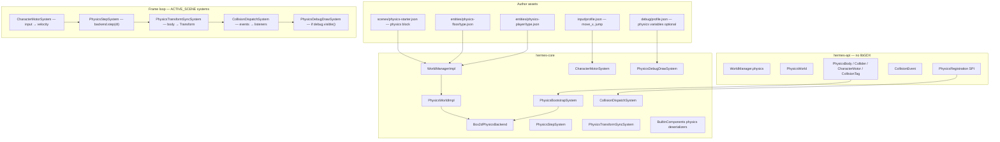

# Physics, Collisions, and Simulation Debug Integration Plan

> **For agentic workers:** REQUIRED SUB-SKILL: Use superpowers:subagent-driven-development (recommended) or superpowers:executing-plans to implement this plan task-by-task. Steps use checkbox (`- [ ]`) syntax for tracking.

> **Pre-release policy:** Nothing is shipped. Prefer clean design over compatibility. Delete dead code; do not layer interim hacks. Export builds must not pay runtime cost for **debug-only** physics tooling (wireframes, metrics panels, tweak variables). Gameplay physics runs in exports when the scene uses it.

**Goal:** Add optional **2D physics** (gravity, collisions, character move + jump) driven by scene JSON and entity templates, with a stock **physics starter** scene (floor + dynamic box that stays on the floor), plus **debug-mode hooks** so authors can inspect and tune simulation during development.

**Architecture:** libGDX-free **components** (`PhysicsBody`, `Collider`, `CharacterMotor`, `CollisionTag`) and a **`PhysicsWorld`** service on each scene's `WorldManager`. **Box2D** (via `gdx-box2d`) is the v1 backend behind a small `PhysicsBackend` interface so a future 3D backend can swap in. ECS systems bootstrap bodies from entities, step simulation, sync **body → `Transform`**, and dispatch collision events. **`CharacterMotorSystem`** reads input actions and applies horizontal velocity + jump impulses. Debug wireframes and tunable gravity come from [debug mode](2026-05-30-debug-mode.md) (`DebugService` variables + `PhysicsDebugRegistration` SPI) — zero export cost when `hermes.debug=false`.

**Tech Stack:** Java 11, libGDX 1.14.0 + `gdx-box2d`, JUnit 5, existing ECS (`WorldManager`, `EntityStore`, `EntityFactory`), `InputService`, `DebugService` (from debug-mode plan), Gradle launcher native deps.

---

## Current baseline (repo state)

| Area | Today | After this plan |
|------|-------|-----------------|
| Physics | None | Optional per-scene Box2D world |
| Collision | `Selectable` screen picks only | Physical colliders + trigger sensors + collision events |
| Movement | Manual systems / drag | Config `CharacterMotor` (move + jump) |
| Scene root | `WorldManager.entities()` only | Adds `WorldManager.physics()` |
| Starter demo | Spin cube (no physics) | `physics-starter` scene: floor + player box |
| Debug + sim | Not implemented | Physics metrics/wireframes when debug overlay visible |
| Dependencies | `gdx` only in core | `gdx-box2d` + platform natives in launchers |

Relevant existing types to reuse:

- `Transform` — synced from physics bodies each frame (dynamic entities)
- `EntityFactory` / entity templates — floor and player as `entities/*/type.json`
- `InputService.actions()` — `move_x`, `jump` actions (input-format-v1 already documents axes)
- `ComponentRegistration` SPI — pattern for `PhysicsRegistration`
- `WorldManager` — per-scene simulation root ([entity-types plan](2026-05-21-entity-types-and-world-manager.md) — **landed**)
- `DebugService` / `DebugRegistration` — from [debug-mode plan](2026-05-30-debug-mode.md) (**not landed**; physics debug tasks assume it)

---

## Design goals

| Goal | How |
|------|-----|
| **Optional per entity** | Only entities with `PhysicsBody` + `Collider` participate; others unchanged |
| **No-code starter** | Scene JSON + templates + input profile → floor, box, move, jump |
| **Progressive complexity** | Tiers 0–4 (below): static floor → dynamic body → motor → collision handlers → custom backend |
| **Minimal export debug cost** | Wireframes/metrics/variables gated on `hermes.debug`; gameplay physics unchanged |
| **Generalized & extensible** | `PhysicsBackend` + `PhysicsRegistration` SPI; open collision tag strings |
| **Maintainable** | libGDX/Box2D only in `hermes-core`; `hermes-api` stays libGDX-free |
| **Easy balancing** | Debug variables `physics.gravityY`, `physics.timeScale` (via `SimulationClock`) |

### Author complexity tiers

| Tier | Author writes | Engine does |
|------|---------------|-------------|
| **0 — Static colliders** | `PhysicsBody` + `Collider` on floor entity | Static Box2D body, no motion |
| **1 — Dynamic props** | `"bodyType": "dynamic"` on crate | Gravity, collision response, Transform sync |
| **2 — Playable character** | `CharacterMotor` + input actions | Move axis, jump, grounded detection |
| **3 — Gameplay reactions** | `CollisionTag` + Java `CollisionListener` SPI | Begin/end contact events |
| **4 — Custom simulation** | Custom `PhysicsBackend` or motor system | Swap backend or replace motor logic |

---

## Relationship to other plans

| Plan | Status | How physics plan uses it |
|------|--------|---------------------------|
| [Debug mode](2026-05-30-debug-mode.md) | Not landed | Physics wireframe draw, gravity variable, body/contact metrics, sim pause/time scale |
| [Entity types](2026-05-21-entity-types-and-world-manager.md) | Landed | Floor/player templates; `$ref` Collider size from Transform scale |
| [Unified input](2026-05-21-unified-input-system.md) | Landed | `move_x` axis, `jump` button in motor |
| [Unified runtime config](2026-05-24-unified-runtime-config-service.md) | Landed | Optional `hermes.physics` flag (default enable) |
| [World lighting](2026-05-26-world-lighting.md) | Not landed | Independent; lit meshes on physics entities work as today |
| [Custom UI service](2026-05-29-custom-ui-service.md) | Not landed | Independent |

**Recommended order:**

1. Land **entity-types** (done) and **debug mode Tasks 1–4** (`SimulationClock`, `DebugService` API, noop export path).
2. Execute **this plan** (physics core → motor → collisions → debug hooks → dogfood).
3. Optional follow-up: `hermes-templates/physics-starter` template after dogfood validates the scene.

---

## Architecture

### System context



### Coordinate model

Hermes **WORLD** units match ECS `Transform` (see [coordinate-spaces.md](../../coordinate-spaces.md)). Box2D uses **meters** internally; scene `physics.scale` (default `32`) defines **world units per meter** (`pixelsPerMeter` alias accepted in JSON).

| Space | Mapping |
|-------|---------|
| Transform `(x, y)` | Box2D body center `(x / scale, y / scale)` |
| Collider `width/height` | Full size in **world units** (converted to meters for fixtures) |
| Gravity | Scene `physics.gravity` in **world units/s²** (converted before `World.setGravity`) |
| Z axis | Ignored by 2D physics; use `Transform.z` for render layering only |

Both Hermes orthographic world space and Box2D use **Y-up**. No axis flip required.

### Lazy activation (export-friendly)

A scene pays for Box2D **only when**:

1. Scene JSON includes `"physics": { "enabled": true }` (or omits `enabled` with at least one `PhysicsBody`), **and**
2. At least one entity has `PhysicsBody` + `Collider` after load.

Otherwise `WorldManager.physics()` returns **`InactivePhysicsWorld`** (no-op `step`, no native Box2D world allocated).

Debug draw/metrics add **zero** work when `engine.debug().enabled()` is false (export).

### System order and scopes

Register all physics systems as **`SystemScope.ACTIVE_SCENE`** in `PhysicsComponents.registerSystems()` (called from `BuiltinComponents.registerSystems`).

| Order | System | Responsibility |
|-------|--------|----------------|
| 10 | `PhysicsBootstrapSystem` | Create/update/destroy Box2D bodies for entity add/remove |
| 20 | `CharacterMotorSystem` | Read `move_x` / `jump`; set linear velocity; jump impulse |
| 30 | `PhysicsStepSystem` | `physics().step(scaledDelta)` |
| 40 | `PhysicsTransformSyncSystem` | Copy body pose → `Transform` (dynamic + kinematic) |
| 50 | `CollisionDispatchSystem` | Emit `CollisionEvent` to SPI listeners |
| 60 | `PhysicsDebugDrawSystem` | Draw collider outlines when debug overlay visible |

`CharacterMotorSystem` runs **before** the step so jump impulses apply same frame. Transform sync runs **after** step.

When [debug mode](2026-05-30-debug-mode.md) lands, motor and step use `engine.simulation().beginFrame(rawDelta)` scaled delta (pause/time scale affect physics).

### PhysicsWorld API

```java
// hermes-api
public interface PhysicsWorld {
    boolean active();
    float scale();                 // world units per meter
    void setGravity(float x, float y);  // world units/s²
    void step(float deltaSeconds);
    int bodyCount();
    int contactCount();
}
```

`WorldManager`:

```java
public interface WorldManager {
    EntityStore entities();
    PhysicsWorld physics();
}
```

### Components (hermes-api)

#### `PhysicsBody`

| Field | JSON | Default | Description |
|-------|------|---------|-------------|
| `bodyType` | `"static"` \| `"dynamic"` \| `"kinematic"` | `"dynamic"` | Box2D body type |
| `enabled` | bool | `true` | Skip simulation when false |
| `fixedRotation` | bool | `true` for `CharacterMotor` entities | Prevent tipping |

Runtime-only (not in JSON): `bodyId` (`int`, `-1` = unbound).

#### `Collider`

| Field | JSON | Default | Description |
|-------|------|---------|-------------|
| `shape` | `"box"` \| `"circle"` | `"box"` | Fixture shape |
| `width`, `height` | float | `1` | Box full size in world units |
| `radius` | float | `0.5` | Circle radius in world units |
| `offsetX`, `offsetY` | float | `0` | Local offset from Transform |
| `density` | float | `1` | Dynamic mass |
| `friction` | float | `0.3` | Surface friction |
| `restitution` | float | `0` | Bounciness |
| `sensor` | bool | `false` | Trigger only (no physical response) |
| `category` | string | `"default"` | Collision category name |
| `collidesWith` | string[] | `["default"]` | Category mask list |

Categories map to bit flags via stable hash (`PhysicsCategories.resolve(name)`).

#### `CharacterMotor`

| Field | JSON | Default | Description |
|-------|------|---------|-------------|
| `moveXAction` | string | `"move_x"` | Input axis action |
| `jumpAction` | string | `"jump"` | Input button action |
| `moveSpeed` | float | `8` | Max horizontal speed (world units/s) |
| `jumpSpeed` | float | `12` | Initial upward speed on jump |
| `coyoteTime` | float | `0.08` | Seconds after leaving ground jump still allowed |

Runtime: `grounded` (bool), `coyoteTimer` (float).

#### `CollisionTag`

| Field | JSON | Default |
|-------|------|---------|
| `tag` | string | `""` |

Used in `CollisionEvent` for gameplay filtering.

### Collision events

```java
public final class CollisionEvent {
    public enum Phase { BEGIN, END }
    private final Phase phase;
    private final EntityId entityA;
    private final EntityId entityB;
    private final String tagA;
    private final String tagB;
    private final boolean sensor;
    // getters ...
}
```

`PhysicsRegistration` SPI:

```java
public interface PhysicsRegistration {
    void register(HermesEngine engine, PhysicsRegistrar registrar);
}

public interface PhysicsRegistrar {
    void collisionListener(CollisionListener listener);
}

public interface CollisionListener {
    void onCollision(CollisionEvent event, WorldManager manager);
}
```

Load via `ServiceLoader` in `HermesEngineImpl` (same pattern as `ComponentRegistration`).

### Debug integration

When debug mode is enabled (`hermes.debug=true`) and overlay visible:

| Feature | Source |
|---------|--------|
| Collider wireframes | `PhysicsDebugDrawSystem` + `ShapeRenderer` |
| Panel rows | `PhysicsDebugRegistration` → metrics: `physics.bodies`, `physics.contacts`, `physics.player.grounded` |
| Tunable gravity | Read `engine.debug().variableFloat("physics.gravityY", sceneDefault)` each step |
| Sim control | Existing debug commands: pause, step, time scale (via `SimulationClock`) |

Export: `NoopDebugService` → variables return scene defaults; debug draw system returns immediately.

Stock debug profile addition (optional, in dogfood):

```json
"variables": [
  { "id": "physics.gravityY", "label": "Gravity Y", "type": "float", "default": -20, "min": -80, "max": 0, "step": 1 }
]
```

---

## File structure

### New — hermes-api

| File | Responsibility |
|------|----------------|
| `dev/hermes/api/physics/PhysicsWorld.java` | Scene physics service |
| `dev/hermes/api/physics/PhysicsBody.java` | Body type component |
| `dev/hermes/api/physics/Collider.java` | Shape + material component |
| `dev/hermes/api/physics/CharacterMotor.java` | Move + jump component |
| `dev/hermes/api/physics/CollisionTag.java` | Gameplay tag component |
| `dev/hermes/api/physics/CollisionEvent.java` | Contact event payload |
| `dev/hermes/api/physics/PhysicsRegistration.java` | SPI entry |
| `dev/hermes/api/physics/PhysicsRegistrar.java` | SPI registrar |
| `dev/hermes/api/physics/CollisionListener.java` | SPI callback |

Modify:

| File | Change |
|------|--------|
| `dev/hermes/api/ecs/WorldManager.java` | Add `physics()` |
| `dev/hermes/api/ecs/HermesEngine.java` | Document physics systems (no new methods) |

### New — hermes-core

| File | Responsibility |
|------|----------------|
| `dev/hermes/core/physics/PhysicsBackend.java` | Internal backend interface |
| `dev/hermes/core/physics/Box2dPhysicsBackend.java` | Box2D implementation |
| `dev/hermes/core/physics/PhysicsWorldImpl.java` | Wraps backend + scene settings |
| `dev/hermes/core/physics/InactivePhysicsWorld.java` | No-op when physics unused |
| `dev/hermes/core/physics/PhysicsCategories.java` | Name → category bit |
| `dev/hermes/core/physics/PhysicsBodyHandle.java` | EntityId ↔ Body mapping |
| `dev/hermes/core/physics/PhysicsSceneSettings.java` | Parsed scene `physics` block |
| `dev/hermes/core/physics/PhysicsBootstrapSystem.java` | Body lifecycle |
| `dev/hermes/core/physics/CharacterMotorSystem.java` | Input-driven motor |
| `dev/hermes/core/physics/PhysicsStepSystem.java` | Step backend |
| `dev/hermes/core/physics/PhysicsTransformSyncSystem.java` | Body → Transform |
| `dev/hermes/core/physics/CollisionDispatchSystem.java` | Contact listener bridge |
| `dev/hermes/core/physics/PhysicsDebugDrawSystem.java` | Debug wireframes |
| `dev/hermes/core/physics/PhysicsDebugRegistration.java` | Builtin debug metrics |
| `dev/hermes/core/physics/PhysicsComponents.java` | Deserializers + system registration |

Modify:

| File | Change |
|------|--------|
| `dev/hermes/core/ecs/BuiltinComponents.java` | Delegate physics registration to `PhysicsComponents` |
| `dev/hermes/core/ecs/WorldManagerImpl.java` | Own `PhysicsWorldImpl`; parse scene settings on scene load |
| `dev/hermes/core/ecs/SceneParser.java` | Parse optional top-level `physics` object |
| `dev/hermes/core/ecs/SceneDocument.java` | Hold `PhysicsSceneSettings` |
| `dev/hermes/core/scene/SceneStack.java` | Pass physics settings into `WorldManagerImpl` |
| `hermes-core/build.gradle` | Add `gdx-box2d` dep + test natives |

### Launchers / Gradle

| File | Change |
|------|--------|
| `hermes-gradle-plugin/.../launcher/desktop.gradle` | `gdx-box2d-platform:natives-desktop` |
| `hermes-gradle-plugin/.../launcher/android.gradle` | Box2D Android natives |
| `hermes-gradle-plugin/.../launcher/html.gradle` | Document: Box2D **not supported on TeaVM** — physics scenes fail doctor check for HTML export |

### Dogfood + docs

| File | Change |
|------|--------|
| `dogfood-simulation/.../scenes/physics-starter.json` | Floor + player demo |
| `dogfood-simulation/.../entities/physics-floor/type.json` | Static floor template |
| `dogfood-simulation/.../entities/physics-player/type.json` | Dynamic box + motor |
| `dogfood-simulation/.../input/profile.json` | `move_x`, `jump` bindings |
| `dogfood-simulation/.../SampleHermesGame.java` | Register `physics-starter` scene |
| `docs/physics.md` | Author guide |
| `docs/scene-format-v1.md` | `physics` block + component tables |
| `docs/ARCHITECTURE.md` | Physics section |

---

## Config formats

### Scene `physics` block (v1)

Add optional top-level key to scene JSON:

```json
{
  "inputContext": "gameplay",
  "physics": {
    "enabled": true,
    "gravity": { "x": 0, "y": -20 },
    "scale": 32,
    "velocityIterations": 8,
    "positionIterations": 3
  },
  "entities": []
}
```

| Field | Default | Description |
|-------|---------|-------------|
| `enabled` | `true` if any entity has `PhysicsBody`, else `false` | Master switch |
| `gravity.x`, `gravity.y` | `0`, `-20` | World units per second² |
| `scale` | `32` | World units per Box2D meter (`pixelsPerMeter` alias) |
| `velocityIterations` | `8` | Box2D solver |
| `positionIterations` | `3` | Box2D solver |

### Entity template — floor (`entities/physics-floor/type.json`)

```json
{
  "version": 1,
  "components": {
    "Transform": { "x": 0, "y": -2, "scaleX": 20, "scaleY": 1 },
    "Mesh": { "model": "models/plane.obj", "texture": "hermes-logo.png" },
    "Material": { "shader": "default/unlit" },
    "PhysicsBody": { "bodyType": "static" },
    "Collider": {
      "shape": "box",
      "width": { "$ref": "Transform.scaleX" },
      "height": { "$ref": "Transform.scaleY" },
      "friction": 0.6
    },
    "CollisionTag": { "tag": "floor" }
  }
}
```

Extend `$ref` resolver (small addition) to support `Transform.scaleX` / `scaleY` — required for this template.

### Entity template — player (`entities/physics-player/type.json`)

```json
{
  "version": 1,
  "components": {
    "Transform": { "x": 0, "y": 2, "scaleX": 1, "scaleY": 1 },
    "Mesh": { "model": "models/cube.obj", "texture": "hermes-logo.png" },
    "Material": { "shader": "default/unlit" },
    "PhysicsBody": { "bodyType": "dynamic", "fixedRotation": true },
    "Collider": { "shape": "box", "width": 1, "height": 1, "density": 1.2, "friction": 0.2 },
    "CharacterMotor": { "moveSpeed": 8, "jumpSpeed": 12 },
    "CollisionTag": { "tag": "player" }
  }
}
```

### Starter scene (`scenes/physics-starter.json`)

```json
{
  "inputContext": "gameplay",
  "physics": {
    "gravity": { "x": 0, "y": -20 },
    "scale": 32
  },
  "entities": [
    {
      "id": "camera",
      "components": {
        "Transform": { "x": 0, "y": 4, "z": 10 },
        "Camera": { "projection": "orthographic", "active": true, "zoom": 0.05, "fitMode": "stretch" }
      }
    },
    { "type": "physics-floor", "id": "floor" },
    { "type": "physics-player", "id": "player", "components": { "Transform": { "x": 0, "y": 3 } } }
  ]
}
```

Camera `zoom` tuned so floor and player are visible — adjust in dogfood during Task 18 manual verify.

### Input profile additions

```json
{
  "actions": {
    "move_x": { "type": "axis" },
    "jump": { "type": "button" }
  },
  "bindings": [
    { "action": "move_x", "source": "keyboard", "key": "D", "scale": 1 },
    { "action": "move_x", "source": "keyboard", "key": "A", "scale": -1 },
    { "action": "move_x", "source": "gamepad", "axis": "LEFT_X" },
    { "action": "jump", "source": "keyboard", "key": "SPACE", "when": "justPressed" },
    { "action": "jump", "source": "gamepad", "button": "A", "when": "justPressed" }
  ]
}
```

---

## Usage examples

### Tier 0 — Floor only (static collision)

Scene entity inline:

```json
{
  "id": "ground",
  "components": {
    "Transform": { "y": -1, "scaleX": 40, "scaleY": 2 },
    "PhysicsBody": { "bodyType": "static" },
    "Collider": { "shape": "box", "width": 40, "height": 2 }
  }
}
```

No Java. Physics world activates from scene `physics` block.

### Tier 2 — Playable character (config-only)

Use `physics-player` template + input bindings above. Player falls, lands on floor, moves with A/D, jumps with Space.

### Tier 3 — Collectible pickup (Java listener)

```java
public final class PickupPhysicsRegistration implements PhysicsRegistration {
    @Override
    public void register(HermesEngine engine, PhysicsRegistrar registrar) {
        registrar.collisionListener((event, manager) -> {
            if (event.phase() != CollisionEvent.Phase.BEGIN || !event.sensor()) {
                return;
            }
            if ("player".equals(event.tagA()) && "coin".equals(event.tagB())) {
                manager.entities().removeEntity(event.entityB());
            }
        });
    }
}
```

Coin entity uses `"sensor": true` on `Collider` and `"tag": "coin"`.

### Tier 4 — Custom motor (replace built-in)

```java
engine.addSystem(new JetpackMotorSystem(engine.input()), SystemScope.ACTIVE_SCENE);
// Omit CharacterMotor from entity; keep PhysicsBody + Collider
```

Register **before** or **instead of** stock motor by not adding `CharacterMotor` component.

### Debug tuning (when debug mode enabled)

```java
// Gameplay reads tunable gravity each frame (export returns scene default):
float gravityY = engine.debug().variableFloat("physics.gravityY", -20f);
manager.physics().setGravity(0f, gravityY);
```

Press F3 → see body/contact counts; Shift+/- time scale slows physics for inspection.

---

## Export / distribution behavior

| Aspect | Dev | Export |
|--------|-----|--------|
| Gameplay physics | Active when scene uses it | Same — shipped games may need physics |
| Box2D natives | Linked via launcher | Same |
| Lazy world | No world if no physics entities | Same |
| Debug wireframes | When overlay visible | Never (`debug.enabled()` false) |
| Debug variables | Live tuning | Return JSON defaults |
| HTML (TeaVM) | Doctor warns | Physics not supported v1 — fail `hermesDoctor` if scene has `physics.enabled` |

---

## Implementation tasks

### Task 1: Physics API components

**Files:**
- Create: `hermes-api/src/main/java/dev/hermes/api/physics/PhysicsBody.java`
- Create: `hermes-api/src/main/java/dev/hermes/api/physics/Collider.java`
- Create: `hermes-api/src/main/java/dev/hermes/api/physics/CharacterMotor.java`
- Create: `hermes-api/src/main/java/dev/hermes/api/physics/CollisionTag.java`
- Create: `hermes-api/src/main/java/dev/hermes/api/physics/PhysicsWorld.java`
- Create: `hermes-api/src/main/java/dev/hermes/api/physics/CollisionEvent.java`
- Test: `hermes-core/src/test/java/dev/hermes/core/physics/PhysicsComponentsDeserializeTest.java`

- [ ] **Step 1: Write the failing test**

```java
package dev.hermes.core.physics;

import static org.junit.jupiter.api.Assertions.*;

import dev.hermes.api.physics.*;
import dev.hermes.core.ecs.ComponentRegistryImpl;
import dev.hermes.core.ecs.JsonComponentData;
import org.junit.jupiter.api.Test;

class PhysicsComponentsDeserializeTest {

    @Test
    void deserializesPhysicsBodyAndCollider() {
        ComponentRegistryImpl registry = PhysicsTestFixtures.registryWithPhysics();
        PhysicsBody body = registry.deserialize(
                "s", "e", "PhysicsBody",
                new JsonComponentData("{\"bodyType\":\"static\",\"fixedRotation\":true}"));
        Collider collider = registry.deserialize(
                "s", "e", "Collider",
                new JsonComponentData("{\"shape\":\"box\",\"width\":4,\"height\":1,\"sensor\":true}"));
        assertEquals(PhysicsBody.BodyType.STATIC, body.bodyType());
        assertTrue(body.fixedRotation());
        assertTrue(collider.sensor());
        assertEquals(4f, collider.width(), 0.001f);
    }
}
```

- [ ] **Step 2: Run test to verify it fails**

Run: `./gradlew :hermes-core:test --tests dev.hermes.core.physics.PhysicsComponentsDeserializeTest -q`

Expected: FAIL — types / registry not found

- [ ] **Step 3: Implement components + deserializers**

`PhysicsBody.java`:

```java
package dev.hermes.api.physics;

import dev.hermes.api.Component;

public final class PhysicsBody implements Component {
    public enum BodyType { STATIC, KINEMATIC, DYNAMIC }

    private BodyType bodyType = BodyType.DYNAMIC;
    private boolean enabled = true;
    private boolean fixedRotation;
    private int bodyId = -1;

    public BodyType bodyType() { return bodyType; }
    public void setBodyType(BodyType bodyType) { this.bodyType = bodyType; }
    public boolean enabled() { return enabled; }
    public void setEnabled(boolean enabled) { this.enabled = enabled; }
    public boolean fixedRotation() { return fixedRotation; }
    public void setFixedRotation(boolean fixedRotation) { this.fixedRotation = fixedRotation; }
    public int bodyId() { return bodyId; }
    public void setBodyId(int bodyId) { this.bodyId = bodyId; }
}
```

`PhysicsWorld.java`:

```java
package dev.hermes.api.physics;

public interface PhysicsWorld {
    boolean active();
    float scale();
    void setGravity(float x, float y);
    void step(float deltaSeconds);
    int bodyCount();
    int contactCount();
}
```

Add `PhysicsComponents.java` with JSON deserializers (register in Task 2).

- [ ] **Step 4: Run test — PASS**

- [ ] **Step 5: Commit**

```bash
git add hermes-api/src/main/java/dev/hermes/api/physics/ \
        hermes-core/src/main/java/dev/hermes/core/physics/PhysicsComponents.java \
        hermes-core/src/test/java/dev/hermes/core/physics/
git commit -m "feat: add physics ECS components and PhysicsWorld API"
```

---

### Task 2: Scene physics block parsing

**Files:**
- Create: `hermes-core/src/main/java/dev/hermes/core/physics/PhysicsSceneSettings.java`
- Modify: `hermes-core/src/main/java/dev/hermes/core/ecs/SceneDocument.java`
- Modify: `hermes-core/src/main/java/dev/hermes/core/ecs/SceneParser.java`
- Test: `hermes-core/src/test/java/dev/hermes/core/physics/PhysicsSceneSettingsTest.java`

- [ ] **Step 1: Write failing test**

```java
@Test
void parsesPhysicsBlock() {
    String json = "{"
            + "\"physics\":{\"gravity\":{\"x\":0,\"y\":-15},\"scale\":64},"
            + "\"entities\":[]}";
    SceneDocument doc = SceneParser.parseString(json, "test.json");
    PhysicsSceneSettings physics = doc.physics();
    assertTrue(physics.enabled());
    assertEquals(-15f, physics.gravityY(), 0.001f);
    assertEquals(64f, physics.scale(), 0.001f);
}
```

- [ ] **Step 2: Run — FAIL**

- [ ] **Step 3: Implement** `PhysicsSceneSettings` record with defaults; parse in `SceneParser`.

- [ ] **Step 4: Run — PASS**

- [ ] **Step 5: Commit**

```bash
git commit -m "feat: parse scene physics settings block"
```

---

### Task 3: WorldManager.physics() + inactive world

**Files:**
- Modify: `hermes-api/src/main/java/dev/hermes/api/ecs/WorldManager.java`
- Create: `hermes-core/src/main/java/dev/hermes/core/physics/InactivePhysicsWorld.java`
- Create: `hermes-core/src/main/java/dev/hermes/core/physics/PhysicsWorldImpl.java` (stub)
- Modify: `hermes-core/src/main/java/dev/hermes/core/ecs/WorldManagerImpl.java`
- Modify: `hermes-core/src/main/java/dev/hermes/core/scene/SceneStack.java`
- Test: `hermes-core/src/test/java/dev/hermes/core/physics/InactivePhysicsWorldTest.java`

- [ ] **Step 1: Test inactive by default**

```java
@Test
void physicsInactiveWithoutSettings() {
    WorldManagerImpl manager = new WorldManagerImpl();
    assertFalse(manager.physics().active());
}
```

- [ ] **Step 3: Wire** `WorldManagerImpl(PhysicsSceneSettings)`; `SceneStack` passes parsed settings.

- [ ] **Step 5: Commit**

```bash
git commit -m "feat: expose PhysicsWorld on WorldManager"
```

---

### Task 4: Box2D dependency + backend skeleton

**Files:**
- Modify: `hermes-core/build.gradle`
- Modify: `hermes-gradle-plugin/src/main/resources/launcher/desktop.gradle`
- Modify: `hermes-gradle-plugin/src/main/resources/launcher/android.gradle`
- Create: `hermes-core/src/main/java/dev/hermes/core/physics/PhysicsBackend.java`
- Create: `hermes-core/src/main/java/dev/hermes/core/physics/Box2dPhysicsBackend.java`
- Test: `hermes-core/src/test/java/dev/hermes/core/physics/Box2dPhysicsBackendTest.java`

- [ ] **Step 1: Add dependencies**

`hermes-core/build.gradle`:

```groovy
implementation "com.badlogicgames.gdx:gdx-box2d:$gdxVersion"
testRuntimeOnly "com.badlogicgames.gdx:gdx-box2d-platform:$gdxVersion:natives-desktop"
```

`desktop.gradle` (runtime):

```groovy
implementation "com.badlogicgames.gdx:gdx-box2d:$gdxVersion"
runtimeOnly "com.badlogicgames.gdx:gdx-box2d-platform:$gdxVersion:natives-desktop"
```

- [ ] **Step 2: Write failing test**

```java
@Test
void createsWorldAndSteps() {
    Box2dPhysicsBackend backend = new Box2dPhysicsBackend(32f, 0f, -20f);
    backend.step(1f / 60f);
    assertEquals(0, backend.bodyCount());
    backend.dispose();
}
```

- [ ] **Step 3: Implement** minimal backend wrapping `com.badlogic.gdx.physics.box2d.World`.

- [ ] **Step 5: Commit**

```bash
git commit -m "feat: add Box2D backend and launcher natives"
```

---

### Task 5: PhysicsBootstrapSystem — static box on floor

**Files:**
- Create: `hermes-core/src/main/java/dev/hermes/core/physics/PhysicsBodyHandle.java`
- Create: `hermes-core/src/main/java/dev/hermes/core/physics/PhysicsBootstrapSystem.java`
- Modify: `hermes-core/src/main/java/dev/hermes/core/physics/Box2dPhysicsBackend.java`
- Modify: `hermes-core/src/main/java/dev/hermes/core/physics/PhysicsWorldImpl.java`
- Test: `hermes-core/src/test/java/dev/hermes/core/physics/PhysicsBootstrapSystemTest.java`

- [ ] **Step 1: Write failing integration test**

Headless test: create manager with physics enabled, one static entity with Transform y=0, box collider 10×1, run bootstrap — assert `bodyCount()==1` and body stays at y=0 after 60 steps with gravity.

- [ ] **Step 3: Implement** body creation from Transform + Collider; store `bodyId` on `PhysicsBody`.

- [ ] **Step 5: Commit**

```bash
git commit -m "feat: bootstrap Box2D bodies from physics components"
```

---

### Task 6: PhysicsStepSystem + PhysicsTransformSyncSystem

**Files:**
- Create: `hermes-core/src/main/java/dev/hermes/core/physics/PhysicsStepSystem.java`
- Create: `hermes-core/src/main/java/dev/hermes/core/physics/PhysicsTransformSyncSystem.java`
- Modify: `hermes-core/src/main/java/dev/hermes/core/physics/PhysicsComponents.java`
- Test: `hermes-core/src/test/java/dev/hermes/core/physics/DynamicBoxFallTest.java`

- [ ] **Step 1: Write failing test**

Dynamic box at y=5 above static floor at y=0 — after 1s simulated time, box y > 0 (resting on floor, not falling through).

```java
@Test
void dynamicBoxRestsOnFloor() {
    PhysicsTestHarness harness = PhysicsTestHarness.create()
            .gravity(0f, -20f)
            .staticFloor(0f, 0f, 10f, 1f)
            .dynamicBox(0f, 5f, 1f, 1f);
    harness.stepSeconds(1f);
    float y = harness.boxTransformY();
    assertTrue(y > 0.4f && y < 1.2f, "y=" + y);
}
```

- [ ] **Step 3: Implement** step + sync (body → Transform x/y; preserve Transform.z).

- [ ] **Step 5: Commit**

```bash
git commit -m "feat: physics step and transform sync systems"
```

---

### Task 7: CharacterMotorSystem — move and jump

**Files:**
- Modify: `hermes-core/src/main/java/dev/hermes/core/physics/PhysicsComponents.java` (motor deserializer)
- Create: `hermes-core/src/main/java/dev/hermes/core/physics/CharacterMotorSystem.java`
- Test: `hermes-core/src/test/java/dev/hermes/core/physics/CharacterMotorSystemTest.java`

- [ ] **Step 1: Write failing test**

Mock input: `move_x=1` for 0.5s → velocity x > 0; `jump` justPressed while grounded → velocity y > 0.

- [ ] **Step 3: Implement**

```java
public final class CharacterMotorSystem implements System {
    private final InputService input;

    @Override
    public void update(WorldManager manager, float deltaSeconds) {
        EntityStore entities = manager.entities();
        if (!manager.physics().active()) {
            return;
        }
        for (Entity entity : entities.entitiesWith(CharacterMotor.class)) {
            CharacterMotor motor = entities.getComponent(entity.id(), CharacterMotor.class);
            PhysicsBody body = entities.getComponent(entity.id(), PhysicsBody.class);
            if (body == null || body.bodyId() < 0) {
                continue;
            }
            float vx = input.actions().axis(motor.moveXAction()) * motor.moveSpeed();
            // set linear velocity X via backend; handle jump + grounded in helper
        }
    }
}
```

Grounded: read `body.isGrounded()` from backend (contact count with floor category, or raycast down 0.05m).

- [ ] **Step 5: Commit**

```bash
git commit -m "feat: add CharacterMotor move and jump system"
```

---

### Task 8: CollisionTag + CollisionDispatchSystem

**Files:**
- Create: `hermes-core/src/main/java/dev/hermes/core/physics/CollisionDispatchSystem.java`
- Create: `hermes-api/src/main/java/dev/hermes/api/physics/PhysicsRegistration.java`
- Create: `hermes-api/src/main/java/dev/hermes/api/physics/PhysicsRegistrar.java`
- Create: `hermes-api/src/main/java/dev/hermes/api/physics/CollisionListener.java`
- Modify: `hermes-core/src/main/java/dev/hermes/core/ecs/HermesEngineImpl.java`
- Test: `hermes-core/src/test/java/dev/hermes/core/physics/CollisionDispatchSystemTest.java`

- [ ] **Step 1: Test** player dynamic box overlaps sensor coin — listener receives BEGIN with tags `player`/`coin`.

- [ ] **Step 3: Implement** Box2D `ContactListener` → queue events → dispatch after step.

- [ ] **Step 5: Commit**

```bash
git commit -m "feat: collision events and PhysicsRegistration SPI"
```

---

### Task 9: PhysicsCategories + Collider filters

**Files:**
- Create: `hermes-core/src/main/java/dev/hermes/core/physics/PhysicsCategories.java`
- Modify: `hermes-core/src/main/java/dev/hermes/core/physics/Box2dPhysicsBackend.java`
- Test: `hermes-core/src/test/java/dev/hermes/core/physics/PhysicsCategoriesTest.java`

- [ ] **Step 1: Test** `"collidesWith": ["floor"]` — coin (category `pickup`, mask `player`) does not collide with floor.

- [ ] **Step 3: Implement** stable category bits; default category `"default"` collides with all.

- [ ] **Step 5: Commit**

```bash
git commit -m "feat: collision categories and filter masks"
```

---

### Task 10: Extend $ref for Transform.scaleX / scaleY

**Files:**
- Modify: `hermes-core/src/main/java/dev/hermes/core/ecs/ComponentRefResolver.java`
- Test: `hermes-core/src/test/java/dev/hermes/core/ecs/ComponentRefResolverTest.java`

- [ ] **Step 1: Add test** for `"width": { "$ref": "Transform.scaleX" }`.

- [ ] **Step 3: Implement** scale ref paths.

- [ ] **Step 5: Commit**

```bash
git commit -m "feat: support Transform scale refs for collider sizing"
```

---

### Task 11: Register physics systems in engine

**Files:**
- Modify: `hermes-core/src/main/java/dev/hermes/core/ecs/BuiltinComponents.java`
- Modify: `hermes-core/src/main/java/dev/hermes/core/physics/PhysicsComponents.java`

- [ ] **Step 1: Verify** systems run in order via registration sequence in `PhysicsComponents.registerSystems(engine)`.

- [ ] **Step 3: Call** from `BuiltinComponents.registerSystems`.

- [ ] **Step 5: Commit**

```bash
git commit -m "feat: register physics systems on engine startup"
```

---

### Task 12: PhysicsDebugDrawSystem (requires DebugService)

**Prerequisite:** Debug mode Task 4 (`DebugService` API) landed.

**Files:**
- Create: `hermes-core/src/main/java/dev/hermes/core/physics/PhysicsDebugDrawSystem.java`
- Test: `hermes-core/src/test/java/dev/hermes/core/physics/PhysicsDebugDrawSystemTest.java`

- [ ] **Step 1: Test** when `debug.enabled() && debug.visible()` false → system does not call ShapeRenderer.

- [ ] **Step 3: Implement** wireframe draw of box/circle fixtures in world space (convert meters → world units).

- [ ] **Step 5: Commit**

```bash
git commit -m "feat: draw physics collider debug wireframes"
```

---

### Task 13: PhysicsDebugRegistration — metrics + gravity variable

**Prerequisite:** Debug mode Tasks 7, 11 (`DebugServiceImpl`, `DebugRegistration` SPI).

**Files:**
- Create: `hermes-core/src/main/java/dev/hermes/core/physics/PhysicsDebugRegistration.java`
- Create: `hermes-core/src/main/resources/META-INF/services/dev.hermes.api.debug.DebugRegistration`
- Modify: `hermes-core/src/main/java/dev/hermes/core/physics/PhysicsStepSystem.java`
- Test: manual + unit test for metric keys

- [ ] **Step 1: Register metrics** `physics.bodies`, `physics.contacts`; binding `physics.player.grounded`.

- [ ] **Step 3: PhysicsStepSystem** reads `engine.debug().variableFloat("physics.gravityY", settings.gravityY())`.

- [ ] **Step 5: Commit**

```bash
git commit -m "feat: physics debug metrics and tunable gravity"
```

---

### Task 14: SimulationClock integration for physics step

**Prerequisite:** Debug mode Tasks 1, 3.

**Files:**
- Modify: `hermes-core/src/main/java/dev/hermes/core/physics/PhysicsStepSystem.java`
- Modify: `hermes-core/src/main/java/dev/hermes/core/physics/CharacterMotorSystem.java`
- Test: extend `DynamicBoxFallTest` — pause simulation → box y unchanged for 10 steps

- [ ] **Step 3: Pass** scaled delta from frame loop (already applied to `System.update` once debug mode wires it).

- [ ] **Step 5: Commit**

```bash
git commit -m "feat: respect simulation pause and time scale in physics"
```

---

### Task 15: Dogfood physics-starter scene

**Files:**
- Create: `dogfood-simulation/src/main/resources/assets/scenes/physics-starter.json`
- Create: `dogfood-simulation/src/main/resources/assets/entities/physics-floor/type.json`
- Create: `dogfood-simulation/src/main/resources/assets/entities/physics-player/type.json`
- Modify: `dogfood-simulation/src/main/resources/assets/input/profile.json`
- Modify: `dogfood-simulation/src/main/java/dev/hermes/sample/SampleHermesGame.java`
- Optional: `dogfood-simulation/src/main/resources/assets/debug/profile.json`

- [ ] **Step 1: Register scene** `engine.scenes().registry().register("physics-starter", "scenes/physics-starter.json");`

- [ ] **Step 2: Manual verify**

Run: `./gradlew :dogfood-simulation:hermesRunDesktop`

Navigate to physics-starter (add key binding or temporary `goTo` in `onCreate` for demo).

Expected: box falls onto floor and stops; A/D moves; Space jumps; F3 shows physics stats (after debug mode landed).

- [ ] **Step 3: Commit**

```bash
git commit -m "demo: add physics-starter scene to dogfood simulation"
```

---

### Task 16: hermesDoctor HTML physics guard

**Files:**
- Modify: `hermes-tooling/src/main/java/dev/hermes/tooling/doctor/HermesDoctorSupport.java` (or scene scan helper)
- Test: `hermes-tooling/src/test/java/dev/hermes/tooling/doctor/PhysicsHtmlGuardTest.java`

- [ ] **Step 1: Test** project with `physics.enabled` in scene + HTML platform enabled → doctor warning/error.

- [ ] **Step 3: Implement** scan of registered scene paths for physics block.

- [ ] **Step 5: Commit**

```bash
git commit -m "feat: warn when exporting physics scenes to HTML"
```

---

### Task 17: Documentation

**Files:**
- Create: `docs/physics.md`
- Modify: `docs/scene-format-v1.md`, `docs/ARCHITECTURE.md`, `docs/README.md`, `docs/entity-types.md`

- [ ] **Step 1: Author guide** — tiers, scene block, components, motor, collisions, debug tuning, HTML limitation.

- [ ] **Step 2: Cross-link** from architecture and entity-types docs.

- [ ] **Step 3: Commit**

```bash
git commit -m "docs: add physics and collisions author guide"
```

---

## Self-review (spec coverage)

| Requirement | Task |
|-------------|------|
| Physics for entities (optional) | Tasks 1, 5 — components + bootstrap |
| Collisions / interaction | Tasks 8, 9 — events, categories, sensors |
| Floor + object not falling through | Task 6 — dynamic fall test |
| User move + jump | Task 7 — CharacterMotor |
| Easy starter for users | Task 15 — physics-starter scene |
| Debug stats + influence sim | Tasks 12–14 — wireframes, variables, SimulationClock |
| Minimal export impact for debug | Tasks 3, 12, 13 — inactive world, debug gating |
| Config-first + Java extension | Tiers doc + Tasks 1, 8, SPI |
| Generalized / expandable | PhysicsBackend, PhysicsRegistration, WorldManager.physics() |
| No backward compat burden | Clean new components; extend `$ref` only |

**Placeholder scan:** None — tasks include concrete tests, paths, and code.

**Type consistency:** `PhysicsWorld` on `WorldManager`; `bodyId` on `PhysicsBody`; `CollisionEvent.Phase` used in listener test; `scale` in scene JSON matches `PhysicsWorld.scale()`.

**Gap:** 3D physics backend — explicitly out of scope v1; `PhysicsBackend` interface documents extension point in `docs/physics.md`.

---

## Future (out of scope v1)

- 3D backend (Bullet) behind `PhysicsBackend`
- Character motor variants (top-down, platformer coyote + jump buffer in JSON)
- Joints, motors, ropes (Box2D joints exposed via components)
- Tilemap/static mesh colliders
- `hermes-templates/physics-starter` project template
- Declarative collision responses in JSON (`onCollision` → debug command)
- Networked physics / rollback

---

**Plan complete and saved to `docs/superpowers/plans/2026-05-30-physics-and-collisions.md`. Two execution options:**

**1. Subagent-Driven (recommended)** — I dispatch a fresh subagent per task, review between tasks, fast iteration

**2. Inline Execution** — Execute tasks in this session using executing-plans, batch execution with checkpoints

**Which approach?**
