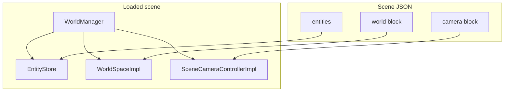
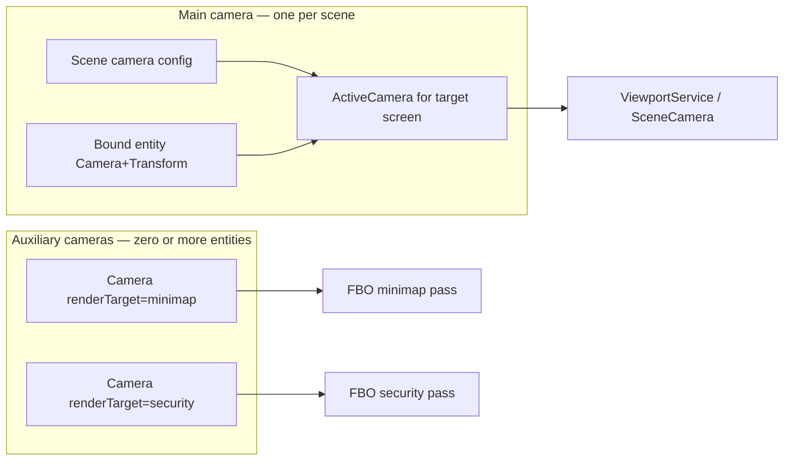
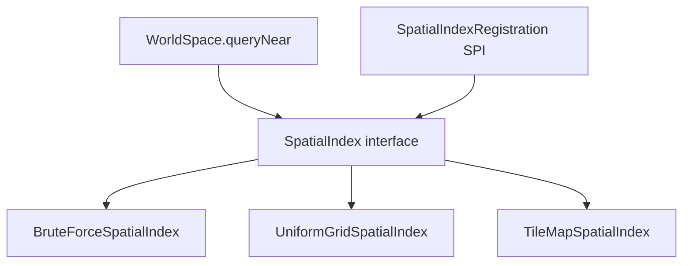
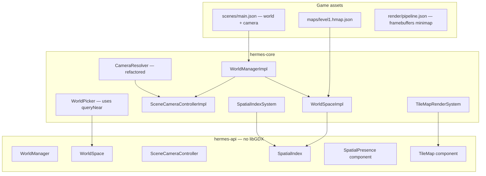

# World Space, Spatial Queries, and Scene Camera Implementation Plan

> **For agentic workers:** REQUIRED SUB-SKILL: Use superpowers:subagent-driven-development (recommended) or superpowers:executing-plans to implement this plan task-by-task. Steps use checkbox (`- [ ]`) syntax for tracking.

> **Pre-release policy:** Nothing is shipped. Delete `Camera.active`; move main view to scene `"camera"` block; remove camera entities from templates. No migration shims or deprecated aliases. Update every scene JSON, template, test, and doc in the same pass.

**Goal:** Give each scene a configurable **world space** (dimensions, open vs tilemap, pluggable spatial search) and a **scene-owned main camera** (not an entity) that can bind to entity cameras at runtime — while auxiliary entity cameras keep multi-view features like minimaps via `renderTarget`.

**Architecture:** Extend `WorldManager` with `space()` (`WorldSpace`) and `camera()` (`SceneCameraController`). Scene JSON gains `"world"` and `"camera"` blocks (version 1). A `SpatialIndex` SPI backs `queryNear` / `queryAabb`; default is brute-force, optional uniform grid and tilemap-backed indexes. Main camera resolves: bound entity → scene config → engine default. Entity `Camera` components are **auxiliary only** (minimap, security cam, picture-in-picture) unless promoted to main via controller. libGDX-free types in `hermes-api`; indexing and tile loading in `hermes-core`.

**Tech Stack:** Java 11, libGDX 1.14.0 (core only for tile batching / existing render), JUnit 5, Gradle `:hermes-core:test`, `:dogfood-simulation:compileJava`, existing ECS (`WorldManager`, `EntityStore`, `EntityFactory`), `ResourceService` / `ResourceKind` ([central resource plan](2026-06-08-central-resource-management.md) — **landed** v1), `ViewportService`, `CameraResolver`, `WorldPicker`.

**Plan status:** **Partially landed** (Tasks 1–2) — `WorldManager.space()` / `camera()`, libGDX-free world types (`WorldBounds`, `WorldKind`, `WorldSpace`, `SpatialIndex`, `SceneCameraConfig`, `SceneCameraController`, `MainCameraBinding`), `BruteForceSpatialIndex`, and `SpatialPresence` are in the repo (`dc7691a`, `7e49270`). Scene JSON `"world"` / `"camera"` blocks, `CameraResolver` refactor, `SpatialIndexSystem`, grid/tilemap strategies, scene migrations, and author docs are **not started**. `Camera.active` and `main-camera` entities remain everywhere. `SceneCameraControllerImpl` and `ActiveCameraView` are stubs; `SceneCameraConfig` lacks scene pose fields (`x`/`y`/`z`) and still carries spurious `active`/`renderTarget` copied from entity `Camera`.

| Task | Status | Notes |
|------|--------|-------|
| 1 — World/camera API | **Landed** | Stubs remain in controller + `ActiveCameraView` |
| 2 — BruteForce + SpatialPresence | **Landed** | No JSON deserializer; `queryNear` ignores `SpatialPresence` expansion |
| 3 — Parse `"world"` | Not started | |
| 4 — Parse `"camera"` | Not started | |
| 5 — CameraResolver refactor | Not started | `Camera.active` still in API + scenes |
| 6 — SpatialIndexSystem | Not started | Manual `spatial().rebuild()` only |
| 7–12 | Not started | Grid, tilemap, picker, migration, SPI |

---

## Current baseline (repo state)

| Area | Today | After this plan |
|------|-------|-----------------|
| Scene root | `WorldManager.entities()` + stub `space()` / `camera()` | JSON-backed `space()` + `camera()` services |
| World bounds | Always `WorldBounds.unbounded()` | Explicit `WorldBounds` from scene `"world"` block |
| Spatial queries | `BruteForceSpatialIndex` + manual `rebuild()`; `WorldPicker` full scan | `SpatialIndexSystem` auto-rebuild; picker uses `queryNear` |
| Main camera | First entity with `Camera.active == true` (`CameraResolver`) | Scene `"camera"` block; optional bind to entity |
| Auxiliary cameras | Same as main (`active` flag) | Entity `Camera` + `renderTarget` (minimap FBO) |
| Tile worlds | `WorldKind.TILEMAP` enum only | `"world".kind: "tilemap"` + `.hmap.json` via `ResourceKind.TILEMAP` |
| Scene JSON | `entities`, `lighting`, `audio`, `ui`, `preload`, … — no `world`/`camera` | Adds `"world"`, `"camera"` |
| Templates / dogfood | `main-camera` entity in every scene | Camera in scene block; entity cameras only when needed |
| Author docs | `scene-format-v1.md` has no world/camera sections | `docs/world-space.md` + scene-format cross-links |

Relevant existing types to reuse:

- `WorldManager` / `WorldManagerImpl` — per-scene root with `space()` + `camera()` wired ([entity-types plan](2026-05-21-entity-types-and-world-manager.md) — **landed**)
- `WorldSpaceImpl` / `BruteForceSpatialIndex` / `SpatialBoundsHelper` — landed v1 spatial path; extend, do not rewrite
- `SpatialPresence` — landed component type; add `BuiltinComponents` deserializer in Task 2 follow-up or Task 11
- `Camera` / `CameraResolver` / `ActiveCamera` / `SceneCamera` — **still entity-active**; refactor in Task 5
- `Transform` — entity pose; spatial index tracks entities with `Transform`
- `Selectable.radius` — default pick/query radius when no `SpatialPresence` (not wired into `queryNear` yet)
- `SceneDocument` / `SceneParser` — pattern for new top-level blocks (same as `lighting`, `audio`, `preload`)
- `SceneLightingState` on reserved entity — **do not** duplicate; world/camera live on `WorldManager` services
- `ViewportService` / `RenderSurfaceDesc` — unchanged contract; resolver input changes in Task 5
- `WorldPicker` — still linear `entitiesWith(Selectable)` scan; switch in Task 10
- `ResourceService` / `ResourceLoaderRegistry` — tilemap loader registers `ResourceKind.TILEMAP` in Task 8
- `ComponentRegistration` SPI — pattern for `SpatialIndexRegistration`

---

## Design goals

| Goal | How |
|------|-----|
| **No-code games** | Omit `"world"` / `"camera"` → unbounded open world + viewport-centered ortho (today’s default, explicit) |
| **Configurable world size** | `"world".dimensions` explicit, or `"match": "designViewport"` / `"cameraViewport"` |
| **Fast neighbor search** | `"spatial".strategy: "uniformGrid"` with `cellSize`; tilemap uses grid cells automatically |
| **Tile-based games** | `"kind": "tilemap"` + `assets/maps/*.hmap.json`; bounds from map; tile draw via `TileMap` component |
| **Scene main camera** | Top-level `"camera"` block — not an entity |
| **Runtime camera switch** | `manager.camera().bindMain("player-cam")` promotes entity camera to main view |
| **Minimap / multi-view** | Entity `Camera` with `"renderTarget": "minimap"` unchanged; independent of main binding |
| **Progressive complexity** | Tiers 0–5 (below) |
| **Maintainable** | libGDX-free `WorldSpace`, `SceneCameraController`, `SpatialIndex` in `hermes-api` |
| **Extensible** | `SpatialIndexRegistration` SPI for custom strategies (quadtree, chunk hash, etc.) |

### Author complexity tiers

| Tier | Author writes | Engine does |
|------|---------------|-------------|
| **0 — Defaults** | Nothing extra | Unbounded open world; ortho main camera centered on viewport |
| **1 — Bounded world** | `"world": { "dimensions": { "width": 4000, "height": 3000 } }` | `WorldBounds`; clamp optional via future systems |
| **2 — Scene camera** | `"camera": { "projection": "perspective", "z": 5, "lookAt": {…} }` | Main view without camera entity |
| **3 — Spatial grid** | `"spatial": { "strategy": "uniformGrid", "cellSize": 128 }` | `queryNear` / picker use grid |
| **4 — Tilemap** | `"kind": "tilemap", "tilemap": "maps/level1.hmap.json"` | Map bounds + tile index + `TileMap` draw |
| **5 — Java control** | `manager.camera().bindMain("drone-cam")`; custom `SpatialIndex` SPI | Runtime main switch; custom search |

**Honest v1 limits:** No Tiled `.tmx` import (Hermes `.hmap.json` only). No camera blend/lerp when switching main. No streaming/chunk unload. 3D spatial queries use AABB/sphere in XYZ but grid is XY-primary (Z folded into cell). Physics colliders ([physics plan](2026-05-30-physics-and-collisions.md)) do not auto-sync spatial bounds — authors set `SpatialPresence` or rely on point queries.

---

## Relationship to other plans

| Plan | Status | How this plan uses it |
|------|--------|------------------------|
| [Central resource management](2026-06-08-central-resource-management.md) | **Landed** (v1) | Tilemap assets load via `ResourceKind.TILEMAP` + `ResourceLoaderRegistration` (Task 8); no private tile caches |
| [Entity types](2026-05-21-entity-types-and-world-manager.md) | Landed | `WorldManager` extension surface; templates unchanged except camera entity removal |
| [World lighting](2026-05-26-world-lighting.md) | **Landed** | Light culling uses active camera position; switch to new resolver in Task 5 |
| [Unified input](2026-05-21-unified-input-system.md) | Landed | `CameraSceneControlSystem` orbits **main** camera (scene or bound entity) after Task 5 |
| [Unified runtime config](2026-05-24-unified-runtime-config-service.md) | Landed | Boot profiles unchanged |
| [Custom UI](2026-05-29-custom-ui-service.md) | Landed | `"match": "designViewport"` reads scene UI `designAspect` when present |
| [Audio](2026-05-22-audio-system.md) | **Landed** | `AudioListenerUpdater` follows `CameraResolver` today; migrate to `resolveForManager` in Task 5 |
| [Animations & drawables](2026-05-30-animations-and-drawables.md) | Not started | Animated entities update `Transform` → `SpatialIndexSystem` must run after animation tracks |
| [Physics & collisions](2026-05-30-physics-and-collisions.md) | Not started | Independent `WorldManager.physics()` service; share world units; spatial index ≠ physics broadphase |
| [Debug mode](2026-05-30-debug-mode.md) | Not started | v2: overlay rows `world.bounds`, `spatial.cellCount`, `camera.mainBinding` |
| [Save/load](2026-05-22-save-load-sessions.md) | Not started | v2: persist `camera.mainBinding` + optional world seed |
| [Dogfood sample games](2026-06-08-dogfood-sample-games.md) | Not started | Pac-Man maze v1 = char grid; can adopt tilemap after Task 8–9 |
| [Localization](2026-05-30-localization-i18n.md) | Not started | Independent |

**Prerequisites:** [Entity types](2026-05-21-entity-types-and-world-manager.md) + [central resource management](2026-06-08-central-resource-management.md) v1 — both **landed**. Tasks 1–2 **landed**.

**Recommended order:**

1. **Resume this plan** at Task 3 (scene `"world"` JSON) — Tasks 1–2 done.
2. Complete Tasks 3–6 (JSON blocks + resolver + `SpatialIndexSystem`) before grid/tilemap or migrations.
3. **Physics plan** — can proceed in parallel after Task 3 bounds exist; optional future hook: populate spatial index from static colliders.
4. **Animations plan** — no conflict once `SpatialIndexSystem` exists; register it after animation transform writes.

---

## Architecture

### Conceptual model

Hermes separates three scene-level concerns that authors often conflate:

| Concept | Owner | Purpose |
|---------|-------|---------|
| **World space** | `WorldManager.space()` | Simulation extent, coordinate policy, spatial search |
| **Main camera** | `WorldManager.camera()` | Primary view for screen pass, audio listener, orbit controls |
| **Entities** | `WorldManager.entities()` | Game objects; may carry auxiliary `Camera` components |



### Main vs auxiliary cameras



**Resolution for pass target `"screen"` (or blank):**

1. If `SceneCameraController.mainBinding()` is **ENTITY** → that entity’s `Camera` + `Transform`.
2. Else if scene has `"camera"` block → inline `SceneCameraConfig`.
3. Else → engine default ortho centered on surface (current `CameraResolver.defaultCamera`).

**Resolution for pass target `"minimap"` (or any FBO id):**

1. First entity whose `Camera.renderTarget()` equals pass target id.
2. If none → fall back to main camera (with warning).

Delete `Camera.active`. Entity cameras without `renderTarget` are **main candidates** (can be bound) but do not auto-drive the main view until `bindMain(name)` or scene `"camera".follow` names them.

### World kinds

| `world.kind` | Bounds | Default spatial strategy | Typical use |
|--------------|--------|--------------------------|-------------|
| `open` (default) | From `dimensions` or unbounded | `bruteForce` or `uniformGrid` | Arena, open world, 3D scene |
| `tilemap` | From map width × tile size | `tilemap` | 2D platformer, RPG overworld |

### Spatial index strategies



All strategies index entities that have **`Transform`** and optionally **`SpatialPresence`**. Query shape:

- **Point + radius** (`queryNear`) — circle in XY for 2D; sphere in XYZ when `radiusZ` omitted uses same radius.
- **AABB** (`queryAabb`) — axis-aligned box in world units.

Index maintenance: **`SpatialIndexSystem`** (ACTIVE_SCENE, runs early) marks dirty on component add/remove/transform change; rebuilds or incremental update per strategy.

### Layer diagram



### Coordinate model

World units remain ECS **`Transform`** space ([coordinate-spaces.md](../../coordinate-spaces.md)). World **dimensions** define authoritative bounds:

| JSON | Semantics |
|------|-----------|
| `"width": 1280, "height": 720` | Axis-aligned bounds `[0, width] × [0, height]` when `"origin": "bottomLeft"` (default) |
| `"origin": "center"` | Bounds `[-width/2, width/2] × [-height/2, height/2]` |
| `"match": "designViewport"` | Width/height from scene UI design size or `designAspect × referenceHeight` |
| `"match": "cameraViewport"` | From scene `"camera".viewportWidth/Height` if set, else designViewport |
| Omitted dimensions | **Unbounded** on X/Y; Z unbounded unless `"depth"` set |

Tilemap bounds: `map.width × tileWidth`, `map.height × tileHeight` override explicit dimensions when `kind` is `tilemap`.

---

## Scene JSON — `"world"` block (version 1)

```json
{
  "world": {
    "version": 1,
    "kind": "open",
    "dimensions": {
      "width": 4000,
      "height": 3000,
      "depth": 512,
      "origin": "bottomLeft"
    },
    "spatial": {
      "strategy": "uniformGrid",
      "cellSize": 128
    }
  },
  "entities": []
}
```

**Match viewport instead of explicit size:**

```json
"world": {
  "version": 1,
  "dimensions": {
    "match": "designViewport"
  },
  "spatial": { "strategy": "bruteForce" }
}
```

**Tilemap world:**

```json
"world": {
  "version": 1,
  "kind": "tilemap",
  "tilemap": "maps/level1.hmap.json",
  "spatial": { "strategy": "tilemap" }
},
"entities": [
  {
    "id": "ground",
    "components": {
      "Transform": { "x": 0, "y": 0 },
      "TileMap": { "map": "maps/level1.hmap.json", "layer": "ground" }
    }
  }
]
```

| Field | Required | Description |
|-------|----------|-------------|
| `world.version` | Yes | Must be `1`. |
| `world.kind` | No | `"open"` (default) or `"tilemap"`. |
| `world.dimensions` | No | Explicit size, or `{ "match": "designViewport" \| "cameraViewport" }`. Omitted → unbounded. |
| `world.dimensions.origin` | No | `"bottomLeft"` (default) or `"center"`. |
| `world.tilemap` | When kind=tilemap | Asset path to `.hmap.json`. |
| `world.spatial.strategy` | No | `"bruteForce"` \| `"uniformGrid"` \| `"tilemap"`. Default: `bruteForce` for open, `tilemap` for tilemap kind. |
| `world.spatial.cellSize` | For uniformGrid | World units per cell; default `128`. |

---

## Scene JSON — `"camera"` block (version 1)

Replaces the common **`main-camera` entity** pattern.

```json
{
  "camera": {
    "version": 1,
    "projection": "perspective",
    "x": 0,
    "y": 2,
    "z": 8,
    "rotationX": 0,
    "rotationY": 0,
    "rotationZ": 0,
    "fieldOfView": 60,
    "near": 0.1,
    "far": 3000,
    "zoom": 1,
    "viewportWidth": 0,
    "viewportHeight": 0,
    "fitMode": "stretch",
    "designAspect": 0,
    "lookAt": { "x": 0, "y": 0, "z": 0 },
    "follow": null
  },
  "entities": []
}
```

| Field | Default | Description |
|-------|---------|-------------|
| `camera.version` | — | Must be `1`. |
| `camera.projection` | `"orthographic"` | `"orthographic"` or `"perspective"`. |
| `camera.x`, `y`, `z` | `0` | Main camera position when not bound to entity. |
| `camera.rotationX/Y/Z` | `0` | Degrees; used when no `lookAt`. |
| `camera.lookAt` | unset | Perspective aim target. |
| `camera.zoom`, `fieldOfView`, `near`, `far` | same as entity Camera today | |
| `camera.viewportWidth/Height` | `0` | `0` = full render surface. |
| `camera.fitMode`, `designAspect` | same as entity Camera today | |
| `camera.follow` | unset | Optional entity **id** to bind main camera at load (entity must have `Camera` + `Transform`). |

**Minimap (auxiliary entity camera + FBO):**

```json
{
  "camera": {
    "version": 1,
    "projection": "perspective",
    "z": 5,
    "fieldOfView": 60
  },
  "renderPipeline": "render/minimap-pipeline.json",
  "entities": [
    {
      "id": "minimap-cam",
      "components": {
        "Transform": { "x": 0, "y": 0, "z": 20 },
        "Camera": {
          "projection": "orthographic",
          "zoom": 0.05,
          "renderTarget": "minimap",
          "viewportWidth": 256,
          "viewportHeight": 256
        }
      }
    }
  ]
}
```

Pipeline excerpt:

```json
"framebuffers": [
  { "id": "minimap", "width": 256, "height": 256, "depth": false }
],
"passes": [
  { "id": "world", "type": "sprites", "target": "minimap", "layers": ["WORLD"] },
  { "id": "main", "type": "sprites", "target": "screen", "layers": ["WORLD"] },
  { "id": "ui", "type": "ui", "target": "screen", "depthTest": false }
]
```

---

## Hermes tilemap asset (`.hmap.json` version 1)

```json
{
  "version": 1,
  "tileWidth": 32,
  "tileHeight": 32,
  "width": 40,
  "height": 30,
  "tileset": "tilesets/overworld.png",
  "layers": [
    {
      "name": "ground",
      "tiles": [1, 1, 2, 0, 1, "..."]
    }
  ]
}
```

| Field | Description |
|-------|-------------|
| `tiles` | Row-major `width × height` array; `0` = empty |
| `tileset` | Texture path; UV layout: horizontal strip, tile index 1-based |

---

## Public API (hermes-api)

### WorldManager (extended)

```java
public interface WorldManager {
  EntityStore entities();
  WorldSpace space();
  SceneCameraController camera();
}
```

### WorldSpace

```java
public interface WorldSpace {
  WorldKind kind();
  WorldBounds bounds();
  SpatialIndex spatial();
  // Task 8: Optional<TileMapSpec> tileMap();

  /** Entities within radius of (x,y) in world units. */
  List<Entity> queryNear(float x, float y, float radius);

  /** Entities within sphere. */
  List<Entity> queryNear(float x, float y, float z, float radius);

  /** Entities whose SpatialPresence intersects AABB. */
  List<Entity> queryAabb(float minX, float minY, float maxX, float maxY);
}
```

**Landed:** All methods above except `tileMap()`. `WorldSpaceImpl` is constructed with fixed `kind`/`bounds`/`spatial` — Task 3 must apply scene JSON by replacing or reconfiguring the impl on load.

### SceneCameraController

```java
public interface SceneCameraController {
  SceneCameraConfig sceneConfig();
  MainCameraBinding mainBinding(); // SCENE | ENTITY
  Optional<String> mainEntityName();

  void bindMain(String entityName);
  void unbindMain();
  ActiveCameraView resolveMain(float surfaceWidth, float surfaceHeight);
}
```

`ActiveCameraView` is libGDX-free (same fields as today's `ActiveCamera` but public in api package). **Today:** empty stub class — populate in Task 5 alongside `CameraResolver.resolveForManager`.

### SpatialPresence component

```java
public final class SpatialPresence implements Component {
  /** Pick/query radius; 0 = point. Default inferred from Selectable when absent. */
  private float radius = 0f;
  private float halfWidth = 0f;
  private float halfHeight = 0f;
}
```

### TileMap component

```java
public final class TileMap implements Component {
  private String map;
  private String layer = "ground";
}
```

### Gameplay examples

**Find enemies near player (Java tier 5):**

```java
WorldManager manager = engine.scenes().activeManager();
EntityStore entities = manager.entities();
Entity player = entities.findByName("player");
Transform pt = entities.getComponent(player.id(), Transform.class);
List<Entity> nearby = manager.space().queryNear(pt.x(), pt.y(), 200f);
for (Entity e : nearby) {
  if (entities.hasComponent(e.id(), EnemyTag.class)) { /* … */ }
}
```

**Switch main camera to drone (Java tier 5):**

```java
manager.camera().bindMain("drone-cam");
```

**No-code platformer (JSON tiers 0–4):**

```json
{
  "world": {
    "version": 1,
    "kind": "tilemap",
    "tilemap": "maps/level1.hmap.json"
  },
  "camera": {
    "version": 1,
    "projection": "orthographic",
    "x": 640,
    "y": 360,
    "zoom": 1,
    "follow": "player"
  },
  "entities": [
    { "type": "player", "id": "player", "components": { "Transform": { "x": 64, "y": 64 } } },
    { "id": "ground", "components": { "TileMap": { "map": "maps/level1.hmap.json" } } }
  ]
}
```

---

## File structure

| File | Status | Responsibility |
|------|--------|----------------|
| `hermes-api/.../world/WorldSpace.java` | Landed | Query API |
| `hermes-api/.../world/WorldBounds.java` | Landed | min/max + unbounded flags |
| `hermes-api/.../world/WorldKind.java` | Landed | OPEN, TILEMAP |
| `hermes-api/.../world/SpatialIndex.java` | Landed | Strategy interface |
| `hermes-api/.../world/SceneCameraController.java` | Landed | Main camera control API |
| `hermes-api/.../world/SceneCameraConfig.java` | Landed (incomplete) | libGDX-free main config — add x/y/z; remove `active`/`renderTarget` |
| `hermes-api/.../world/MainCameraBinding.java` | Landed | SCENE, ENTITY enum |
| `hermes-api/.../world/ActiveCameraView.java` | Stub | Public resolved view — empty class; fill in Task 5 |
| `hermes-api/.../world/TileMapSpec.java` | Not started | Read-only map metadata |
| `hermes-api/.../ecs/SpatialPresence.java` | Landed | Query bounds component |
| `hermes-api/.../ecs/TileMap.java` | Not started | Tile draw reference |
| `hermes-api/.../world/SpatialIndexRegistration.java` | Not started | SPI |
| `hermes-core/.../world/WorldSpaceImpl.java` | Landed | Holds bounds + index; immutable after construct |
| `hermes-core/.../world/WorldBlockParser.java` | Not started | Parse `"world"` JSON |
| `hermes-core/.../world/SceneCameraBlockParser.java` | Not started | Parse `"camera"` JSON |
| `hermes-core/.../world/SceneCameraControllerImpl.java` | Stub | Binding state — TODO methods |
| `hermes-core/.../world/WorldBoundsResolver.java` | Not started | match designViewport etc. |
| `hermes-core/.../world/spatial/BruteForceSpatialIndex.java` | Landed | Default strategy |
| `hermes-core/.../world/spatial/SpatialBoundsHelper.java` | Landed | AABB + radius helpers; `effectiveRadius` unused in `queryNear` yet |
| `hermes-core/.../world/spatial/UniformGridSpatialIndex.java` | Not started | Grid |
| `hermes-core/.../world/spatial/TileMapSpatialIndex.java` | Not started | Cell = tile |
| `hermes-core/.../world/tilemap/HermesTileMapLoader.java` | Not started | Load `.hmap.json` via `ResourceService` |
| `hermes-core/.../world/tilemap/TileMapRenderSystem.java` | Not started | Draw tiles in sprites pass |
| `hermes-core/.../ecs/SpatialIndexSystem.java` | Not started | Maintain index |
| `hermes-core/.../ecs/CameraResolver.java` | Unchanged | Refactor to use controller (Task 5) |
| `hermes-core/.../ecs/BuiltinComponents.java` | Unchanged | Still deserializes `Camera.active`; add `SpatialPresence` |
| `hermes-core/.../ecs/WorldManagerImpl.java` | Landed | Wire services |
| `hermes-core/.../ecs/SceneDocument.java` | Unchanged | Parse world + camera (Task 3–4) |
| `hermes-core/.../input/WorldPicker.java` | Unchanged | Use spatial queries (Task 10) |
| `docs/world-space.md` | Not started | Author guide |
| `docs/scene-format-v1.md` | Unchanged | world + camera sections (Task 11) |

---

## Implementation tasks

### Task 1: libGDX-free world and camera API types

**Status: Landed** (`dc7691a`). Remaining gaps: `ActiveCameraView` is an empty class; `SceneCameraControllerImpl` returns defaults / null; `SceneCameraConfig` needs scene pose fields and should drop `active`/`renderTarget` (scene cameras do not use pass targets).

**Files:**
- Create: `hermes-api/src/main/java/dev/hermes/api/world/WorldBounds.java` — **done**
- Create: `hermes-api/src/main/java/dev/hermes/api/world/WorldKind.java` — **done**
- Create: `hermes-api/src/main/java/dev/hermes/api/world/WorldSpace.java` — **done**
- Create: `hermes-api/src/main/java/dev/hermes/api/world/SpatialIndex.java` — **done**
- Create: `hermes-api/src/main/java/dev/hermes/api/world/SceneCameraConfig.java` — **done** (incomplete fields)
- Create: `hermes-api/src/main/java/dev/hermes/api/world/MainCameraBinding.java` — **done**
- Create: `hermes-api/src/main/java/dev/hermes/api/world/SceneCameraController.java` — **done**
- Create: `hermes-api/src/main/java/dev/hermes/api/world/ActiveCameraView.java` — **stub**
- Modify: `hermes-api/src/main/java/dev/hermes/api/ecs/WorldManager.java` — **done**

- [x] **Step 1: Write failing test**

Create `hermes-core/src/test/java/dev/hermes/core/world/WorldApiSurfaceTest.java`:

```java
@Test
void worldManagerExposesSpaceAndCamera() {
  WorldManagerImpl manager = new WorldManagerImpl();
  assertNotNull(manager.space());
  assertNotNull(manager.camera());
  assertEquals(WorldKind.OPEN, manager.space().kind());
  assertTrue(manager.space().bounds().unboundedX());
}
```

- [x] **Step 2: Run test to verify it fails**

Run: `./gradlew :hermes-core:test --tests dev.hermes.core.world.WorldApiSurfaceTest -q`
Expected: FAIL — `space()` / `camera()` not defined

- [x] **Step 3: Implement API types and stub impl**

`WorldBounds.java`:

```java
public final class WorldBounds {
  private final float minX, minY, minZ, maxX, maxY, maxZ;
  private final boolean unboundedX, unboundedY, unboundedZ;
  // constructor, getters, static unbounded()
}
```

Extend `WorldManager`:

```java
WorldSpace space();
SceneCameraController camera();
```

`WorldManagerImpl` — initial stubs:

```java
private final WorldSpaceImpl space = new WorldSpaceImpl();
private final SceneCameraControllerImpl camera = new SceneCameraControllerImpl();

@Override public WorldSpace space() { return space; }
@Override public SceneCameraController camera() { return camera; }
```

- [x] **Step 4: Run test to verify it passes**

Run: `./gradlew :hermes-core:test --tests dev.hermes.core.world.WorldApiSurfaceTest -q`
Expected: PASS

- [x] **Step 5: Commit**

```bash
git add hermes-api/src/main/java/dev/hermes/api/world/ hermes-api/src/main/java/dev/hermes/api/ecs/WorldManager.java hermes-core/src/main/java/dev/hermes/core/ecs/WorldManagerImpl.java hermes-core/src/main/java/dev/hermes/core/world/ hermes-core/src/test/java/dev/hermes/core/world/WorldApiSurfaceTest.java
git commit -m "feat: add WorldSpace and SceneCameraController API on WorldManager"
```

---

### Task 2: BruteForceSpatialIndex and SpatialPresence

**Status: Landed** (`7e49270`). Remaining gaps before Task 6: `queryNear` uses transform point only (does not expand by `SpatialPresence` / `Selectable` via `SpatialBoundsHelper.effectiveRadius`); `SpatialPresence` has no `BuiltinComponents` JSON deserializer; callers must invoke `spatial().rebuild(entities)` manually (see `entitiesAddedAfterRebuildAreNotVisibleUntilRebuild` test).

**Files:**
- Create: `hermes-api/src/main/java/dev/hermes/api/ecs/SpatialPresence.java` — **done**
- Create: `hermes-core/src/main/java/dev/hermes/core/world/spatial/BruteForceSpatialIndex.java` — **done**
- Create: `hermes-core/src/main/java/dev/hermes/core/world/spatial/SpatialBoundsHelper.java` — **done**
- Modify: `hermes-core/src/main/java/dev/hermes/core/world/WorldSpaceImpl.java` — **done**
- Test: `hermes-core/src/test/java/dev/hermes/core/world/BruteForceSpatialIndexTest.java` — **done** (15 cases)

- [x] **Step 1: Write failing test**

```java
@Test
void queryNearReturnsEntitiesWithinRadius() {
  WorldManagerImpl manager = new WorldManagerImpl();
  EntityStore es = manager.entities();
  Entity a = es.create("a");
  es.addComponent(a.id(), new Transform(10f, 10f));
  Entity b = es.create("b");
  es.addComponent(b.id(), new Transform(100f, 100f));
  manager.space().spatial().rebuild(es);
  List<Entity> hits = manager.space().queryNear(10f, 10f, 5f);
  assertEquals(1, hits.size());
  assertEquals("a", hits.get(0).name());
}
```

- [x] **Step 2: Run test to verify it fails**

Run: `./gradlew :hermes-core:test --tests dev.hermes.core.world.BruteForceSpatialIndexTest -q`
Expected: FAIL — `rebuild` / `queryNear` missing

- [x] **Step 3: Implement BruteForceSpatialIndex**

```java
public final class BruteForceSpatialIndex implements SpatialIndex {
  public void rebuild(EntityStore entities) { /* cache entities with Transform */ }
  public List<Entity> queryNear(EntityStore entities, float x, float y, float radius) {
    float r2 = radius * radius;
    List<Entity> out = new ArrayList<>();
    for (Entity e : indexed) {
      Transform t = entities.getComponent(e.id(), Transform.class);
      float dx = t.x() - x, dy = t.y() - y;
      float effR = radius + SpatialBoundsHelper.effectiveRadius(entities, e);
      if (dx * dx + dy * dy <= effR * effR) out.add(e);
    }
    return out;
  }
}
```

**Implementation note:** Landed code stores `EntityStore` on `rebuild()` and `queryNear`/`queryAabb` use the cached index without taking `EntityStore` per call. `queryNear` currently uses point distance only — wire `effectiveRadius` when polishing before Task 10.

Wire `WorldSpaceImpl.queryNear` to delegate to `spatial().queryNear(…)` (index holds entity ref from last rebuild).

- [x] **Step 4: Run test to verify it passes**

Expected: PASS

- [x] **Step 5: Commit**

```bash
git commit -m "feat: add BruteForceSpatialIndex and SpatialPresence"
```

---

### Task 3: Parse scene `"world"` block

**Files:**
- Create: `hermes-core/src/main/java/dev/hermes/core/world/WorldBlockParser.java`
- Create: `hermes-core/src/main/java/dev/hermes/core/world/WorldBlock.java`
- Modify: `hermes-core/src/main/java/dev/hermes/core/ecs/SceneDocument.java`
- Modify: `hermes-core/src/main/java/dev/hermes/core/ecs/SceneParser.java`
- Modify: `hermes-core/src/main/java/dev/hermes/core/ecs/SceneLoadMetadata.java`
- Test: `hermes-core/src/test/java/dev/hermes/core/world/WorldBlockParserTest.java`

- [ ] **Step 1: Write failing test**

```java
@Test
void parsesExplicitDimensions() {
  String json = """
    { "world": { "version": 1, "dimensions": { "width": 800, "height": 600 } }, "entities": [] }
    """;
  WorldBlock block = WorldBlockParser.parse("test.json", new JsonReader().parse(json));
  assertEquals(800f, block.bounds().maxX(), 0.001f);
  assertEquals(600f, block.bounds().maxY(), 0.001f);
}
```

- [ ] **Step 2: Run test — expect FAIL**

- [ ] **Step 3: Implement parser + apply on scene load**

In `SceneParser.loadIntoEntities`, after entities loaded:

```java
document.world().ifPresent(block -> applyWorldBlock(manager.space(), block, document));
```

- [ ] **Step 4: Run tests**

Run: `./gradlew :hermes-core:test --tests dev.hermes.core.world.WorldBlockParserTest -q`

- [ ] **Step 5: Commit**

```bash
git commit -m "feat: parse scene world block into WorldSpace"
```

---

### Task 4: Parse scene `"camera"` block and SceneCameraController

**Files:**
- Create: `hermes-core/src/main/java/dev/hermes/core/world/SceneCameraBlockParser.java`
- Modify: `hermes-core/src/main/java/dev/hermes/core/world/SceneCameraControllerImpl.java`
- Modify: `hermes-core/src/main/java/dev/hermes/core/ecs/SceneDocument.java`
- Modify: `hermes-core/src/main/java/dev/hermes/core/ecs/SceneParser.java`
- Test: `hermes-core/src/test/java/dev/hermes/core/world/SceneCameraBlockParserTest.java`

- [ ] **Step 1: Write failing test**

```java
@Test
void parsesPerspectiveCameraAndFollow() {
  String json = """
    { "camera": { "version": 1, "projection": "perspective", "z": 5, "fieldOfView": 60, "follow": "player" }, "entities": [] }
    """;
  SceneCameraBlock block = SceneCameraBlockParser.parse("t.json", new JsonReader().parse(json));
  assertEquals(Camera.Projection.PERSPECTIVE, block.config().projection());
  assertEquals("player", block.followEntity().orElseThrow());
}
```

- [ ] **Step 2: Run test — expect FAIL**

- [ ] **Step 3: Implement parser + apply**

On load:

```java
document.camera().ifPresent(block -> {
  manager.camera().setSceneConfig(block.config());
  block.followEntity().ifPresent(manager.camera()::bindMain);
});
```

- [ ] **Step 4: Run test — expect PASS**

- [ ] **Step 5: Commit**

```bash
git commit -m "feat: parse scene camera block and bind follow entity"
```

---

### Task 5: Refactor CameraResolver — remove Camera.active

**Files:**
- Modify: `hermes-api/src/main/java/dev/hermes/api/ecs/Camera.java` — delete `active` field
- Modify: `hermes-core/src/main/java/dev/hermes/core/ecs/BuiltinComponents.java` — remove `active` deserialization
- Modify: `hermes-core/src/main/java/dev/hermes/core/ecs/CameraResolver.java`
- Modify: `hermes-core/src/main/java/dev/hermes/core/world/SceneCameraControllerImpl.java`
- Test: `hermes-core/src/test/java/dev/hermes/core/ecs/CameraResolverTest.java` (update all cases)

- [ ] **Step 1: Write failing test**

```java
@Test
void screenPassUsesSceneCameraWhenNoBinding() {
  WorldManagerImpl manager = new WorldManagerImpl();
  manager.camera().setSceneConfig(sceneConfigOrtho(320f, 240f));
  ActiveCamera active = CameraResolver.resolveForManager(manager, "screen", 800f, 600f);
  assertEquals(320f, active.x(), 0.001f);
  assertEquals(240f, active.y(), 0.001f);
}
```

Add new resolver entry point:

```java
public static ActiveCamera resolveForManager(
    WorldManager manager, String passTargetId, float surfaceW, float surfaceH)
```

- [ ] **Step 2: Run test — expect FAIL**

- [ ] **Step 3: Implement resolver logic**

For `"screen"`:
- Call `manager.camera().resolveMain(surfaceW, surfaceH)` → `ActiveCameraView`
- Convert to internal `ActiveCamera`

For FBO target id:
- Scan entities for `Camera.renderTarget()` match (unchanged)
- Fallback to main with stderr warning

- [ ] **Step 4: Update all call sites**

Replace `CameraResolver.resolve(entities, …)` with `resolveForManager(manager, …)` in:
- `ViewportServiceImpl`
- `WorldPicker`
- `AudioListenerUpdater`
- `SpriteDrawOrder` callers
- Render pass binding

- [ ] **Step 5: Run full core tests**

Run: `./gradlew :hermes-core:test -q`

- [ ] **Step 6: Commit**

```bash
git commit -m "refactor: scene-owned main camera; remove Camera.active"
```

---

### Task 6: SpatialIndexSystem

**Files:**
- Create: `hermes-core/src/main/java/dev/hermes/core/ecs/SpatialIndexSystem.java`
- Modify: `hermes-core/src/main/java/dev/hermes/core/HermesLauncherSupport.java` or builtin systems registration
- Test: `hermes-core/src/test/java/dev/hermes/core/world/SpatialIndexSystemTest.java`

- [ ] **Step 1: Write failing test**

Spawn entity after load → query includes it without manual rebuild.

- [ ] **Step 2: Run test — expect FAIL**

- [ ] **Step 3: Implement system**

```java
public final class SpatialIndexSystem implements System {
  @Override
  public void update(WorldManager manager, float deltaSeconds) {
    manager.space().spatial().rebuild(manager.entities());
  }
}
```

Register ACTIVE_SCENE scope. (Optimize dirty-flag in v2; full rebuild OK for v1 brute force.)

- [ ] **Step 4: Run test — expect PASS**

- [ ] **Step 5: Commit**

```bash
git commit -m "feat: SpatialIndexSystem rebuilds index each frame"
```

---

### Task 7: UniformGridSpatialIndex

**Files:**
- Create: `hermes-core/src/main/java/dev/hermes/core/world/spatial/UniformGridSpatialIndex.java`
- Modify: `hermes-core/src/main/java/dev/hermes/core/world/WorldSpaceImpl.java` — factory from strategy string
- Test: `hermes-core/src/test/java/dev/hermes/core/world/UniformGridSpatialIndexTest.java`

- [ ] **Step 1: Write failing test**

100 entities in grid; query small radius returns ≪ 100 (assert < 10 for localized query).

- [ ] **Step 2: Run test — expect FAIL**

- [ ] **Step 3: Implement uniform grid**

Cell size from `world.spatial.cellSize`. Insert entity into cells overlapping its bounds. Query visits 3×3 neighbor cells.

- [ ] **Step 4: Run test — expect PASS**

- [ ] **Step 5: Commit**

```bash
git commit -m "feat: uniform grid spatial index strategy"
```

---

### Task 8: Hermes tilemap loader + TileMapSpatialIndex

**Files:**
- Create: `hermes-api/src/main/java/dev/hermes/api/ecs/TileMap.java`
- Create: `hermes-api/src/main/java/dev/hermes/api/resource/ResourceKind.java` entry `TILEMAP` (or extend existing enum)
- Create: `hermes-core/src/main/java/dev/hermes/core/world/tilemap/HermesTileMapLoader.java` — register on `ResourceLoaderRegistry`
- Create: `hermes-core/src/main/java/dev/hermes/core/world/tilemap/TileMapAsset.java`
- Create: `hermes-core/src/main/java/dev/hermes/core/world/spatial/TileMapSpatialIndex.java`
- Modify: `hermes-core/src/main/java/dev/hermes/core/world/WorldSpaceImpl.java`
- Test: `hermes-core/src/test/java/dev/hermes/core/world/TileMapWorldTest.java`
- Test resource: `hermes-core/src/test/resources/assets/maps/test.hmap.json`

- [ ] **Step 1: Write failing test**

Load tilemap world; bounds 40×30 tiles × 32px; entity at tile (5,5) found via `queryNear` tile center.

- [ ] **Step 2: Run test — expect FAIL**

- [ ] **Step 3: Implement loader + index**

- [ ] **Step 4: Run test — expect PASS**

- [ ] **Step 5: Commit**

```bash
git commit -m "feat: tilemap world kind with Hermes hmap loader"
```

---

### Task 9: TileMapRenderSystem

**Files:**
- Create: `hermes-core/src/main/java/dev/hermes/core/world/tilemap/TileMapRenderSystem.java`
- Modify: `hermes-core/src/main/java/dev/hermes/core/ecs/BuiltinComponents.java`
- Modify: `hermes-core/src/main/java/dev/hermes/core/render/pass/SpritesPass.java` or register as render system
- Test: `hermes-core/src/test/java/dev/hermes/core/world/TileMapRenderSystemTest.java`

- [ ] **Step 1: Write failing test**

Entity with `TileMap` component → system registers drawable batch entries (mock batch verify call count > 0).

- [ ] **Step 2: Run test — expect FAIL**

- [ ] **Step 3: Implement batched tile draw**

Use loaded `TileMapAsset`; one texture bind per tileset; draw visible tiles intersecting main camera bounds (from `ActiveCameraView`).

- [ ] **Step 4: Run test — expect PASS**

- [ ] **Step 5: Commit**

```bash
git commit -m "feat: TileMap component and render system"
```

---

### Task 10: WorldPicker uses spatial queries

**Files:**
- Modify: `hermes-core/src/main/java/dev/hermes/core/input/WorldPicker.java`
- Modify: `hermes-core/src/main/java/dev/hermes/core/input/InputServiceImpl.java` — pass WorldManager
- Test: `hermes-core/src/test/java/dev/hermes/core/input/WorldPickerTest.java`

- [ ] **Step 1: Write failing test**

100 selectable entities; pick still hits correct target (regression). With grid enabled, spy that candidate set < 100.

- [ ] **Step 2: Run test — expect FAIL** (if not wired)

- [ ] **Step 3: Replace linear scan**

```java
List<Entity> candidates = entities.entitiesWith(Selectable.class);
// becomes:
List<Entity> candidates = worldSpace.queryNear(worldPt.x, worldPt.y, maxPickRadius);
```

Compute `maxPickRadius` from camera visible world rect diagonal or conservative 4096 when unbounded.

- [ ] **Step 4: Run tests — expect PASS**

- [ ] **Step 5: Commit**

```bash
git commit -m "perf: WorldPicker uses WorldSpace spatial queries"
```

---

### Task 11: Migrate scenes, templates, and docs

**Files:**
- Modify: all `**/scenes/*.json` — move camera entity → `"camera"` block
- Modify: `dogfood-simulation/src/main/resources/assets/scenes/main.json`
- Modify: `hermes-templates/**/scenes/main.json`
- Modify: `docs/scene-format-v1.md`
- Create: `docs/world-space.md`
- Modify: `docs/ARCHITECTURE.md`, `docs/coordinate-spaces.md`

- [ ] **Step 1: Update dogfood main.json**

`dogfood-simulation/src/main/resources/assets/scenes/main.json` still has a `main-camera` entity today — migrate to:

```json
{
  "camera": {
    "version": 1,
    "projection": "perspective",
    "x": 0,
    "y": 0,
    "z": 5,
    "fieldOfView": 60,
    "fitMode": "stretch"
  },
  "inputContext": "gameplay",
  "ui": "ui/hud.json",
  "entities": [ /* remove main-camera entity */ ]
}
```

- [ ] **Step 2: Update templates and test scenes**

Run: `./gradlew :hermes-core:test :dogfood-simulation:compileJava -q`
Expected: all pass

- [ ] **Step 3: Add docs**

Document `"world"`, `"camera"`, tiers, Java API in `docs/world-space.md`; cross-link from scene-format-v1.

- [ ] **Step 4: Commit**

```bash
git commit -m "docs: world space and scene camera; migrate scene JSON"
```

---

### Task 12: Minimap dogfood demo + SpatialIndexRegistration SPI

**Files:**
- Create: `dogfood-simulation/src/main/resources/assets/render/minimap-pipeline.json`
- Create: `dogfood-simulation/src/main/resources/assets/scenes/minimap-demo.json`
- Create: `hermes-api/src/main/java/dev/hermes/api/world/SpatialIndexRegistration.java`
- Modify: `hermes-core/src/main/java/dev/hermes/core/world/WorldSpaceImpl.java`
- Test: `hermes-core/src/test/java/dev/hermes/core/world/SpatialIndexRegistrationTest.java`

- [ ] **Step 1: Write failing SPI test**

Register custom strategy id `"testGrid"` → factory returns custom index.

- [ ] **Step 2: Implement SPI loading via ServiceLoader**

- [ ] **Step 3: Add minimap demo scene**

Scene with scene `"camera"` + entity minimap camera with `"renderTarget": "minimap"` + bounded `"world"`.

- [ ] **Step 4: Run full test suite**

Run: `./gradlew test -q`

- [ ] **Step 5: Commit**

```bash
git commit -m "feat: spatial index SPI and minimap demo scene"
```

---

## Self-review

### Spec coverage

| Requirement | Task | Status |
|-------------|------|--------|
| World/camera API on `WorldManager` | Task 1 | Landed |
| Brute-force spatial queries | Task 2 | Landed |
| World dimensions (same/bigger/smaller than app) | Task 3 | Not started |
| Search strategies for near entities | Tasks 2, 6, 7, 8, 10 | Partial (brute force only) |
| Open space world | Task 3 — kind open default | Default in code; not JSON-driven |
| Tile map world | Tasks 8, 9 | Not started |
| Scene main camera not entity | Tasks 4, 5 | Not started |
| Entity cameras + main switch | Tasks 4, 5 — bindMain / follow | Not started |
| Minimap / renderTarget preserved | Task 5 resolver FBO branch; Task 12 demo | Not started |
| Config-first + Java tiers | Design goals + Task 11 docs | Not started |
| Fit future plans | Relationship section; SpatialPresence separate from physics | Updated |
| No backward compat | Pre-release policy; delete Camera.active | Policy stands; not executed |

### Placeholder scan

Tasks 1–2 landed with documented gaps (stubs, `effectiveRadius`, deserializers). Tasks 3–12 retain concrete test code and commands. No TBD steps.

### Type consistency

- `WorldManager.space()` / `camera()` used consistently — **landed**
- `CameraResolver.resolveForManager(WorldManager, …)` replaces entity-only resolve — **planned Task 5**; today still `resolveForPass(EntityStore, …)`
- `SceneCameraConfig` fields should align with scene `"camera"` JSON (pose + projection); remove `active`/`renderTarget` when completing Task 4–5
- `SpatialIndex.rebuild(EntityStore)` + query without per-call store — **landed** (differs from early sketch in Task 2 step 3)

---

## Execution handoff

Plan updated to reflect **partial landing** (Tasks 1–2). **Resume at Task 3.** Two execution options:

**1. Subagent-Driven (recommended)** — dispatch a fresh subagent per task, review between tasks, fast iteration

**2. Inline Execution** — execute tasks in this session using executing-plans, batch execution with checkpoints

Which approach?
