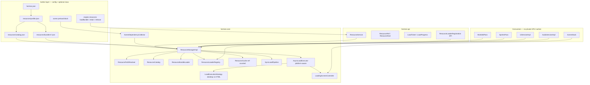
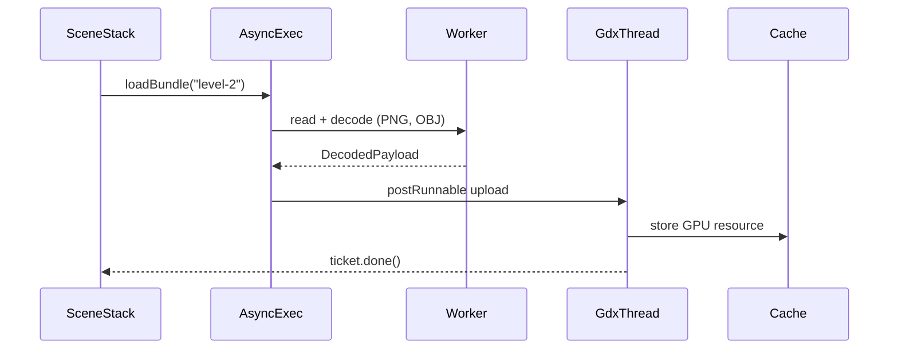
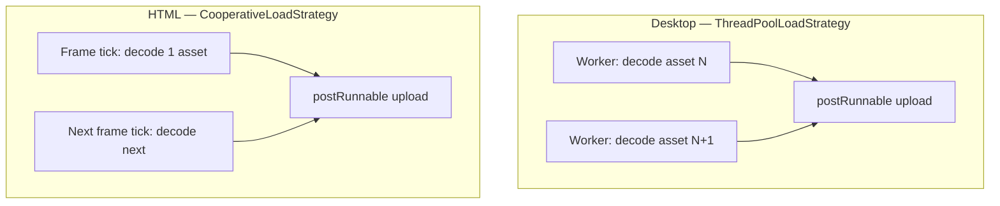

# Central Resource Management Implementation Plan

> **For agentic workers:** REQUIRED SUB-SKILL: Use superpowers:subagent-driven-development (recommended) or superpowers:executing-plans to implement this plan task-by-task. Steps use checkbox (`- [ ]`) syntax for tracking.

> **Pre-release policy:** Nothing is shipped. Replace scattered per-subsystem caches (`ModelCache`, inline texture maps in `SpritesPass`, `UiTextureCache`, `SoundCache`) with one `ResourceService`. Delete the old types in the same pass. No migration shims.

**Goal:** Introduce a **central resource management system** that loads game assets synchronously or asynchronously (with an optional loading screen), gives authors a config-first workflow for simple games, and exposes SPI + Java hooks for heavy projects — all through one cache, one lifecycle, and one progress model.

**Architecture:** `ResourceService` (hermes-api) owns **identity** (`ResourceRef`), **kind** (`ResourceKind`), **load tickets** (`LoadTicket`), and **progress**. `ResourceManagerImpl` (hermes-core) routes every asset through a **loader registry**, a **reference-counted cache**, and a **platform-aware two-phase load pipeline**: Phase A decode + Phase B GPU upload via `Gdx.app.postRunnable`. **Desktop** runs Phase A on a worker thread pool; **HTML/TeaVM** runs Phase A **cooperatively on the main loop** (one asset per frame — no `ExecutorService`). Scenes declare **preload bundles** in JSON; `SceneStack` shows a **loading overlay** while a ticket is in flight. Subsystems stop owning private caches.

**Platform policy:** Implement on **desktop first**, but **HTML (TeaVM) parity is a merge gate** — same JSON config, same bundles, `:hermes-launcher-html:compileJava` green, browser smoke with async preload + loading bar. No TeaVM-incompatible APIs (`java.util.concurrent` thread pools, blocking `awaitCompletion` on the main loop).

**Tech Stack:** Java 11, libGDX 1.14, gdx-teavm (HTML), existing ECS/scene stack, JUnit 5, Gradle `:hermes-core:test`, `:hermes-launcher-html:compileJava`, browser smoke on minimal template.

---

## Current baseline (repo state)

| Area | Today | After this plan |
|------|-------|-----------------|
| Path resolution | `HermesAssetPaths.internal(path)` duplicated everywhere | Unchanged resolver; all loads go through `ResourceService` |
| 3D models | `ModelCache` — lazy OBJ, per-pass ownership | `ResourceKind.MODEL` loader + shared cache |
| 2D textures | Inline `HashMap` in `SpritesPass` | `ResourceKind.TEXTURE` — shared by sprites + UI |
| UI textures | `UiTextureCache` separate cache | Same `TEXTURE` cache; white-pixel fallback stays in UI layer |
| Audio clips | `SoundCache` private to audio | `ResourceKind.SOUND` loader; `SoundCache` deleted |
| Shaders | `ShaderRegistry` at pipeline compile | Stays pipeline-scoped v1; optional `ResourceKind.SHADER` v2 |
| Scene load | Synchronous JSON parse + entity spawn on main thread | Sync default; optional async preload + loading screen |
| Startup | Blocks in `HermesGdxApplication.create()` until first scene loads | Optional async bootstrap via `resourceProfile.defaultAsync` |
| Progress UX | None; first-frame GPU hitch on lazy caches | Explicit progress + built-in or custom loading UI |
| Extension | Per-domain loaders only | `ResourceLoaderRegistration` SPI for new kinds |
| HTML packaging | `assets.txt` on desktop classpath; TeaVM `addAssets` at compile time | Same JSON paths via `HermesAssetPaths`; all bundle/catalog files must live under game assets dir |
| HTML async | N/A (everything sync on browser main thread) | Cooperative frame-sliced async — loading UX without background threads |

**Recommended execution order relative to other plans:**

1. **This plan first** — unified loading/cache is infrastructure for everything else.
2. [Animations & drawables](2026-05-30-animations-and-drawables.md) — new kinds (`GLTF_MODEL`, `SPRITE_SHEET`, `ANIMATION_CLIP`) register as loaders on top of this system.
3. [Localization](2026-05-30-localization-i18n.md) — `LOCALE_CATALOG` kind + bundle preload per locale.
4. [World space & scene camera](2026-05-30-world-space-and-scene-camera.md) — tilemap assets as `ResourceKind.TILEMAP`.

---

## Architecture

### Layer diagram



### Core concepts

| Concept | Responsibility |
|---------|----------------|
| **`ResourceRef`** | Stable identity: normalized asset path **or** catalog alias (`@logo`). Immutable, comparable, used as cache key after resolution. |
| **`ResourceKind`** | What loader to use: `TEXTURE`, `MODEL`, `SOUND`, `FONT`, `JSON`, `BINARY`, … Extensible via SPI. |
| **`ResourceHandle`** | Opaque loaded token in API; core maps to typed libGDX object internally. |
| **`ResourceLoader<K>`** | Parses bytes → intermediate (off-thread safe) → GPU object (main thread only). |
| **`ResourceCache`** | One map `(ResourceRef, ResourceKind) → entry` with reference counts and scene-scoped release groups. |
| **`LoadTicket`** | Handle for an async batch; poll `progress()`, `done()`, `failed()`. |
| **`ResourceBundle`** | Named list of `(ref, kind)` loaded together — used for menus, levels, locale packs. |
| **`LoadingScreenController`** | Fullscreen overlay (built-in bar or custom `ui/*.json`) shown while any ticket with `showLoadingScreen: true` is in flight. |

### Two-phase load pipeline (platform-aware)

libGDX GPU objects (`Texture`, `Model`, `ShaderProgram`) **must** be created during the libGDX application loop. CPU-bound decode **may** run off-thread on desktop only.

**Desktop sequence:**



**HTML sequence (cooperative — same thread, spread across frames):**

```mermaid
sequenceDiagram
  participant Render as HermesGdxApplication.render
  participant AsyncExec
  participant GdxThread
  participant Cache

  Render->>AsyncExec: tick()
  AsyncExec->>AsyncExec: decode 1 asset (Phase A)
  AsyncExec->>GdxThread: postRunnable upload (Phase B)
  GdxThread->>Cache: store GPU resource
  Note over Render: loading bar updates; repeat next frame
  GdxThread-->>Render: ticket.done() when batch complete
```

**Rules (both platforms):**

1. **Phase A:** read `FileHandle` via `HermesAssetPaths`, decode to CPU-safe `DecodedPayload` (`Pixmap`, parsed OBJ mesh data, raw bytes). On HTML, at most `cooperativeAssetsPerFrame` per `tick()`.
2. **Phase B:** `Gdx.app.postRunnable(() -> upload + cache + increment progress)` — create GPU objects.
3. **Failure:** ticket marks failed; loading screen shows error line; scene transition aborts with `ResourceLoadException` in logs.
4. **Sync path:** both phases run immediately on the calling thread — acceptable for unit tests and tiny games on all platforms.

**Forbidden on HTML:** `Executors.newFixedThreadPool`, `new Thread(...)`, blocking `awaitCompletion()` inside `render()` or `SceneStack.processPending()`.

### Reference counting and lifecycle

| Event | Action |
|-------|--------|
| First `loadSync` / async ticket completes | Cache entry `refs = 1` |
| Scene enter with preload bundle | `retainGroup("scene:<id>")` on all bundle refs |
| Scene exit | `releaseGroup("scene:<id>")` — decrement; dispose GPU object at `refs == 0` |
| Explicit Java `retain(ref)` / `release(ref)` | Tier-3 manual control for streaming open worlds |
| Engine dispose | `ResourceManagerImpl.dispose()` clears all |

Scene-scoped groups prevent leaks when pushing/popping overlay scenes without unloading shared textures (e.g. UI font used by pause menu + game).

### Path resolution

`ResourcePathResolver` wraps existing `HermesAssetPaths.internal()`:

| Input | Resolved |
|-------|----------|
| `textures/logo.png` | normalized path |
| `/textures/logo.png` | strip leading `/` |
| `@logo` | lookup in `resources/catalog.json` → `textures/logo.png` |
| `bundle:main-menu` | not a resource ref — handled by bundle loader |

Invalid alias → `ResourceLoadException` at resolve time (fail fast, same as scene JSON errors today).

**HTML note:** `HermesAssetPaths` needs **no HTML-specific fork**. TeaVM embeds the game assets tree at compile time via `TeaVMBuilder.addAssets(new AssetFileHandle(assetsPath))`. Desktop additionally generates `assets.txt` for libGDX enumeration — HTML never reads `assets.txt`. Every path referenced in catalogs, bundles, and scenes must exist under the game assets directory at **TeaVM compile time** (no runtime download, no filesystem outside embedded assets).

---

## HTML / TeaVM platform parity

### Asset packaging (desktop vs HTML)

| Aspect | Desktop / Android | HTML (TeaVM) |
|--------|-------------------|--------------|
| Asset source | `:game` `processResources` + `assets.txt` manifest | `TeaVMBuilder.addAssets(hermes.assets.dir)` at compile time |
| Runtime config | Classpath `hermes-runtime.properties` | Also embedded via `addAssets(hermes.runtime.config.dir)` |
| Path API | `Gdx.files.internal` via `HermesAssetPaths` | Same API — files pre-bundled into WASM/JS |
| Directory listing | Works (`entities/*/type.json` scan) | Works if directories embedded at compile time |
| Download size | JAR/classpath | Entire assets tree in web export — keep bundles lean |
| Deployment | Local JAR | **Must serve over HTTP** when WASM enabled (`serve.sh` in export) |

Authors use **identical JSON** (`resources/catalog.json`, bundles, scene `preload`) on all platforms. Gradle + TeaVM ensure files are present; `hermesDoctor` catches HTML-incompatible bundle contents at build time.

### Threading and async — the critical HTML difference

Browsers run Hermes on a **single main thread**. TeaVM/gdx-teavm does **not** support desktop-style `ExecutorService` / background worker threads for game logic or asset decode.

| Approach | Desktop | HTML |
|----------|---------|------|
| Phase A (CPU decode: read `FileHandle`, parse OBJ, decode PNG bytes) | Worker thread pool (`min(4, cores)`) | **Cooperative:** queue work; decode **one resource per frame** in `AsyncLoadExecutor.tick()` |
| Phase B (GPU: `new Texture`, `Model`) | `Gdx.app.postRunnable` on render thread | Same — `postRunnable` schedules next frame on the **same browser thread** |
| True parallelism | Yes (I/O + decode overlap) | **No** — async still helps UX via loading bar + avoiding one giant blocking hitch |
| `LoadTicket.awaitCompletion()` | OK from test/tool threads | **Forbidden on main loop** — poll `done()` / `progress()` only; tests use frame pump helper |

**Detection at runtime** (hermes-core only — not exposed in hermes-api):

```java
import com.badlogic.gdx.Application;
import com.badlogic.gdx.Gdx;

static boolean isHtmlPlatform() {
    return Gdx.app != null && Gdx.app.getType() == Application.ApplicationType.WebGL;
}
```

`AsyncLoadExecutor` selects strategy at init:



`HermesGdxApplication.render()` calls `engine.resources().tick()` **before** scene update when any load ticket is active — advances cooperative queue and updates loading screen progress.

### What works on HTML (v1 resource kinds)

| `ResourceKind` | HTML | Notes |
|----------------|------|-------|
| `TEXTURE` | ✅ | PNG/JPG via `FileHandle` — primary 2D path |
| `MODEL` | ✅ | OBJ via `ObjLoader` — same as today |
| `JSON` | ✅ | Catalog, bundles, UI docs — pure string parse |
| `BINARY` | ✅ | Opaque bytes if needed by SPI loaders |
| `FONT` | ✅ | BitmapFont / future BMFont — avoid desktop-only native font paths |
| `SOUND` | ⚠️ **Skip / warn** | [Audio on HTML not in v1](docs/audio.md). Bundle entries with `kind: sound` are **skipped at load time** on HTML with a one-time debug log; `hermesDoctor` **warns** when HTML enabled + bundle references sound paths |
| `SHADER` (v2) | ❌ | Custom GLSL blocked by existing doctor rule — use builtin shaders only |

Future kinds from other plans inherit the same rules:

| Future kind | HTML constraint |
|-------------|-----------------|
| `GLTF_MODEL` | **Split `.gltf` + `.bin` + PNG** only — no `.glb` with embedded buffers (Pixmap/TeaVM limitation; see [animations plan](2026-05-30-animations-and-drawables.md)) |
| `SPRITE_SHEET` | ✅ if backed by external PNG |
| `ANIMATION_CLIP` | ✅ Hermes JSON; glTF clips follow glTF rules |
| `TILEMAP` | ✅ JSON + texture refs |

### HTML authoring rules for bundles and catalogs

1. **All referenced paths must exist** in the game assets dir before `hermesRunHtml` / `hermesExportHtml`.
2. **No `.glb`** in bundles when targeting HTML — doctor error (extend `HermesDoctorSupport`).
3. **No custom shader paths** in render pipelines — already enforced by doctor.
4. **Prefer smaller boot bundles** — everything ships in the WASM/JS download.
5. **Split glTF** for any 3D character/prop that will run in the browser.
6. **Optional `html` bundle variant** — authors may define `resources/bundles/level-1-html.json` with fewer/simpler assets; scene preload can list platform-specific bundle ids via future `$platform` hook. **v1 shortcut:** one bundle set that passes doctor for both platforms.

### Default async policy on HTML

`resources/profile.json` adds platform-aware defaults:

```json
{
  "version": 1,
  "catalog": "resources/catalog.json",
  "bundlesDirectory": "resources/bundles",
  "defaultAsync": false,
  "htmlDefaultAsync": true,
  "cooperativeAssetsPerFrame": 1,
  "showLoadingScreenWhenAsync": true
}
```

| Field | Desktop default | HTML behavior |
|-------|-----------------|---------------|
| `defaultAsync` | `false` | Used when platform is desktop |
| `htmlDefaultAsync` | `true` | Scene `preload.async: true` is the norm on web — spreads decode across frames |
| `cooperativeAssetsPerFrame` | ignored | Decode/upload budget per frame (start with `1`; tune to `2` if frame time allows) |

When `htmlDefaultAsync` is true, `"async": true` in scene preload still shows the loading screen but **does not spawn threads** — it enables cooperative frame-sliced loading.

### `LoadTicket` HTML contract

```java
public interface LoadTicket {
    boolean done();
    boolean failed();
    Optional<Throwable> error();
    float progress(); // 0.0 .. 1.0

    /**
     * Blocks until done/failed.
     * <p><b>Desktop:</b> safe from test threads and background loaders.
     * <p><b>HTML:</b> do not call from the main/game loop — freezes the tab.
     * Tests must use {@code ResourceTestFrames.pumpUntilDone(ticket)} instead.
     */
    void awaitCompletion();
}
```

Add `ResourceService.tick()` to public API — required on HTML, no-op safe on desktop:

```java
/** Advance cooperative async loads; call once per frame from the application loop. */
void tick();
```

### Merge gate (HTML)

This feature is **not done** until all checks pass:

| Check | Command / action | Expected |
|-------|------------------|----------|
| Unit tests | `./gradlew :hermes-core:test -q` | PASS |
| Full suite | `./gradlew test -q` | PASS |
| TeaVM compile | `./gradlew :hermes-launcher-html:compileJava -q` | PASS — catches forbidden JDK APIs |
| Doctor (HTML project) | `./gradlew :game:hermesDoctor -q` on template with HTML enabled | PASS — no `.glb` in bundles, no custom shaders |
| Browser smoke | `./gradlew :game:hermesRunHtml` → open scene with async preload | Loading bar advances; scene renders; no console errors |
| HTML export | `./gradlew :game:hermesExportHtml -q` | ZIP builds; `serve.sh` + HTTP load works |

---

## Author complexity tiers

| Tier | Author writes | Engine does |
|------|---------------|-------------|
| **0 — Implicit** | Scene/entity JSON with plain paths (`"texture": "logo.png"`) | Sync load on first use (same as today, but unified cache) |
| **1 — Preload bundle** | Scene `"preload": { "bundles": ["main-menu"] }` | Async or sync load bundle before scene enter; optional loading screen |
| **2 — Catalog aliases** | `"texture": "@logo"` in entity JSON + `resources/catalog.json` | Resolve alias; reuse across scenes; rename files in one place |
| **3 — Java control** | `LoadTicket t = engine.resources().loadBundleAsync("level-2");` … `t.await()` or poll in system | Manual retain/release, custom loading UX, streaming |
| **4 — Custom loader SPI** | `ResourceLoaderRegistration` for `ResourceKind.PROCEDURAL_MESH` | Plug new kinds without touching core manager |

**Honest v1 limits:** No HTTP/CDN streaming. No cross-fade between loading screens. No priority queue preemption (FIFO batches). No automatic memory budget eviction — authors use bundles + release groups. Shader compilation stays in render pipeline v1 (not moved into resource manager). **HTML:** no background-thread decode; no `.glb` in bundles; sound resources skipped until TeaVM audio lands; entire asset tree baked into export download.

---

## Configuration reference

### `hermes.json` (new optional fields)

```json
{
  "title": "MyGame",
  "scene": "scenes/main-menu.json",
  "renderPipeline": "render/pipeline.json",
  "inputProfile": "input/profile.json",
  "audioProfile": "audio/profile.json",
  "resourceProfile": "resources/profile.json",
  "loadingScreen": "ui/loading.json"
}
```

| Field | Default | Purpose |
|-------|---------|---------|
| `resourceProfile` | `resources/profile.json` if file exists, else built-in defaults | Catalog path, bundles dir, default sync/async |
| `loadingScreen` | built-in minimal bar | Custom UI document shown during async loads |

### `resources/profile.json`

```json
{
  "version": 1,
  "catalog": "resources/catalog.json",
  "bundlesDirectory": "resources/bundles",
  "defaultAsync": false,
  "htmlDefaultAsync": true,
  "cooperativeAssetsPerFrame": 1,
  "showLoadingScreenWhenAsync": true
}
```

| Field | Default | Purpose |
|-------|---------|---------|
| `defaultAsync` | `false` | Desktop: when true, scene preload bundles load async automatically |
| `htmlDefaultAsync` | `true` | HTML: enables cooperative frame-sliced preload (no background threads) |
| `cooperativeAssetsPerFrame` | `1` | HTML only: max Phase A decodes per `ResourceService.tick()` |
| `showLoadingScreenWhenAsync` | `true` | Show overlay during async scene transitions |

### `resources/catalog.json`

```json
{
  "version": 1,
  "entries": {
    "@logo": { "path": "textures/hermes-logo.png", "kind": "texture" },
    "@player-model": { "path": "models/hero.obj", "kind": "model" },
    "@click": { "path": "sfx/ui/click.wav", "kind": "sound" }
  }
}
```

### `resources/bundles/main-menu.json`

```json
{
  "version": 1,
  "id": "main-menu",
  "resources": [
    { "ref": "@logo", "kind": "texture" },
    { "ref": "models/cube.obj", "kind": "model" },
    { "ref": "sfx/ui/hover.wav", "kind": "sound" }
  ]
}
```

### Scene JSON `preload` block

```json
{
  "preload": {
    "async": true,
    "showLoadingScreen": true,
    "bundles": ["main-menu", "shared-ui"],
    "paths": [
      { "ref": "textures/background.png", "kind": "texture" }
    ]
  },
  "entities": []
}
```

Scene-level `preload.async` overrides profile `defaultAsync` for that transition only.

### Built-in loading screen UI (`ui/loading.json` — optional custom)

Minimal custom example:

```json
{
  "version": 1,
  "designSize": { "width": 640, "height": 360 },
  "root": {
    "type": "column",
    "children": [
      { "type": "label", "id": "title", "text": "Loading…" },
      { "type": "progressBar", "id": "progress", "binding": "loading.progress" }
    ]
  }
}
```

Engine registers default binding provider exposing `loading.progress` (0.0–1.0) and `loading.label` (current bundle id).

---

## Public API (`hermes-api`)

### `ResourceService`

```java
package dev.hermes.api.resource;

public interface ResourceService {

    /** Resolve path or @alias to canonical ResourceRef. */
    ResourceRef resolve(String pathOrAlias);

    /** Returns true if ref is loaded and cached. */
    boolean isLoaded(ResourceRef ref, ResourceKind kind);

    /** Blocking load on calling thread. */
    void loadSync(ResourceRef ref, ResourceKind kind);

    /** Load every entry in a bundle synchronously. */
    void loadBundleSync(String bundleId);

    /** Start async load; returns ticket to poll. */
    LoadTicket loadAsync(ResourceRef ref, ResourceKind kind);

    LoadTicket loadBundleAsync(String bundleId);

    Optional<LoadProgress> activeProgress();

    void retain(ResourceRef ref, ResourceKind kind);

    void release(ResourceRef ref, ResourceKind kind);

    void retainSceneBundle(String sceneId, String bundleId);

    void releaseSceneResources(String sceneId);

    /** Advance cooperative async loads; call each frame from the application loop. */
    void tick();
}
```

### `LoadTicket`

```java
public interface LoadTicket {
    boolean done();
    boolean failed();
    Optional<Throwable> error();
    float progress(); // 0.0 .. 1.0
    /** Blocks until done/failed — desktop/tools only; do not call from render thread. */
    void awaitCompletion();
}
```

### `HermesEngine` addition

```java
ResourceService resources();
```

Typed GPU access stays **inside hermes-core** (not on public API):

```java
// hermes-core/internal — used by render passes only
public final class ResourceAccess {
    public static TextureRegion textureRegion(ResourceManagerImpl mgr, ResourceRef ref) { ... }
    public static Model model(ResourceManagerImpl mgr, ResourceRef ref) { ... }
}
```

Tier-3 Java authors interact through bundles and scene preload — not raw `Texture` handles — matching Hermes config-first philosophy.

---

## Usage examples

### Tier 0 — No resource config (implicit sync)

`hermes.json` only. Scene references paths directly:

```json
{
  "entities": [
    {
      "id": "logo",
      "components": {
        "Transform": { "x": 320, "y": 240 },
        "Sprite": { "texture": "hermes-logo.png" },
        "Material": { "shader": "default/unlit" }
      }
    }
  ]
}
```

First draw loads texture through `ResourceService` — one cache entry, no author action.

### Tier 1 — Preload + loading screen (config only)

`resources/bundles/game.json` lists all level assets. Scene:

```json
{
  "preload": { "bundles": ["game"], "async": true },
  "entities": []
}
```

`SceneStack.goTo("level-1")` shows loading overlay until bundle completes, then parses entities.

### Tier 2 — Catalog aliases

Change `hermes-logo.png` path once in `catalog.json`; all `@logo` references update.

Entity template:

```json
{
  "components": {
    "Sprite": { "texture": "@logo" }
  }
}
```

Component deserializers call `engine.resources().resolve(textureField)` before storing path in component (normalized ref string in component).

### Tier 3 — Java-controlled streaming

```java
@Override
public void onCreate(HermesEngine engine) {
    engine.scenes().registry().register("world", "scenes/world.json");
    engine.addSystem(new ChunkStreamSystem(engine.resources()), SystemScope.ACTIVE_SCENE);
}

final class ChunkStreamSystem implements System {
    private final ResourceService resources;

    void loadChunk(int cx, int cy) {
        String bundleId = "chunk-" + cx + "-" + cy;
        LoadTicket ticket = resources.loadBundleAsync(bundleId);
        // poll ticket.progress() in update — no loading screen for background chunks
    }

    void unloadChunk(int cx, int cy) {
        resources.releaseSceneResources("chunk-" + cx + "-" + cy);
    }
}
```

### Tier 4 — Custom loader SPI

```java
public final class ProceduralMeshRegistration implements ResourceLoaderRegistration {
    @Override
    public void register(ResourceLoaderRegistry registry) {
        registry.register(ResourceKind.PROCEDURAL_MESH, new ProceduralMeshLoader());
    }
}
```

`META-INF/services/dev.hermes.api.resource.ResourceLoaderRegistration`

---

## File structure (new and modified)

### Create — hermes-api

| File | Responsibility |
|------|----------------|
| `dev/hermes/api/resource/ResourceService.java` | Public service interface |
| `dev/hermes/api/resource/ResourceRef.java` | Immutable identity |
| `dev/hermes/api/resource/ResourceKind.java` | Enum of built-in kinds |
| `dev/hermes/api/resource/LoadTicket.java` | Async batch handle |
| `dev/hermes/api/resource/LoadProgress.java` | Aggregate progress snapshot |
| `dev/hermes/api/resource/ResourceLoadException.java` | Fail-fast load errors |
| `dev/hermes/api/resource/ResourceLoaderRegistration.java` | SPI interface |

### Create — hermes-core

| File | Responsibility |
|------|----------------|
| `resource/ResourceManagerImpl.java` | Central orchestrator |
| `resource/ResourcePathResolver.java` | Path + alias resolution |
| `resource/ResourceCatalog.java` | Parsed catalog.json |
| `resource/ResourceCatalogLoader.java` | JSON parser |
| `resource/ResourceBundle.java` | Bundle model |
| `resource/ResourceBundleLoader.java` | JSON parser |
| `resource/ResourceProfileLoader.java` | profile.json parser |
| `resource/ResourceLoaderRegistry.java` | kind → loader map |
| `resource/ResourceCache.java` | Ref-counted storage |
| `resource/ResourceCacheEntry.java` | Typed payload + refs |
| `resource/SyncLoadPipeline.java` | Blocking load path |
| `resource/AsyncLoadExecutor.java` | Worker + Gdx postRunnable |
| `resource/DecodedPayload.java` | CPU-side intermediate |
| `resource/loaders/TextureResourceLoader.java` | PNG/JPG → Texture |
| `resource/loaders/ModelResourceLoader.java` | OBJ → Model |
| `resource/loaders/SoundResourceLoader.java` | WAV/OGG → Sound handle |
| `resource/loaders/JsonResourceLoader.java` | Raw JSON string cache |
| `resource/LoadExecutionStrategy.java` | Strategy interface (desktop pool vs HTML cooperative) |
| `resource/ThreadPoolLoadStrategy.java` | Desktop worker pool |
| `resource/CooperativeLoadStrategy.java` | HTML frame-sliced queue |
| `resource/ResourcePlatform.java` | `isHtmlPlatform()` helper |
| `resource/ResourceAccess.java` | Typed getters for core consumers |
| `resource/SceneDependencyCollector.java` | Extract refs from scene/entity/components |
| `resource/LoadingScreenController.java` | Overlay + bindings |
| `resource/BuiltinLoadingScreen.java` | Default bar renderer |

### Modify

| File | Change |
|------|--------|
| `hermes-api/.../HermesEngine.java` | Add `resources()` |
| `hermes-core/.../HermesEngineImpl.java` | Wire `ResourceManagerImpl` |
| `hermes-core/.../HermesGdxApplication.java` | Load resource profile; call `resources().tick()` in render |
| `hermes-core/.../scene/SceneStack.java` | Preload + async transition + loading screen |
| `hermes-core/.../render/pass/SpritesPass.java` | Remove inline cache; use `ResourceAccess` |
| `hermes-core/.../render/pass/World3dPass.java` | Use `ResourceAccess` instead of `ModelCache` |
| `hermes-core/.../ui/UiServiceImpl.java` | Use `ResourceAccess`; delete `UiTextureCache` |
| `hermes-core/.../audio/AudioServiceImpl.java` | Use resource sound loader |
| `hermes-tooling/.../HermesGameConfig.java` | Add `resourceProfile`, `loadingScreen` |
| `hermes-core/.../config/RuntimeConfigServiceImpl.java` | Typed accessors for new keys |
| `hermes-core/.../ecs/SceneLoader.java` | Parse `preload` block into metadata |
| `hermes-core/.../ecs/SceneLoadMetadata.java` | Store preload spec |
| `hermes-tooling/.../doctor/HermesDoctorSupport.java` | HTML bundle guards (`.glb`, sound warnings) |

### Delete

| File | Reason |
|------|--------|
| `hermes-core/.../render/resource/ModelCache.java` | Replaced by resource manager |
| `hermes-core/.../ui/UiTextureCache.java` | Replaced by resource manager |
| `hermes-core/.../audio/SoundCache.java` | Replaced by resource manager |

---

## Testing strategy

| Test type | Location | Pattern |
|-----------|----------|---------|
| Parser unit tests | `ResourceCatalogLoaderTest`, `ResourceBundleLoaderTest` | Parse JSON strings — no filesystem |
| Resolver tests | `ResourcePathResolverTest` | `TestGdx.initClasspathFiles()` + fixture catalog |
| Sync load tests | `ResourceManagerSyncLoadTest` | Load texture/model from `src/test/resources/assets/` |
| Async tests | `ResourceManagerAsyncLoadTest` | Desktop: `awaitCompletion()`; HTML path: `ResourceTestFrames.pumpUntilDone(ticket)` |
| Cooperative async | `CooperativeLoadStrategyTest` | Simulate frame ticks without thread pool |
| HTML sound skip | `HtmlSoundResourceSkipTest` | When `ResourcePlatform.isHtmlPlatform()` true, SOUND entries skipped |
| Doctor HTML bundles | `HermesDoctorResourceBundleTest` | `.glb` in bundle + HTML enabled → FAIL |
| Scene preload | `ScenePreloadIntegrationTest` | Load scene JSON with preload block; assert `isLoaded` |
| Ref-count dispose | `ResourceCacheLifecycleTest` | retain/release groups; assert dispose called |
| Regression | Existing `World3dPassTest`, sprite tests | Update to use resource manager fixtures |

Run after each task: `./gradlew :hermes-core:test --tests "dev.hermes.core.resource.*" -q`

Merge gate: `./gradlew test :hermes-launcher-html:compileJava -q` + browser smoke on minimal template with async preload (see **Merge gate (HTML)** above).

---

## Implementation tasks

### Task 1: Resource API types

**Files:**
- Create: `hermes-api/src/main/java/dev/hermes/api/resource/ResourceRef.java`
- Create: `hermes-api/src/main/java/dev/hermes/api/resource/ResourceKind.java`
- Create: `hermes-api/src/main/java/dev/hermes/api/resource/ResourceLoadException.java`
- Test: `hermes-api/src/test/java/dev/hermes/api/resource/ResourceRefTest.java`

- [ ] **Step 1: Write the failing test**

```java
package dev.hermes.api.resource;

import org.junit.jupiter.api.Test;
import static org.junit.jupiter.api.Assertions.*;

class ResourceRefTest {

    @Test
    void normalizesPathAndRejectsBlank() {
        ResourceRef ref = ResourceRef.of("textures/logo.png");
        assertEquals("textures/logo.png", ref.path());
        assertFalse(ref.alias());
        assertThrows(IllegalArgumentException.class, () -> ResourceRef.of("  "));
    }

    @Test
    void aliasPrefix() {
        ResourceRef ref = ResourceRef.of("@logo");
        assertTrue(ref.alias());
        assertEquals("@logo", ref.raw());
    }
}
```

- [ ] **Step 2: Run test to verify it fails**

Run: `./gradlew :hermes-api:test --tests "dev.hermes.api.resource.ResourceRefTest" -q`
Expected: FAIL — class `ResourceRef` not found

- [ ] **Step 3: Write minimal implementation**

```java
package dev.hermes.api.resource;

import java.util.Objects;

public final class ResourceRef {
    private final String raw;

    private ResourceRef(String raw) {
        this.raw = Objects.requireNonNull(raw, "raw");
    }

    public static ResourceRef of(String pathOrAlias) {
        if (pathOrAlias == null || pathOrAlias.isBlank()) {
            throw new IllegalArgumentException("pathOrAlias must not be blank");
        }
        String trimmed = pathOrAlias.trim();
        if (trimmed.startsWith("/")) {
            trimmed = trimmed.substring(1);
        }
        return new ResourceRef(trimmed);
    }

    public String raw() { return raw; }
    public String path() { return raw; }
    public boolean alias() { return raw.startsWith("@"); }

    @Override
    public boolean equals(Object o) {
        if (this == o) return true;
        if (!(o instanceof ResourceRef)) return false;
        return raw.equals(((ResourceRef) o).raw);
    }

    @Override
    public int hashCode() { return raw.hashCode(); }

    @Override
    public String toString() { return "ResourceRef{" + raw + "}"; }
}
```

```java
package dev.hermes.api.resource;

public enum ResourceKind {
    TEXTURE,
    MODEL,
    SOUND,
    FONT,
    JSON,
    BINARY
}
```

```java
package dev.hermes.api.resource;

public final class ResourceLoadException extends RuntimeException {
    public ResourceLoadException(String message) { super(message); }
    public ResourceLoadException(String message, Throwable cause) { super(message, cause); }
}
```

- [ ] **Step 4: Run test to verify it passes**

Run: `./gradlew :hermes-api:test --tests "dev.hermes.api.resource.ResourceRefTest" -q`
Expected: PASS

- [ ] **Step 5: Commit**

```bash
git add hermes-api/src/main/java/dev/hermes/api/resource/ hermes-api/src/test/java/dev/hermes/api/resource/
git commit -m "feat(api): add ResourceRef, ResourceKind, ResourceLoadException"
```

---

### Task 2: ResourceService and LoadTicket interfaces

**Files:**
- Create: `hermes-api/src/main/java/dev/hermes/api/resource/ResourceService.java`
- Create: `hermes-api/src/main/java/dev/hermes/api/resource/LoadTicket.java`
- Create: `hermes-api/src/main/java/dev/hermes/api/resource/LoadProgress.java`
- Create: `hermes-api/src/main/java/dev/hermes/api/resource/ResourceLoaderRegistration.java`
- Modify: `hermes-api/src/main/java/dev/hermes/api/ecs/HermesEngine.java`

- [ ] **Step 1: Add interfaces (no test — interfaces only)**

```java
package dev.hermes.api.resource;

import java.util.Optional;

public interface ResourceService {
    ResourceRef resolve(String pathOrAlias);
    boolean isLoaded(ResourceRef ref, ResourceKind kind);
    void loadSync(ResourceRef ref, ResourceKind kind);
    void loadBundleSync(String bundleId);
    LoadTicket loadAsync(ResourceRef ref, ResourceKind kind);
    LoadTicket loadBundleAsync(String bundleId);
    Optional<LoadProgress> activeProgress();
    void retain(ResourceRef ref, ResourceKind kind);
    void release(ResourceRef ref, ResourceKind kind);
    void retainSceneBundle(String sceneId, String bundleId);
    void releaseSceneResources(String sceneId);
    void tick();
}
```

```java
public interface LoadTicket {
    boolean done();
    boolean failed();
    Optional<Throwable> error();
    float progress();
    /** Desktop/tests OK; HTML — never call from main loop (use frame pump). */
    void awaitCompletion();
}
```

```java
package dev.hermes.api.resource;

public final class LoadProgress {
    private final float fraction;
    private final String label;

    public LoadProgress(float fraction, String label) {
        this.fraction = fraction;
        this.label = label;
    }

    public float fraction() { return fraction; }
    public String label() { return label; }
}
```

Add to `HermesEngine`:

```java
import dev.hermes.api.resource.ResourceService;

ResourceService resources();
```

- [ ] **Step 2: Compile api module**

Run: `./gradlew :hermes-api:compileJava -q`
Expected: BUILD SUCCESSFUL

- [ ] **Step 3: Commit**

```bash
git add hermes-api/src/main/java/dev/hermes/api/
git commit -m "feat(api): add ResourceService and load ticket types"
```

---

### Task 3: ResourceCatalog loader

**Files:**
- Create: `hermes-core/src/main/java/dev/hermes/core/resource/ResourceCatalog.java`
- Create: `hermes-core/src/main/java/dev/hermes/core/resource/ResourceCatalogLoader.java`
- Create: `hermes-core/src/test/resources/assets/resources/catalog.json`
- Test: `hermes-core/src/test/java/dev/hermes/core/resource/ResourceCatalogLoaderTest.java`

- [ ] **Step 1: Write the failing test**

```java
package dev.hermes.core.resource;

import dev.hermes.api.resource.ResourceKind;
import dev.hermes.api.resource.ResourceRef;
import org.junit.jupiter.api.Test;
import static org.junit.jupiter.api.Assertions.*;

class ResourceCatalogLoaderTest {

    @Test
    void parsesEntries() {
        String json = """
            {
              "version": 1,
              "entries": {
                "@logo": { "path": "textures/logo.png", "kind": "texture" }
              }
            }
            """;
        ResourceCatalog catalog = ResourceCatalogLoader.parse(json);
        ResourceCatalog.Entry entry = catalog.resolve(ResourceRef.of("@logo"));
        assertEquals("textures/logo.png", entry.path());
        assertEquals(ResourceKind.TEXTURE, entry.kind());
    }
}
```

- [ ] **Step 2: Run test to verify it fails**

Run: `./gradlew :hermes-core:test --tests "dev.hermes.core.resource.ResourceCatalogLoaderTest" -q`
Expected: FAIL

- [ ] **Step 3: Implement loader**

Use libGDX `JsonReader` + `HermesAssetPaths` pattern from `EntityTypeLoader`. `ResourceCatalog.resolve(ResourceRef)` throws `ResourceLoadException` for unknown aliases.

- [ ] **Step 4: Run test to verify it passes**

Run: `./gradlew :hermes-core:test --tests "dev.hermes.core.resource.ResourceCatalogLoaderTest" -q`
Expected: PASS

- [ ] **Step 5: Commit**

```bash
git add hermes-core/src/main/java/dev/hermes/core/resource/ResourceCatalog*.java hermes-core/src/test/
git commit -m "feat(core): add ResourceCatalog JSON loader"
```

---

### Task 4: ResourcePathResolver

**Files:**
- Create: `hermes-core/src/main/java/dev/hermes/core/resource/ResourcePathResolver.java`
- Test: `hermes-core/src/test/java/dev/hermes/core/resource/ResourcePathResolverTest.java`

- [ ] **Step 1: Write the failing test**

```java
@Test
void resolvesAliasViaCatalog() {
    ResourceCatalog catalog = ResourceCatalogLoader.parse("""
        {"version":1,"entries":{"@logo":{"path":"textures/logo.png","kind":"texture"}}}
        """);
    ResourcePathResolver resolver = new ResourcePathResolver(catalog);
    ResourcePathResolver.Resolved resolved = resolver.resolve(ResourceRef.of("@logo"));
    assertEquals("textures/logo.png", resolved.path());
    assertEquals(ResourceKind.TEXTURE, resolved.kind());
}

@Test
void plainPathUsesInferredKindWhenUnknown() {
    ResourcePathResolver resolver = new ResourcePathResolver(ResourceCatalog.empty());
    ResourcePathResolver.Resolved resolved =
            resolver.resolve(ResourceRef.of("models/cube.obj"), ResourceKind.MODEL);
    assertEquals("models/cube.obj", resolved.path());
}
```

- [ ] **Step 2: Run test — expect FAIL**

- [ ] **Step 3: Implement resolver**

Delegate file existence check to `HermesAssetPaths.internal(path).exists()` — throw `ResourceLoadException` if missing (author error).

- [ ] **Step 4: Run test — expect PASS**

- [ ] **Step 5: Commit**

```bash
git commit -m "feat(core): add ResourcePathResolver with catalog alias support"
```

---

### Task 5: ResourceCache with reference counting

**Files:**
- Create: `hermes-core/src/main/java/dev/hermes/core/resource/ResourceCache.java`
- Create: `hermes-core/src/main/java/dev/hermes/core/resource/ResourceCacheEntry.java`
- Create: `hermes-core/src/main/java/dev/hermes/core/resource/ResourceKey.java`
- Test: `hermes-core/src/test/java/dev/hermes/core/resource/ResourceCacheLifecycleTest.java`

- [ ] **Step 1: Write failing lifecycle test**

```java
@Test
void disposesWhenRefCountHitsZero() {
    ResourceCache cache = new ResourceCache();
    AtomicBoolean disposed = new AtomicBoolean(false);
    Object payload = new Object();
    ResourceKey key = new ResourceKey(ResourceRef.of("a.png"), ResourceKind.TEXTURE);

    cache.put(key, payload, disposed::set);
    cache.retain(key);
    cache.release(key);
    assertFalse(disposed.get());
    cache.release(key);
    assertTrue(disposed.get());
    assertFalse(cache.contains(key));
}
```

- [ ] **Step 2–4: Implement, run, pass**

`ResourceCacheEntry` stores payload + `int refs` + `Disposable` callback for GPU types.

- [ ] **Step 5: Commit**

```bash
git commit -m "feat(core): add reference-counted ResourceCache"
```

---

### Task 6: TextureResourceLoader (sync path)

**Files:**
- Create: `hermes-core/src/main/java/dev/hermes/core/resource/ResourceLoader.java`
- Create: `hermes-core/src/main/java/dev/hermes/core/resource/loaders/TextureResourceLoader.java`
- Create: `hermes-core/src/main/java/dev/hermes/core/resource/SyncLoadPipeline.java`
- Test: `hermes-core/src/test/java/dev/hermes/core/resource/TextureResourceLoaderTest.java`

- [ ] **Step 1: Write failing test**

```java
@Test
void loadsTextureFromClasspath() {
    TestGdx.initClasspathFiles();
    TestGdx.initHeadlessGl();
    ResourceCache cache = new ResourceCache();
    SyncLoadPipeline pipeline = new SyncLoadPipeline(cache, ResourceLoaderRegistry.withDefaults());
    ResourceKey key = new ResourceKey(ResourceRef.of("textures/test-rgba.png"), ResourceKind.TEXTURE);
    pipeline.loadSync(key, "textures/test-rgba.png");
    assertTrue(cache.contains(key));
}
```

Add fixture PNG under `hermes-core/src/test/resources/assets/textures/test-rgba.png` (copy from existing test assets or generate 1×1).

- [ ] **Step 2–4: Implement loader interface**

```java
public interface ResourceLoader {
    ResourceKind kind();
    DecodedPayload decode(String path);      // phase A — thread-safe
    Object upload(DecodedPayload decoded);   // phase B — render thread
    void dispose(Object resource);
}
```

`TextureResourceLoader`: decode reads `FileHandle` bytes; upload creates `Texture` + wraps in `TextureRegion`.

- [ ] **Step 5: Commit**

```bash
git commit -m "feat(core): add sync texture loading pipeline"
```

---

### Task 7: Model and Sound loaders

**Files:**
- Create: `hermes-core/src/main/java/dev/hermes/core/resource/loaders/ModelResourceLoader.java`
- Create: `hermes-core/src/main/java/dev/hermes/core/resource/loaders/SoundResourceLoader.java`
- Create: `hermes-core/src/main/java/dev/hermes/core/resource/ResourceLoaderRegistry.java`
- Test: `hermes-core/src/test/java/dev/hermes/core/resource/ModelResourceLoaderTest.java`

- [ ] **Step 1: Model loader test** — load existing OBJ fixture from test assets (same path used by `ModelCache` tests).

- [ ] **Step 2: Sound loader test** — use mock `SoundBackend` injection hook on registry for headless tests (mirror `AudioServiceImpl` test pattern).

- [ ] **Step 3–4: Implement and pass**

Move OBJ parsing from deleted `ModelCache` into `ModelResourceLoader`.

- [ ] **Step 5: Commit**

```bash
git commit -m "feat(core): add model and sound resource loaders"
```

---

### Task 8: ResourceBundle loader

**Files:**
- Create: `hermes-core/src/main/java/dev/hermes/core/resource/ResourceBundle.java`
- Create: `hermes-core/src/main/java/dev/hermes/core/resource/ResourceBundleLoader.java`
- Test: `hermes-core/src/test/java/dev/hermes/core/resource/ResourceBundleLoaderTest.java`

- [ ] **Step 1: Parse bundle JSON test** (see Configuration reference above).

- [ ] **Step 2–4: Implement**

Bundle id `"main-menu"` maps to file `resources/bundles/main-menu.json` (from profile `bundlesDirectory`).

- [ ] **Step 5: Commit**

```bash
git commit -m "feat(core): add resource bundle loader"
```

---

### Task 9: ResourceManagerImpl (sync API)

**Files:**
- Create: `hermes-core/src/main/java/dev/hermes/core/resource/ResourceManagerImpl.java`
- Create: `hermes-core/src/main/java/dev/hermes/core/resource/ResourceAccess.java`
- Modify: `hermes-core/src/main/java/dev/hermes/core/ecs/HermesEngineImpl.java`
- Test: `hermes-core/src/test/java/dev/hermes/core/resource/ResourceManagerSyncLoadTest.java`

- [ ] **Step 1: Failing integration test**

```java
@Test
void loadBundleSyncMarksAllLoaded() {
    TestGdx.initClasspathFiles();
    TestGdx.initHeadlessGl();
    ResourceManagerImpl mgr = ResourceManagerImpl.forTest("assets/resources/");
    mgr.loadBundleSync("test-bundle");
    assertTrue(mgr.isLoaded(ResourceRef.of("@logo"), ResourceKind.TEXTURE));
}
```

Add `assets/resources/bundles/test-bundle.json` + catalog fixture under test resources.

- [ ] **Step 2–4: Implement manager**

Wire catalog, resolver, registry, cache, sync pipeline. Expose via `HermesEngineImpl.resources()`.

- [ ] **Step 5: Commit**

```bash
git commit -m "feat(core): add ResourceManagerImpl with sync bundle loading"
```

---

### Task 10: Platform-aware AsyncLoadExecutor

**Files:**
- Create: `hermes-core/src/main/java/dev/hermes/core/resource/LoadExecutionStrategy.java`
- Create: `hermes-core/src/main/java/dev/hermes/core/resource/ThreadPoolLoadStrategy.java`
- Create: `hermes-core/src/main/java/dev/hermes/core/resource/CooperativeLoadStrategy.java`
- Create: `hermes-core/src/main/java/dev/hermes/core/resource/ResourcePlatform.java`
- Create: `hermes-core/src/main/java/dev/hermes/core/resource/AsyncLoadExecutor.java`
- Create: `hermes-core/src/main/java/dev/hermes/core/resource/LoadTicketImpl.java`
- Create: `hermes-core/src/test/java/dev/hermes/core/resource/ResourceTestFrames.java`
- Test: `hermes-core/src/test/java/dev/hermes/core/resource/ResourceManagerAsyncLoadTest.java`
- Test: `hermes-core/src/test/java/dev/hermes/core/resource/CooperativeLoadStrategyTest.java`
- Modify: `hermes-core/src/main/java/dev/hermes/core/HermesGdxApplication.java` — call `engine.resources().tick()` in `render()`

- [ ] **Step 1: Write failing cooperative async test (HTML path)**

```java
@Test
void cooperativeLoadCompletesViaFramePump() {
    TestGdx.initClasspathFiles();
    TestGdx.initHeadlessGl();
    ResourceManagerImpl mgr = ResourceManagerImpl.forTest("assets/resources/");
    mgr.useCooperativeStrategyForTests(true); // force HTML path in unit tests
    LoadTicket ticket = mgr.loadBundleAsync("test-bundle");
    ResourceTestFrames.pumpUntilDone(mgr, ticket, 120);
    assertTrue(ticket.done());
    assertEquals(1.0f, ticket.progress(), 0.01f);
}
```

`ResourceTestFrames.pumpUntilDone` loops: `mgr.tick()` + flush `Gdx.app` runnables — **never** calls `awaitCompletion()`.

- [ ] **Step 2: Write failing desktop async test**

```java
@Test
void threadPoolLoadCompletes() throws Exception {
    TestGdx.initClasspathFiles();
    TestGdx.initHeadlessGl();
    ResourceManagerImpl mgr = ResourceManagerImpl.forTest("assets/resources/");
    mgr.useCooperativeStrategyForTests(false);
    LoadTicket ticket = mgr.loadBundleAsync("test-bundle");
    ticket.awaitCompletion(); // OK on desktop test thread
    assertTrue(ticket.done());
}
```

- [ ] **Step 3: Implement strategies**

```java
interface LoadExecutionStrategy {
    void enqueue(AsyncJob job);
    void tick(); // cooperative only
    void shutdown();
}

final class ThreadPoolLoadStrategy implements LoadExecutionStrategy {
    // Fixed pool min(4, availableProcessors)
    // decode on worker → Gdx.app.postRunnable(upload)
}

final class CooperativeLoadStrategy implements LoadExecutionStrategy {
    // ArrayDeque queue; tick() polls at most cooperativeAssetsPerFrame jobs
    // Phase A inline in tick(); Phase B via postRunnable
}
```

`AsyncLoadExecutor` constructor:

```java
this.strategy = ResourcePlatform.isHtmlPlatform()
        ? new CooperativeLoadStrategy(profile.cooperativeAssetsPerFrame())
        : new ThreadPoolLoadStrategy();
```

**TeaVM constraint:** `ThreadPoolLoadStrategy` must not reference `java.util.concurrent` types in a way that breaks TeaVM — `:hermes-launcher-html:compileJava` is the gate. If TeaVM rejects `ExecutorService`, use `@TeaVMIgnore` alternative or a minimal custom queue for desktop only behind `if (!ResourcePlatform.isHtmlPlatform())` so HTML never loads thread-pool classes (verify at compile).

- [ ] **Step 4: Wire `ResourceService.tick()` and render loop**

In `HermesGdxApplication.render()` after fatal-screen check:

```java
if (engine != null) {
    engine.resources().tick();
}
```

- [ ] **Step 5: Run tests**

Run: `./gradlew :hermes-core:test --tests "dev.hermes.core.resource.*Async*" --tests "dev.hermes.core.resource.Cooperative*" -q`
Expected: PASS

Run: `./gradlew :hermes-launcher-html:compileJava -q`
Expected: PASS

- [ ] **Step 6: Commit**

```bash
git commit -m "feat(core): platform-aware async loading for desktop and HTML"
```

---

### Task 11: Scene preload metadata

**Files:**
- Modify: `hermes-core/src/main/java/dev/hermes/core/ecs/SceneLoader.java`
- Modify: `hermes-core/src/main/java/dev/hermes/core/ecs/SceneLoadMetadata.java`
- Create: `hermes-core/src/main/java/dev/hermes/core/resource/ScenePreloadSpec.java`
- Test: `hermes-core/src/test/java/dev/hermes/core/resource/ScenePreloadParseTest.java`

- [ ] **Step 1: Test parsing scene preload block**

```java
@Test
void parsesPreloadFromSceneJson() {
    SceneLoadMetadata meta = SceneLoader.loadMetadataFromString("""
        {"preload":{"bundles":["main-menu"],"async":true},"entities":[]}
        """);
    assertTrue(meta.preload().isPresent());
    assertEquals(List.of("main-menu"), meta.preload().get().bundles());
    assertTrue(meta.preload().get().async());
}
```

- [ ] **Step 2–4: Implement parse + store in metadata**

- [ ] **Step 5: Commit**

```bash
git commit -m "feat(core): parse scene preload block into metadata"
```

---

### Task 12: LoadingScreenController

**Files:**
- Create: `hermes-core/src/main/java/dev/hermes/core/resource/LoadingScreenController.java`
- Create: `hermes-core/src/main/java/dev/hermes/core/resource/BuiltinLoadingScreen.java`
- Test: `hermes-core/src/test/java/dev/hermes/core/resource/LoadingScreenControllerTest.java`

- [ ] **Step 1: Test show/hide + progress binding**

When `begin(progressSupplier)` called, `isVisible()` true; when ticket done, `end()` hides.

Built-in renderer draws centered bar + percent using `SpriteBatch` (no UI document required).

- [ ] **Step 2–4: Implement**

Optional custom path: load `ui/loading.json` via existing `UiDocumentLoader`; register binding provider `{ loading.progress, loading.label }`.

- [ ] **Step 5: Commit**

```bash
git commit -m "feat(core): add loading screen controller with builtin fallback"
```

---

### Task 13: SceneStack async transitions

**Files:**
- Modify: `hermes-core/src/main/java/dev/hermes/core/scene/SceneStack.java`
- Modify: `hermes-core/src/main/java/dev/hermes/core/scene/SceneManagerImpl.java`
- Test: `hermes-core/src/test/java/dev/hermes/core/scene/SceneAsyncTransitionTest.java`

- [ ] **Step 1: Failing test**

Scene with `preload.async: true` → `goTo` does not call `enterScene` until ticket done; loading controller visible during wait.

- [ ] **Step 2–4: Implement transition state machine**

Add `PendingTransition` field on `SceneStack`:

1. Parse scene definition path → load metadata only (cheap JSON scan or full parse — prefer lightweight preload scan task if split needed).
2. Start bundle async load + show loading screen.
3. Each frame in `processPending()`, poll ticket; on done → `loadScene` + `enterScene`; on fail → abort + log.

Sync path unchanged when no preload or `async: false`.

- [ ] **Step 5: Commit**

```bash
git commit -m "feat(core): async scene transitions with preload bundles"
```

---

### Task 14: Runtime config + hermes.json fields

**Files:**
- Modify: `hermes-tooling/src/main/java/dev/hermes/tooling/config/HermesGameConfig.java`
- Modify: `hermes-tooling/src/main/java/dev/hermes/tooling/config/HermesGameConfigParser.java`
- Modify: `hermes-core/src/main/java/dev/hermes/core/config/RuntimeConfigServiceImpl.java`
- Modify: `hermes-core/src/main/java/dev/hermes/core/HermesGdxApplication.java`
- Test: `hermes-tooling/src/test/java/dev/hermes/tooling/config/HermesGameConfigParserTest.java`

- [ ] **Step 1: Test parser reads new fields**

- [ ] **Step 2–4: Wire profile path + loading screen into boot**

In `HermesGdxApplication.create()` after engine creation:

```java
engine.resources().loadProfile(
    runtimeConfig.gameResourceProfile()); // new accessor, default resources/profile.json
```

If profile `defaultAsync` and bootstrap scene has preload async → defer `processPending` until ticket completes (show loading screen on first frame).

- [ ] **Step 5: Commit**

```bash
git commit -m "feat: wire resource profile and loading screen into boot"
```

---

### Task 15: Migrate SpritesPass and World3dPass

**Files:**
- Modify: `hermes-core/src/main/java/dev/hermes/core/render/pass/SpritesPass.java`
- Modify: `hermes-core/src/main/java/dev/hermes/core/render/pass/World3dPass.java`
- Modify: `hermes-core/src/main/java/dev/hermes/core/render/RenderPipelineExecutor.java`
- Delete: `hermes-core/src/main/java/dev/hermes/core/render/resource/ModelCache.java`
- Test: update `World3dPassTest`, sprite pass tests

- [ ] **Step 1: Update tests to inject ResourceManagerImpl**

- [ ] **Step 2: Replace inline caches**

```java
// SpritesPass — replace regions.computeIfAbsent block with:
TextureRegion region = ResourceAccess.textureRegion(resources, ResourceRef.of(texturePath));
resources.loadSync(ResourceRef.of(texturePath), ResourceKind.TEXTURE);
```

Pass `ResourceManagerImpl` into passes from `RenderPipelineExecutor`.

- [ ] **Step 3: Delete ModelCache; run render tests**

Run: `./gradlew :hermes-core:test --tests "*Pass*" -q`
Expected: PASS

- [ ] **Step 4: Commit**

```bash
git commit -m "refactor(render): route sprite and model loads through ResourceService"
```

---

### Task 16: Migrate UI and audio

**Files:**
- Modify: `hermes-core/src/main/java/dev/hermes/core/ui/UiServiceImpl.java`
- Modify: `hermes-core/src/main/java/dev/hermes/core/audio/AudioServiceImpl.java`
- Delete: `hermes-core/src/main/java/dev/hermes/core/ui/UiTextureCache.java`
- Delete: `hermes-core/src/main/java/dev/hermes/core/audio/SoundCache.java`
- Test: update UI + audio tests

- [ ] **Step 1–3: Replace caches with ResourceAccess**

Keep `whitePixel()` procedural 1×1 in UI layer (not an asset file) — local fallback, not cached in resource manager.

Audio: `ResourceKind.SOUND` payload wraps clip id → backend handle. **On HTML** (`ResourcePlatform.isHtmlPlatform()`): skip decode/upload for sound resources — log once at debug level; mark ticket item complete without caching (mirrors [audio.md](docs/audio.md) HTML limitation).

- [ ] **Step 4: Run tests**

Run: `./gradlew :hermes-core:test -q`
Expected: PASS

- [ ] **Step 5: Commit**

```bash
git commit -m "refactor(ui,audio): use central resource manager"
```

---

### Task 17: Component deserializer alias resolution

**Files:**
- Modify: `hermes-core/src/main/java/dev/hermes/core/ecs/BuiltinComponents.java` (Sprite/Mesh deserializers)
- Test: `hermes-core/src/test/java/dev/hermes/core/ecs/SpriteAliasLoadTest.java`

- [ ] **Step 1: Test entity loads with @alias texture**

Scene JSON `"texture": "@logo"` → component stores resolved path or ref string consistently.

- [ ] **Step 2–4: Resolve via ResourceService in deserializer context**

Inject `ResourceService` into `ComponentRegistryImpl` / `SceneLoadContext`.

- [ ] **Step 5: Commit**

```bash
git commit -m "feat(ecs): resolve @catalog aliases in drawable deserializers"
```

---

### Task 18: ResourceLoaderRegistration SPI

**Files:**
- Use existing `ResourceLoaderRegistration.java` from Task 2
- Modify: `hermes-core/src/main/java/dev/hermes/core/resource/ResourceLoaderRegistry.java`
- Modify: `hermes-core/src/main/java/dev/hermes/core/ecs/HermesEngineImpl.java`
- Test: `hermes-core/src/test/java/dev/hermes/core/resource/ResourceLoaderRegistrationTest.java`

- [ ] **Step 1: Test SPI loader registered at engine init**

Test loader handles `ResourceKind.BINARY` for a custom extension.

- [ ] **Step 2–4: ServiceLoader loop in HermesEngineImpl** (mirror `ComponentRegistration`).

- [ ] **Step 5: Commit**

```bash
git commit -m "feat(core): add ResourceLoaderRegistration SPI"
```

---

### Task 19: Template + dogfood asset bundles

**Files:**
- Create: `hermes-templates/minimal/src/main/resources/assets/resources/catalog.json`
- Create: `hermes-templates/minimal/src/main/resources/assets/resources/bundles/boot.json`
- Create: `hermes-templates/2d/...` (same pattern)
- Modify: template scene JSON files with optional preload blocks
- Modify: `dogfood-simulation/...` with bundles for main menu + game scene

- [ ] **Step 1: Add catalog + boot bundle to minimal template**

- [ ] **Step 2: Add preload to main scene JSON**

- [ ] **Step 3: Run template compile**

Run: `./gradlew :hermes-templates:minimal:compileJava -q`
Expected: PASS

- [ ] **Step 4: Commit**

```bash
git commit -m "chore(templates): add resource bundles and preload examples"
```

---

### Task 20: HTML doctor guards for resource bundles

**Files:**
- Modify: `hermes-tooling/src/main/java/dev/hermes/tooling/doctor/HermesDoctorSupport.java`
- Test: `hermes-tooling/src/test/java/dev/hermes/tooling/doctor/HermesDoctorResourceBundleTest.java`

- [ ] **Step 1: Write failing doctor test**

```java
@Test
void failsWhenHtmlEnabledAndBundleReferencesGlb(@TempDir Path project) throws Exception {
    writeMinimalHermesProject(project, htmlEnabled: true);
    writeBundle(project, "boot", List.of("models/hero.glb"));
    DoctorResult result = HermesDoctorSupport.checkResourceBundles(project);
    assertEquals(Status.FAIL, result.status());
    assertTrue(result.message().contains(".glb"));
}

@Test
void warnsWhenHtmlEnabledAndBundleReferencesSound(@TempDir Path project) throws Exception {
    writeMinimalHermesProject(project, htmlEnabled: true);
    writeBundle(project, "boot", soundEntry: "sfx/click.wav");
    DoctorResult result = HermesDoctorSupport.checkResourceBundles(project);
    assertEquals(Status.WARN, result.status());
}
```

- [ ] **Step 2: Implement `checkResourceBundles`**

Scan `resources/bundles/*.json` when HTML platform enabled in `settings.gradle`:

- **FAIL** if any `path` or resolved catalog entry ends with `.glb`
- **WARN** if any entry has `"kind": "sound"` (audio not supported on HTML v1)
- **OK** otherwise

Wire into existing `hermesDoctor` task alongside HTML custom-shader check.

- [ ] **Step 3: Run tests**

Run: `./gradlew :hermes-tooling:test --tests "dev.hermes.tooling.doctor.HermesDoctorResourceBundleTest" -q`
Expected: PASS

- [ ] **Step 4: Commit**

```bash
git commit -m "feat(doctor): HTML guards for resource bundle glb and sound entries"
```

---

### Task 21: Documentation (including HTML section)

**Files:**
- Create: `docs/resource-management.md`
- Modify: `docs/scene-format-v1.md` — document `preload` block
- Modify: `README.md` or `docs/index.md` — link new doc

- [ ] **Step 1: Write author-facing doc**

Include: tiers 0–4, config file reference, loading screen setup, Java API, SPI guide, FAQ (sync vs async, when to use bundles).

**Required HTML section in `docs/resource-management.md`:**

- Asset packaging (`TeaVMBuilder.addAssets` vs desktop `assets.txt`)
- Cooperative async — no background threads; `tick()` + loading bar
- `htmlDefaultAsync` / `cooperativeAssetsPerFrame` profile fields
- Supported resource kinds on HTML (table)
- `.glb` forbidden; split glTF required (link animations plan)
- Sound skipped on HTML until Web Audio backend
- Doctor checks for bundles
- `LoadTicket` polling rules — never block main loop
- Export size guidance — keep boot bundles small

- [ ] **Step 2: Commit**

```bash
git add docs/
git commit -m "docs: add resource management guide"
```

---

### Task 22: Merge gate verification

**Files:** none (verification only)

- [ ] **Step 1: Full test suite**

Run: `./gradlew test -q`
Expected: PASS

- [ ] **Step 2: TeaVM compile (HTML API gate)**

Run: `./gradlew :hermes-launcher-html:compileJava -q`
Expected: PASS — confirms no forbidden JDK/concurrent APIs on HTML classpath path

- [ ] **Step 3: Doctor on HTML-enabled template**

Run: `./gradlew :hermes-templates:minimal:hermesDoctor -q` (with HTML enabled in template settings)
Expected: PASS — bundles contain no `.glb`; sound warnings documented if present

- [ ] **Step 4: Desktop smoke**

Run minimal template desktop; trigger scene with `preload.async: true`; confirm loading bar then scene renders.

- [ ] **Step 5: HTML browser smoke**

Run: `./gradlew :hermes-templates:minimal:hermesRunHtml` (or export + `serve.sh`)

Open printed URL; navigate to scene with async preload; confirm:

- Loading overlay visible and `loading.progress` advances
- Scene renders after load completes
- Browser console has no resource load errors

- [ ] **Step 6: HTML export smoke**

Run: `./gradlew :hermes-templates:minimal:hermesExportHtml -q`
Unzip export; run `./serve.sh`; repeat browser checks over HTTP (required for WASM).

- [ ] **Step 7: Commit any fixes**

```bash
git commit -m "fix: address resource management merge gate failures"
```

---

## Self-review

### Spec coverage

| Requirement | Task |
|-------------|------|
| Central resource management | Tasks 9, 15, 16 |
| Sync loading | Tasks 6–9 |
| Async loading | Task 10 |
| Loading screen | Tasks 12, 13 |
| Config-first (no code) | Tiers 0–2, Tasks 8, 11, 19 |
| Java customization | Tier 3 API Task 9, Tier 4 SPI Task 18 |
| Easy to extend | ResourceLoaderRegistration, ResourceKind enum extension |
| Delete legacy caches | Tasks 15, 16 |
| hermes.json integration | Task 14 |
| Scene preload | Tasks 11, 13 |
| HTML cooperative async | Tasks 10, 14 (tick in render) |
| HTML sound skip | Task 16 |
| HTML doctor bundle guards | Task 20 |
| HTML parity merge gate | Task 22 |
| Platform-aware load strategy | Task 10 |

### Placeholder scan

No TBD/TODO steps. Each task includes concrete file paths, test code, and commands.

### Type consistency

- `ResourceRef` / `ResourceKind` / `LoadTicket` names consistent throughout.
- `ResourceManagerImpl` implements `ResourceService` exclusively.
- Scene preload stored in `SceneLoadMetadata.preload()` → `ScenePreloadSpec` used by `SceneStack`.
- Bundle id `"main-menu"` → file `resources/bundles/main-menu.json` everywhere.

---

## Execution handoff

**Plan complete and saved to `docs/superpowers/plans/2026-06-08-central-resource-management.md`. Two execution options:**

**1. Subagent-Driven (recommended)** — dispatch a fresh subagent per task, review between tasks, fast iteration

**2. Inline Execution** — execute tasks in this session using executing-plans, batch execution with checkpoints

**Which approach?**
