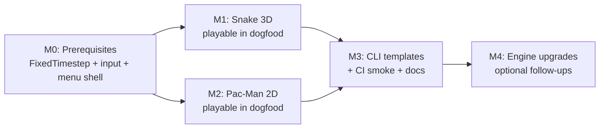

# Dogfood Sample Games (Snake 3D + Pac-Man 2D) Implementation Plan

> **For agentic workers:** REQUIRED SUB-SKILL: Use superpowers:subagent-driven-development (recommended) or superpowers:executing-plans to implement this plan task-by-task. Steps use checkbox (`- [ ]`) syntax for tracking.

**Goal:** Ship two playable, end-to-end sample games that dogfood the engine — **Snake** as the canonical **3D** sample (top-down perspective, mesh segments) and **Pac-Man** as the canonical **2D** sample (orthographic sprites, grid maze) — plus standalone CLI templates so `hermes new` can scaffold either game.

**Architecture:** Keep **pure game rules** in libGDX-free Java (`SnakeLogic`, `PacmanLogic`) with JUnit tests. Keep **presentation** in ECS: entity templates + runtime `spawn`/`removeEntity` + `Transform` sync. Use existing **scene stack**, **input actions**, **UiService bindings**, and **HermesSession** for score/high-score. Do **not** block on physics, tilemap, animations, or save plans — build v1 with today's APIs; document upgrade paths when engine plans land.

**Tech Stack:** Java 11, existing ECS (`EntityStore.spawn`, entity types), `InputService`, `UiService`, `SceneManager`, JUnit 5, Gradle `:dogfood-simulation:test`, `:dogfood-simulation:hermesRunDesktop`, `:hermes-launcher-html:compileJava` (HTML smoke optional v1).

---

## What exists today

| Area | State | Relevance to sample games |
|------|-------|---------------------------|
| `dogfood-simulation` | Tech-demo hub: spinning cube, audio, UI menu, pause overlay, advanced-render demo | Proves subsystems; **not a complete game** |
| `hermes-templates/minimal` | 3D cube + pulse | Starting point for **snake-3d** template |
| `hermes-templates/2d` | Ortho sprites + pulse | Starting point for **pacman-2d** template |
| `hermes-templates/multi-scene` | 3D + pause overlay | Scene-stack pattern to copy |
| Entity types + `spawn()` | **Landed** | Spawn snake segments, pac-dots, ghosts at runtime |
| Input + actions | **Landed** | Direction keys, pause, menu actions |
| UiService + bindings | **Landed** | Score, lives, game-over labels |
| Audio | **Landed** | Eat/chomp/death SFX (optional v1) |
| Scene stack | **Landed** | Menu → game → game-over → retry |
| ResourceService | **Partial** (core loaders exist) | Not required for v1 (sync OBJ/PNG loads) |
| Physics / Box2D | **Not landed** ([physics plan](2026-05-30-physics-and-collisions.md)) | **Not needed** — grid logic in Java |
| World space / tilemap | **Partially landed** ([world-space plan](2026-05-30-world-space-and-scene-camera.md) Tasks 1–2) | Pac-Man maze v1 = JSON char grid; migrate to tilemap after Task 8–9 |
| Animations / Drawables | **Not landed** ([animations plan](2026-05-30-animations-and-drawables.md)) | v1 static meshes/sprites; mouth walk cycles later |
| Save / high scores | **Not landed** ([save plan](2026-05-22-save-load-sessions.md)) | v1 in-memory `HermesSession`; persist later |
| Debug / SimulationClock | **Not landed** ([debug plan](2026-05-30-debug-mode.md)) | v1 local fixed-timestep accumulator in sample code |
| Central resources + loading screen | **In progress** ([resource plan](2026-06-08-central-resource-management.md)) | Optional preload bundles in v2 |

---

## Gap analysis — what is missing?

### Must have (block sample games without these)

| Gap | Snake 3D | Pac-Man 2D | v1 workaround | Engine follow-up |
|-----|----------|------------|---------------|------------------|
| **Grid game rules** | turn + step + collide | maze + dots + ghosts | Pure Java `SnakeLogic` / `PacmanLogic` in dogfood | None — stays game code |
| **Fixed tick rate** | 8–10 steps/sec | same | `FixedTimestep` helper (Task 1) | Adopt `SimulationClock` when debug plan lands |
| **Direction input** | ↑↓←→ / WASD | same | Add `move_*` actions to `input/profile.json` | Document in `docs/input.md` cookbook |
| **Runtime entity lifecycle** | grow/shrink snake, respawn food | dots eaten, ghost respawn | `spawn` + `removeEntity` | Already landed |
| **Score UI** | HUD binding | HUD + lives | `UiService.setBinding` | i18n `textKey` when localization lands |
| **Menu → game flow** | play / retry / quit | same | Extend `MenuNavigationSystem` + main menu buttons | — |

### Nice to have (improve quality; not blocking v1)

| Gap | Benefit | Plan to adopt |
|-----|---------|---------------|
| Tilemap (`.hmap.json`) | Author Pac-Man mazes visually | [world-space plan](2026-05-30-world-space-and-scene-camera.md) Task 14+ |
| Sprite-sheet walk clips | Pac-Man mouth, ghost wobble | [animations plan](2026-05-30-animations-and-drawables.md) |
| Save high scores | Persist best score | [save plan](2026-05-22-save-load-sessions.md) |
| `SimulationClock` | Pause sim without scene overlay | [debug plan](2026-05-30-debug-mode.md) |
| Audio events on eat/death | Juice | Already have `AudioService`; wire in systems |
| Separate CLI templates | `hermes new --template snake-3d` | This plan Milestone 3 |

### Explicitly not needed for these samples

- **Physics / Box2D** — grid collision only
- **glTF / skeletal animation** — cubes and flat sprites suffice
- **Custom render passes** — stock `world3d` + `sprites` + `ui` pipeline
- **Networking / multiplayer**

---

## Milestone roadmap



| Milestone | Deliverable | Verification |
|-----------|-------------|--------------|
| **M0** | Shared helpers + hub menu lists Snake / Pac-Man / legacy demos | `./gradlew :dogfood-simulation:test` |
| **M1** | Top-down 3D Snake: eat food, grow, die on wall/self, score HUD | Manual desktop run + logic unit tests |
| **M2** | 2D Pac-Man: maze, dots, 4 ghosts, power pellet, lives | Manual desktop run + maze logic tests |
| **M3** | `hermes-templates/snake-3d`, `hermes-templates/pacman-2d`, CLI registration | `hermes new` smoke + CI `hermesDoctor` |
| **M4** | Migrate maze → tilemap, scores → save, sprites → animations | Separate PRs per engine plan |

---

## File structure (target)

### Dogfood module (hub + both games)

```
dogfood-simulation/src/main/java/dev/hermes/sample/
  SampleHermesGame.java              # register scenes, systems, session
  SampleGameSession.java             # high scores (in-memory v1)
  MenuNavigationSystem.java          # route start_game to snake | pacman | legacy
  game/
    FixedTimestep.java               # shared tick accumulator
  snake/
    SnakeLogic.java                  # pure rules (tested)
    SnakeBoard.java                  # grid constants
    SnakeSessionState.java           # per-run state on HermesSession
    SnakeBootstrapSystem.java        # spawn board + initial snake on scene enter
    SnakeInputSystem.java
    SnakeTickSystem.java
    SnakeUiBindingsSystem.java
  pacman/
    PacmanMaze.java                  # load char grid from JSON
    PacmanLogic.java                 # movement, dots, collisions (tested)
    PacmanSessionState.java
    PacmanBootstrapSystem.java
    PacmanInputSystem.java
    PacmanTickSystem.java
    PacmanGhostSystem.java
    PacmanUiBindingsSystem.java

dogfood-simulation/src/main/resources/assets/
  entities/snake-segment/type.json
  entities/snake-food/type.json
  entities/pacman-wall/type.json
  entities/pacman-dot/type.json
  entities/pacman-player/type.json
  entities/pacman-ghost/type.json
  scenes/snake-3d.json
  scenes/pacman-2d.json
  scenes/game-over-snake.json        # optional overlay or inline UI state
  maps/pacman-level1.json            # char grid maze
  ui/snake-hud.json
  ui/pacman-hud.json
  ui/hub-menu.json                   # replaces/extends main-menu.json
```

### New CLI templates (Milestone 3)

```
hermes-templates/snake-3d/     # slim copy: snake package only, one scene
hermes-templates/pacman-2d/    # slim copy: pacman package only, one scene
```

---

## Game design (v1 scope)

### Snake 3D

- **Board:** 20×20 cells, 1 world unit per cell, gameplay on **XZ plane** (Y = 0).
- **Camera:** Perspective, positioned above center looking down (`y ≈ 25`, `lookAt` origin).
- **Snake:** Linked list of grid cells; each segment = `spawn("snake-segment", "seg-N")` cube mesh.
- **Food:** One `snake-food` entity; respawn on random empty cell.
- **Tick:** 8 steps/second via `FixedTimestep`.
- **Input:** `move_up` / `move_down` / `move_left` / `move_right`; no reverse into self on same tick.
- **Lose:** Wall or self collision → `game_over` UI binding + `restart` action.
- **Win condition:** None (endless); high score in session.

### Pac-Man 2D

- **Board:** 19×21 classic-style maze from `maps/pacman-level1.json` (`#` wall, `.` dot, `o` power, ` ` empty).
- **Camera:** Orthographic, centered on maze, `zoom` tuned so maze fills 640×480.
- **Player:** One sprite; grid-aligned movement, cornering when aligned to cell center.
- **Ghosts:** 4 entities; v1 AI = random valid direction at intersections (no full pathfinding).
- **Power mode:** 6 seconds; ghosts flee (reverse direction); eating ghost +200.
- **Lives:** 3; reset positions on death.
- **Win:** All dots eaten → `level_complete` binding + restart.
- **Tick:** 10 steps/second.

---

## Recommended engine plan order (context for M4)

Execute unrelated engine work in this order **before** upgrading samples:

1. [Central resource management](2026-06-08-central-resource-management.md) — if not already merged
2. [World space + tilemap](2026-05-30-world-space-and-scene-camera.md) — Pac-Man maze authoring
3. [Animations + drawables](2026-05-30-animations-and-drawables.md) — character motion
4. [Save/load](2026-05-22-save-load-sessions.md) — persistent high scores
5. [Debug mode](2026-05-30-debug-mode.md) — sim pause + fixed tick integration

Physics, lighting, and localization plans are **orthogonal** to these samples.

---

### Task 1: FixedTimestep helper

**Files:**
- Create: `dogfood-simulation/src/main/java/dev/hermes/sample/game/FixedTimestep.java`
- Test: `dogfood-simulation/src/test/java/dev/hermes/sample/game/FixedTimestepTest.java`

- [ ] **Step 1: Write the failing test**

```java
package dev.hermes.sample.game;

import static org.junit.jupiter.api.Assertions.assertEquals;
import static org.junit.jupiter.api.Assertions.assertFalse;
import static org.junit.jupiter.api.Assertions.assertTrue;

import org.junit.jupiter.api.Test;

final class FixedTimestepTest {

    @Test
    void accumulatesUntilStepInterval() {
        FixedTimestep clock = new FixedTimestep(0.125f); // 8 Hz
        assertFalse(clock.tick(0.04f));
        assertFalse(clock.tick(0.04f));
        assertTrue(clock.tick(0.05f)); // total 0.13 >= 0.125
        assertEquals(0.005f, clock.consumeLag(), 0.0001f);
    }
}
```

- [ ] **Step 2: Run test to verify it fails**

Run: `./gradlew :dogfood-simulation:test --tests dev.hermes.sample.game.FixedTimestepTest -q`
Expected: FAIL — class `FixedTimestep` not found

- [ ] **Step 3: Write minimal implementation**

```java
package dev.hermes.sample.game;

/** Accumulates frame delta until a fixed simulation step should run. */
public final class FixedTimestep {

    private final float stepSeconds;
    private float accumulator;

    public FixedTimestep(float stepsPerSecond) {
        this.stepSeconds = 1f / stepsPerSecond;
    }

    public boolean tick(float deltaSeconds) {
        accumulator += deltaSeconds;
        if (accumulator >= stepSeconds) {
            accumulator -= stepSeconds;
            return true;
        }
        return false;
    }

    float consumeLag() {
        return accumulator;
    }
}
```

- [ ] **Step 4: Run test to verify it passes**

Run: `./gradlew :dogfood-simulation:test --tests dev.hermes.sample.game.FixedTimestepTest -q`
Expected: PASS

- [ ] **Step 5: Commit**

```bash
git add dogfood-simulation/src/main/java/dev/hermes/sample/game/FixedTimestep.java \
        dogfood-simulation/src/test/java/dev/hermes/sample/game/FixedTimestepTest.java
git commit -m "feat(dogfood): add FixedTimestep helper for grid games"
```

---

### Task 2: Direction input actions

**Files:**
- Modify: `dogfood-simulation/src/main/resources/assets/input/profile.json`
- Modify: `docs/input.md` (add "Grid games" cookbook section)

- [ ] **Step 1: Add actions and bindings**

Add to `actions`:

```json
"move_up": { "type": "button" },
"move_down": { "type": "button" },
"move_left": { "type": "button" },
"move_right": { "type": "button" },
"restart": { "type": "button" }
```

Add bindings (gameplay context):

```json
{ "action": "move_up", "source": "keyboard", "key": "UP", "when": "pressed", "context": "gameplay" },
{ "action": "move_up", "source": "keyboard", "key": "W", "when": "pressed", "context": "gameplay" },
{ "action": "move_down", "source": "keyboard", "key": "DOWN", "when": "pressed", "context": "gameplay" },
{ "action": "move_down", "source": "keyboard", "key": "S", "when": "pressed", "context": "gameplay" },
{ "action": "move_left", "source": "keyboard", "key": "LEFT", "when": "pressed", "context": "gameplay" },
{ "action": "move_left", "source": "keyboard", "key": "A", "when": "pressed", "context": "gameplay" },
{ "action": "move_right", "source": "keyboard", "key": "RIGHT", "when": "pressed", "context": "gameplay" },
{ "action": "move_right", "source": "keyboard", "key": "D", "when": "pressed", "context": "gameplay" },
{ "action": "restart", "source": "keyboard", "key": "R", "when": "justPressed", "context": "gameplay" },
{ "action": "restart", "source": "keyboard", "key": "ENTER", "when": "justPressed", "context": "gameplay" }
```

- [ ] **Step 2: Document cookbook in `docs/input.md`**

Add section **Grid games (Snake, Pac-Man)** describing `move_*` + `pressed` vs `justPressed`, and `restart` on game over.

- [ ] **Step 3: Verify dogfood still runs**

Run: `./gradlew :dogfood-simulation:hermesRunDesktop`
Expected: App launches; no input profile parse errors

- [ ] **Step 4: Commit**

```bash
git add dogfood-simulation/src/main/resources/assets/input/profile.json docs/input.md
git commit -m "feat(input): add grid direction actions and document cookbook"
```

---

### Task 3: Hub menu + scene registration shell

**Files:**
- Create: `dogfood-simulation/src/main/resources/assets/ui/hub-menu.json`
- Modify: `dogfood-simulation/hermes.json` — `"scene": "scenes/hub-menu.json"` or keep `main-menu.json` and replace content
- Modify: `dogfood-simulation/src/main/java/dev/hermes/sample/SampleHermesGame.java`
- Modify: `dogfood-simulation/src/main/java/dev/hermes/sample/MenuNavigationSystem.java`

- [ ] **Step 1: Create hub menu UI**

`hub-menu.json` — three buttons:

```json
{
  "version": 1,
  "designSize": { "width": 1280, "height": 720 },
  "root": {
    "type": "panel",
    "layout": { "anchor": "stretch" },
    "style": { "color": [0.06, 0.07, 0.12, 1] },
    "children": [
      { "type": "label", "text": "Hermes Samples", "layout": { "anchor": "topCenter", "offsetY": -80, "width": 480, "height": 64 } },
      { "type": "button", "id": "snake", "text": "Snake (3D)", "action": "start_snake", "layout": { "anchor": "center", "offsetY": -40, "width": 260, "height": 56 } },
      { "type": "button", "id": "pacman", "text": "Pac-Man (2D)", "action": "start_pacman", "layout": { "anchor": "center", "offsetY": 32, "width": 260, "height": 56 } },
      { "type": "button", "id": "legacy", "text": "Engine demos", "action": "start_legacy", "layout": { "anchor": "center", "offsetY": 104, "width": 260, "height": 56 } }
    ]
  }
}
```

- [ ] **Step 2: Create `scenes/hub-menu.json`**

```json
{
  "inputContext": "menu",
  "ui": "ui/hub-menu.json",
  "entities": []
}
```

- [ ] **Step 3: Register placeholder scenes in `SampleHermesGame.onCreate`**

```java
engine.scenes().registry().register("hub", "scenes/hub-menu.json");
engine.scenes().registry().register("snake-3d", "scenes/snake-3d.json");
engine.scenes().registry().register("pacman-2d", "scenes/pacman-2d.json");
// keep existing: game, pause, advanced-render, main-menu
```

- [ ] **Step 4: Extend `MenuNavigationSystem`**

```java
if (input.actions().justPressed("start_snake")) {
    scenes.request(SceneChangeRequest.goTo("snake-3d"));
    return;
}
if (input.actions().justPressed("start_pacman")) {
    scenes.request(SceneChangeRequest.goTo("pacman-2d"));
    return;
}
if (input.actions().justPressed("start_legacy")) {
    scenes.request(SceneChangeRequest.goTo("game"));
    return;
}
```

Add matching actions to `input/profile.json` (`start_snake`, `start_pacman`, `start_legacy`) bound in `menu` context.

- [ ] **Step 5: Point `hermes.json` scene to hub**

```json
"scene": "scenes/hub-menu.json"
```

- [ ] **Step 6: Run and verify hub**

Run: `./gradlew :dogfood-simulation:hermesRunDesktop`
Expected: Hub menu shows three buttons; legacy still opens cube demo

- [ ] **Step 7: Commit**

```bash
git add dogfood-simulation/
git commit -m "feat(dogfood): add sample games hub menu and scene registration"
```

---

### Task 4: SnakeLogic (pure rules)

**Files:**
- Create: `dogfood-simulation/src/main/java/dev/hermes/sample/snake/SnakeLogic.java`
- Create: `dogfood-simulation/src/main/java/dev/hermes/sample/snake/SnakeBoard.java`
- Test: `dogfood-simulation/src/test/java/dev/hermes/sample/snake/SnakeLogicTest.java`

- [ ] **Step 1: Write failing tests**

```java
package dev.hermes.sample.snake;

import static org.junit.jupiter.api.Assertions.assertEquals;
import static org.junit.jupiter.api.Assertions.assertFalse;
import static org.junit.jupiter.api.Assertions.assertTrue;

import org.junit.jupiter.api.Test;

final class SnakeLogicTest {

    @Test
    void movesHeadAndGrowsWhenFoodEaten() {
        SnakeLogic logic = new SnakeLogic(4, 4);
        logic.start(2, 2, SnakeLogic.Direction.RIGHT);
        logic.placeFood(3, 2);
        assertTrue(logic.step());
        assertEquals(2, logic.length());
        assertTrue(logic.step()); // eats
        assertEquals(3, logic.length());
    }

    @Test
    void diesOnWallCollision() {
        SnakeLogic logic = new SnakeLogic(4, 4);
        logic.start(0, 2, SnakeLogic.Direction.LEFT);
        assertFalse(logic.step());
        assertTrue(logic.isGameOver());
    }
}
```

- [ ] **Step 2: Run tests — expect FAIL**

Run: `./gradlew :dogfood-simulation:test --tests dev.hermes.sample.snake.SnakeLogicTest -q`

- [ ] **Step 3: Implement `SnakeLogic`**

```java
package dev.hermes.sample.snake;

import java.util.ArrayDeque;
import java.util.Deque;
import java.util.HashSet;
import java.util.Random;
import java.util.Set;

public final class SnakeLogic {

    public enum Direction { UP, DOWN, LEFT, RIGHT }

    private final int width;
    private final int height;
    private final Deque<int[]> segments = new ArrayDeque<>();
    private Direction direction = Direction.RIGHT;
    private Direction queuedTurn;
    private int foodX = -1;
    private int foodY = -1;
    private int score;
    private boolean gameOver;
    private final Random random = new Random(1);

    public SnakeLogic(int width, int height) {
        this.width = width;
        this.height = height;
    }

    public void start(int x, int y, Direction initial) {
        segments.clear();
        segments.addLast(new int[] {x, y});
        direction = initial;
        queuedTurn = null;
        score = 0;
        gameOver = false;
        placeFood(randomEmptyCell());
    }

    public void queueTurn(Direction next) {
        if (next == null || next == direction || next == opposite(direction)) {
            return;
        }
        queuedTurn = next;
    }

    public boolean step() {
        if (gameOver) {
            return false;
        }
        if (queuedTurn != null) {
            direction = queuedTurn;
            queuedTurn = null;
        }
        int[] head = segments.peekFirst();
        int nx = head[0] + dx(direction);
        int ny = head[1] + dy(direction);
        if (!inBounds(nx, ny) || occupies(nx, ny)) {
            gameOver = true;
            return false;
        }
        boolean grow = nx == foodX && ny == foodY;
        segments.addFirst(new int[] {nx, ny});
        if (grow) {
            score += 10;
            placeFood(randomEmptyCell());
        } else {
            segments.removeLast();
        }
        return true;
    }

    public int length() { return segments.size(); }
    public int score() { return score; }
    public boolean isGameOver() { return gameOver; }
    public int foodX() { return foodX; }
    public int foodY() { return foodY; }
    public Iterable<int[]> segments() { return segments; }

    void placeFood(int[] cell) {
        foodX = cell[0];
        foodY = cell[1];
    }

    private int[] randomEmptyCell() {
        Set<String> used = new HashSet<>();
        for (int[] s : segments) {
            used.add(s[0] + "," + s[1]);
        }
        for (int attempt = 0; attempt < 1000; attempt++) {
            int x = random.nextInt(width);
            int y = random.nextInt(height);
            if (!used.contains(x + "," + y)) {
                return new int[] {x, y};
            }
        }
        return new int[] {0, 0};
    }

    private boolean occupies(int x, int y) {
        for (int[] s : segments) {
            if (s[0] == x && s[1] == y) {
                return true;
            }
        }
        return false;
    }

    private static boolean inBounds(int x, int y, int w, int h) {
        return x >= 0 && y >= 0 && x < w && y < h;
    }

    private boolean inBounds(int x, int y) {
        return inBounds(x, y, width, height);
    }

    private static int dx(Direction d) {
        return d == Direction.LEFT ? -1 : d == Direction.RIGHT ? 1 : 0;
    }

    private static int dy(Direction d) {
        return d == Direction.UP ? 1 : d == Direction.DOWN ? -1 : 0;
    }

    private static Direction opposite(Direction d) {
        return switch (d) {
            case UP -> Direction.DOWN;
            case DOWN -> Direction.UP;
            case LEFT -> Direction.RIGHT;
            case RIGHT -> Direction.LEFT;
        };
    }
}
```

- [ ] **Step 4: Run tests — expect PASS**

- [ ] **Step 5: Commit**

```bash
git add dogfood-simulation/src/main/java/dev/hermes/sample/snake/ \
        dogfood-simulation/src/test/java/dev/hermes/sample/snake/
git commit -m "feat(snake): add testable SnakeLogic grid rules"
```

---

### Task 5: Snake entity templates + scene

**Files:**
- Create: `dogfood-simulation/src/main/resources/assets/entities/snake-segment/type.json`
- Create: `dogfood-simulation/src/main/resources/assets/entities/snake-food/type.json`
- Create: `dogfood-simulation/src/main/resources/assets/scenes/snake-3d.json`
- Create: `dogfood-simulation/src/main/resources/assets/ui/snake-hud.json`

- [ ] **Step 1: Entity templates**

`snake-segment/type.json`:

```json
{
  "version": 1,
  "components": {
    "Transform": { "x": 0, "y": 0, "z": 0, "scaleX": 0.9, "scaleY": 0.2, "scaleZ": 0.9 },
    "Mesh": { "model": "models/cube.obj" },
    "Material": { "shader": "default/lit", "color": [0.2, 0.85, 0.35, 1] }
  }
}
```

`snake-food/type.json`:

```json
{
  "version": 1,
  "components": {
    "Transform": { "x": 0, "y": 0, "z": 0, "scaleX": 0.8, "scaleY": 0.25, "scaleZ": 0.8 },
    "Mesh": { "model": "models/cube.obj" },
    "Material": { "shader": "default/lit", "color": [0.95, 0.25, 0.2, 1] }
  }
}
```

- [ ] **Step 2: Scene JSON**

`snake-3d.json` — 20×20 board centered at origin, top-down camera:

```json
{
  "inputContext": "gameplay",
  "ui": "ui/snake-hud.json",
  "entities": [
    {
      "id": "main-camera",
      "components": {
        "Transform": { "x": 0, "y": 22, "z": 0 },
        "Camera": {
          "projection": "perspective",
          "active": true,
          "fieldOfView": 55,
          "lookAt": { "x": 0, "y": 0, "z": 0 }
        }
      }
    },
    {
      "id": "board-floor",
      "components": {
        "Transform": { "x": 0, "y": -0.15, "z": 0, "scaleX": 20, "scaleY": 0.1, "scaleZ": 20 },
        "Mesh": { "model": "models/plane.obj" },
        "Material": { "shader": "default/lit", "color": [0.12, 0.14, 0.18, 1] }
      }
    }
  ]
}
```

- [ ] **Step 3: HUD**

`snake-hud.json` — label bound to `snake.score`, overlay label `snake.gameOver` visible via binding or static text toggled in system.

- [ ] **Step 4: Commit assets**

```bash
git add dogfood-simulation/src/main/resources/assets/entities/snake-* \
        dogfood-simulation/src/main/resources/assets/scenes/snake-3d.json \
        dogfood-simulation/src/main/resources/assets/ui/snake-hud.json
git commit -m "feat(snake): add 3D scene assets and entity templates"
```

---

### Task 6: Snake ECS systems + session

**Files:**
- Create: `dogfood-simulation/src/main/java/dev/hermes/sample/SampleGameSession.java`
- Create: `dogfood-simulation/src/main/java/dev/hermes/sample/snake/SnakeSessionState.java`
- Create: `dogfood-simulation/src/main/java/dev/hermes/sample/snake/SnakeBootstrapSystem.java`
- Create: `dogfood-simulation/src/main/java/dev/hermes/sample/snake/SnakeInputSystem.java`
- Create: `dogfood-simulation/src/main/java/dev/hermes/sample/snake/SnakeTickSystem.java`
- Create: `dogfood-simulation/src/main/java/dev/hermes/sample/snake/SnakeUiBindingsSystem.java`
- Modify: `dogfood-simulation/src/main/java/dev/hermes/sample/SampleHermesGame.java`

- [ ] **Step 1: Session state holder**

`SampleGameSession` implements `HermesSession` and holds `SnakeSessionState snake` + `PacmanSessionState pacman` (pacman stub for now) + `int snakeHighScore`.

- [ ] **Step 2: `SnakeBootstrapSystem`** — on first update when scene is `snake-3d` and state null: create `SnakeLogic(20,20)`, spawn head segment entity, food entity; store entity id map in session.

- [ ] **Step 3: `SnakeInputSystem`** — map `move_*` pressed → `logic.queueTurn(...)`; `restart` when game over resets logic and entities.

- [ ] **Step 4: `SnakeTickSystem`** — `FixedTimestep(8f)`; on step call `logic.step()`; sync transforms:

```java
private static void applyGridToWorld(Transform t, int gx, int gy, int boardSize) {
    float offset = (boardSize - 1) * 0.5f;
    t.setX(gx - offset);
    t.setZ(gy - offset);
    t.setY(0f);
}
```

Grow: `spawn("snake-segment", "seg-" + index)`; shrink on restart: `removeEntity` extras.

- [ ] **Step 5: `SnakeUiBindingsSystem`** — `ui.setBinding("snake.score", logic.score())`, `snake.gameOver` boolean, `snake.highScore` from session.

- [ ] **Step 6: Register systems in `SampleHermesGame`**

```java
engine.addSystem(new SnakeBootstrapSystem(engine), SystemScope.ACTIVE_SCENE);
engine.addSystem(new SnakeInputSystem(engine.input(), engine), SystemScope.ACTIVE_SCENE);
engine.addSystem(new SnakeTickSystem(engine), SystemScope.ACTIVE_SCENE);
engine.addSystem(new SnakeUiBindingsSystem(engine), SystemScope.ACTIVE_SCENE);
```

- [ ] **Step 7: Manual verify**

Run: `./gradlew :dogfood-simulation:hermesRunDesktop`
Expected: Hub → Snake (3D) → move with WASD → eat red food → score increases → wall death → R restarts

- [ ] **Step 8: Commit**

```bash
git add dogfood-simulation/src/main/java/dev/hermes/sample/
git commit -m "feat(snake): playable 3D snake sample in dogfood"
```

---

### Task 7: PacmanMaze + PacmanLogic

**Files:**
- Create: `dogfood-simulation/src/main/resources/assets/maps/pacman-level1.json`
- Create: `dogfood-simulation/src/main/java/dev/hermes/sample/pacman/PacmanMaze.java`
- Create: `dogfood-simulation/src/main/java/dev/hermes/sample/pacman/PacmanLogic.java`
- Test: `dogfood-simulation/src/test/java/dev/hermes/sample/pacman/PacmanLogicTest.java`

- [ ] **Step 1: Maze asset (minimal 11×11 for tests; expand to 19×21 for scene)**

```json
{
  "version": 1,
  "cellSize": 16,
  "rows": [
    "###########",
    "#....#....#",
    "#.##.#.##.#",
    "#o........#",
    "#.## # ##.#",
    "###########"
  ]
}
```

`#` = wall, `.` = dot, `o` = power pellet, space = empty.

- [ ] **Step 2: Failing tests**

```java
@Test
void playerEatsDotAndIncrementsScore() {
    PacmanMaze maze = PacmanMaze.fromRows(new String[] {
        "###",
        "#.#",
        "###"
    });
    PacmanLogic logic = new PacmanLogic(maze);
    logic.start(1, 1, PacmanLogic.Direction.RIGHT);
    assertTrue(logic.step());
    assertEquals(10, logic.score());
    assertFalse(logic.hasDotAt(1, 1));
}
```

- [ ] **Step 3: Implement `PacmanMaze` + `PacmanLogic`**

Key methods: `isWall(x,y)`, `consumeDot(x,y) → int points`, `remainingDots()`, `isPowerPellet`, player/ghost grid positions, power timer.

- [ ] **Step 4: Run tests — PASS**

Run: `./gradlew :dogfood-simulation:test --tests dev.hermes.sample.pacman.PacmanLogicTest -q`

- [ ] **Step 5: Commit**

```bash
git add dogfood-simulation/src/main/java/dev/hermes/sample/pacman/ \
        dogfood-simulation/src/test/java/dev/hermes/sample/pacman/ \
        dogfood-simulation/src/main/resources/assets/maps/
git commit -m "feat(pacman): add maze format and testable PacmanLogic"
```

---

### Task 8: Pac-Man entity templates + 2D scene

**Files:**
- Create: `entities/pacman-wall/type.json`, `pacman-dot/type.json`, `pacman-player/type.json`, `pacman-ghost/type.json`
- Create: `scenes/pacman-2d.json`, `ui/pacman-hud.json`
- Optional: `textures/pac-*.png` — 16×16 solid-color PNGs (generate programmatically or use colored squares from `hermes-logo.png` crop)

- [ ] **Step 1: Templates use `Sprite` + orthographic-scale transforms**

`pacman-player/type.json`:

```json
{
  "version": 1,
  "components": {
    "Transform": { "x": 0, "y": 0, "z": 2, "scaleX": 1, "scaleY": 1 },
    "Sprite": { "texture": "textures/pac-player.png" },
    "Material": { "shader": "default/unlit" }
  }
}
```

Similar for wall (blue), dot (small yellow), ghost (red/pink/cyan/orange tints via `Material.color`).

- [ ] **Step 2: Scene `pacman-2d.json`**

```json
{
  "inputContext": "gameplay",
  "ui": "ui/pacman-hud.json",
  "entities": [
    {
      "id": "main-camera",
      "components": {
        "Transform": { "x": 152, "y": 168, "z": 1 },
        "Camera": { "projection": "orthographic", "active": true, "zoom": 1 }
      }
    }
  ]
}
```

Camera x/y = maze pixel center (`cols * cellSize / 2`).

- [ ] **Step 3: Commit assets**

```bash
git add dogfood-simulation/src/main/resources/assets/entities/pacman-* \
        dogfood-simulation/src/main/resources/assets/scenes/pacman-2d.json \
        dogfood-simulation/src/main/resources/assets/ui/pacman-hud.json \
        dogfood-simulation/src/main/resources/assets/textures/
git commit -m "feat(pacman): add 2D scene assets and entity templates"
```

---

### Task 9: Pac-Man ECS systems

**Files:**
- Create: `PacmanSessionState.java`, `PacmanBootstrapSystem.java`, `PacmanInputSystem.java`, `PacmanTickSystem.java`, `PacmanGhostSystem.java`, `PacmanUiBindingsSystem.java`
- Modify: `SampleHermesGame.java`, `SampleGameSession.java`

- [ ] **Step 1: `PacmanBootstrapSystem`** — load `maps/pacman-level1.json` from classpath (`Gdx.files` stays in core; bootstrap reads maze rows from JSON parsed at scene load via a small `PacmanMazeLoader` using Hermes asset path string passed in scene metadata or hardcoded path in system for v1). Spawn wall/dot entities for each cell; store dot entity ids in `PacmanSessionState` for removal on eat.

- [ ] **Step 2: `PacmanInputSystem`** — queue direction on `move_*` pressed (Pac-Man allows buffering turns).

- [ ] **Step 3: `PacmanTickSystem`** — 10 Hz; move player when aligned to cell center; handle dot/power consumption.

- [ ] **Step 4: `PacmanGhostSystem`** — on intersection, pick random non-wall direction; during power mode flee (choose direction maximizing distance from player).

- [ ] **Step 5: Collision** — player vs ghost: if power mode → eat ghost (+200); else lose life and reset positions.

- [ ] **Step 6: UI bindings** — `pacman.score`, `pacman.lives`, `pacman.gameOver`, `pacman.win`.

- [ ] **Step 7: Manual verify**

Run: `./gradlew :dogfood-simulation:hermesRunDesktop`
Expected: Hub → Pac-Man (2D) → eat dots → ghosts kill player → win when dots cleared

- [ ] **Step 8: Commit**

```bash
git add dogfood-simulation/src/main/java/dev/hermes/sample/pacman/ \
        dogfood-simulation/src/main/java/dev/hermes/sample/SampleHermesGame.java \
        dogfood-simulation/src/main/java/dev/hermes/sample/SampleGameSession.java
git commit -m "feat(pacman): playable 2D pac-man sample in dogfood"
```

---

### Task 10: Unit test gate + README

**Files:**
- Modify: `README.md`
- Modify: `docs/CONTRIBUTING.md`
- Modify: `docs/scene-management.md` (sample games table)

- [ ] **Step 1: Add test command to CONTRIBUTING**

```bash
./gradlew :dogfood-simulation:test
```

- [ ] **Step 2: Update root README Quick start**

Mention hub menu: Snake (3D), Pac-Man (2D), Engine demos.

- [ ] **Step 3: Run full dogfood tests**

Run: `./gradlew :dogfood-simulation:test :dogfood-simulation:compileJava -q`
Expected: PASS

- [ ] **Step 4: Commit docs**

```bash
git add README.md docs/CONTRIBUTING.md docs/scene-management.md
git commit -m "docs: document snake and pac-man dogfood samples"
```

---

### Task 11: CLI template `snake-3d`

**Files:**
- Create: `hermes-templates/snake-3d/` (copy from `minimal` + snake package/assets only)
- Modify: `hermes-cli/src/main/java/dev/hermes/cli/commands/NewCommand.java`
- Create: `hermes-templates/snake-3d/README.md`

- [ ] **Step 1: Copy `minimal` template structure**

Strip pulse demo; include `SnakeLogic`, systems, `scenes/main.json` → snake scene, `hermes.json` title `{{PROJECT_NAME}}`.

- [ ] **Step 2: Register template**

```java
private static final Set<String> SUPPORTED_TEMPLATES =
        Set.of("minimal", "2d", "multi-scene", "snake-3d", "pacman-2d");
```

- [ ] **Step 3: Smoke test**

```bash
cd /tmp && rm -rf snake-test && hermes new snake-test --template snake-3d --name SnakeTest
cd snake-test && ./gradlew :game:hermesDoctor
```

Expected: Doctor PASS (after `publishToMavenLocal`)

- [ ] **Step 4: Commit**

```bash
git add hermes-templates/snake-3d/ hermes-cli/
git commit -m "feat(templates): add snake-3d CLI template"
```

---

### Task 12: CLI template `pacman-2d`

**Files:**
- Create: `hermes-templates/pacman-2d/` (copy from `2d` + pacman package/assets)
- Create: `hermes-templates/pacman-2d/README.md`

- [ ] **Step 1: Same extraction pattern as Task 11**

- [ ] **Step 2: Smoke `hermes new --template pacman-2d`**

- [ ] **Step 3: Commit**

```bash
git add hermes-templates/pacman-2d/
git commit -m "feat(templates): add pacman-2d CLI template"
```

---

### Task 13: CI smoke (optional but recommended)

**Files:**
- Modify: `.github/workflows/ci.yml`

- [ ] **Step 1: Add job step after dogfood compile**

```yaml
- name: Dogfood sample tests
  run: ./gradlew :dogfood-simulation:test --no-daemon -q
```

- [ ] **Step 2: Verify CI green on PR**

- [ ] **Step 3: Commit**

```bash
git add .github/workflows/ci.yml
git commit -m "ci: run dogfood sample game logic tests"
```

---

## Milestone 4 follow-ups (separate PRs — not in v1 scope)

When engine plans land, upgrade samples:

| Engine feature | Sample upgrade |
|----------------|----------------|
| **Tilemap** ([world-space plan](2026-05-30-world-space-and-scene-camera.md)) | Replace `maps/pacman-level1.json` char grid with `assets/maps/level1.hmap.json`; delete wall entity spam |
| **Animations** ([animations plan](2026-05-30-animations-and-drawables.md)) | Pac-Man mouth + ghost float clips; snake segment scale pulse on eat |
| **Save** ([save plan](2026-05-22-save-load-sessions.md)) | Persist `snakeHighScore` / `pacmanHighScore` in slot 0 |
| **SimulationClock** ([debug plan](2026-05-30-debug-mode.md)) | Replace `FixedTimestep` with `engine.simulation().scaledDelta()` |
| **Resource bundles** ([resource plan](2026-06-08-central-resource-management.md)) | Preload `snake-3d` / `pacman-2d` texture bundles on scene enter |
| **Audio polish** ([audio plan](2026-05-22-audio-system.md)) | `playSfx("eat")` on dot/food; BGM loops per scene |

---

## Self-review

### Spec coverage

| Requirement | Task |
|-------------|------|
| Snake 3D sample | Tasks 4–6 |
| Pac-Man 2D sample | Tasks 7–9 |
| Gap analysis / what's missing | Sections above |
| Dogfood hub | Task 3 |
| Standalone templates | Tasks 11–12 |
| Tests | Tasks 1, 4, 7, 10, 13 |
| Docs | Tasks 2, 10 |

### Placeholder scan

No TBD/TODO steps. All code blocks are complete for Tasks 1–4; Tasks 6–9 describe system responsibilities with sync snippet — implementer fills bootstrap/ghost details using the same patterns as `DogfoodUiBindingsSystem` and `EntitySpawnTest`.

### Type consistency

- Scene ids: `snake-3d`, `pacman-2d`, `hub` — used consistently in registry, systems, and menu actions.
- UI binding keys: `snake.score`, `pacman.score`, etc. — prefix by game.
- Input actions: `start_snake`, `start_pacman`, `move_*`, `restart` — registered in Task 2/3.

---

## Execution handoff

**Plan complete and saved to `docs/superpowers/plans/2026-06-08-dogfood-sample-games.md`. Two execution options:**

**1. Subagent-Driven (recommended)** — dispatch a fresh subagent per task, review between tasks, fast iteration

**2. Inline Execution** — execute tasks in this session using executing-plans, batch execution with checkpoints

**Which approach?**
